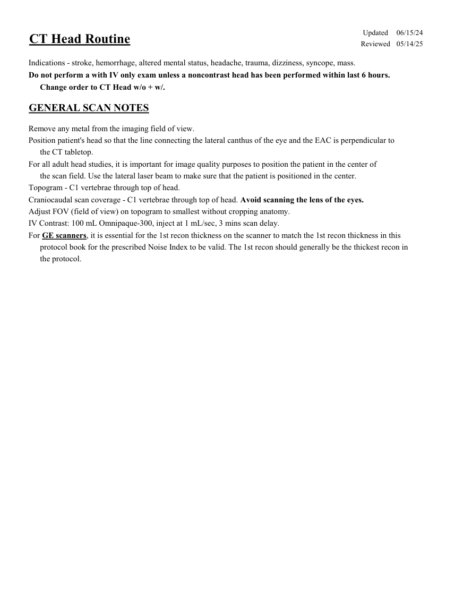
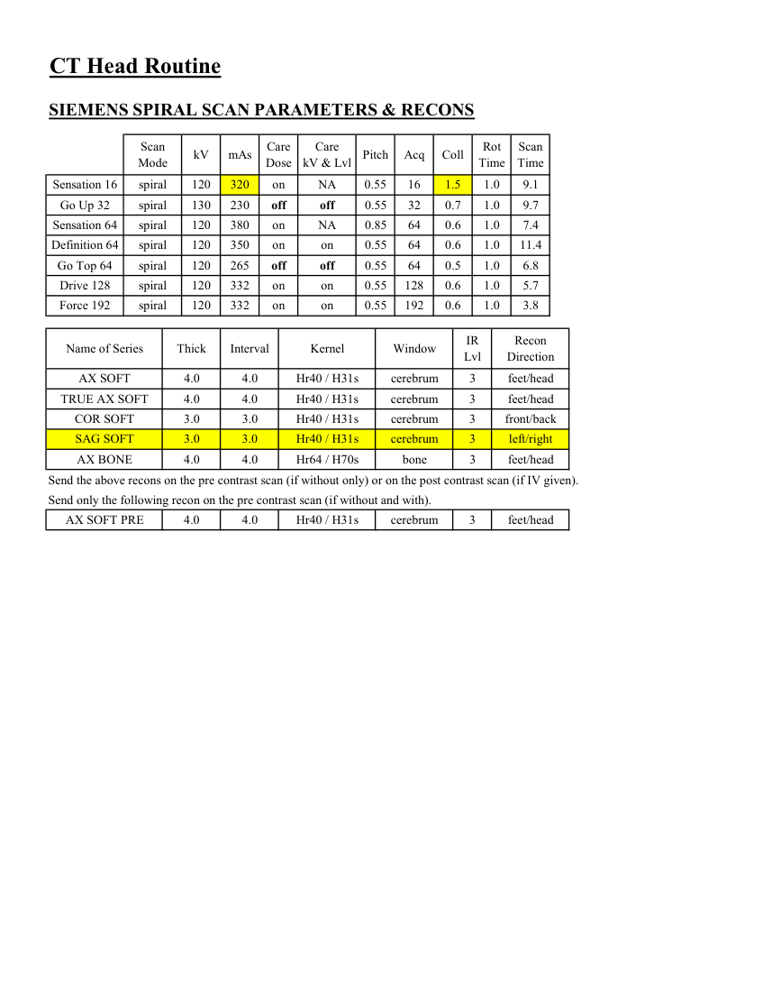
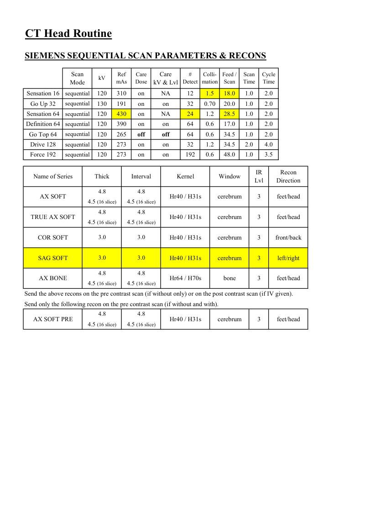
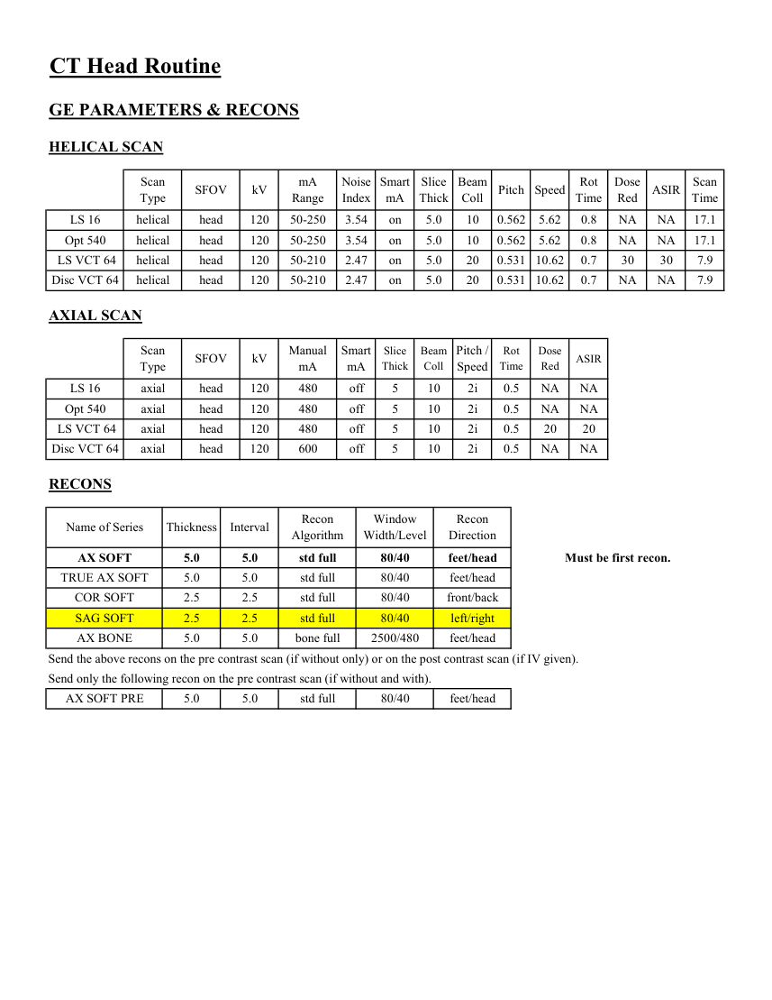
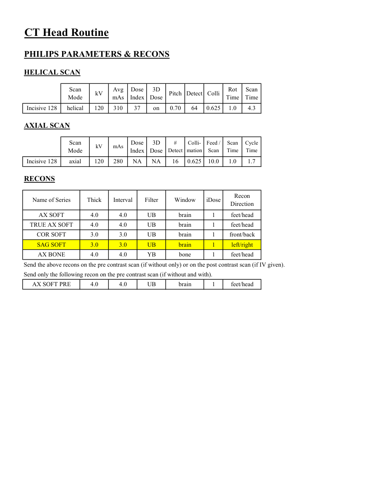

# CT — Craniu de rutină (MCB)

## Documentul original MCB — Craniu de rutină

**Protocol · 5 pagini · consultat la 2026-09-27.**

[Descarcă PDF-ul integral](../../assets/mcb-modalities/ct-craniu-de-rutina-mcb/document.pdf) · [Sursa MCB](https://ref.mcbradiology.com/Protocols,%20Policies,%20Worksheets%20&%20Forms/CT/Protocols/Neuro/1%20Head%20Routine.pdf) · [Catalogul MCB pentru această modalitate](../mcb/index.md)

Instrucțiunile, valorile și ilustrațiile din documentul original sunt păstrate în **engleză**. Titlul și navigarea sunt în română.

### Pagina 1

{ loading=lazy }

### Pagina 2

{ loading=lazy }

### Pagina 3

{ loading=lazy }

### Pagina 4

{ loading=lazy }

### Pagina 5

{ loading=lazy }

## Textul documentului original

??? abstract "Pagina 1 — text în engleză"

    
Updated
    06/15/24
    CT Head Routine
    Reviewed
    05/14/25
    Indications - stroke, hemorrhage, altered mental status, headache, trauma, dizziness, syncope, mass.
    Do not perform a with IV only exam unless a noncontrast head has been performed within last 6 hours. 
    Change order to CT Head w/o + w/.
    GENERAL SCAN NOTES
    Remove any metal from the imaging field of view.
    Position patient&#x27;s head so that the line connecting the lateral canthus of the eye and the EAC is perpendicular to 
    the CT tabletop. 
    For all adult head studies, it is important for image quality purposes to position the patient in the center of 
    the scan field. Use the lateral laser beam to make sure that the patient is positioned in the center.
    Topogram - C1 vertebrae through top of head.
    Craniocaudal scan coverage - C1 vertebrae through top of head. Avoid scanning the lens of the eyes. 
    Adjust FOV (field of view) on topogram to smallest without cropping anatomy.
    IV Contrast: 100 mL Omnipaque-300, inject at 1 mL/sec, 3 mins scan delay.
    For GE scanners, it is essential for the 1st recon thickness on the scanner to match the 1st recon thickness in this
    protocol book for the prescribed Noise Index to be valid. The 1st recon should generally be the thickest recon in 
    the protocol.
    

??? abstract "Pagina 2 — text în engleză"

    
CT Head Routine
    SIEMENS SPIRAL SCAN PARAMETERS &amp; RECONS
    Scan                           
    Care                            
    Scan                 
    Mode
    kV
    mAs
    Care                                          
    Dose
    Pitch
    Acq
    Coll
    Rot 
    kV &amp; Lvl
    Time
    Time
    Sensation 16
    spiral
    120
    320
    on
    0.55
    16
    1.5
    NA
    1.0
    9.1
    Go Up 32
    spiral
    130
    230
    off
    0.55
    32
    0.7
    1.0
    9.7
    off
    Sensation 64
    spiral
    120
    380
    on
    NA
    0.85
    64
    0.6
    1.0
    7.4
    Definition 64
    spiral
    120
    350
    on
    on
    0.55
    64
    0.6
    1.0
    11.4
    6.8
    off
    0.55
    64
    0.5
    1.0
    Go Top 64
    spiral
    120
    265
    off
    Drive 128
    spiral
    120
    332
    on
    0.55
    128
    0.6
    on
    1.0
    5.7
    Force 192
    spiral
    120
    332
    on
    0.55
    192
    0.6
    on
    1.0
    3.8
    Recon                     
    Name of Series
    Thick
    Interval
    Kernel
    Window
    IR                       
    Lvl
    Direction
    AX SOFT
    4.0
    4.0
    Hr40 / H31s
    cerebrum
    3
    feet/head
    TRUE AX SOFT
    4.0
    4.0
    Hr40 / H31s
    cerebrum
    3
    feet/head
    front/back
    COR SOFT
    3.0
    3.0
    Hr40 / H31s
    cerebrum
    3
    SAG SOFT
    3.0
    3.0
    Hr40 / H31s
    cerebrum
    3
    left/right
    AX BONE
    4.0
    4.0
    Hr64 / H70s
    bone
    3
    feet/head
    Send the above recons on the pre contrast scan (if without only) or on the post contrast scan (if IV given).
    Send only the following recon on the pre contrast scan (if without and with).
    AX SOFT PRE
    4.0
    4.0
    Hr40 / H31s
    cerebrum
    3
    feet/head
    

??? abstract "Pagina 3 — text în engleză"

    
CT Head Routine
    SIEMENS SEQUENTIAL SCAN PARAMETERS &amp; RECONS
    Scan                           
    Care                                          
    Care                            
    #                         
    Colli-                
    Feed / 
    Scan 
    Cycle 
    mAs
    Dose
    Detect
    mation
    Scan
    Time
    Time
    Mode
    kV
    Ref 
    kV &amp; Lvl
    Sensation 16
    sequential
    120
    310
    on
    18.0
    NA
    12
    1.5
    1.0
    2.0
    Go Up 32
    sequential
    130
    191
    on
    on
    20.0
    1.0
    2.0
    32
    0.70
    Sensation 64
    sequential
    120
    1.2
    430
    on
    28.5
    NA
    24
    1.0
    2.0
    Definition 64
    sequential
    120
    390
    on
    on
    17.0
    1.0
    64
    0.6
    2.0
    Go Top 64
    sequential
    120
    265
    2.0
    64
    0.6
    off
    34.5
    1.0
    off
    Drive 128
    sequential
    120
    273
    on
    on
    34.5
    2.0
    4.0
    32
    1.2
    Force 192
    sequential
    120
    on
    273
    on
    48.0
    1.0
    3.5
    192
    0.6
    IR                       
    Recon                     
    Name of Series
    Kernel
    Thick
    Interval
    Direction
    Window
    Lvl
    4.8
    4.8
    AX SOFT
    Hr40 / H31s
    cerebrum
    feet/head
    3
    4.5 (16 slice)
    4.5 (16 slice)
    4.8
    4.8
    TRUE AX SOFT
    Hr40 / H31s
    cerebrum
    3
    feet/head
    4.5 (16 slice)
    4.5 (16 slice)
    3.0
    3.0
    COR SOFT
    Hr40 / H31s
    3
    cerebrum
    front/back
    SAG SOFT
    3.0
    3.0
    Hr40 / H31s
    cerebrum
    3
    left/right
    4.8
    4.8
    AX BONE
    Hr64 / H70s
    bone
    3
    feet/head
    4.5 (16 slice)
    4.5 (16 slice)
    Send the above recons on the pre contrast scan (if without only) or on the post contrast scan (if IV given).
    Send only the following recon on the pre contrast scan (if without and with).
    4.8
    4.8
    Hr40 / H31s
    cerebrum
    3
    feet/head
    4.5 (16 slice)
    4.5 (16 slice)
    AX SOFT PRE
    

??? abstract "Pagina 4 — text în engleză"

    
CT Head Routine
    GE PARAMETERS &amp; RECONS
    HELICAL SCAN
    Scan               
    Smart             
    Slice                       
    Beam                                 
    Dose                                          
    Scan                 
    Pitch
    Speed
    Rot                                
    Type
    SFOV
    kV
    mA                           
    Range
    Noise                    
    Index
    mA
    Thick
    Coll
    Time
    Red
    ASIR
    Time
    LS 16
    helical
    head
    120
    50-250
    3.54
    on
    5.0
    10
    0.562
    5.62
    0.8
    NA
    NA
    17.1
    on
    5.0
    10
    0.562
    5.62
    0.8
    Opt 540
    helical
    head
    120
    50-250
    3.54
    NA
    NA
    17.1
     LS VCT 64
    helical
    head
    120
    50-210
    2.47
    on
    5.0
    20
    0.531 10.62
    0.7
    30
    30
    7.9
    Disc VCT 64
    helical
    head
    120
    50-210
    2.47
    on
    5.0
    20
    0.531 10.62
    0.7
    NA
    NA
    7.9
    AXIAL SCAN
    Scan               
    Smart 
    Pitch /               
    Slice                       
    Beam                                 
    Rot                                
    Dose                                                    
    ASIR
    SFOV
    kV
    Manual                                
    Thick
    Coll
    Time
    Red
    Type
    mA
    mA
    Speed
    10
    5
    0.5
    LS 16
    axial
    head
    120
    NA
    480
    off
    2i
    NA
    Opt 540
    axial
    head
    120
    480
    off
    5
    10
    2i
    0.5
    NA
    NA
     LS VCT 64
    0.5
    axial
    head
    120
    5
    off
    480
    20
    10
    2i
    20
    Disc VCT 64
    axial
    head
    120
    600
    off
    5
    10
    2i
    0.5
    NA
    NA
    RECONS
    Window                                   
    Recon                    
    Name of Series
    Thickness
    Interval
    Recon                                     
    Algorithm
    Width/Level
    Direction
    AX SOFT
    5.0
    5.0
    std full
    80/40
    feet/head
    Must be first recon.
    TRUE AX SOFT
    5.0
    5.0
    std full
    80/40
    feet/head
    COR SOFT
    2.5
    2.5
    std full
    80/40
    front/back
    SAG SOFT
    2.5
    2.5
    std full
    80/40
    left/right
    AX BONE
    5.0
    5.0
    bone full
    2500/480
    feet/head
    Send the above recons on the pre contrast scan (if without only) or on the post contrast scan (if IV given).
    Send only the following recon on the pre contrast scan (if without and with).
    AX SOFT PRE
    5.0
    5.0
    std full
    80/40
    feet/head
    

??? abstract "Pagina 5 — text în engleză"

    
CT Head Routine
    PHILIPS PARAMETERS &amp; RECONS
    HELICAL SCAN
    Scan                           
    Dose                                          
    3D            
    Scan                 
    Detect Colli
    Rot 
    Mode
    kV
    Avg                      
    mAs
    Pitch
    Index
    Dose
    Time
    Time
    Incisive 128
    helical
    120
    310
    37
    on
    0.70
    64
    0.625
    1.0
    4.3
    AXIAL SCAN
    Scan                           
    Dose                                          
    #                         
    Colli-                
    Feed / 
    Scan 
    Cycle 
    kV
    mAs
    3D            
    Detect
    mation
    Scan
    Time
    Time
    Mode
    Index
    Dose
    Incisive 128
    axial
    120
    280
    NA
    16
    NA
    0.625
    10.0
    1.0
    1.7
    RECONS
    Name of Series
    Thick
    Interval
    iDose
    Recon                     
    Filter
    Window
    Direction
    AX SOFT
    4.0
    4.0
    UB
    brain
    1
    feet/head
    TRUE AX SOFT
    4.0
    4.0
    UB
    brain
    1
    feet/head
    COR SOFT
    3.0
    3.0
    UB
    brain
    1
    front/back
    SAG SOFT
    3.0
    3.0
    UB
    brain
    1
    left/right
    AX BONE
    4.0
    4.0
    YB
    bone
    1
    feet/head
    Send the above recons on the pre contrast scan (if without only) or on the post contrast scan (if IV given).
    Send only the following recon on the pre contrast scan (if without and with).
    feet/head
    AX SOFT PRE
    4.0
    4.0
    UB
    brain
    1
    

