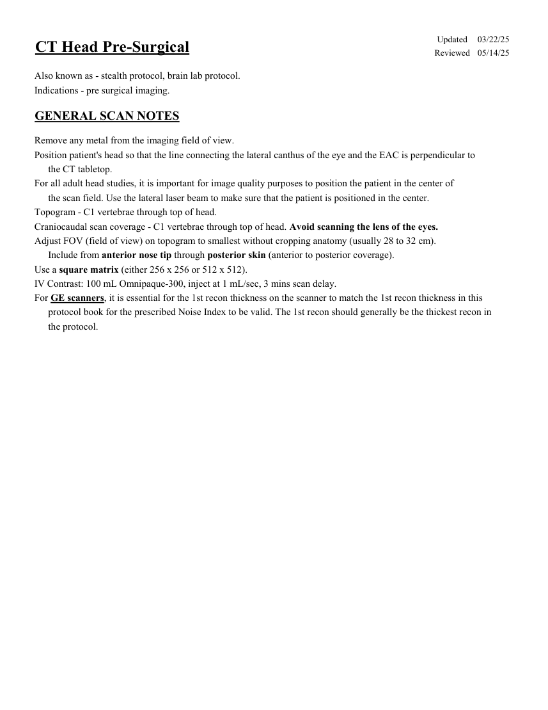
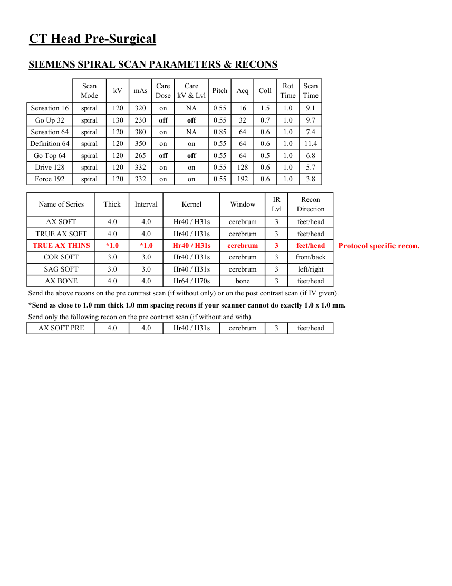
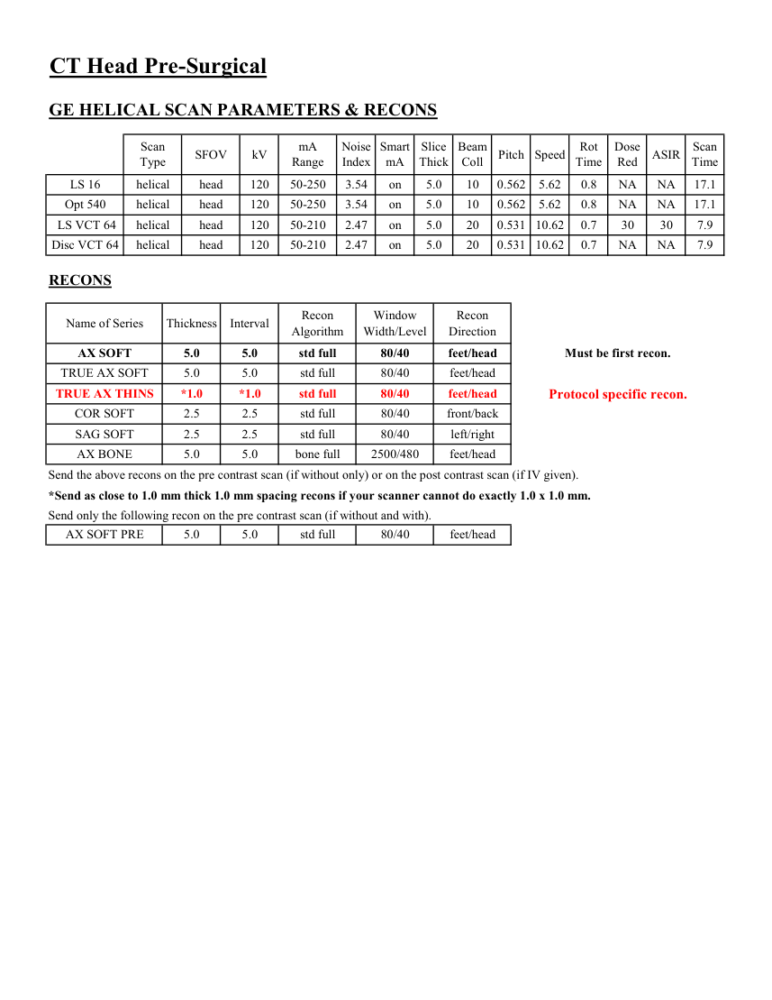
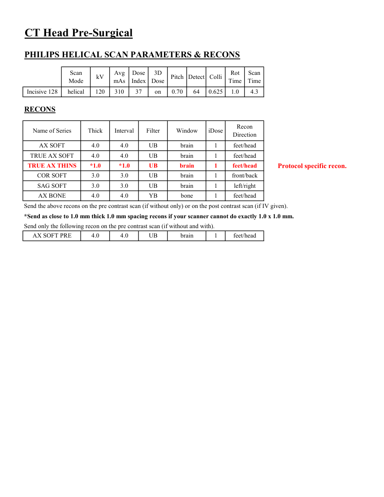

# CT — Craniu preoperator (MCB)

## Documentul original MCB — Craniu preoperator

**Protocol · 4 pagini · consultat la 2026-09-27.**

[Descarcă PDF-ul integral](../../assets/mcb-modalities/ct-craniu-preoperator-mcb/document.pdf) · [Sursa MCB](https://ref.mcbradiology.com/Protocols,%20Policies,%20Worksheets%20&%20Forms/CT/Protocols/Neuro/2%20Head%20Pre-Surgical.pdf) · [Catalogul MCB pentru această modalitate](../mcb/index.md)

Instrucțiunile, valorile și ilustrațiile din documentul original sunt păstrate în **engleză**. Titlul și navigarea sunt în română.

### Pagina 1

{ loading=lazy }

### Pagina 2

{ loading=lazy }

### Pagina 3

{ loading=lazy }

### Pagina 4

{ loading=lazy }

## Textul documentului original

??? abstract "Pagina 1 — text în engleză"

    
Updated
    03/22/25
    CT Head Pre-Surgical
    Reviewed
    05/14/25
    Also known as - stealth protocol, brain lab protocol.
    Indications - pre surgical imaging.
    GENERAL SCAN NOTES
    Remove any metal from the imaging field of view.
    Position patient&#x27;s head so that the line connecting the lateral canthus of the eye and the EAC is perpendicular to 
    the CT tabletop. 
    For all adult head studies, it is important for image quality purposes to position the patient in the center of 
    the scan field. Use the lateral laser beam to make sure that the patient is positioned in the center.
    Topogram - C1 vertebrae through top of head.
    Craniocaudal scan coverage - C1 vertebrae through top of head. Avoid scanning the lens of the eyes. 
    Adjust FOV (field of view) on topogram to smallest without cropping anatomy (usually 28 to 32 cm).
    Include from anterior nose tip through posterior skin (anterior to posterior coverage).
    Use a square matrix (either 256 x 256 or 512 x 512).
    IV Contrast: 100 mL Omnipaque-300, inject at 1 mL/sec, 3 mins scan delay.
    For GE scanners, it is essential for the 1st recon thickness on the scanner to match the 1st recon thickness in this
    protocol book for the prescribed Noise Index to be valid. The 1st recon should generally be the thickest recon in 
    the protocol.
    

??? abstract "Pagina 2 — text în engleză"

    
CT Head Pre-Surgical
    SIEMENS SPIRAL SCAN PARAMETERS &amp; RECONS
    Scan                           
    Care                                          
    Scan                 
    Acq
    Coll
    Rot 
    Mode
    kV
    mAs
    Care                            
    Dose
    kV &amp; Lvl
    Pitch
    Time
    Time
    Sensation 16
    spiral
    120
    320
    on
    NA
    0.55
    16
    1.5
    1.0
    9.1
    Go Up 32
    spiral
    130
    230
    off
    off
    0.55
    32
    0.7
    1.0
    9.7
    Sensation 64
    spiral
    120
    380
    on
    0.85
    64
    0.6
    1.0
    7.4
    NA
    Definition 64
    spiral
    120
    350
    on
    on
    0.55
    64
    0.6
    1.0
    11.4
    Go Top 64
    spiral
    120
    265
    off
    0.55
    64
    0.5
    1.0
    6.8
    off
    Drive 128
    spiral
    120
    332
    on
    on
    0.55
    128
    0.6
    1.0
    5.7
    Force 192
    spiral
    120
    332
    on
    on
    0.55
    192
    0.6
    1.0
    3.8
    IR                       
    Recon                     
    Name of Series
    Thick
    Interval
    Kernel
    Window
    Lvl
    Direction
    AX SOFT
    4.0
    4.0
    Hr40 / H31s
    cerebrum
    3
    feet/head
    TRUE AX SOFT
    4.0
    4.0
    Hr40 / H31s
    cerebrum
    3
    feet/head
    TRUE AX THINS
    *1.0
    *1.0
    Hr40 / H31s
    cerebrum
    3
    feet/head
    Protocol specific recon.
    COR SOFT
    3.0
    3.0
    Hr40 / H31s
    cerebrum
    3
    front/back
    SAG SOFT
    3.0
    3.0
    Hr40 / H31s
    cerebrum
    3
    left/right
    AX BONE
    4.0
    4.0
    Hr64 / H70s
    bone
    3
    feet/head
    Send the above recons on the pre contrast scan (if without only) or on the post contrast scan (if IV given).
    *Send as close to 1.0 mm thick 1.0 mm spacing recons if your scanner cannot do exactly 1.0 x 1.0 mm.
    Send only the following recon on the pre contrast scan (if without and with).
    feet/head
    AX SOFT PRE
    4.0
    4.0
    Hr40 / H31s
    cerebrum
    3
    

??? abstract "Pagina 3 — text în engleză"

    
CT Head Pre-Surgical
    GE HELICAL SCAN PARAMETERS &amp; RECONS
    Scan               
    Smart             
    Slice                       
    Beam                                 
    Dose                                          
    ASIR
    Scan                 
    Type
    SFOV
    kV
    mA                           
    Range
    Noise                    
    Index
    mA
    Thick
    Coll
    Pitch
    Speed
    Rot                                
    Time
    Red
    Time
    10
    0.562
    5.62
    0.8
    NA
    NA
    LS 16
    helical
    head
    120
    50-250
    3.54
    on
    5.0
    17.1
    Opt 540
    helical
    head
    120
    50-250
    3.54
    on
    5.0
    10
    0.562
    5.62
    0.8
    NA
    NA
    17.1
    on
    5.0
     LS VCT 64
    helical
    head
    120
    50-210
    2.47
    30
    30
    7.9
    20
    0.531 10.62
    0.7
    Disc VCT 64
    helical
    head
    120
    50-210
    2.47
    on
    NA
    7.9
    5.0
    20
    0.531 10.62
    0.7
    NA
    RECONS
    Window                                   
    Recon                    
    Name of Series
    Thickness
    Interval
    Recon                                     
    Algorithm
    Width/Level
    Direction
    AX SOFT
    5.0
    5.0
    std full
    80/40
    feet/head
    Must be first recon.
    TRUE AX SOFT
    5.0
    5.0
    std full
    80/40
    feet/head
    TRUE AX THINS
    *1.0
    *1.0
    std full
    80/40
    feet/head
    Protocol specific recon.
    COR SOFT
    2.5
    2.5
    std full
    80/40
    front/back
    SAG SOFT
    2.5
    2.5
    std full
    80/40
    left/right
    AX BONE
    5.0
    5.0
    bone full
    2500/480
    feet/head
    Send the above recons on the pre contrast scan (if without only) or on the post contrast scan (if IV given).
    *Send as close to 1.0 mm thick 1.0 mm spacing recons if your scanner cannot do exactly 1.0 x 1.0 mm.
    Send only the following recon on the pre contrast scan (if without and with).
    AX SOFT PRE
    5.0
    5.0
    std full
    80/40
    feet/head
    

??? abstract "Pagina 4 — text în engleză"

    
CT Head Pre-Surgical
    PHILIPS HELICAL SCAN PARAMETERS &amp; RECONS
    Scan                           
    Dose                                          
    3D            
    Rot 
    Scan                 
    Mode
    kV
    Avg                      
    mAs
    Index
    Dose
    Pitch Detect Colli
    Time
    Time
    Incisive 128
    helical
    120
    310
    37
    on
    0.70
    64
    0.625
    1.0
    4.3
    RECONS
    Recon                     
    Name of Series
    Thick
    Interval
    Filter
    Window
    iDose
    Direction
    AX SOFT
    4.0
    4.0
    UB
    brain
    1
    feet/head
    TRUE AX SOFT
    4.0
    4.0
    UB
    brain
    1
    feet/head
    TRUE AX THINS
    *1.0
    *1.0
    UB
    brain
    1
    feet/head
    Protocol specific recon.
    COR SOFT
    3.0
    3.0
    UB
    brain
    1
    front/back
    SAG SOFT
    3.0
    3.0
    UB
    brain
    1
    left/right
    AX BONE
    4.0
    4.0
    YB
    bone
    1
    feet/head
    Send the above recons on the pre contrast scan (if without only) or on the post contrast scan (if IV given).
    *Send as close to 1.0 mm thick 1.0 mm spacing recons if your scanner cannot do exactly 1.0 x 1.0 mm.
    Send only the following recon on the pre contrast scan (if without and with).
    AX SOFT PRE
    4.0
    4.0
    UB
    brain
    1
    feet/head
    

