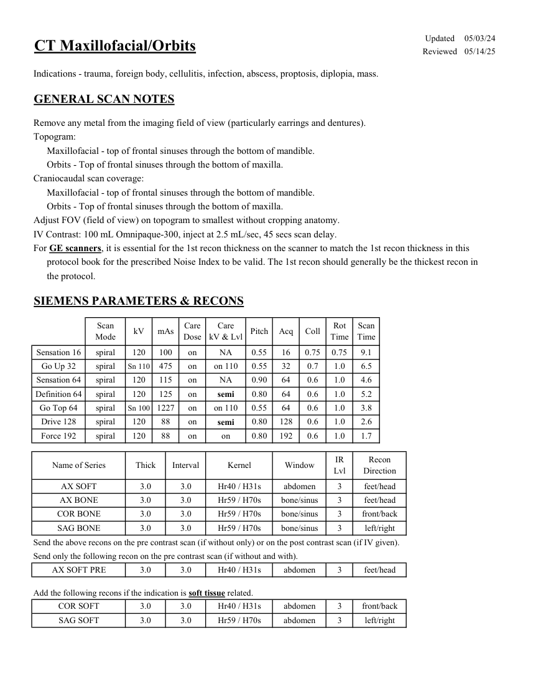
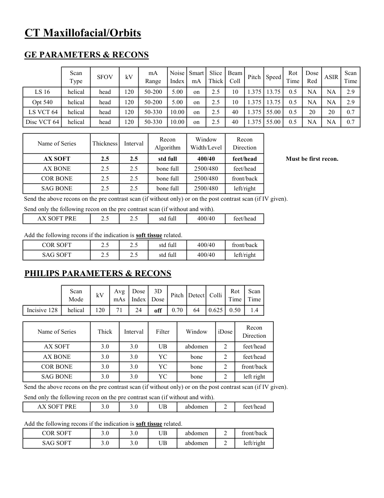

# CT — Masiv facial și orbite (MCB)

## Documentul original MCB — Masiv facial și orbite

**Protocol · 2 pagini · consultat la 2026-09-27.**

[Descarcă PDF-ul integral](../../assets/mcb-modalities/ct-masiv-facial-si-orbite-mcb/document.pdf) · [Sursa MCB](https://ref.mcbradiology.com/Protocols,%20Policies,%20Worksheets%20&%20Forms/CT/Protocols/Neuro/8%20MF%20&%20Orbits.pdf) · [Catalogul MCB pentru această modalitate](../mcb/index.md)

Instrucțiunile, valorile și ilustrațiile din documentul original sunt păstrate în **engleză**. Titlul și navigarea sunt în română.

### Pagina 1

{ loading=lazy }

### Pagina 2

{ loading=lazy }

## Textul documentului original

??? abstract "Pagina 1 — text în engleză"

    
Updated
    05/03/24
    CT Maxillofacial/Orbits
    Reviewed
    05/14/25
    Indications - trauma, foreign body, cellulitis, infection, abscess, proptosis, diplopia, mass.
    GENERAL SCAN NOTES
    Remove any metal from the imaging field of view (particularly earrings and dentures).
    Topogram:
    Maxillofacial - top of frontal sinuses through the bottom of mandible.
    Orbits - Top of frontal sinuses through the bottom of maxilla.
    Craniocaudal scan coverage:
    Maxillofacial - top of frontal sinuses through the bottom of mandible.
    Orbits - Top of frontal sinuses through the bottom of maxilla.
    Adjust FOV (field of view) on topogram to smallest without cropping anatomy.
    IV Contrast: 100 mL Omnipaque-300, inject at 2.5 mL/sec, 45 secs scan delay.
    For GE scanners, it is essential for the 1st recon thickness on the scanner to match the 1st recon thickness in this
    protocol book for the prescribed Noise Index to be valid. The 1st recon should generally be the thickest recon in 
    the protocol.
    SIEMENS PARAMETERS &amp; RECONS
    Scan                           
    Care                                          
    Scan                 
    Mode
    kV
    mAs
    Care                            
    Dose
    kV &amp; Lvl
    Pitch
    Acq
    Coll
    Rot 
    Time
    Time
    Sensation 16
    spiral
    120
    100
    on
    NA
    0.55
    16
    0.75
    0.75
    9.1
    Go Up 32
    spiral
    Sn 110
    475
    on
    on 110
    0.55
    32
    1.0
    0.7
    6.5
    Sensation 64
    spiral
    120
    115
    on
    NA
    0.90
    64
    0.6
    1.0
    4.6
    120
    125
    on
    5.2
    semi
    0.80
    64
    0.6
    1.0
    Definition 64
    spiral
    Go Top 64
    spiral
    Sn 100
    1227
    on
    on 110
    0.55
    64
    0.6
    1.0
    3.8
    on
    2.6
    semi
    0.80
    128
    0.6
    1.0
    Drive 128
    spiral
    120
    88
    Force 192
    spiral
    120
    88
    on
    on
    0.80
    192
    0.6
    1.0
    1.7
    IR                       
    Recon                     
    Name of Series
    Thick
    Interval
    Kernel
    Window
    Lvl
    Direction
    AX SOFT
    3.0
    3.0
    Hr40 / H31s
    abdomen
    3
    feet/head
    AX BONE
    3.0
    3.0
    Hr59 / H70s
    bone/sinus
    3
    feet/head
    COR BONE
    3.0
    3.0
    Hr59 / H70s
    bone/sinus
    3
    front/back
    3
    left/right
    SAG BONE
    3.0
    3.0
    Hr59 / H70s
    bone/sinus
    Send the above recons on the pre contrast scan (if without only) or on the post contrast scan (if IV given).
    Send only the following recon on the pre contrast scan (if without and with).
    AX SOFT PRE
    3.0
    3.0
    Hr40 / H31s
    abdomen
    3
    feet/head
    Add the following recons if the indication is soft tissue related.
    COR SOFT
    3.0
    3.0
    Hr40 / H31s
    abdomen
    3
    front/back
    3
    left/right
    SAG SOFT
    3.0
    3.0
    Hr59 / H70s
    abdomen
    

??? abstract "Pagina 2 — text în engleză"

    
CT Maxillofacial/Orbits
    GE PARAMETERS &amp; RECONS
    Scan               
    Smart             
    Slice                       
    Beam                                 
    Dose                                          
    Type
    SFOV
    kV
    mA                           
    Range
    Noise                    
    Index
    mA
    Thick
    Coll
    Pitch
    Speed
    Rot                                
    Time
    Red
    ASIR
    Scan                 
    Time
    LS 16
    helical
    head
    120
    50-200
    NA
    2.9
    5.00
    on
    2.5
    10
    1.375
    13.75
    0.5
    NA
    Opt 540
    helical
    head
    120
    50-200
    5.00
    on
    2.5
    10
    1.375
    NA
    2.9
    13.75
    0.5
    NA
     LS VCT 64
    helical
    head
    120
    50-330
    10.00
    on
    2.5
    40
    1.375 55.00
    0.5
    20
    20
    0.7
    Disc VCT 64
    helical
    head
    120
    50-330
    10.00
    on
    2.5
    40
    1.375 55.00
    0.5
    NA
    NA
    0.7
    Window                                   
    Recon 
    Name of Series
    Thickness
    Interval
    Recon                                     
    Algorithm
    Width/Level
    Direction
    AX SOFT
    2.5
    2.5
    std full
    400/40
    feet/head
    Must be first recon.
    AX BONE
    2.5
    2.5
    bone full
    feet/head
    2500/480
    COR BONE
    2.5
    2.5
    bone full
    2500/480
    front/back
    SAG BONE
    2.5
    2.5
    bone full
    2500/480
    left/right
    Send the above recons on the pre contrast scan (if without only) or on the post contrast scan (if IV given).
    Send only the following recon on the pre contrast scan (if without and with).
    AX SOFT PRE
    2.5
    2.5
    std full
    400/40
    feet/head
    Add the following recons if the indication is soft tissue related.
    COR SOFT
    2.5
    2.5
    std full
    400/40
    front/back
    SAG SOFT
    2.5
    2.5
    std full
    400/40
    left/right
    PHILIPS PARAMETERS &amp; RECONS
    Scan                           
    Dose                                          
    3D            
    Scan                 
    Mode
    kV
    Avg                      
    mAs
    Index
    Dose
    Pitch Detect Colli
    Rot 
    Time
    Time
    1.4
    off
    0.70
    64
    0.625
    0.50
    Incisive 128
    helical
    120
    71
    24
    Name of Series
    Thick
    Interval
    Filter
    Window
    iDose
    Recon                     
    Direction
    AX SOFT
    3.0
    3.0
    UB
    abdomen
    2
    feet/head
    AX BONE
    3.0
    3.0
    YC
    bone
    2
    feet/head
    COR BONE
    3.0
    3.0
    YC
    bone
    2
    front/back
    SAG BONE
    3.0
    3.0
    YC
    bone
    2
    left right
    Send the above recons on the pre contrast scan (if without only) or on the post contrast scan (if IV given).
    Send only the following recon on the pre contrast scan (if without and with).
    AX SOFT PRE
    3.0
    3.0
    UB
    abdomen
    2
    feet/head
    Add the following recons if the indication is soft tissue related.
    COR SOFT
    3.0
    3.0
    UB
    abdomen
    2
    front/back
    2
    left/right
    SAG SOFT
    3.0
    3.0
    UB
    abdomen
    

