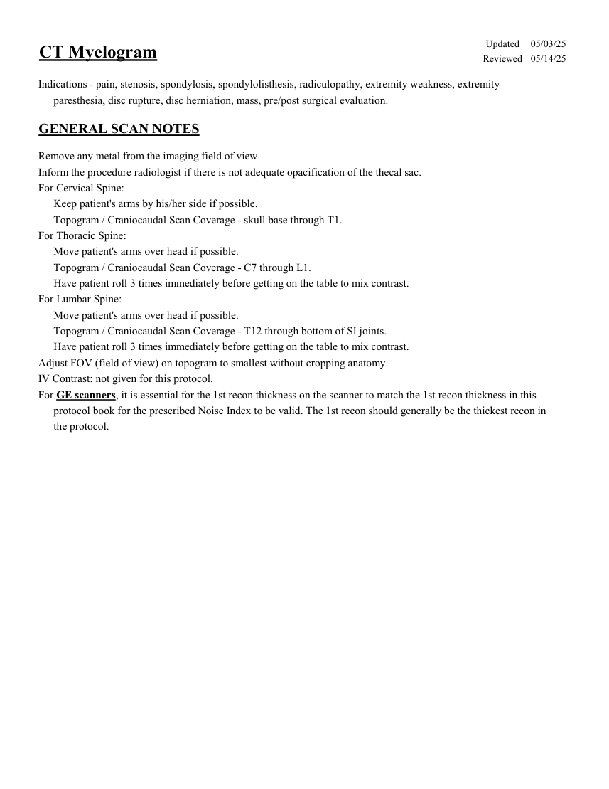
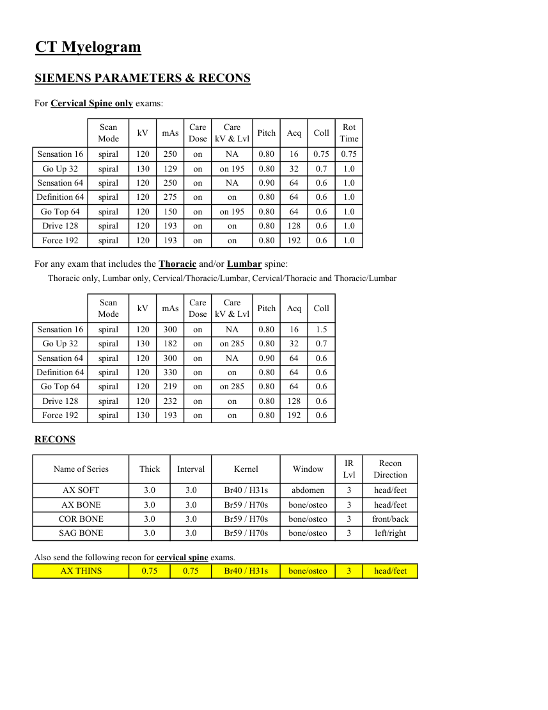
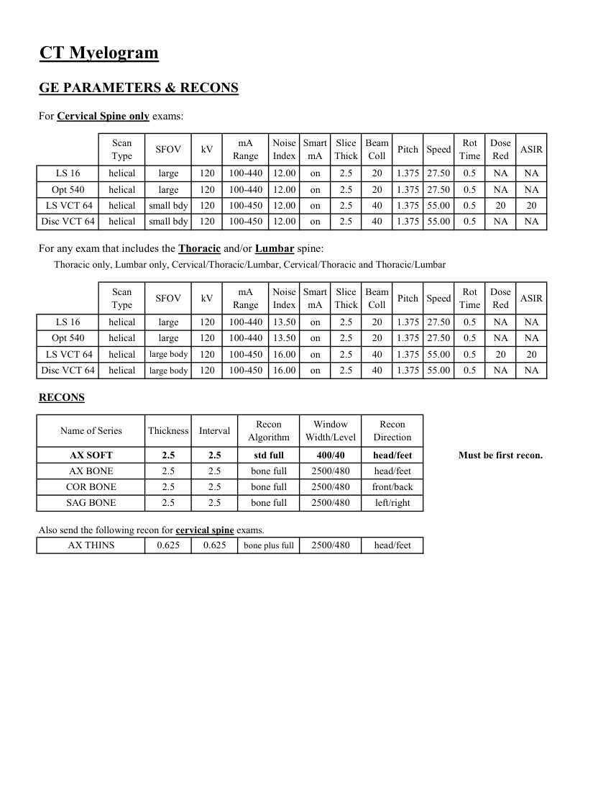
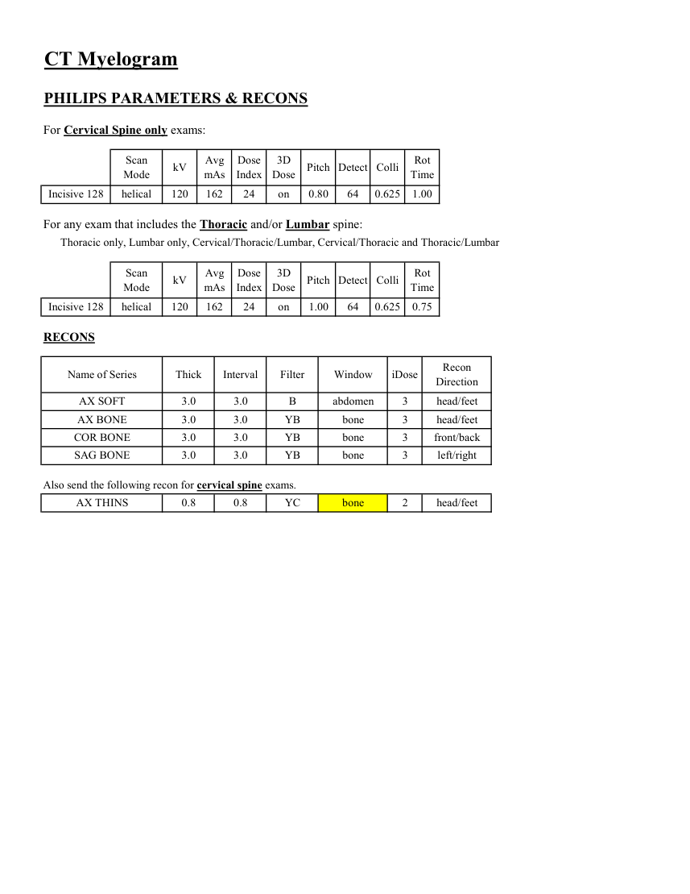

# CT — Mielografie (MCB)

## Documentul original MCB — Mielografie

**Protocol · 4 pagini · consultat la 2026-09-27.**

[Descarcă PDF-ul integral](../../assets/mcb-modalities/ct-mielografie-mcb/document.pdf) · [Sursa MCB](https://ref.mcbradiology.com/Protocols,%20Policies,%20Worksheets%20&%20Forms/CT/Protocols/Neuro/17%20Myelogram.pdf) · [Catalogul MCB pentru această modalitate](../mcb/index.md)

Instrucțiunile, valorile și ilustrațiile din documentul original sunt păstrate în **engleză**. Titlul și navigarea sunt în română.

### Pagina 1

{ loading=lazy }

### Pagina 2

{ loading=lazy }

### Pagina 3

{ loading=lazy }

### Pagina 4

{ loading=lazy }

## Textul documentului original

??? abstract "Pagina 1 — text în engleză"

    
Updated
    05/03/25
    CT Myelogram
    Reviewed
    05/14/25
    Indications - pain, stenosis, spondylosis, spondylolisthesis, radiculopathy, extremity weakness, extremity 
    paresthesia, disc rupture, disc herniation, mass, pre/post surgical evaluation.
    GENERAL SCAN NOTES
    Remove any metal from the imaging field of view.
    Inform the procedure radiologist if there is not adequate opacification of the thecal sac.
    For Cervical Spine:
    Keep patient&#x27;s arms by his/her side if possible.
    Topogram / Craniocaudal Scan Coverage - skull base through T1.
    For Thoracic Spine:
    Move patient&#x27;s arms over head if possible.
    Topogram / Craniocaudal Scan Coverage - C7 through L1.
    Have patient roll 3 times immediately before getting on the table to mix contrast.
    For Lumbar Spine:
    Move patient&#x27;s arms over head if possible.
    Topogram / Craniocaudal Scan Coverage - T12 through bottom of SI joints.
    Have patient roll 3 times immediately before getting on the table to mix contrast.
    Adjust FOV (field of view) on topogram to smallest without cropping anatomy.
    IV Contrast: not given for this protocol.
    For GE scanners, it is essential for the 1st recon thickness on the scanner to match the 1st recon thickness in this
    protocol book for the prescribed Noise Index to be valid. The 1st recon should generally be the thickest recon in 
    the protocol.
    

??? abstract "Pagina 2 — text în engleză"

    
CT Myelogram
    SIEMENS PARAMETERS &amp; RECONS
    For Cervical Spine only exams:
    Scan                           
    Care                                          
    Mode
    kV
    mAs
    Care                            
    Dose
    kV &amp; Lvl
    Pitch
    Acq
    Coll
    Rot 
    Time
    Sensation 16
    spiral
    120
    250
    on
    NA
    0.80
    16
    0.75
    0.75
    Go Up 32
    spiral
    130
    129
    on
    on 195
    0.80
    32
    0.7
    1.0
    Sensation 64
    spiral
    120
    250
    on
    NA
    0.90
    64
    0.6
    1.0
    Definition 64
    spiral
    120
    275
    on
    on
    0.80
    64
    0.6
    1.0
    Go Top 64
    spiral
    120
    150
    on
    on 195
    0.80
    64
    0.6
    1.0
    Drive 128
    spiral
    120
    193
    on
    on
    0.80
    128
    0.6
    1.0
    Force 192
    spiral
    120
    193
    on
    on
    0.80
    192
    0.6
    1.0
    For any exam that includes the Thoracic and/or Lumbar spine:
    Thoracic only, Lumbar only, Cervical/Thoracic/Lumbar, Cervical/Thoracic and Thoracic/Lumbar
    Scan                           
    Care                                          
    Mode
    kV
    mAs
    Care                            
    Dose
    kV &amp; Lvl
    Pitch
    Acq
    Coll
    Sensation 16
    spiral
    120
    300
    on
    NA
    0.80
    16
    1.5
    Go Up 32
    spiral
    130
    182
    on
    on 285
    0.80
    32
    0.7
    Sensation 64
    spiral
    120
    300
    on
    NA
    0.90
    64
    0.6
    Definition 64
    spiral
    120
    330
    on
    on
    0.80
    64
    0.6
    Go Top 64
    spiral
    120
    219
    on
    on 285
    0.80
    64
    0.6
    Drive 128
    spiral
    120
    232
    on
    on
    0.80
    128
    0.6
    Force 192
    spiral
    130
    193
    on
    on
    0.80
    192
    0.6
    RECONS
    Recon                     
    Name of Series
    Thick
    Interval
    Kernel
    Window
    IR                       
    Lvl
    Direction
    AX SOFT
    3.0
    3.0
    Br40 / H31s
    abdomen
    3
    head/feet
    AX BONE
    3.0
    3.0
    Br59 / H70s
    bone/osteo
    3
    head/feet
    COR BONE
    3.0
    3.0
    Br59 / H70s
    bone/osteo
    3
    front/back
    SAG BONE
    3.0
    3.0
    Br59 / H70s
    bone/osteo
    3
    left/right
    Also send the following recon for cervical spine exams.
    AX THINS
    0.75
    0.75
    Br40 / H31s
    bone/osteo
    3
    head/feet
    

??? abstract "Pagina 3 — text în engleză"

    
CT Myelogram
    GE PARAMETERS &amp; RECONS
    For Cervical Spine only exams:
    Scan               
    Smart             
    Slice                       
    Beam                                 
    Dose                                          
    ASIR
    Type
    SFOV
    kV
    mA                           
    Range
    Noise                    
    Index
    mA
    Thick
    Coll
    Pitch
    Speed
    Rot                                
    Time
    Red
    LS 16
    helical
    large
    120
    100-440
    12.00
    on
    2.5
    20
    1.375 27.50
    0.5
    NA
    NA
    Opt 540
    helical
    large
    120
    100-440
    12.00
    on
    2.5
    20
    1.375 27.50
    0.5
    NA
    NA
     LS VCT 64
    helical
    small bdy
    120
    100-450
    12.00
    on
    2.5
    40
    1.375 55.00
    0.5
    20
    20
    Disc VCT 64
    helical
    small bdy
    120
    100-450
    12.00
    on
    2.5
    40
    1.375
    55.00
    0.5
    NA
    NA
    For any exam that includes the Thoracic and/or Lumbar spine:
    Thoracic only, Lumbar only, Cervical/Thoracic/Lumbar, Cervical/Thoracic and Thoracic/Lumbar
    Scan               
    mA                           
    Smart             
    Slice                       
    Beam                                 
    Dose                                          
    Pitch
    Speed
    Rot                                
    ASIR
    Type
    SFOV
    kV
    Range
    Noise                    
    Index
    mA
    Thick
    Coll
    Time
    Red
    LS 16
    helical
    large
    120
    100-440
    13.50
    on
    2.5
    20
    1.375
    27.50
    0.5
    NA
    NA
    Opt 540
    helical
    100-440
    13.50
    on
    2.5
    20
    1.375
    large
    120
    27.50
    0.5
    NA
    NA
     LS VCT 64
    helical
    large body
    120
    100-450
    on
    2.5
    16.00
    40
    1.375
    55.00
    0.5
    20
    20
    Disc VCT 64
    helical
    large body
    120
    100-450
    16.00
    on
    2.5
    40
    1.375 55.00
    0.5
    NA
    NA
    RECONS
    Window                                   
    Recon 
    Name of Series
    Thickness
    Interval
    Recon                                     
    Algorithm
    Width/Level
    Direction
    AX SOFT
    2.5
    2.5
    std full
    Must be first recon.
    400/40
    head/feet
    AX BONE
    2.5
    2.5
    bone full
    2500/480
    head/feet
    COR BONE
    2.5
    2.5
    bone full
    2500/480
    front/back
    SAG BONE
    2.5
    2.5
    bone full
    2500/480
    left/right
    Also send the following recon for cervical spine exams.
    AX THINS
    0.625
    0.625
    bone plus full
    2500/480
    head/feet
    

??? abstract "Pagina 4 — text în engleză"

    
CT Myelogram
    PHILIPS PARAMETERS &amp; RECONS
    For Cervical Spine only exams:
    Scan                           
    Dose                                          
    3D            
    Mode
    kV
    Avg                      
    mAs
    Index
    Dose
    Pitch Detect Colli
    Rot 
    Time
    Incisive 128
    helical
    120
    162
    24
    on
    0.80
    64
    0.625
    1.00
    For any exam that includes the Thoracic and/or Lumbar spine:
    Thoracic only, Lumbar only, Cervical/Thoracic/Lumbar, Cervical/Thoracic and Thoracic/Lumbar
    Scan                           
    Dose                                          
    3D            
    Mode
    kV
    Avg                      
    mAs
    Index
    Dose
    Pitch Detect Colli
    Rot 
    Time
    Incisive 128
    helical
    120
    162
    24
    on
    1.00
    64
    0.625
    0.75
    RECONS
    Name of Series
    Thick
    Interval
    Filter
    Window
    iDose
    Recon                     
    Direction
    AX SOFT
    3.0
    3.0
    B
    abdomen
    3
    head/feet
    AX BONE
    3.0
    3.0
    YB
    bone
    3
    head/feet
    COR BONE
    3.0
    3.0
    YB
    bone
    3
    front/back
    SAG BONE
    3.0
    3.0
    YB
    bone
    3
    left/right
    Also send the following recon for cervical spine exams.
    AX THINS
    0.8
    0.8
    YC
    bone
    2
    head/feet
    

