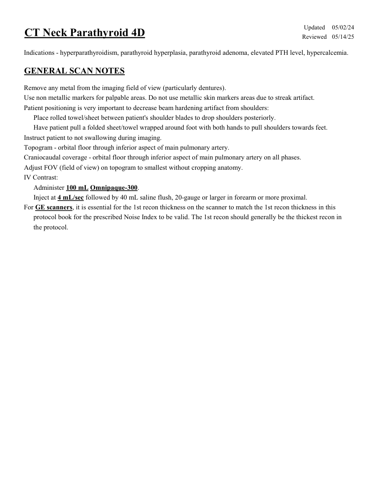
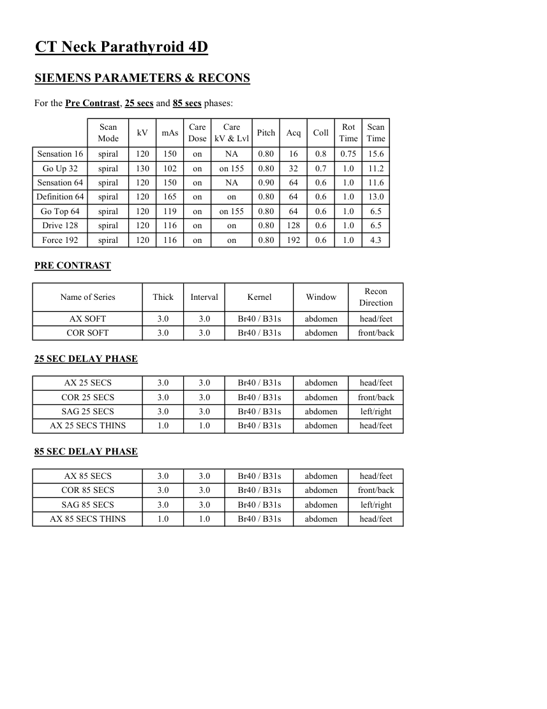
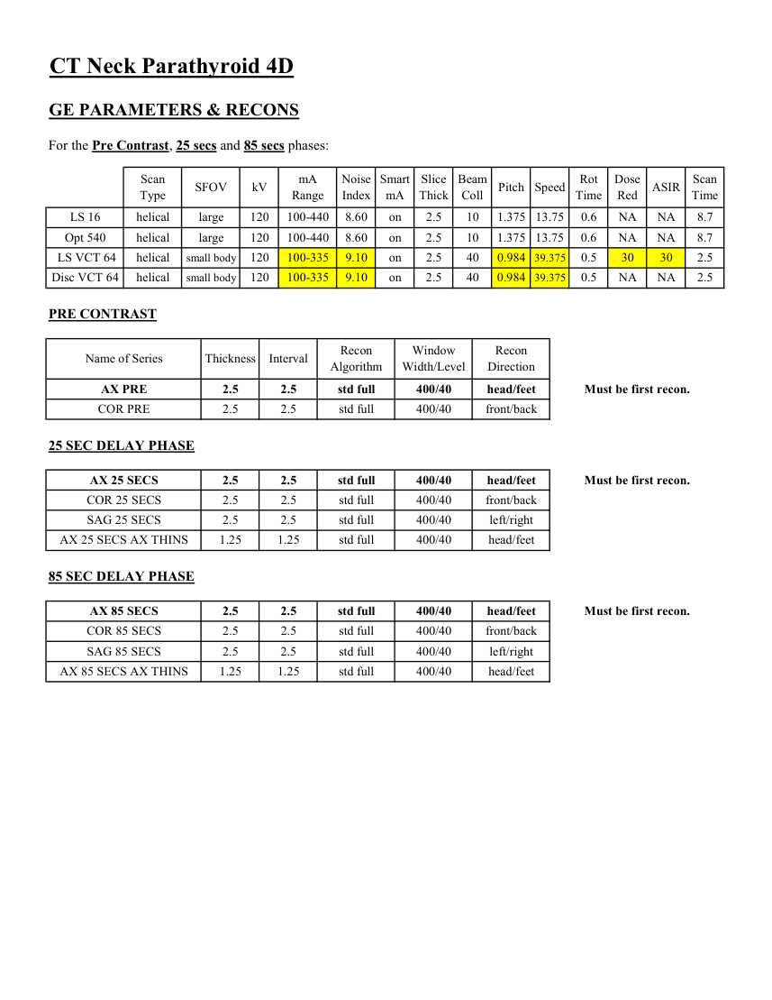
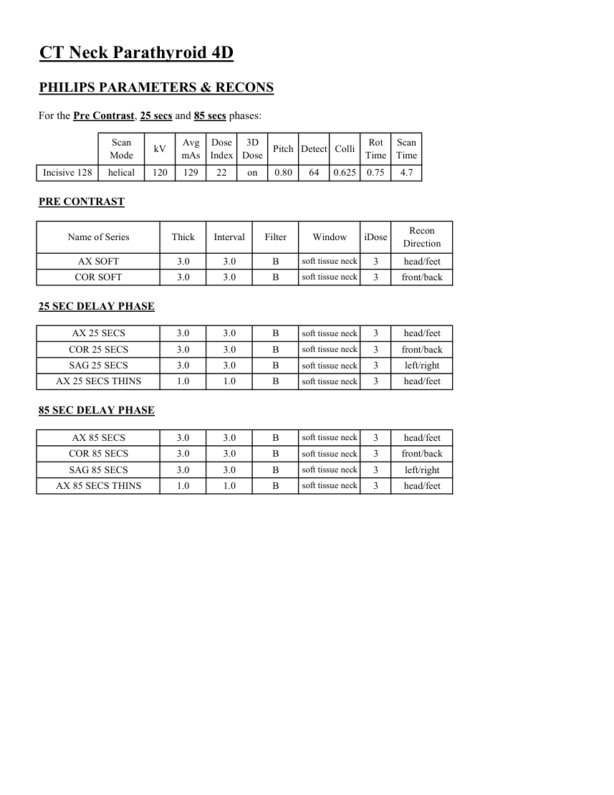

# CT — Paratiroide (MCB)

## Documentul original MCB — Paratiroide

**Protocol · 4 pagini · consultat la 2026-09-27.**

[Descarcă PDF-ul integral](../../assets/mcb-modalities/ct-paratiroide-mcb/document.pdf) · [Sursa MCB](https://ref.mcbradiology.com/Protocols,%20Policies,%20Worksheets%20&%20Forms/CT/Protocols/Neuro/12%20Neck%20Parathyroid.pdf) · [Catalogul MCB pentru această modalitate](../mcb/index.md)

Instrucțiunile, valorile și ilustrațiile din documentul original sunt păstrate în **engleză**. Titlul și navigarea sunt în română.

### Pagina 1

{ loading=lazy }

### Pagina 2

{ loading=lazy }

### Pagina 3

{ loading=lazy }

### Pagina 4

{ loading=lazy }

## Textul documentului original

??? abstract "Pagina 1 — text în engleză"

    
Updated
    05/02/24
    CT Neck Parathyroid 4D
    Reviewed
    05/14/25
    Indications - hyperparathyroidism, parathyroid hyperplasia, parathyroid adenoma, elevated PTH level, hypercalcemia.
    GENERAL SCAN NOTES
    Remove any metal from the imaging field of view (particularly dentures).
    Use non metallic markers for palpable areas. Do not use metallic skin markers areas due to streak artifact.
    Patient positioning is very important to decrease beam hardening artifact from shoulders:
    Place rolled towel/sheet between patient&#x27;s shoulder blades to drop shoulders posteriorly.
    Have patient pull a folded sheet/towel wrapped around foot with both hands to pull shoulders towards feet.
    Instruct patient to not swallowing during imaging.
    Topogram - orbital floor through inferior aspect of main pulmonary artery.
    Craniocaudal coverage - orbital floor through inferior aspect of main pulmonary artery on all phases.
    Adjust FOV (field of view) on topogram to smallest without cropping anatomy.
    IV Contrast:
    Administer 100 mL Omnipaque-300.
    Inject at 4 mL/sec followed by 40 mL saline flush, 20-gauge or larger in forearm or more proximal.
    For GE scanners, it is essential for the 1st recon thickness on the scanner to match the 1st recon thickness in this
    protocol book for the prescribed Noise Index to be valid. The 1st recon should generally be the thickest recon in 
    the protocol.
    

??? abstract "Pagina 2 — text în engleză"

    
CT Neck Parathyroid 4D
    SIEMENS PARAMETERS &amp; RECONS
    For the Pre Contrast, 25 secs and 85 secs phases:
    Scan                           
    Care                                          
    Scan                 
    Mode
    kV
    mAs
    Care                            
    Dose
    kV &amp; Lvl
    Pitch
    Acq
    Coll
    Rot 
    Time
    Time
    Sensation 16
    spiral
    120
    150
    on
    NA
    0.80
    16
    0.8
    0.75
    15.6
    Go Up 32
    spiral
    130
    102
    on
    on 155
    0.80
    32
    0.7
    1.0
    11.2
    Sensation 64
    spiral
    120
    150
    on
    NA
    0.90
    64
    0.6
    1.0
    11.6
    Definition 64
    spiral
    120
    165
    on
    on
    0.80
    64
    0.6
    1.0
    13.0
    Go Top 64
    spiral
    120
    119
    on
    on 155
    0.80
    64
    0.6
    1.0
    6.5
    Drive 128
    spiral
    120
    116
    on
    on
    0.80
    128
    0.6
    1.0
    6.5
    Force 192
    spiral
    120
    116
    on
    on
    0.80
    192
    0.6
    1.0
    4.3
    PRE CONTRAST
    Recon                     
    Name of Series
    Thick
    Interval
    Window
    Kernel
    Direction
    AX SOFT
    3.0
    3.0
    abdomen
    head/feet
    Br40 / B31s
    COR SOFT
    3.0
    3.0
    abdomen
    front/back
    Br40 / B31s
    25 SEC DELAY PHASE
    AX 25 SECS
    3.0
    3.0
    abdomen
    head/feet
    Br40 / B31s
    COR 25 SECS
    3.0
    3.0
    abdomen
    front/back
    Br40 / B31s
    SAG 25 SECS
    3.0
    3.0
    abdomen
    left/right
    Br40 / B31s
    AX 25 SECS THINS
    1.0
    1.0
    abdomen
    head/feet
    Br40 / B31s
    85 SEC DELAY PHASE
    AX 85 SECS
    3.0
    3.0
    abdomen
    head/feet
    Br40 / B31s
    COR 85 SECS
    3.0
    3.0
    abdomen
    front/back
    Br40 / B31s
    SAG 85 SECS
    3.0
    3.0
    abdomen
    left/right
    Br40 / B31s
    AX 85 SECS THINS
    1.0
    1.0
    abdomen
    head/feet
    Br40 / B31s
    

??? abstract "Pagina 3 — text în engleză"

    
CT Neck Parathyroid 4D
    GE PARAMETERS &amp; RECONS
    For the Pre Contrast, 25 secs and 85 secs phases:
    Scan               
    Smart             
    Slice                       
    Beam                                 
    Dose                                          
    Type
    SFOV
    kV
    mA                           
    Range
    Noise                    
    Index
    mA
    Thick
    Coll
    Pitch
    Speed
    Rot                                
    Time
    Red
    ASIR
    Scan                 
    Time
    LS 16
    helical
    large
    120
    100-440
    8.60
    1.375 13.75
    0.6
    on
    2.5
    10
    NA
    NA
    8.7
    Opt 540
    helical
    large
    120
    100-440
    8.60
    on
    2.5
    10
    1.375 13.75
    0.6
    NA
    NA
    8.7
     LS VCT 64
    helical
    small body
    120
    100-335
    9.10
    on
    2.5
    40
    0.984 39.375
    0.5
    30
    30
    2.5
    Disc VCT 64
    helical
    small body
    120
    100-335
    9.10
    on
    2.5
    40
    0.984 39.375
    0.5
    NA
    NA
    2.5
    PRE CONTRAST
    Window                                   
    Recon 
    Name of Series
    Thickness
    Interval
    Recon                                     
    Algorithm
    Width/Level
    Direction
    AX PRE
    2.5
    2.5
    std full
    400/40
    head/feet
    Must be first recon.
    COR PRE
    2.5
    2.5
    std full
    400/40
    front/back
    25 SEC DELAY PHASE
    AX 25 SECS
    2.5
    2.5
    std full
    400/40
    head/feet
    Must be first recon.
    COR 25 SECS
    2.5
    2.5
    std full
    400/40
    front/back
    SAG 25 SECS
    2.5
    2.5
    std full
    400/40
    left/right
    AX 25 SECS AX THINS
    1.25
    1.25
    std full
    400/40
    head/feet
    85 SEC DELAY PHASE
    AX 85 SECS
    2.5
    2.5
    std full
    400/40
    head/feet
    Must be first recon.
    COR 85 SECS
    2.5
    2.5
    std full
    400/40
    front/back
    SAG 85 SECS
    2.5
    2.5
    std full
    400/40
    left/right
    AX 85 SECS AX THINS
    1.25
    1.25
    std full
    400/40
    head/feet
    

??? abstract "Pagina 4 — text în engleză"

    
CT Neck Parathyroid 4D
    PHILIPS PARAMETERS &amp; RECONS
    For the Pre Contrast, 25 secs and 85 secs phases:
    Scan                           
    Dose                                          
    3D            
    Scan                 
    Mode
    kV
    Avg                      
    mAs
    Index
    Dose
    Pitch Detect Colli
    Rot 
    Time
    Time
    Incisive 128
    helical
    120
    129
    22
    on
    0.80
    64
    0.625
    0.75
    4.7
    PRE CONTRAST
    Name of Series
    Thick
    Interval
    Filter
    Window
    iDose
    Recon                     
    Direction
    AX SOFT
    3.0
    3.0
    3
    B
    soft tissue neck
    head/feet
    COR SOFT
    3.0
    3.0
    B
    soft tissue neck
    3
    front/back
    25 SEC DELAY PHASE
    AX 25 SECS
    3.0
    3.0
    B
    soft tissue neck
    3
    head/feet
    COR 25 SECS
    3.0
    3.0
    B
    soft tissue neck
    3
    front/back
    SAG 25 SECS
    3.0
    3.0
    B
    soft tissue neck
    3
    left/right
    AX 25 SECS THINS
    1.0
    1.0
    B
    soft tissue neck
    3
    head/feet
    85 SEC DELAY PHASE
    AX 85 SECS
    3.0
    3.0
    B
    soft tissue neck
    3
    head/feet
    COR 85 SECS
    3.0
    3.0
    B
    soft tissue neck
    3
    front/back
    SAG 85 SECS
    3.0
    3.0
    B
    soft tissue neck
    3
    left/right
    AX 85 SECS THINS
    1.0
    1.0
    B
    soft tissue neck
    3
    head/feet
    

