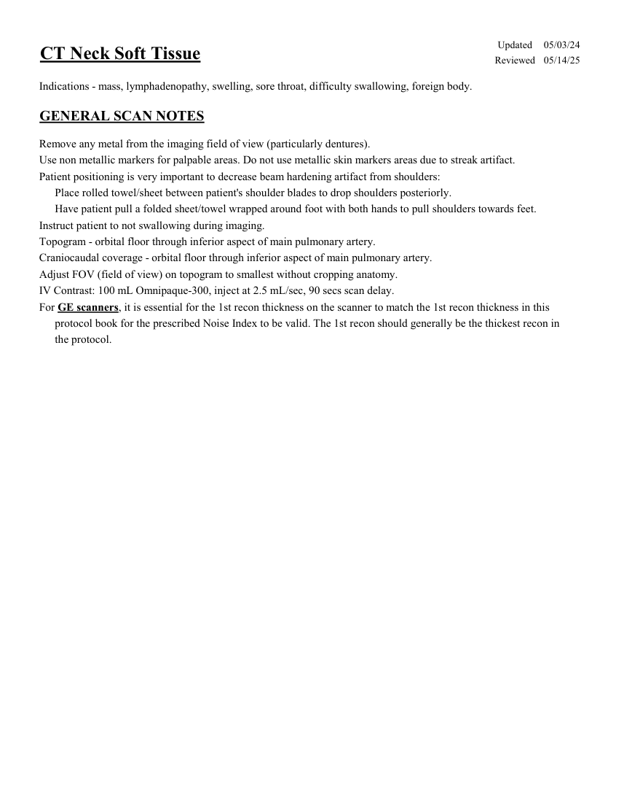
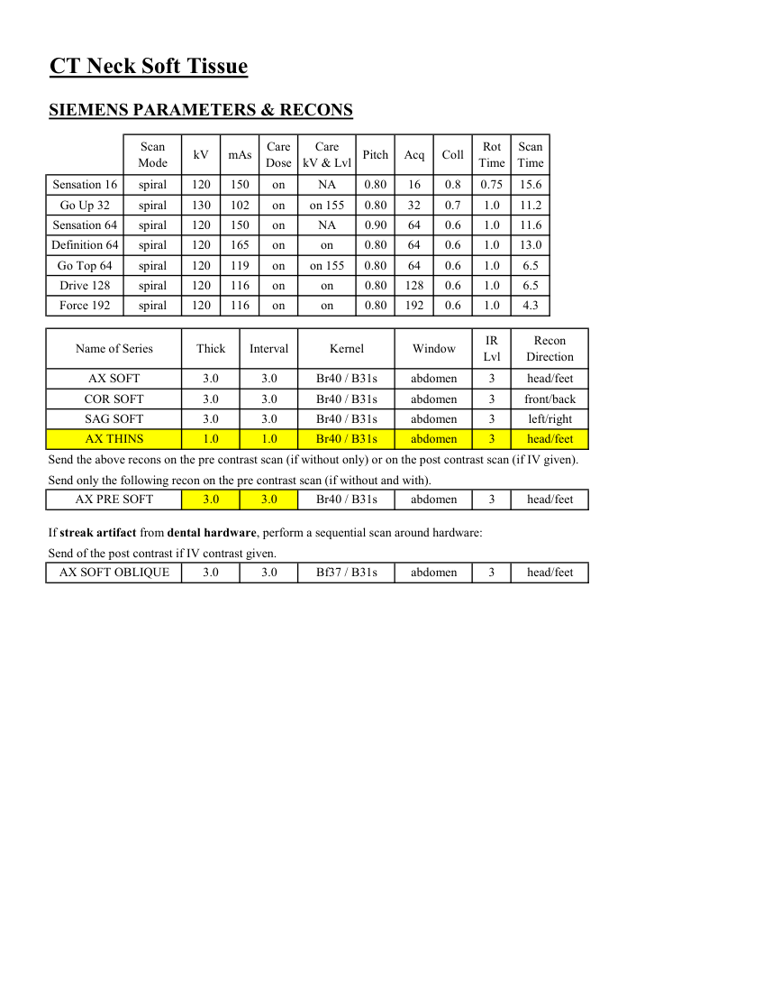
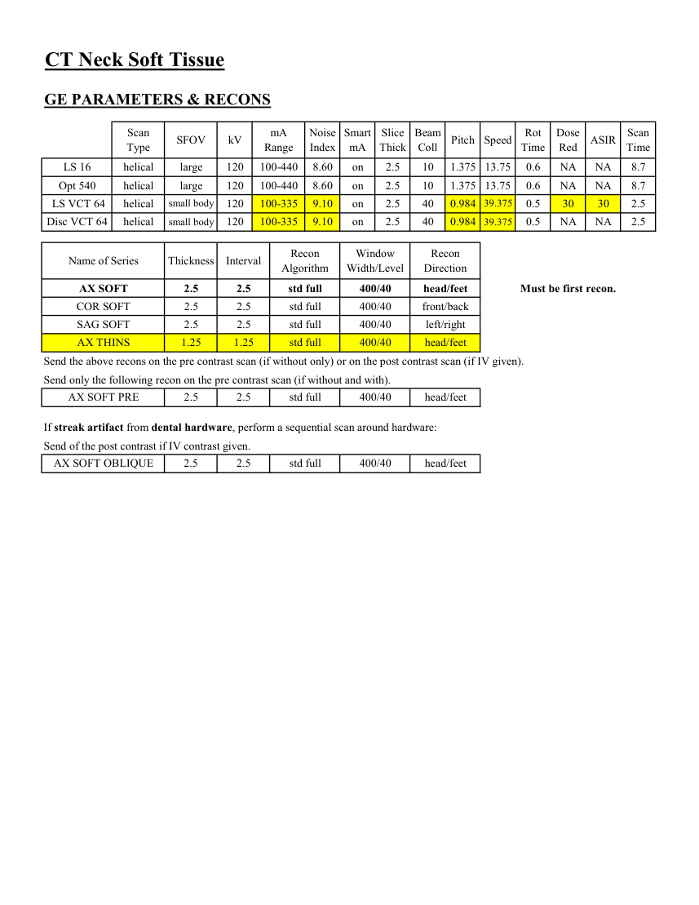
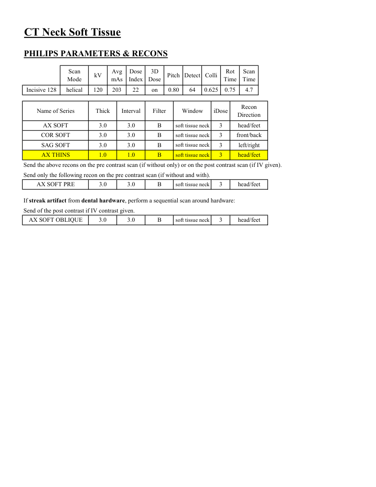

# CT — Părți moi cervicale (MCB)

## Documentul original MCB — Părți moi cervicale

**Protocol · 4 pagini · consultat la 2026-09-27.**

[Descarcă PDF-ul integral](../../assets/mcb-modalities/ct-parti-moi-cervicale-mcb/document.pdf) · [Sursa MCB](https://ref.mcbradiology.com/Protocols,%20Policies,%20Worksheets%20&%20Forms/CT/Protocols/Neuro/11%20Neck%20Soft%20Tissue.pdf) · [Catalogul MCB pentru această modalitate](../mcb/index.md)

Instrucțiunile, valorile și ilustrațiile din documentul original sunt păstrate în **engleză**. Titlul și navigarea sunt în română.

### Pagina 1

{ loading=lazy }

### Pagina 2

{ loading=lazy }

### Pagina 3

{ loading=lazy }

### Pagina 4

{ loading=lazy }

## Textul documentului original

??? abstract "Pagina 1 — text în engleză"

    
Updated
    05/03/24
    CT Neck Soft Tissue
    Reviewed
    05/14/25
    Indications - mass, lymphadenopathy, swelling, sore throat, difficulty swallowing, foreign body.
    GENERAL SCAN NOTES
    Remove any metal from the imaging field of view (particularly dentures).
    Use non metallic markers for palpable areas. Do not use metallic skin markers areas due to streak artifact.
    Patient positioning is very important to decrease beam hardening artifact from shoulders:
    Place rolled towel/sheet between patient&#x27;s shoulder blades to drop shoulders posteriorly.
    Have patient pull a folded sheet/towel wrapped around foot with both hands to pull shoulders towards feet.
    Instruct patient to not swallowing during imaging.
    Topogram - orbital floor through inferior aspect of main pulmonary artery.
    Craniocaudal coverage - orbital floor through inferior aspect of main pulmonary artery.
    Adjust FOV (field of view) on topogram to smallest without cropping anatomy.
    IV Contrast: 100 mL Omnipaque-300, inject at 2.5 mL/sec, 90 secs scan delay.
    For GE scanners, it is essential for the 1st recon thickness on the scanner to match the 1st recon thickness in this
    protocol book for the prescribed Noise Index to be valid. The 1st recon should generally be the thickest recon in 
    the protocol.
    

??? abstract "Pagina 2 — text în engleză"

    
CT Neck Soft Tissue
    SIEMENS PARAMETERS &amp; RECONS
    Scan                           
    Care                                          
    Scan                 
    Mode
    kV
    mAs
    Care                            
    Dose
    kV &amp; Lvl
    Pitch
    Acq
    Coll
    Rot 
    Time
    Time
    Sensation 16
    spiral
    120
    150
    on
    NA
    0.8
    16
    0.80
    0.75
    15.6
    Go Up 32
    spiral
    130
    102
    on
    on 155
    0.80
    32
    0.7
    1.0
    11.2
    Sensation 64
    spiral
    120
    150
    on
    0.6
    64
    0.90
    NA
    1.0
    11.6
    Definition 64
    spiral
    120
    165
    on
    on
    0.80
    64
    0.6
    1.0
    13.0
    Go Top 64
    spiral
    120
    119
    on
    0.6
    64
    0.80
    on 155
    1.0
    6.5
    Drive 128
    spiral
    120
    116
    on
    on
    0.80
    128
    0.6
    1.0
    6.5
    1.0
    4.3
    Force 192
    spiral
    120
    116
    on
    0.6
    192
    0.80
    on
    Name of Series
    Thick
    Interval
    Window
    Recon                     
    Kernel
    IR                       
    Lvl
    Direction
    AX SOFT
    3.0
    3.0
    abdomen
    Br40 / B31s
    3
    head/feet
    COR SOFT
    3.0
    3.0
    abdomen
    front/back
    Br40 / B31s
    3
    SAG SOFT
    3.0
    3.0
    abdomen
    left/right
    Br40 / B31s
    3
    1.0
    1.0
    abdomen
    head/feet
    AX THINS
    Br40 / B31s
    3
    Send the above recons on the pre contrast scan (if without only) or on the post contrast scan (if IV given).
    Send only the following recon on the pre contrast scan (if without and with).
    abdomen
    3
    AX PRE SOFT
    3.0
    3.0
    Br40 / B31s
    head/feet
    If streak artifact from dental hardware, perform a sequential scan around hardware:
    Send of the post contrast if IV contrast given.
    AX SOFT OBLIQUE
    Bf37 / B31s
    3
    3.0
    3.0
    abdomen
    head/feet
    

??? abstract "Pagina 3 — text în engleză"

    
CT Neck Soft Tissue
    GE PARAMETERS &amp; RECONS
    Scan               
    Smart             
    Slice                       
    Beam                                 
    Dose                                          
    Type
    SFOV
    kV
    mA                           
    Range
    Noise                    
    Index
    mA
    Thick
    Coll
    Pitch
    Speed
    Rot                                
    Time
    Red
    ASIR
    Scan                 
    Time
    LS 16
    helical
    large
    120
    100-440
    10
    2.5
    on
    8.60
    1.375 13.75
    0.6
    NA
    NA
    8.7
    Opt 540
    helical
    large
    120
    100-440
    8.60
    on
    2.5
    10
    1.375 13.75
    0.6
    NA
    NA
    8.7
    100-335
     LS VCT 64
    helical
    small body
    120
    0.984 39.375
    0.5
    30
    40
    2.5
    on
    9.10
    30
    2.5
    Disc VCT 64
    helical
    small body
    120
    100-335
    9.10
    on
    2.5
    40
    0.984 39.375
    0.5
    NA
    NA
    2.5
    Recon                                     
    Window                                   
    Recon 
    Name of Series
    Thickness
    Interval
    Algorithm
    Width/Level
    Direction
    AX SOFT
    2.5
    2.5
    head/feet
    400/40
    std full
    Must be first recon.
    COR SOFT
    2.5
    2.5
    front/back
    400/40
    std full
    SAG SOFT
    2.5
    2.5
    left/right
    400/40
    std full
    AX THINS
    1.25
    1.25
    std full
    400/40
    head/feet
    Send the above recons on the pre contrast scan (if without only) or on the post contrast scan (if IV given).
    Send only the following recon on the pre contrast scan (if without and with).
    AX SOFT PRE
    2.5
    2.5
    head/feet
    400/40
    std full
    If streak artifact from dental hardware, perform a sequential scan around hardware:
    Send of the post contrast if IV contrast given.
    head/feet
    400/40
    std full
    AX SOFT OBLIQUE
    2.5
    2.5
    

??? abstract "Pagina 4 — text în engleză"

    
CT Neck Soft Tissue
    PHILIPS PARAMETERS &amp; RECONS
    Scan                           
    Dose                                          
    3D            
    Rot 
    Scan                 
    Mode
    kV
    Avg                      
    mAs
    Index
    Dose
    Pitch Detect Colli
    Time
    Time
    0.625
    64
    0.80
    on
    Incisive 128
    helical
    120
    203
    22
    0.75
    4.7
    Name of Series
    Thick
    Interval
    Filter
    Window
    iDose
    Recon                     
    Direction
    AX SOFT
    3.0
    3.0
    B
    soft tissue neck
    3
    head/feet
    COR SOFT
    3.0
    3.0
    B
    soft tissue neck
    3
    front/back
    SAG SOFT
    3.0
    3.0
    B
    soft tissue neck
    3
    left/right
    AX THINS
    1.0
    1.0
    B
    soft tissue neck
    3
    head/feet
    Send the above recons on the pre contrast scan (if without only) or on the post contrast scan (if IV given).
    Send only the following recon on the pre contrast scan (if without and with).
    AX SOFT PRE
    3.0
    3.0
    head/feet
    3
    soft tissue neck
    B
    If streak artifact from dental hardware, perform a sequential scan around hardware:
    Send of the post contrast if IV contrast given.
    AX SOFT OBLIQUE
    3.0
    3.0
    B
    soft tissue neck
    3
    head/feet
    

