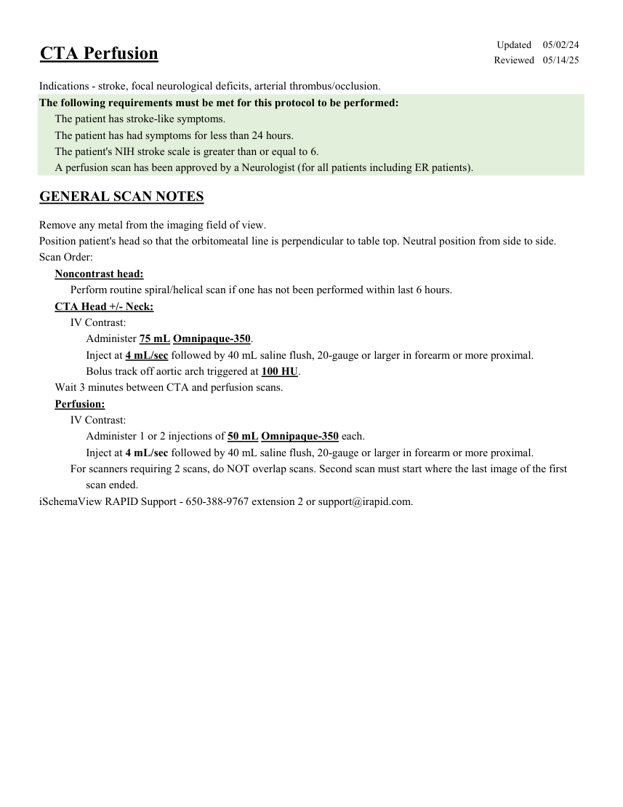
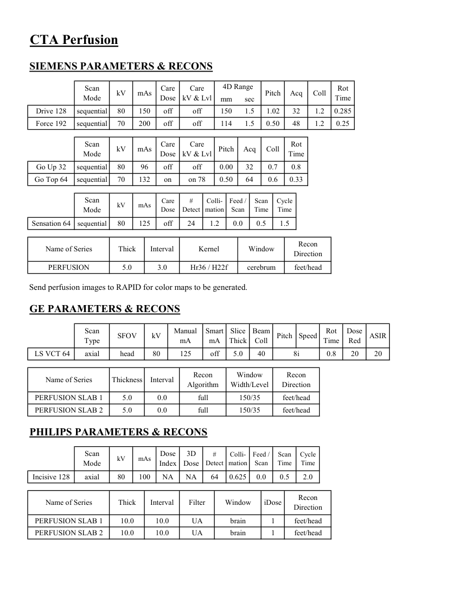

# CT — Perfuzie cerebrală (MCB)

## Documentul original MCB — Perfuzie cerebrală

**Protocol · 2 pagini · consultat la 2026-09-27.**

[Descarcă PDF-ul integral](../../assets/mcb-modalities/ct-perfuzie-cerebrala-mcb/document.pdf) · [Sursa MCB](https://ref.mcbradiology.com/Protocols,%20Policies,%20Worksheets%20&%20Forms/CT/Protocols/Neuro/6%20CTA%20Perfusion.pdf) · [Catalogul MCB pentru această modalitate](../mcb/index.md)

Instrucțiunile, valorile și ilustrațiile din documentul original sunt păstrate în **engleză**. Titlul și navigarea sunt în română.

### Pagina 1

{ loading=lazy }

### Pagina 2

{ loading=lazy }

## Textul documentului original

??? abstract "Pagina 1 — text în engleză"

    
Updated
    05/02/24
    CTA Perfusion
    Reviewed
    05/14/25
    Indications - stroke, focal neurological deficits, arterial thrombus/occlusion.
    The following requirements must be met for this protocol to be performed:
    The patient has stroke-like symptoms.
    The patient has had symptoms for less than 24 hours.
    The patient&#x27;s NIH stroke scale is greater than or equal to 6.
    A perfusion scan has been approved by a Neurologist (for all patients including ER patients).
    GENERAL SCAN NOTES
    Remove any metal from the imaging field of view.
    Position patient&#x27;s head so that the orbitomeatal line is perpendicular to table top. Neutral position from side to side.
    Scan Order:
    Noncontrast head:
    Perform routine spiral/helical scan if one has not been performed within last 6 hours.
    CTA Head +/- Neck:
    IV Contrast:
    Administer 75 mL Omnipaque-350.
    Inject at 4 mL/sec followed by 40 mL saline flush, 20-gauge or larger in forearm or more proximal.
    Bolus track off aortic arch triggered at 100 HU.
    Wait 3 minutes between CTA and perfusion scans.
    Perfusion:
    IV Contrast:
    Administer 1 or 2 injections of 50 mL Omnipaque-350 each.
    Inject at 4 mL/sec followed by 40 mL saline flush, 20-gauge or larger in forearm or more proximal.
    For scanners requiring 2 scans, do NOT overlap scans. Second scan must start where the last image of the first 
    scan ended.
    iSchemaView RAPID Support - 650-388-9767 extension 2 or support@irapid.com.
    

??? abstract "Pagina 2 — text în engleză"

    
CTA Perfusion
    SIEMENS PARAMETERS &amp; RECONS
    4D Range
    Scan                           
    Care                                          
    Pitch
    Rot 
    Coll
    Mode
    kV
    mAs
    Care                            
    Dose
    kV &amp; Lvl
    Acq
    Time
    mm
    sec
    Drive 128
    sequential
    80
    150
    off
    off
    150
    1.5
    1.02
    32
    1.2
    0.285
    Force 192
    sequential
    70
    200
    off
    off
    48
    1.2
    0.25
    114
    1.5
    0.50
    Scan                           
    Care                                          
    Mode
    kV
    mAs
    Care                            
    Dose
    kV &amp; Lvl
    Pitch
    Acq
    Coll
    Rot 
    Time
    Go Up 32
    sequential
    80
    96
    off
    off
    0.00
    32
    0.7
    0.8
    Go Top 64
    sequential
    70
    132
    on
    on 78
    0.50
    64
    0.6
    0.33
    Scan                           
    #                         
    Colli-                
    Feed / 
    Scan 
    Cycle 
    Dose
    Detect
    mation
    Scan
    Time
    Time
    Mode
    kV
    mAs
    Care                            
    Sensation 64
    sequential
    80
    125
    off
    24
    1.2
    0.0
    0.5
    1.5
    Recon                     
    Name of Series
    Interval
    Kernel
    Window
    Thick
    Direction
    PERFUSION
    5.0
    3.0
    Hr36 / H22f
    cerebrum
    feet/head
    Send perfusion images to RAPID for color maps to be generated.
    GE PARAMETERS &amp; RECONS
    Scan               
    Smart             
    Slice                       
    Beam                                 
    Dose                                                    
    Pitch
    Speed
    Rot                                
    ASIR
    Type
    SFOV
    kV
    Manual 
    mA
    mA
    Thick
    Coll
    Time
    Red
    20
    8i
     LS VCT 64
    axial
    head
    80
    125
    off
    5.0
    40
    0.8
    20
    Window                                   
    Recon 
    Name of Series
    Thickness
    Interval
    Recon                                     
    Algorithm
    Width/Level
    Direction
    PERFUSION SLAB 1
    5.0
    0.0
    full
    150/35
    feet/head
    PERFUSION SLAB 2
    5.0
    0.0
    full
    150/35
    feet/head
    PHILIPS PARAMETERS &amp; RECONS
    Scan                           
    3D            
    #                         
    Colli-                
    Feed / 
    Scan 
    Cycle 
    Detect
    mation
    Scan
    Time
    Time
    Mode
    kV
    mAs
    Dose                                          
    Index
    Dose
    Incisive 128
    axial
    80
    100
    NA
    NA
    0.5
    64
    0.625
    0.0
    2.0
    Name of Series
    Thick
    Interval
    Filter
    Window
    iDose
    Recon                     
    Direction
    PERFUSION SLAB 1
    10.0
    10.0
    UA
    brain
    1
    feet/head
    PERFUSION SLAB 2
    10.0
    10.0
    UA
    brain
    1
    feet/head
    

