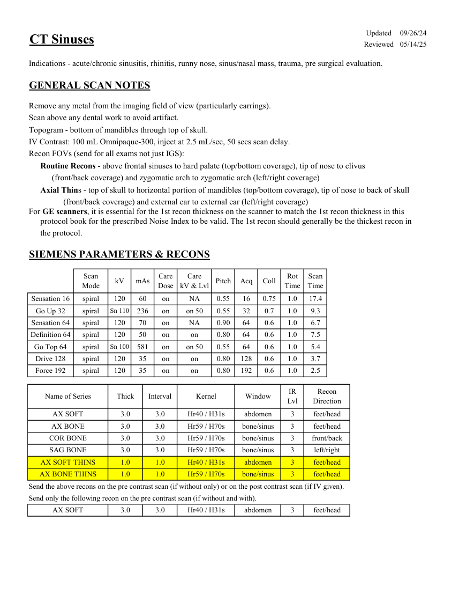
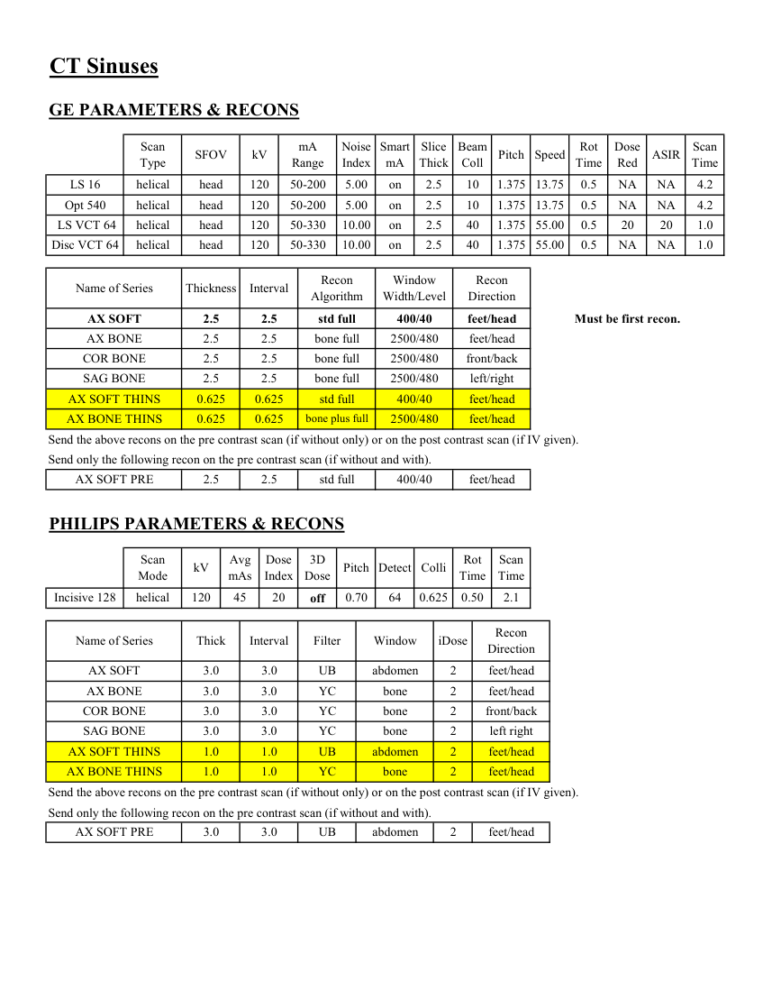

# CT — Sinusuri (MCB)

## Documentul original MCB — Sinusuri

**Protocol · 2 pagini · consultat la 2026-09-27.**

[Descarcă PDF-ul integral](../../assets/mcb-modalities/ct-sinusuri-mcb/document.pdf) · [Sursa MCB](https://ref.mcbradiology.com/Protocols,%20Policies,%20Worksheets%20&%20Forms/CT/Protocols/Neuro/9%20Sinuses.pdf) · [Catalogul MCB pentru această modalitate](../mcb/index.md)

Instrucțiunile, valorile și ilustrațiile din documentul original sunt păstrate în **engleză**. Titlul și navigarea sunt în română.

### Pagina 1

{ loading=lazy }

### Pagina 2

{ loading=lazy }

## Textul documentului original

??? abstract "Pagina 1 — text în engleză"

    
Updated
    09/26/24
    CT Sinuses
    Reviewed
    05/14/25
    Indications - acute/chronic sinusitis, rhinitis, runny nose, sinus/nasal mass, trauma, pre surgical evaluation.
    GENERAL SCAN NOTES
    Remove any metal from the imaging field of view (particularly earrings).
    Scan above any dental work to avoid artifact.
    Topogram - bottom of mandibles through top of skull.
    IV Contrast: 100 mL Omnipaque-300, inject at 2.5 mL/sec, 50 secs scan delay.
    Recon FOVs (send for all exams not just IGS):
    Routine Recons - above frontal sinuses to hard palate (top/bottom coverage), tip of nose to clivus 
    (front/back coverage) and zygomatic arch to zygomatic arch (left/right coverage)
    Axial Thins - top of skull to horizontal portion of mandibles (top/bottom coverage), tip of nose to back of skull 
    (front/back coverage) and external ear to external ear (left/right coverage)
    For GE scanners, it is essential for the 1st recon thickness on the scanner to match the 1st recon thickness in this
    protocol book for the prescribed Noise Index to be valid. The 1st recon should generally be the thickest recon in 
    the protocol.
    SIEMENS PARAMETERS &amp; RECONS
    Scan                           
    Care                                          
    Scan                 
    Mode
    kV
    mAs
    Care                            
    Dose
    kV &amp; Lvl
    Pitch
    Acq
    Coll
    Rot 
    Time
    Time
    Sensation 16
    spiral
    120
    60
    on
    NA
    0.55
    16
    0.75
    1.0
    17.4
    Go Up 32
    spiral
    Sn 110
    236
    on
    on 50
    0.55
    32
    0.7
    1.0
    9.3
    Sensation 64
    spiral
    120
    70
    on
    NA
    0.90
    64
    0.6
    1.0
    6.7
    Definition 64
    spiral
    120
    50
    on
    on
    0.80
    64
    0.6
    1.0
    7.5
    Go Top 64
    spiral
    Sn 100
    581
    on
    on 50
    0.55
    64
    0.6
    1.0
    5.4
    Drive 128
    spiral
    120
    35
    on
    on
    0.80
    128
    0.6
    1.0
    3.7
    Force 192
    spiral
    120
    35
    on
    on
    0.80
    192
    0.6
    1.0
    2.5
    Recon                     
    Name of Series
    Thick
    Interval
    Kernel
    Window
    IR                       
    Lvl
    Direction
    AX SOFT
    3.0
    3.0
    Hr40 / H31s
    abdomen
    3
    feet/head
    AX BONE
    3.0
    3.0
    Hr59 / H70s
    bone/sinus
    3
    feet/head
    COR BONE
    3.0
    3.0
    Hr59 / H70s
    bone/sinus
    3
    front/back
    SAG BONE
    3.0
    3.0
    Hr59 / H70s
    bone/sinus
    3
    left/right
    AX SOFT THINS
    1.0
    1.0
    Hr40 / H31s
    abdomen
    3
    feet/head
    AX BONE THINS
    1.0
    1.0
    Hr59 / H70s
    bone/sinus
    3
    feet/head
    Send the above recons on the pre contrast scan (if without only) or on the post contrast scan (if IV given).
    Send only the following recon on the pre contrast scan (if without and with).
    AX SOFT
    3.0
    3.0
    Hr40 / H31s
    abdomen
    3
    feet/head
    

??? abstract "Pagina 2 — text în engleză"

    
CT Sinuses
    GE PARAMETERS &amp; RECONS
    Scan               
    Smart             
    Slice                       
    Beam                                 
    Dose                                          
    Scan                 
    Type
    SFOV
    kV
    mA                           
    Range
    Noise                    
    Index
    mA
    Thick
    Coll
    Pitch
    Speed
    Rot                                
    Time
    Red
    ASIR
    Time
    LS 16
    helical
    head
    120
    50-200
    5.00
    on
    2.5
    10
    1.375 13.75
    0.5
    NA
    NA
    4.2
    Opt 540
    helical
    head
    120
    50-200
    5.00
    on
    2.5
    10
    1.375 13.75
    0.5
    NA
    NA
    4.2
     LS VCT 64
    helical
    55.00
    head
    120
    50-330
    10.00
    on
    2.5
    40
    1.375
    0.5
    20
    20
    1.0
    Disc VCT 64
    helical
    10.00
    on
    2.5
    40
    1.375 55.00
    head
    120
    50-330
    0.5
    NA
    NA
    1.0
    Window                                   
    Recon 
    Name of Series
    Thickness
    Interval
    Recon                                     
    Algorithm
    Width/Level
    Direction
    AX SOFT
    2.5
    2.5
    std full
    400/40
    feet/head
    Must be first recon.
    AX BONE
    2.5
    2.5
    bone full
    2500/480
    feet/head
    COR BONE
    2.5
    2.5
    bone full
    2500/480
    front/back
    SAG BONE
    2.5
    2.5
    bone full
    2500/480
    left/right
    AX SOFT THINS
    0.625
    0.625
    std full
    400/40
    feet/head
    AX BONE THINS
    0.625
    0.625
    bone plus full
    2500/480
    feet/head
    Send the above recons on the pre contrast scan (if without only) or on the post contrast scan (if IV given).
    Send only the following recon on the pre contrast scan (if without and with).
    AX SOFT PRE
    2.5
    2.5
    std full
    400/40
    feet/head
    PHILIPS PARAMETERS &amp; RECONS
    Scan                           
    Dose                                          
    3D            
    Rot 
    Scan                 
    Mode
    kV
    Avg                      
    mAs
    Index
    Dose
    Pitch Detect Colli
    Time
    Time
    0.50
    2.1
    Incisive 128
    helical
    120
    45
    20
    off
    0.70
    64
    0.625
    Name of Series
    Thick
    Interval
    Filter
    Window
    iDose
    Recon                     
    Direction
    AX SOFT
    3.0
    3.0
    UB
    abdomen
    2
    feet/head
    AX BONE
    3.0
    3.0
    YC
    bone
    2
    feet/head
    COR BONE
    3.0
    3.0
    YC
    bone
    2
    front/back
    SAG BONE
    3.0
    3.0
    YC
    bone
    2
    left right
    AX SOFT THINS
    1.0
    1.0
    UB
    abdomen
    2
    feet/head
    AX BONE THINS
    1.0
    1.0
    YC
    bone
    2
    feet/head
    Send the above recons on the pre contrast scan (if without only) or on the post contrast scan (if IV given).
    Send only the following recon on the pre contrast scan (if without and with).
    AX SOFT PRE
    3.0
    3.0
    UB
    abdomen
    2
    feet/head
    

