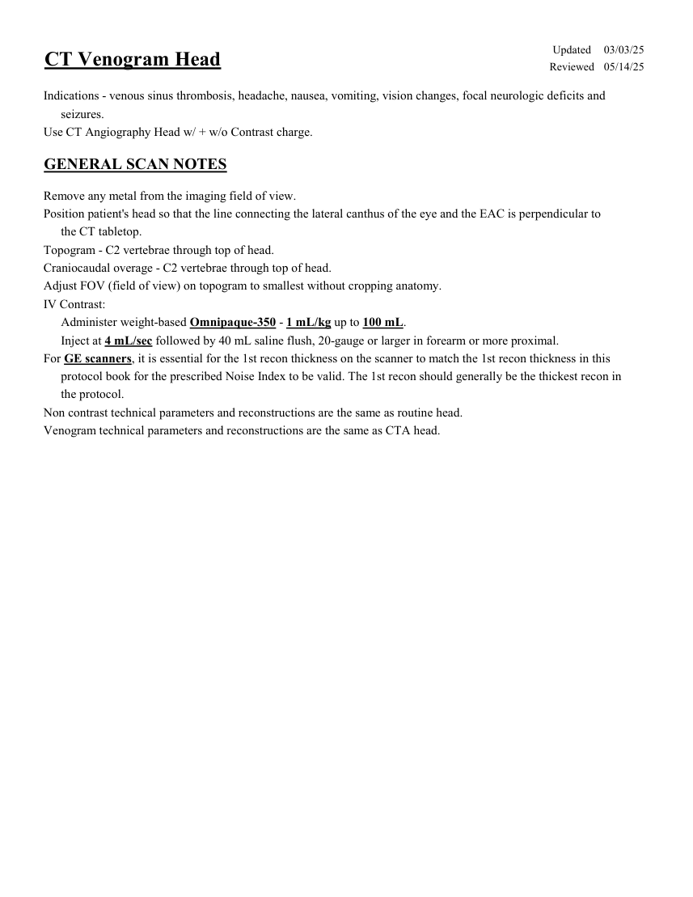
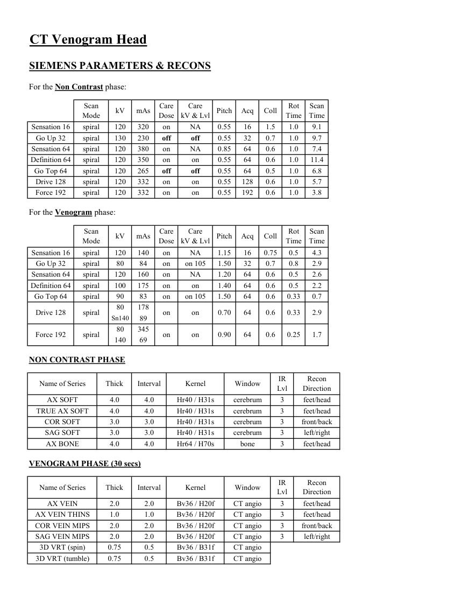
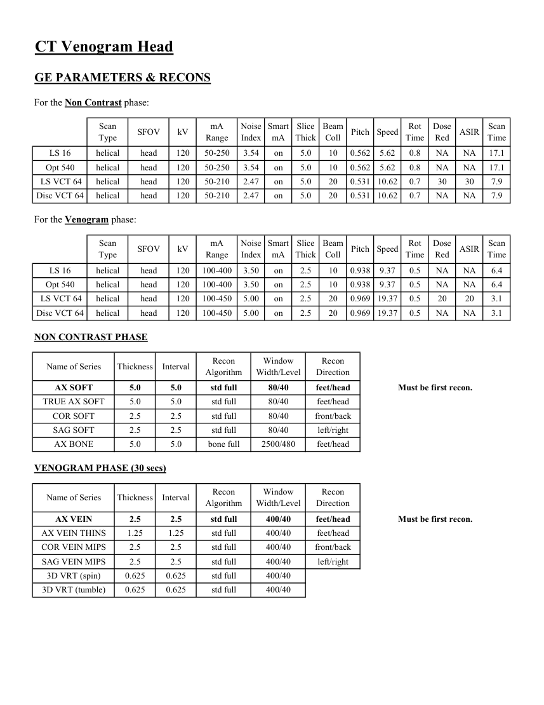
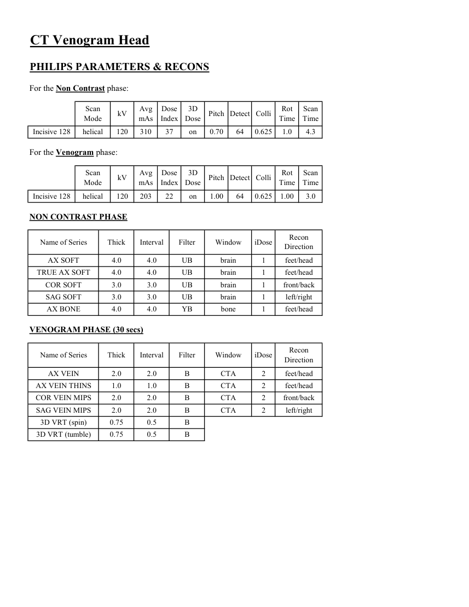

# CT — Venografie cerebrală (MCB)

## Documentul original MCB — Venografie cerebrală

**Protocol · 4 pagini · consultat la 2026-09-27.**

[Descarcă PDF-ul integral](../../assets/mcb-modalities/ct-venografie-cerebrala-mcb/document.pdf) · [Sursa MCB](https://ref.mcbradiology.com/Protocols,%20Policies,%20Worksheets%20&%20Forms/CT/Protocols/Neuro/7%20CTV%20Head.pdf) · [Catalogul MCB pentru această modalitate](../mcb/index.md)

Instrucțiunile, valorile și ilustrațiile din documentul original sunt păstrate în **engleză**. Titlul și navigarea sunt în română.

### Pagina 1

{ loading=lazy }

### Pagina 2

{ loading=lazy }

### Pagina 3

{ loading=lazy }

### Pagina 4

{ loading=lazy }

## Textul documentului original

??? abstract "Pagina 1 — text în engleză"

    
Updated
    03/03/25
    CT Venogram Head
    Reviewed
    05/14/25
    Indications - venous sinus thrombosis, headache, nausea, vomiting, vision changes, focal neurologic deficits and
    seizures.
    Use CT Angiography Head w/ + w/o Contrast charge.
    GENERAL SCAN NOTES
    Remove any metal from the imaging field of view.
    Position patient&#x27;s head so that the line connecting the lateral canthus of the eye and the EAC is perpendicular to 
    the CT tabletop.
    Topogram - C2 vertebrae through top of head.
    Craniocaudal overage - C2 vertebrae through top of head.
    Adjust FOV (field of view) on topogram to smallest without cropping anatomy.
    IV Contrast:
    Administer weight-based Omnipaque-350 - 1 mL/kg up to 100 mL.
    Inject at 4 mL/sec followed by 40 mL saline flush, 20-gauge or larger in forearm or more proximal.
    For GE scanners, it is essential for the 1st recon thickness on the scanner to match the 1st recon thickness in this
    protocol book for the prescribed Noise Index to be valid. The 1st recon should generally be the thickest recon in 
    the protocol.
    Non contrast technical parameters and reconstructions are the same as routine head.
    Venogram technical parameters and reconstructions are the same as CTA head.
    

??? abstract "Pagina 2 — text în engleză"

    
CT Venogram Head
    SIEMENS PARAMETERS &amp; RECONS
    For the Non Contrast phase:
    Scan                           
    Care                                          
    Scan                 
    Pitch
    Acq
    Coll
    Rot 
    Mode
    kV
    mAs
    Care                            
    Dose
    kV &amp; Lvl
    Time
    Time
    Sensation 16
    spiral
    120
    320
    on
    NA
    0.55
    16
    1.5
    1.0
    9.1
    Go Up 32
    spiral
    130
    230
    off
    0.55
    32
    0.7
    1.0
    9.7
    off
    Sensation 64
    spiral
    120
    380
    on
    NA
    0.85
    64
    0.6
    1.0
    7.4
    Definition 64
    spiral
    120
    350
    on
    0.55
    64
    0.6
    1.0
    11.4
    on
    Go Top 64
    spiral
    120
    265
    off
    off
    0.55
    64
    0.5
    1.0
    6.8
    Drive 128
    spiral
    120
    332
    on
    0.55
    128
    0.6
    1.0
    5.7
    on
    Force 192
    spiral
    120
    332
    on
    on
    0.55
    192
    0.6
    1.0
    3.8
    For the Venogram phase:
    Scan                           
    Care                                          
    Scan                 
    Pitch
    Acq
    Coll
    Rot 
    Mode
    kV
    mAs
    Care                            
    Dose
    kV &amp; Lvl
    Time
    Time
    Sensation 16
    spiral
    120
    140
    on
    NA
    1.15
    16
    0.75
    0.5
    4.3
    Go Up 32
    spiral
    80
    84
    on
    1.50
    32
    0.7
    0.8
    2.9
    on 105
    Sensation 64
    spiral
    120
    160
    on
    NA
    1.20
    64
    0.6
    0.5
    2.6
    Definition 64
    spiral
    100
    175
    on
    1.40
    64
    0.6
    0.5
    2.2
    on
    Go Top 64
    spiral
    90
    83
    on
    on 105
    1.50
    64
    0.6
    0.33
    0.7
    0.70
    64
    0.6
    0.33
    2.9
    Sn140
    89
    Drive 128
    spiral
    80
    178
    on
    on
    0.90
    64
    0.6
    0.25
    1.7
    140
    69
    Force 192
    spiral
    80
    345
    on
    on
    NON CONTRAST PHASE
    Recon                     
    Name of Series
    Thick
    Interval
    Kernel
    Window
    IR                       
    Lvl
    Direction
    AX SOFT
    4.0
    4.0
    Hr40 / H31s
    cerebrum
    3
    feet/head
    TRUE AX SOFT
    4.0
    4.0
    Hr40 / H31s
    cerebrum
    3
    feet/head
    COR SOFT
    3.0
    3.0
    Hr40 / H31s
    cerebrum
    3
    front/back
    SAG SOFT
    3.0
    3.0
    Hr40 / H31s
    cerebrum
    3
    left/right
    AX BONE
    4.0
    4.0
    Hr64 / H70s
    bone
    3
    feet/head
    VENOGRAM PHASE (30 secs)
    Recon                     
    Name of Series
    Thick
    Interval
    Kernel
    Window
    IR                       
    Lvl
    Direction
    AX VEIN
    2.0
    2.0
    Bv36 / H20f
    CT angio
    3
    feet/head
    AX VEIN THINS
    1.0
    1.0
    Bv36 / H20f
    CT angio
    3
    feet/head
    COR VEIN MIPS
    2.0
    2.0
    Bv36 / H20f
    CT angio
    3
    front/back
    SAG VEIN MIPS
    2.0
    2.0
    Bv36 / H20f
    CT angio
    3
    left/right
    3D VRT (spin)
    0.75
    0.5
    Bv36 / B31f
    CT angio
    3D VRT (tumble)
    0.75
    0.5
    Bv36 / B31f
    CT angio
    

??? abstract "Pagina 3 — text în engleză"

    
CT Venogram Head
    GE PARAMETERS &amp; RECONS
    For the Non Contrast phase:
    Scan               
    Smart             
    Slice                       
    Beam                                 
    Dose                                          
    Pitch
    Speed
    Rot                                
    Type
    SFOV
    kV
    mA                           
    Range
    Noise                    
    Index
    mA
    Thick
    Coll
    Time
    Red
    ASIR
    Scan                 
    Time
    on
    5.0
    10
    0.562
    5.62
    0.8
    LS 16
    helical
    head
    120
    50-250
    3.54
    NA
    NA
    17.1
    Opt 540
    helical
    head
    120
    50-250
    3.54
    on
    5.0
    10
    0.562
    5.62
    0.8
    NA
    NA
    17.1
    20
    0.531 10.62
    0.7
    30
    30
     LS VCT 64
    helical
    head
    120
    50-210
    2.47
    5.0
    on
    7.9
    Disc VCT 64
    helical
    head
    120
    50-210
    2.47
    on
    5.0
    20
    0.531 10.62
    0.7
    NA
    NA
    7.9
    For the Venogram phase:
    Scan               
    Smart             
    Slice                       
    Beam                                 
    Dose                                          
    Type
    SFOV
    kV
    mA                           
    Range
    Noise                    
    Index
    mA
    Thick
    Coll
    Pitch
    Speed
    Rot                                
    Time
    Red
    ASIR
    Scan                 
    Time
    LS 16
    helical
    head
    120
    100-400
    3.50
    on
    2.5
    NA
    6.4
    10
    0.938
    9.37
    0.5
    NA
    10
    0.938
    9.37
    0.5
    NA
    NA
    Opt 540
    helical
    on
    2.5
    head
    120
    100-400
    3.50
    6.4
     LS VCT 64
    helical
    head
    120
    100-450
    5.00
    on
    2.5
    20
    0.969 19.37
    0.5
    20
    20
    3.1
    on
    2.5
    20
    0.969 19.37
    0.5
    Disc VCT 64
    helical
    head
    120
    100-450
    5.00
    NA
    NA
    3.1
    NON CONTRAST PHASE
    Recon                                     
    Window                                   
    Recon                    
    Name of Series
    Thickness
    Interval
    Algorithm
    Width/Level
    Direction
    AX SOFT
    5.0
    5.0
    std full
    80/40
    feet/head
    Must be first recon.
    TRUE AX SOFT
    5.0
    5.0
    std full
    80/40
    feet/head
    COR SOFT
    2.5
    2.5
    std full
    80/40
    front/back
    SAG SOFT
    2.5
    2.5
    std full
    80/40
    left/right
    AX BONE
    5.0
    5.0
    bone full
    2500/480
    feet/head
    VENOGRAM PHASE (30 secs)
    Window                                   
    Recon 
    Name of Series
    Thickness
    Interval
    Recon                                     
    Algorithm
    Width/Level
    Direction
    AX VEIN
    2.5
    2.5
    std full
    400/40
    feet/head
    Must be first recon.
    AX VEIN THINS
    1.25
    1.25
    std full
    400/40
    feet/head
    COR VEIN MIPS
    2.5
    2.5
    std full
    400/40
    front/back
    SAG VEIN MIPS
    2.5
    2.5
    std full
    400/40
    left/right
    3D VRT (spin)
    0.625
    0.625
    std full
    400/40
    3D VRT (tumble)
    0.625
    0.625
    std full
    400/40
    

??? abstract "Pagina 4 — text în engleză"

    
CT Venogram Head
    PHILIPS PARAMETERS &amp; RECONS
    For the Non Contrast phase:
    Scan                           
    Dose                                          
    3D            
    Scan                 
    Mode
    kV
    Avg                      
    mAs
    Index
    Dose
    Pitch Detect Colli
    Rot 
    Time
    Time
    Incisive 128
    helical
    120
    310
    37
    on
    0.70
    64
    0.625
    1.0
    4.3
    For the Venogram phase:
    Scan                           
    Dose                                          
    3D            
    Scan                 
    Pitch Detect Colli
    Rot 
    Mode
    kV
    Avg                      
    mAs
    Index
    Dose
    Time
    Time
    Incisive 128
    helical
    120
    203
    22
    on
    1.00
    64
    0.625
    1.00
    3.0
    NON CONTRAST PHASE
    Name of Series
    Thick
    Interval
    Filter
    Window
    iDose
    Recon                     
    Direction
    AX SOFT
    4.0
    4.0
    UB
    brain
    1
    feet/head
    TRUE AX SOFT
    4.0
    4.0
    UB
    brain
    1
    feet/head
    COR SOFT
    3.0
    3.0
    UB
    brain
    1
    front/back
    SAG SOFT
    3.0
    3.0
    UB
    brain
    1
    left/right
    feet/head
    AX BONE
    4.0
    4.0
    YB
    bone
    1
    VENOGRAM PHASE (30 secs)
    Recon                     
    Name of Series
    Thick
    Interval
    Filter
    Window
    iDose
    Direction
    AX VEIN
    2.0
    2.0
    B
    CTA
    2
    feet/head
    AX VEIN THINS
    1.0
    1.0
    B
    CTA
    2
    feet/head
    COR VEIN MIPS
    2.0
    2.0
    B
    CTA
    2
    front/back
    SAG VEIN MIPS
    2.0
    2.0
    B
    CTA
    2
    left/right
    3D VRT (spin)
    0.75
    0.5
    B
    3D VRT (tumble)
    0.75
    0.5
    B
    

