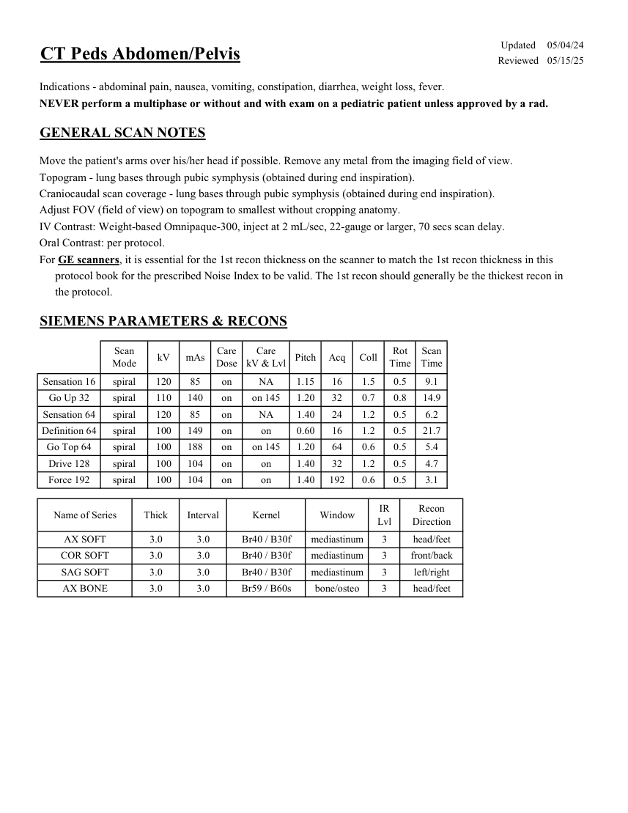
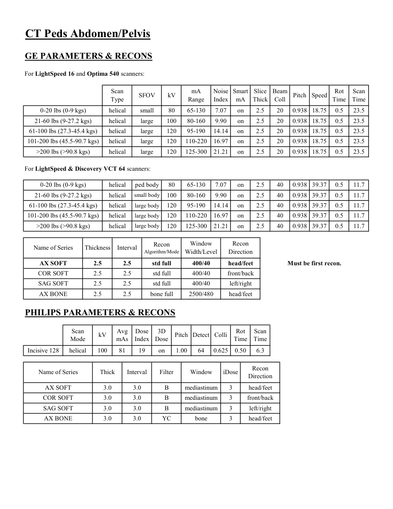

# CT — Abdomen și pelvis la copil (MCB)

## Documentul original MCB — Abdomen și pelvis la copil

**Protocol · 2 pagini · consultat la 2026-09-27.**

[Descarcă PDF-ul integral](../../assets/mcb-modalities/ct-abdomen-si-pelvis-la-copil-mcb/document.pdf) · [Sursa MCB](https://ref.mcbradiology.com/Protocols,%20Policies,%20Worksheets%20&%20Forms/CT/Protocols/Peds/6%20Peds%20AP.pdf) · [Catalogul MCB pentru această modalitate](../mcb/index.md)

Instrucțiunile, valorile și ilustrațiile din documentul original sunt păstrate în **engleză**. Titlul și navigarea sunt în română.

### Pagina 1

{ loading=lazy }

### Pagina 2

{ loading=lazy }

## Textul documentului original

??? abstract "Pagina 1 — text în engleză"

    
Updated
    05/04/24
    CT Peds Abdomen/Pelvis
    Reviewed
    05/15/25
    Indications - abdominal pain, nausea, vomiting, constipation, diarrhea, weight loss, fever.
    NEVER perform a multiphase or without and with exam on a pediatric patient unless approved by a rad.
    GENERAL SCAN NOTES
    Move the patient&#x27;s arms over his/her head if possible. Remove any metal from the imaging field of view.
    Topogram - lung bases through pubic symphysis (obtained during end inspiration).
    Craniocaudal scan coverage - lung bases through pubic symphysis (obtained during end inspiration).
    Adjust FOV (field of view) on topogram to smallest without cropping anatomy.
    IV Contrast: Weight-based Omnipaque-300, inject at 2 mL/sec, 22-gauge or larger, 70 secs scan delay.
    Oral Contrast: per protocol.
    For GE scanners, it is essential for the 1st recon thickness on the scanner to match the 1st recon thickness in this
    protocol book for the prescribed Noise Index to be valid. The 1st recon should generally be the thickest recon in 
    the protocol.
    SIEMENS PARAMETERS &amp; RECONS
    Scan                           
    Care                                          
    Scan                 
    Mode
    kV
    mAs
    Care                            
    Dose
    kV &amp; Lvl
    Pitch
    Acq
    Coll
    Rot 
    Time
    Time
    Sensation 16
    spiral
    120
    85
    on
    NA
    1.15
    16
    1.5
    0.5
    9.1
    Go Up 32
    spiral
    110
    140
    on
    on 145
    1.20
    32
    0.7
    0.8
    14.9
    Sensation 64
    spiral
    120
    85
    on
    1.40
    24
    1.2
    0.5
    6.2
    NA
    Definition 64
    spiral
    100
    149
    on
    on
    0.60
    16
    1.2
    0.5
    21.7
    Go Top 64
    spiral
    100
    188
    on
    1.20
    64
    0.6
    0.5
    5.4
    on 145
    Drive 128
    spiral
    100
    104
    on
    on
    1.40
    32
    1.2
    0.5
    4.7
    Force 192
    spiral
    100
    104
    on
    on
    1.40
    192
    0.6
    0.5
    3.1
    Recon                     
    Name of Series
    Thick
    Interval
    Kernel
    Window
    IR                       
    Lvl
    Direction
    AX SOFT
    3.0
    3.0
    Br40 / B30f
    mediastinum
    3
    head/feet
    COR SOFT
    3.0
    3.0
    Br40 / B30f
    mediastinum
    3
    front/back
    SAG SOFT
    3.0
    3.0
    Br40 / B30f
    mediastinum
    3
    left/right
    AX BONE
    3.0
    3.0
    Br59 / B60s
    bone/osteo
    3
    head/feet
    

??? abstract "Pagina 2 — text în engleză"

    
CT Peds Abdomen/Pelvis
    GE PARAMETERS &amp; RECONS
    For LightSpeed 16 and Optima 540 scanners:
    Scan               
    Smart             
    Slice                       
    Beam                                 
    Scan                 
    Type
    SFOV
    kV
    mA                           
    Range
    Noise                    
    Index
    mA
    Thick
    Coll
    Pitch
    Speed
    Rot                               
    Time
    Time
    0-20 lbs (0-9 kgs)
    helical
    small
    80
    65-130
    7.07
    on
    2.5
    20
    0.938 18.75
    0.5
    23.5
    21-60 lbs (9-27.2 kgs)
    helical
    large
    100
    80-160
    9.90
    on
    2.5
    20
    0.938 18.75
    0.5
    23.5
    61-100 lbs (27.3-45.4 kgs)
    helical
    large
    120
    95-190
    14.14
    on
    2.5
    20
    0.938 18.75
    0.5
    23.5
    101-200 lbs (45.5-90.7 kgs)
    helical
    large
    120
    110-220
    16.97
    on
    2.5
    20
    0.938 18.75
    0.5
    23.5
    &gt;200 lbs (&gt;90.8 kgs)
    helical
    large
    120
    125-300
    0.938
    21.21
    on
    2.5
    20
    18.75
    0.5
    23.5
    For LightSpeed &amp; Discovery VCT 64 scanners:
    0-20 lbs (0-9 kgs)
    helical
    ped body
    80
    65-130
    7.07
    on
    2.5
    40
    0.938
    39.37
    0.5
    11.7
    21-60 lbs (9-27.2 kgs)
    helical
    small body
    100
    80-160
    9.90
    on
    2.5
    40
    0.938 39.37
    0.5
    11.7
    on
    2.5
    40
    0.938 39.37
    0.5
    61-100 lbs (27.3-45.4 kgs)
    helical
    large body
    120
    95-190
    14.14
    11.7
    101-200 lbs (45.5-90.7 kgs)
    helical
    large body
    120
    110-220
    16.97
    on
    2.5
    40
    0.938 39.37
    0.5
    11.7
    &gt;200 lbs (&gt;90.8 kgs)
    helical
    large body
    120
    125-300
    21.21
    2.5
    40
    on
    0.938 39.37
    0.5
    11.7
    Window                                   
    Recon                    
    Name of Series
    Thickness
    Interval
    Recon                                     
    Algorithm/Mode
    Width/Level
    Direction
    AX SOFT
    2.5
    2.5
    std full
    Must be first recon.
    400/40
    head/feet
    COR SOFT
    2.5
    2.5
    std full
    400/40
    front/back
    SAG SOFT
    2.5
    2.5
    std full
    400/40
    left/right
    AX BONE
    2.5
    2.5
    bone full
    2500/480
    head/feet
    PHILIPS PARAMETERS &amp; RECONS
    Scan                           
    Dose                                          
    3D            
    Scan                 
    Pitch Detect Colli
    Rot 
    Mode
    kV
    Avg                      
    mAs
    Index
    Dose
    Time
    Time
    Incisive 128
    helical
    100
    81
    19
    on
    1.00
    64
    0.625
    0.50
    6.3
    Recon                     
    Direction
    Name of Series
    Thick
    Interval
    Filter
    Window
    iDose
    AX SOFT
    3.0
    3.0
    B
    mediastinum
    3
    head/feet
    COR SOFT
    3.0
    3.0
    B
    mediastinum
    3
    front/back
    left/right
    SAG SOFT
    3.0
    3.0
    B
    mediastinum
    3
    head/feet
    AX BONE
    3.0
    3.0
    YC
    bone
    3
    

