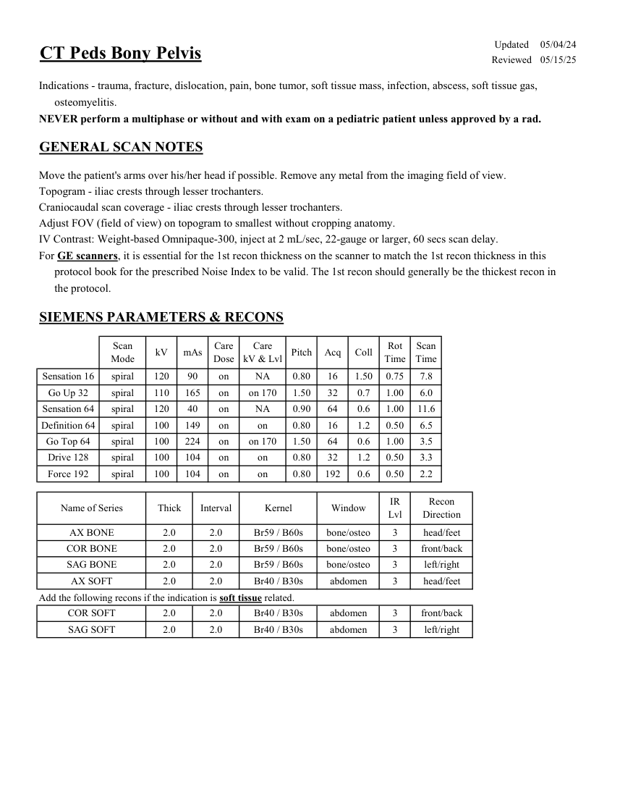
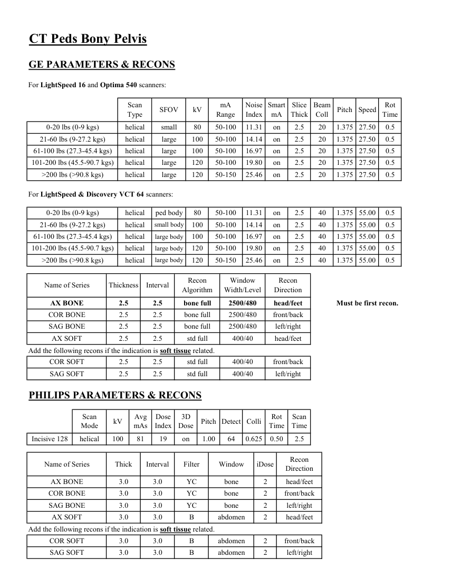

# CT — Bazin osos la copil (MCB)

## Documentul original MCB — Bazin osos la copil

**Protocol · 2 pagini · consultat la 2026-09-27.**

[Descarcă PDF-ul integral](../../assets/mcb-modalities/ct-bazin-osos-la-copil-mcb/document.pdf) · [Sursa MCB](https://ref.mcbradiology.com/Protocols,%20Policies,%20Worksheets%20&%20Forms/CT/Protocols/Peds/11%20Peds%20Bony%20Pelvis.pdf) · [Catalogul MCB pentru această modalitate](../mcb/index.md)

Instrucțiunile, valorile și ilustrațiile din documentul original sunt păstrate în **engleză**. Titlul și navigarea sunt în română.

### Pagina 1

{ loading=lazy }

### Pagina 2

{ loading=lazy }

## Textul documentului original

??? abstract "Pagina 1 — text în engleză"

    
Updated
    05/04/24
    CT Peds Bony Pelvis
    Reviewed
    05/15/25
    Indications - trauma, fracture, dislocation, pain, bone tumor, soft tissue mass, infection, abscess, soft tissue gas, 
    osteomyelitis.
    NEVER perform a multiphase or without and with exam on a pediatric patient unless approved by a rad.
    GENERAL SCAN NOTES
    Move the patient&#x27;s arms over his/her head if possible. Remove any metal from the imaging field of view.
    Topogram - iliac crests through lesser trochanters.
    Craniocaudal scan coverage - iliac crests through lesser trochanters.
    Adjust FOV (field of view) on topogram to smallest without cropping anatomy.
    IV Contrast: Weight-based Omnipaque-300, inject at 2 mL/sec, 22-gauge or larger, 60 secs scan delay.
    For GE scanners, it is essential for the 1st recon thickness on the scanner to match the 1st recon thickness in this
    protocol book for the prescribed Noise Index to be valid. The 1st recon should generally be the thickest recon in 
    the protocol.
    SIEMENS PARAMETERS &amp; RECONS
    Scan                           
    Care                                          
    Scan                 
    Mode
    kV
    mAs
    Care                            
    Dose
    kV &amp; Lvl
    Pitch
    Acq
    Coll
    Rot 
    Time
    Time
    Sensation 16
    spiral
    120
    90
    on
    NA
    0.80
    16
    1.50
    0.75
    7.8
    Go Up 32
    spiral
    110
    165
    on
    on 170
    1.50
    32
    0.7
    1.00
    6.0
    Sensation 64
    spiral
    120
    40
    on
    NA
    0.90
    64
    0.6
    1.00
    11.6
    Definition 64
    spiral
    100
    149
    on
    on
    0.80
    16
    1.2
    0.50
    6.5
    Go Top 64
    spiral
    100
    224
    on
    on 170
    1.50
    64
    0.6
    1.00
    3.5
    Drive 128
    spiral
    100
    104
    on
    on
    0.80
    32
    0.50
    1.2
    3.3
    Force 192
    spiral
    100
    104
    on
    on
    0.80
    192
    0.6
    0.50
    2.2
    Recon                     
    Name of Series
    Thick
    Interval
    Kernel
    Window
    IR                       
    Lvl
    Direction
    AX BONE
    2.0
    2.0
    Br59 / B60s
    bone/osteo
    3
    head/feet
    COR BONE
    2.0
    2.0
    Br59 / B60s
    bone/osteo
    3
    front/back
    SAG BONE
    2.0
    2.0
    Br59 / B60s
    bone/osteo
    3
    left/right
    AX SOFT
    2.0
    2.0
    Br40 / B30s
    abdomen
    3
    head/feet
    Add the following recons if the indication is soft tissue related.
    COR SOFT
    2.0
    2.0
    Br40 / B30s
    abdomen
    3
    front/back
    SAG SOFT
    2.0
    2.0
    Br40 / B30s
    abdomen
    3
    left/right
    

??? abstract "Pagina 2 — text în engleză"

    
CT Peds Bony Pelvis
    GE PARAMETERS &amp; RECONS
    For LightSpeed 16 and Optima 540 scanners:
    Scan               
    Smart             
    Slice                       
    Beam                                 
    SFOV
    Type
    kV
    mA                           
    Range
    Noise                    
    Index
    mA
    Thick
    Coll
    Pitch
    Speed
    Rot                               
    Time
    0-20 lbs (0-9 kgs)
    helical
    80
    50-100
    11.31
    on
    2.5
    20
    1.375
    small
    27.50
    0.5
    21-60 lbs (9-27.2 kgs)
    helical
    100
    50-100
    14.14
    on
    2.5
    1.375 27.50
    0.5
    large
    20
    61-100 lbs (27.3-45.4 kgs)
    helical
    100
    50-100
    16.97
    on
    large
    2.5
    20
    1.375 27.50
    0.5
    101-200 lbs (45.5-90.7 kgs)
    helical
    120
    50-100
    19.80
    large
    on
    2.5
    20
    1.375 27.50
    0.5
    &gt;200 lbs (&gt;90.8 kgs)
    helical
    120
    50-150
    25.46
    on
    large
    2.5
    20
    1.375 27.50
    0.5
    For LightSpeed &amp; Discovery VCT 64 scanners:
    0-20 lbs (0-9 kgs)
    helical
    80
    50-100
    11.31
    ped body
    on
    2.5
    40
    1.375 55.00
    0.5
    21-60 lbs (9-27.2 kgs)
    helical
    100
    50-100
    14.14
    on
    small body
    2.5
    40
    1.375 55.00
    0.5
    large body
    61-100 lbs (27.3-45.4 kgs)
    helical
    100
    50-100
    16.97
    on
    2.5
    40
    1.375 55.00
    0.5
    101-200 lbs (45.5-90.7 kgs)
    helical
    120
    50-100
    19.80
    on
    large body
    2.5
    40
    1.375 55.00
    0.5
    large body
    &gt;200 lbs (&gt;90.8 kgs)
    helical
    120
    50-150
    25.46
    on
    2.5
    40
    1.375 55.00
    0.5
    Window                                   
    Recon 
    Name of Series
    Thickness
    Interval
    Recon                                     
    Algorithm
    Width/Level
    Direction
    AX BONE
    2.5
    2.5
    bone full
    2500/480
    head/feet
    Must be first recon.
    COR BONE
    2.5
    2.5
    bone full
    2500/480
    front/back
    SAG BONE
    2.5
    2.5
    bone full
    2500/480
    left/right
    AX SOFT
    2.5
    2.5
    std full
    400/40
    head/feet
    Add the following recons if the indication is soft tissue related.
    COR SOFT
    2.5
    2.5
    std full
    400/40
    front/back
    SAG SOFT
    2.5
    2.5
    std full
    400/40
    left/right
    PHILIPS PARAMETERS &amp; RECONS
    Scan                           
    Dose                                          
    3D            
    Scan                 
    Pitch Detect Colli
    Rot 
    Mode
    kV
    Avg                      
    mAs
    Index
    Dose
    Time
    Time
    Incisive 128
    helical
    100
    81
    19
    on
    1.00
    64
    0.625
    0.50
    2.5
    Recon                     
    Name of Series
    Thick
    Interval
    Filter
    Window
    iDose
    Direction
    AX BONE
    3.0
    3.0
    YC
    bone
    2
    head/feet
    COR BONE
    3.0
    3.0
    YC
    bone
    2
    front/back
    SAG BONE
    3.0
    3.0
    YC
    bone
    2
    left/right
    AX SOFT
    3.0
    3.0
    B
    abdomen
    2
    head/feet
    Add the following recons if the indication is soft tissue related.
    COR SOFT
    3.0
    3.0
    B
    abdomen
    2
    front/back
    left/right
    SAG SOFT
    3.0
    3.0
    B
    abdomen
    2
    

