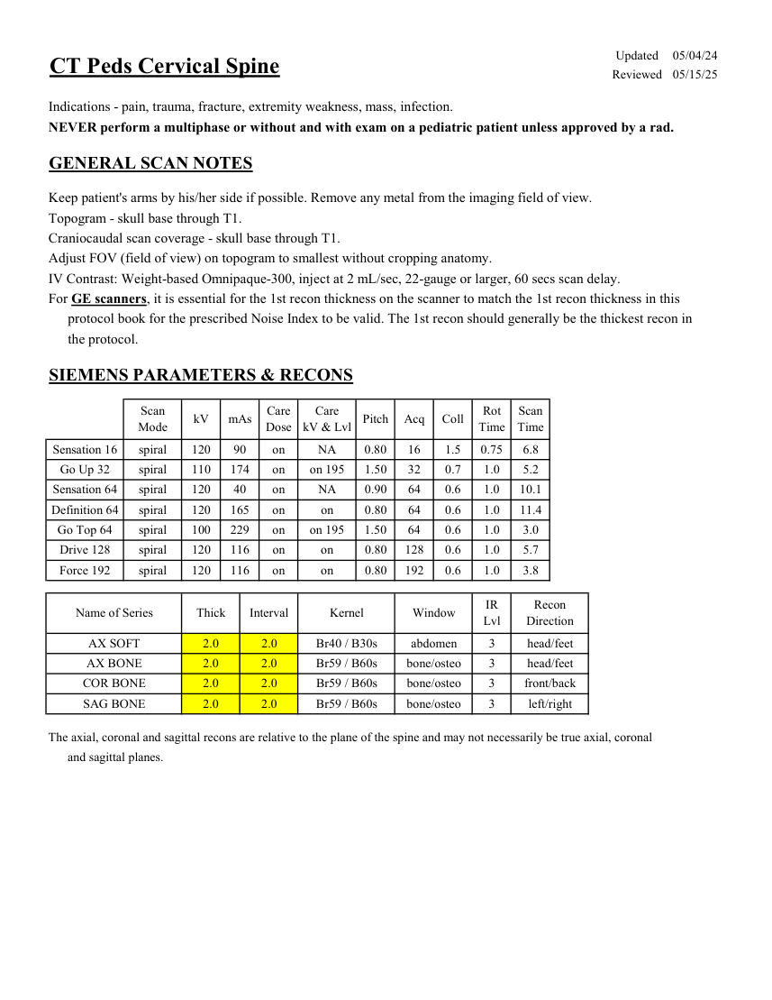
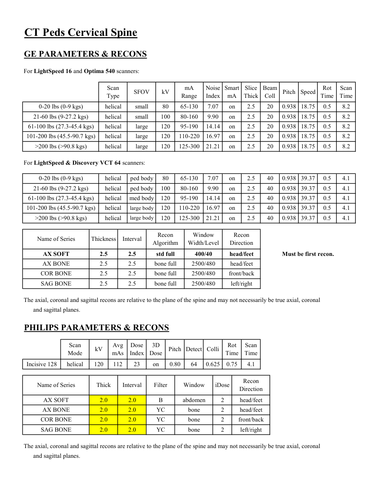

# CT — Coloană cervicală la copil (MCB)

## Documentul original MCB — Coloană cervicală la copil

**Protocol · 2 pagini · consultat la 2026-09-27.**

[Descarcă PDF-ul integral](../../assets/mcb-modalities/ct-coloana-cervicala-la-copil-mcb/document.pdf) · [Sursa MCB](https://ref.mcbradiology.com/Protocols,%20Policies,%20Worksheets%20&%20Forms/CT/Protocols/Peds/8%20Peds%20C%20Spine.pdf) · [Catalogul MCB pentru această modalitate](../mcb/index.md)

Instrucțiunile, valorile și ilustrațiile din documentul original sunt păstrate în **engleză**. Titlul și navigarea sunt în română.

### Pagina 1

{ loading=lazy }

### Pagina 2

{ loading=lazy }

## Textul documentului original

??? abstract "Pagina 1 — text în engleză"

    
Updated
    05/04/24
    CT Peds Cervical Spine
    Reviewed
    05/15/25
    Indications - pain, trauma, fracture, extremity weakness, mass, infection.
    NEVER perform a multiphase or without and with exam on a pediatric patient unless approved by a rad.
    GENERAL SCAN NOTES
    Keep patient&#x27;s arms by his/her side if possible. Remove any metal from the imaging field of view.
    Topogram - skull base through T1.
    Craniocaudal scan coverage - skull base through T1.
    Adjust FOV (field of view) on topogram to smallest without cropping anatomy.
    IV Contrast: Weight-based Omnipaque-300, inject at 2 mL/sec, 22-gauge or larger, 60 secs scan delay.
    For GE scanners, it is essential for the 1st recon thickness on the scanner to match the 1st recon thickness in this
    protocol book for the prescribed Noise Index to be valid. The 1st recon should generally be the thickest recon in 
    the protocol.
    SIEMENS PARAMETERS &amp; RECONS
    Scan                           
    Care                                          
    Scan                 
    Mode
    kV
    mAs
    Care                            
    Dose
    kV &amp; Lvl
    Pitch
    Acq
    Coll
    Rot 
    Time
    Time
    Sensation 16
    spiral
    120
    90
    on
    NA
    16
    1.5
    0.75
    0.80
    6.8
    Go Up 32
    spiral
    110
    174
    on
    on 195
    1.50
    32
    0.7
    1.0
    5.2
    Sensation 64
    spiral
    120
    40
    on
    NA
    0.90
    64
    0.6
    1.0
    10.1
    on
    0.80
    64
    0.6
    Definition 64
    spiral
    120
    165
    on
    1.0
    11.4
    Go Top 64
    spiral
    100
    229
    on
    on 195
    1.50
    64
    0.6
    1.0
    3.0
    Drive 128
    spiral
    120
    116
    on
    on
    0.80
    128
    0.6
    1.0
    5.7
    Force 192
    spiral
    120
    116
    on
    on
    0.80
    192
    0.6
    1.0
    3.8
    Recon                     
    Name of Series
    Thick
    Interval
    Kernel
    Window
    IR                       
    Lvl
    Direction
    AX SOFT
    2.0
    2.0
    Br40 / B30s
    abdomen
    3
    head/feet
    AX BONE
    2.0
    2.0
    Br59 / B60s
    bone/osteo
    3
    head/feet
    COR BONE
    2.0
    2.0
    Br59 / B60s
    bone/osteo
    3
    front/back
    left/right
    SAG BONE
    2.0
    2.0
    Br59 / B60s
    bone/osteo
    3
    The axial, coronal and sagittal recons are relative to the plane of the spine and may not necessarily be true axial, coronal
    and sagittal planes.
    

??? abstract "Pagina 2 — text în engleză"

    
CT Peds Cervical Spine
    GE PARAMETERS &amp; RECONS
    For LightSpeed 16 and Optima 540 scanners:
    Scan               
    mA                           
    Smart             
    Slice                       
    Beam                                 
    Rot                               
    Scan                 
    Pitch
    Speed
    Type
    SFOV
    kV
    Range
    Noise                    
    Index
    mA
    Thick
    Coll
    Time
    Time
    80
    65-130
    7.07
    on
    2.5
    20
    0-20 lbs (0-9 kgs)
    helical
    small
    0.938 18.75
    0.5
    8.2
    21-60 lbs (9-27.2 kgs)
    helical
    small
    100
    80-160
    9.90
    on
    2.5
    20
    0.938
    18.75
    0.5
    8.2
    61-100 lbs (27.3-45.4 kgs)
    on
    2.5
    20
    helical
    large
    120
    95-190
    14.14
    0.938 18.75
    0.5
    8.2
    101-200 lbs (45.5-90.7 kgs)
    helical
    large
    120
    110-220
    16.97
    on
    2.5
    20
    0.938
    18.75
    0.5
    8.2
    &gt;200 lbs (&gt;90.8 kgs)
    18.75
    0.5
    helical
    large
    120
    125-300
    21.21
    on
    2.5
    20
    0.938
    8.2
    For LightSpeed &amp; Discovery VCT 64 scanners:
    0-20 lbs (0-9 kgs)
    helical
    ped body
    80
    65-130
    7.07
    on
    40
    2.5
    0.938 39.37
    0.5
    4.1
    21-60 lbs (9-27.2 kgs)
    helical
    ped body
    100
    80-160
    9.90
    40
    2.5
    on
    0.938 39.37
    0.5
    4.1
    61-100 lbs (27.3-45.4 kgs)
    helical
    med body
    120
    95-190
    14.14
    on
    2.5
    40
    0.938 39.37
    0.5
    4.1
    101-200 lbs (45.5-90.7 kgs)
    helical
    large body
    120
    110-220
    16.97
    on
    2.5
    40
    0.938 39.37
    0.5
    4.1
    &gt;200 lbs (&gt;90.8 kgs)
    helical
    large body
    120
    125-300
    21.21
    on
    40
    2.5
    0.938
    39.37
    0.5
    4.1
    Window                                   
    Recon 
    Name of Series
    Thickness
    Interval
    Recon                                     
    Algorithm
    Width/Level
    Direction
    AX SOFT
    2.5
    2.5
    std full
    400/40
    head/feet
    Must be first recon.
    AX BONE
    2.5
    2.5
    bone full
    2500/480
    head/feet
    COR BONE
    2.5
    2.5
    bone full
    2500/480
    front/back
    SAG BONE
    2.5
    2.5
    bone full
    2500/480
    left/right
    The axial, coronal and sagittal recons are relative to the plane of the spine and may not necessarily be true axial, coronal
    and sagittal planes.
    PHILIPS PARAMETERS &amp; RECONS
    Scan                           
    Dose                                          
    3D            
    Scan                 
    Detect Colli
    Rot 
    Mode
    kV
    Avg                      
    mAs
    Index
    Dose
    Pitch
    Time
    Time
    23
    on
    0.80
    64
    0.625
    0.75
    Incisive 128
    helical
    120
    112
    4.1
    Name of Series
    Thick
    Interval
    Filter
    Window
    iDose
    Recon                     
    Direction
    AX SOFT
    2.0
    2.0
    B
    abdomen
    2
    head/feet
    AX BONE
    2.0
    2.0
    YC
    bone
    2
    head/feet
    COR BONE
    2.0
    2.0
    YC
    bone
    2
    front/back
    SAG BONE
    2.0
    2.0
    YC
    bone
    2
    left/right
    The axial, coronal and sagittal recons are relative to the plane of the spine and may not necessarily be true axial, coronal
    and sagittal planes.
    

