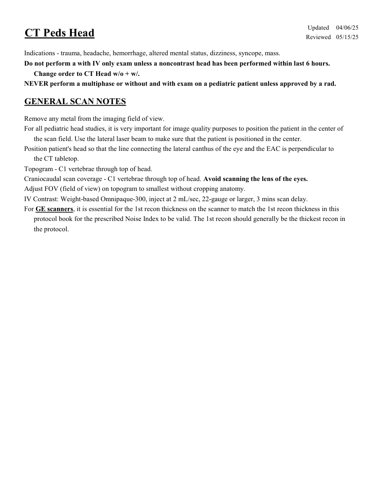
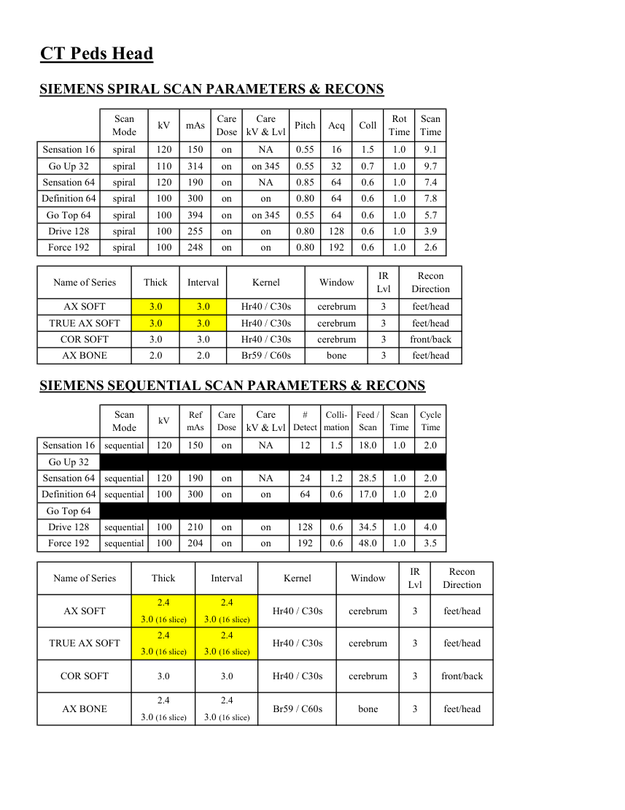
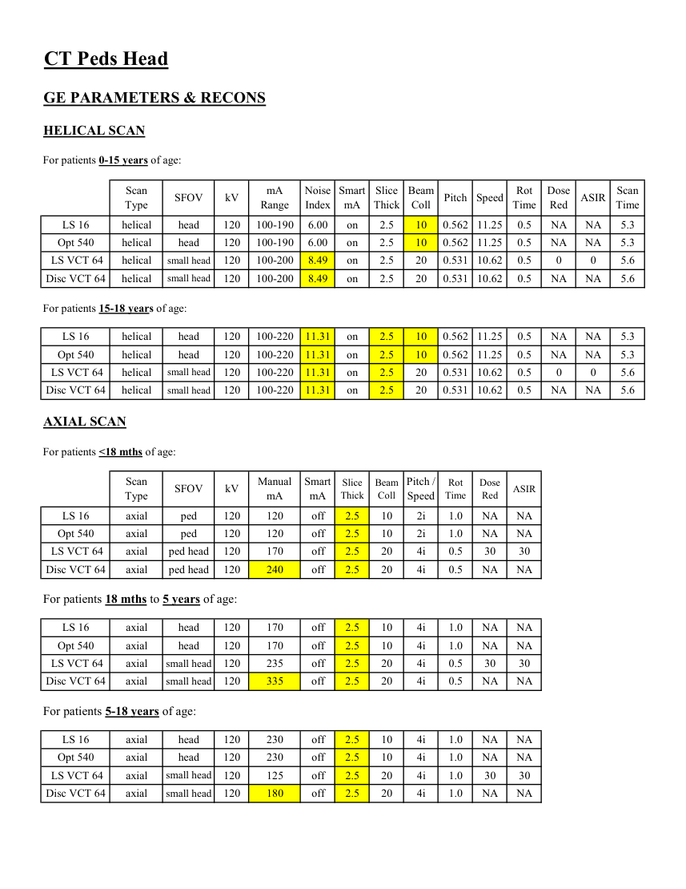
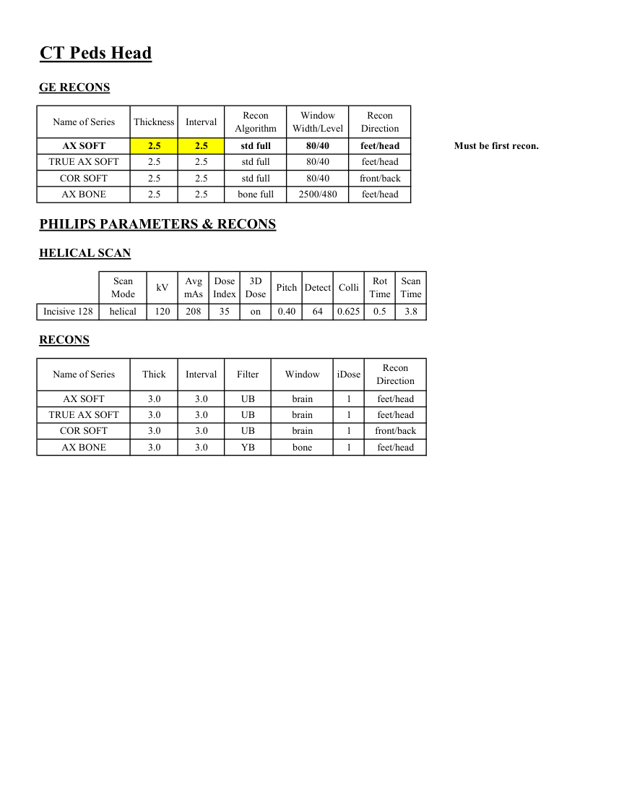

# CT — Craniu pediatric (MCB)

## Documentul original MCB — Craniu pediatric

**Protocol · 4 pagini · consultat la 2026-09-27.**

[Descarcă PDF-ul integral](../../assets/mcb-modalities/ct-craniu-pediatric-mcb/document.pdf) · [Sursa MCB](https://ref.mcbradiology.com/Protocols,%20Policies,%20Worksheets%20&%20Forms/CT/Protocols/Peds/1%20Peds%20Head.pdf) · [Catalogul MCB pentru această modalitate](../mcb/index.md)

Instrucțiunile, valorile și ilustrațiile din documentul original sunt păstrate în **engleză**. Titlul și navigarea sunt în română.

### Pagina 1

{ loading=lazy }

### Pagina 2

{ loading=lazy }

### Pagina 3

{ loading=lazy }

### Pagina 4

{ loading=lazy }

## Textul documentului original

??? abstract "Pagina 1 — text în engleză"

    
Updated
    04/06/25
    CT Peds Head
    Reviewed
    05/15/25
    Indications - trauma, headache, hemorrhage, altered mental status, dizziness, syncope, mass.
    Do not perform a with IV only exam unless a noncontrast head has been performed within last 6 hours. 
    Change order to CT Head w/o + w/.
    NEVER perform a multiphase or without and with exam on a pediatric patient unless approved by a rad.
    GENERAL SCAN NOTES
    Remove any metal from the imaging field of view.
    For all pediatric head studies, it is very important for image quality purposes to position the patient in the center of 
    the scan field. Use the lateral laser beam to make sure that the patient is positioned in the center.
    Position patient&#x27;s head so that the line connecting the lateral canthus of the eye and the EAC is perpendicular to 
    the CT tabletop.
    Topogram - C1 vertebrae through top of head.
    Craniocaudal scan coverage - C1 vertebrae through top of head. Avoid scanning the lens of the eyes. 
    Adjust FOV (field of view) on topogram to smallest without cropping anatomy.
    IV Contrast: Weight-based Omnipaque-300, inject at 2 mL/sec, 22-gauge or larger, 3 mins scan delay.
    For GE scanners, it is essential for the 1st recon thickness on the scanner to match the 1st recon thickness in this
    protocol book for the prescribed Noise Index to be valid. The 1st recon should generally be the thickest recon in 
    the protocol.
    

??? abstract "Pagina 2 — text în engleză"

    
CT Peds Head
    SIEMENS SPIRAL SCAN PARAMETERS &amp; RECONS
    Scan                           
    Care                                          
    Scan                 
    Mode
    kV
    mAs
    Care                            
    Dose
    kV &amp; Lvl
    Pitch
    Acq
    Coll
    Rot 
    Time
    Time
    Sensation 16
    spiral
    120
    150
    on
    NA
    0.55
    16
    1.5
    1.0
    9.1
    Go Up 32
    spiral
    110
    314
    on
    on 345
    0.55
    32
    0.7
    1.0
    9.7
    Sensation 64
    spiral
    120
    190
    on
    NA
    0.85
    64
    0.6
    1.0
    7.4
    Definition 64
    spiral
    100
    300
    on
    on
    0.80
    64
    0.6
    1.0
    7.8
    Go Top 64
    spiral
    100
    394
    on
    on 345
    0.55
    64
    0.6
    1.0
    5.7
    Drive 128
    spiral
    100
    255
    on
    on
    0.80
    128
    0.6
    1.0
    3.9
    Force 192
    spiral
    100
    248
    on
    on
    0.80
    192
    0.6
    1.0
    2.6
    Recon                     
    Name of Series
    Thick
    Interval
    Kernel
    Window
    IR                       
    Lvl
    Direction
    AX SOFT
    3.0
    3.0
    Hr40 / C30s
    cerebrum
    3
    feet/head
    TRUE AX SOFT
    3.0
    3.0
    Hr40 / C30s
    cerebrum
    3
    feet/head
    COR SOFT
    3.0
    3.0
    Hr40 / C30s
    cerebrum
    3
    front/back
    AX BONE
    2.0
    2.0
    Br59 / C60s
    bone
    3
    feet/head
    SIEMENS SEQUENTIAL SCAN PARAMETERS &amp; RECONS
    Scan                           
    Care                                          
    Care                            
    #                         
    Colli-                
    Feed / 
    Scan 
    Cycle 
    mAs
    Dose
    Detect
    mation
    Scan
    Time
    Time
    Mode
    kV
    Ref 
    kV &amp; Lvl
    Sensation 16
    sequential
    120
    150
    on
    NA
    12
    1.5
    18.0
    1.0
    2.0
    Go Up 32
    sequential
    2.0
    Sensation 64
    sequential
    120
    190
    on
    NA
    24
    1.2
    28.5
    1.0
    2.0
    Definition 64
    sequential
    100
    300
    on
    on
    64
    0.6
    17.0
    1.0
    2.0
    Go Top 64
    sequential
    2.0
    Drive 128
    sequential
    100
    210
    on
    on
    128
    0.6
    34.5
    4.0
    1.0
    Force 192
    sequential
    100
    204
    on
    on
    192
    0.6
    48.0
    1.0
    3.5
    Recon                     
    Name of Series
    Thick
    Interval
    Kernel
    Window
    IR                       
    Lvl
    Direction
    2.4
    2.4
    AX SOFT
    Hr40 / C30s
    cerebrum
    3
    feet/head
    3.0 (16 slice)
    3.0 (16 slice)
    2.4
    2.4
    TRUE AX SOFT
    Hr40 / C30s
    cerebrum
    3
    feet/head
    3.0 (16 slice)
    3.0 (16 slice)
    COR SOFT
    Hr40 / C30s
    cerebrum
    3
    front/back
    3.0
    3.0
    2.4
    2.4
    AX BONE
    Br59 / C60s
    bone
    3
    feet/head
    3.0 (16 slice)
    3.0 (16 slice)
    

??? abstract "Pagina 3 — text în engleză"

    
CT Peds Head
    GE PARAMETERS &amp; RECONS
    HELICAL SCAN
    For patients 0-15 years of age:
    Scan               
    mA                           
    Smart             
    Slice                       
    Beam                                 
    Dose                                          
    Type
    SFOV
    kV
    Noise                    
    Index
    Range
    mA
    Thick
    Coll
    Pitch
    Speed
    Rot                                
    Time
    Red
    ASIR
    Scan                 
    Time
    LS 16
    helical
    head
    120
    6.00
    0.562 11.25
    100-190
    on
    2.5
    10
    0.5
    NA
    NA
    5.3
    Opt 540
    helical
    head
    120
    6.00
    on
    2.5
    10
    0.562 11.25
    0.5
    NA
    NA
    5.3
    100-190
     LS VCT 64
    helical
    small head
    120
    100-200
    8.49
    on
    2.5
    20
    0.531 10.62
    0.5
    0
    0
    5.6
    Disc VCT 64
    helical
    small head
    120
    100-200
    8.49
    on
    2.5
    20
    0.531 10.62
    0.5
    NA
    NA
    5.6
    For patients 15-18 years of age:
    LS 16
    helical
    head
    120
    100-220
    0.562 11.25
    11.31
    on
    2.5
    10
    NA
    5.3
    0.5
    NA
    Opt 540
    helical
    head
    120
    100-220
    11.31
    on
    2.5
    10
    0.562 11.25
    0.5
    NA
    NA
    5.3
     LS VCT 64
    helical
    small head
    120
    100-220
    11.31
    on
    2.5
    20
    0.531
    10.62
    0.5
    0
    0
    5.6
    Disc VCT 64
    helical
    small head
    120
    100-220
    11.31
    on
    2.5
    20
    0.531 10.62
    0.5
    NA
    NA
    5.6
    AXIAL SCAN
    For patients &lt;18 mths of age:
    Scan               
    Smart 
    Pitch /               
    Slice                       
    Beam                                 
    Rot                                
    Dose                                                    
    ASIR
    SFOV
    kV
    Manual                                
    Thick
    Coll
    Time
    Red
    Type
    mA
    mA
    Speed
    LS 16
    120
    off
    axial
    ped
    120
    2.5
    10
    2i
    1.0
    NA
    NA
    Opt 540
    axial
    ped
    120
    120
    off
    2.5
    10
    2i
    1.0
    NA
    NA
     LS VCT 64
    20
    4i
    0.5
    30
    30
    axial
    ped head
    120
    170
    off
    2.5
    0.5
    Disc VCT 64
    axial
    ped head
    120
    240
    off
    2.5
    20
    4i
    NA
    NA
    For patients 18 mths to 5 years of age:
    LS 16
    axial
    head
    120
    170
    off
    2.5
    10
    4i
    1.0
    NA
    NA
    Opt 540
    axial
    head
    120
    170
    off
    2.5
    10
    4i
    1.0
    NA
    NA
     LS VCT 64
    axial
    small head
    120
    235
    off
    2.5
    20
    4i
    0.5
    30
    30
    Disc VCT 64
    axial
    off
    2.5
    20
    4i
    0.5
    NA
    NA
    small head
    120
    335
    For patients 5-18 years of age:
    LS 16
    axial
    head
    120
    2.5
    10
    4i
    230
    off
    1.0
    NA
    NA
    Opt 540
    axial
    head
    120
    230
    off
    2.5
    10
    4i
    1.0
    NA
    NA
     LS VCT 64
    axial
    small head
    120
    125
    off
    2.5
    20
    4i
    1.0
    30
    30
    Disc VCT 64
    axial
    small head
    120
    180
    off
    2.5
    20
    4i
    1.0
    NA
    NA
    

??? abstract "Pagina 4 — text în engleză"

    
CT Peds Head
    GE RECONS
    Window                                   
    Recon                    
    Name of Series
    Thickness
    Interval
    Recon                                     
    Algorithm
    Width/Level
    Direction
    AX SOFT
    2.5
    2.5
    std full
    80/40
    feet/head
    Must be first recon.
    TRUE AX SOFT
    2.5
    2.5
    std full
    80/40
    feet/head
    COR SOFT
    2.5
    2.5
    std full
    80/40
    front/back
    AX BONE
    2.5
    2.5
    bone full
    2500/480
    feet/head
    PHILIPS PARAMETERS &amp; RECONS
    HELICAL SCAN
    Scan                           
    Dose                                          
    3D            
    Rot 
    Scan                 
    Mode
    kV
    Avg                      
    mAs
    Index
    Dose
    Pitch Detect Colli
    Time
    Time
    0.5
    3.8
    Incisive 128
    helical
    120
    208
    35
    on
    0.40
    64
    0.625
    RECONS
    Recon                     
    Name of Series
    Thick
    Interval
    Filter
    Window
    iDose
    Direction
    AX SOFT
    3.0
    3.0
    UB
    1
    feet/head
    brain
    TRUE AX SOFT
    3.0
    3.0
    UB
    brain
    1
    feet/head
    COR SOFT
    3.0
    3.0
    UB
    brain
    1
    front/back
    AX BONE
    3.0
    3.0
    YB
    bone
    1
    feet/head
    

