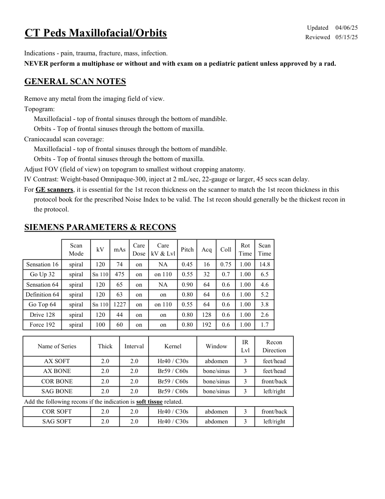
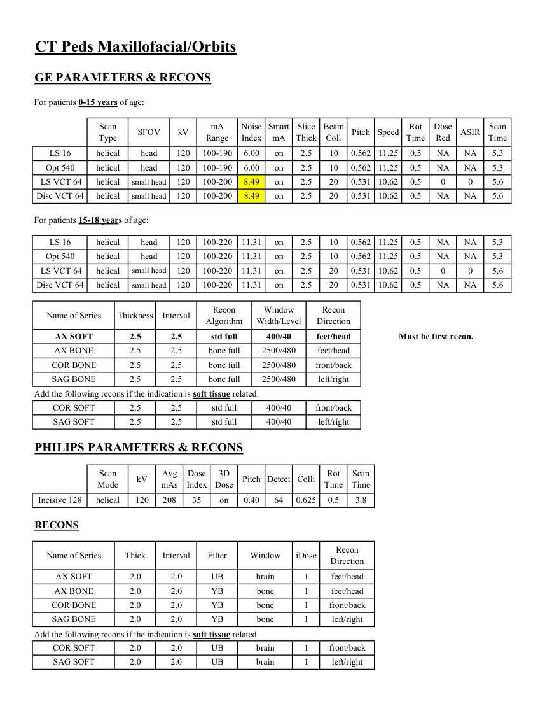

# CT — Masiv facial și orbite la copil (MCB)

## Documentul original MCB — Masiv facial și orbite la copil

**Protocol · 2 pagini · consultat la 2026-09-27.**

[Descarcă PDF-ul integral](../../assets/mcb-modalities/ct-masiv-facial-si-orbite-la-copil-mcb/document.pdf) · [Sursa MCB](https://ref.mcbradiology.com/Protocols,%20Policies,%20Worksheets%20&%20Forms/CT/Protocols/Peds/2%20Peds%20MF%20Orbits.pdf) · [Catalogul MCB pentru această modalitate](../mcb/index.md)

Instrucțiunile, valorile și ilustrațiile din documentul original sunt păstrate în **engleză**. Titlul și navigarea sunt în română.

### Pagina 1

{ loading=lazy }

### Pagina 2

{ loading=lazy }

## Textul documentului original

??? abstract "Pagina 1 — text în engleză"

    
Updated
    04/06/25
    CT Peds Maxillofacial/Orbits
    Reviewed
    05/15/25
    Indications - pain, trauma, fracture, mass, infection.
    NEVER perform a multiphase or without and with exam on a pediatric patient unless approved by a rad.
    GENERAL SCAN NOTES
    Remove any metal from the imaging field of view.
    Topogram:
    Maxillofacial - top of frontal sinuses through the bottom of mandible.
    Orbits - Top of frontal sinuses through the bottom of maxilla.
    Craniocaudal scan coverage:
    Maxillofacial - top of frontal sinuses through the bottom of mandible.
    Orbits - Top of frontal sinuses through the bottom of maxilla.
    Adjust FOV (field of view) on topogram to smallest without cropping anatomy.
    IV Contrast: Weight-based Omnipaque-300, inject at 2 mL/sec, 22-gauge or larger, 45 secs scan delay.
    For GE scanners, it is essential for the 1st recon thickness on the scanner to match the 1st recon thickness in this
    protocol book for the prescribed Noise Index to be valid. The 1st recon should generally be the thickest recon in 
    the protocol.
    SIEMENS PARAMETERS &amp; RECONS
    Scan                           
    Care                                          
    Scan                 
    Mode
    kV
    mAs
    Care                            
    Dose
    kV &amp; Lvl
    Pitch
    Acq
    Coll
    Rot 
    Time
    Time
    Sensation 16
    spiral
    120
    74
    on
    NA
    0.45
    16
    0.75
    1.00
    14.8
    Go Up 32
    spiral
    Sn 110
    475
    on
    on 110
    0.55
    32
    0.7
    1.00
    6.5
    Sensation 64
    spiral
    120
    65
    on
    NA
    0.90
    64
    0.6
    1.00
    4.6
    Definition 64
    spiral
    120
    63
    on
    0.80
    64
    0.6
    1.00
    5.2
    on
    Go Top 64
    spiral
    Sn 110
    1227
    on
    on 110
    0.55
    64
    0.6
    1.00
    3.8
    Drive 128
    spiral
    120
    44
    on
    0.80
    128
    0.6
    1.00
    2.6
    on
    Force 192
    spiral
    100
    60
    on
    on
    0.80
    192
    0.6
    1.00
    1.7
    Recon                     
    Name of Series
    Thick
    Interval
    Kernel
    Window
    IR                       
    Lvl
    Direction
    AX SOFT
    2.0
    2.0
    Hr40 / C30s
    abdomen
    3
    feet/head
    AX BONE
    2.0
    2.0
    Br59 / C60s
    bone/sinus
    3
    feet/head
    COR BONE
    2.0
    2.0
    Br59 / C60s
    bone/sinus
    3
    front/back
    left/right
    SAG BONE
    2.0
    2.0
    Br59 / C60s
    bone/sinus
    3
    Add the following recons if the indication is soft tissue related.
    COR SOFT
    2.0
    2.0
    Hr40 / C30s
    abdomen
    3
    front/back
    SAG SOFT
    2.0
    2.0
    Hr40 / C30s
    abdomen
    3
    left/right
    

??? abstract "Pagina 2 — text în engleză"

    
CT Peds Maxillofacial/Orbits
    GE PARAMETERS &amp; RECONS
    For patients 0-15 years of age:
    Scan               
    Smart             
    Slice                       
    Beam                                 
    Dose                                          
    ASIR
    Scan                 
    Type
    SFOV
    kV
    mA                           
    Range
    Noise                    
    Index
    mA
    Thick
    Coll
    Pitch
    Speed
    Rot                                
    Time
    Red
    Time
    LS 16
    helical
    120
    100-190
    6.00
    on
    2.5
    10
    head
    0.562 11.25
    0.5
    NA
    NA
    5.3
    2.5
    10
    0.562 11.25
    0.5
    NA
    Opt 540
    helical
    head
    120
    100-190
    6.00
    on
    NA
    5.3
     LS VCT 64
    helical
    120
    100-200
    8.49
    on
    2.5
    20
    small head
    0
    0
    5.6
    0.531 10.62
    0.5
    NA
    NA
    5.6
    small head
    Disc VCT 64
    helical
    120
    100-200
    8.49
    on
    2.5
    20
    0.531 10.62
    0.5
    For patients 15-18 years of age:
    on
    2.5
    10
    0.562 11.25
    0.5
    LS 16
    helical
    head
    120
    100-220
    11.31
    NA
    NA
    5.3
    Opt 540
    helical
    head
    120
    100-220
    11.31
    on
    2.5
    10
    0.562 11.25
    0.5
    NA
    NA
    5.3
    20
    0.531 10.62
    0.5
    0
    0
     LS VCT 64
    helical
    small head
    120
    100-220
    11.31
    on
    2.5
    5.6
    Disc VCT 64
    helical
    small head
    120
    100-220
    11.31
    on
    2.5
    20
    0.531 10.62
    0.5
    NA
    NA
    5.6
    Window                                   
    Recon                    
    Name of Series
    Thickness
    Interval
    Recon                                     
    Algorithm
    Width/Level
    Direction
    AX SOFT
    2.5
    Must be first recon.
    2.5
    std full
    400/40
    feet/head
    AX BONE
    2.5
    2.5
    bone full
    2500/480
    feet/head
    COR BONE
    2.5
    2.5
    bone full
    2500/480
    front/back
    SAG BONE
    2.5
    2.5
    bone full
    2500/480
    left/right
    Add the following recons if the indication is soft tissue related.
    COR SOFT
    2.5
    2.5
    std full
    400/40
    front/back
    SAG SOFT
    2.5
    2.5
    std full
    400/40
    left/right
    PHILIPS PARAMETERS &amp; RECONS
    Scan                           
    Dose                                          
    3D            
    Scan                 
    Colli
    Rot 
    Mode
    kV
    Avg                      
    mAs
    Index
    Dose
    Pitch Detect
    Time
    Time
    Incisive 128
    helical
    0.40
    64
    120
    208
    35
    on
    0.625
    0.5
    3.8
    RECONS
    Name of Series
    Thick
    Interval
    Filter
    Window
    iDose
    Recon                     
    Direction
    AX SOFT
    2.0
    UB
    2.0
    brain
    feet/head
    1
    AX BONE
    2.0
    2.0
    bone
    feet/head
    YB
    1
    COR BONE
    2.0
    2.0
    YB
    bone
    1
    front/back
    SAG BONE
    2.0
    2.0
    YB
    bone
    1
    left/right
    Add the following recons if the indication is soft tissue related.
    COR SOFT
    2.0
    2.0
    UB
    brain
    1
    front/back
    SAG SOFT
    2.0
    2.0
    UB
    brain
    1
    left/right
    

