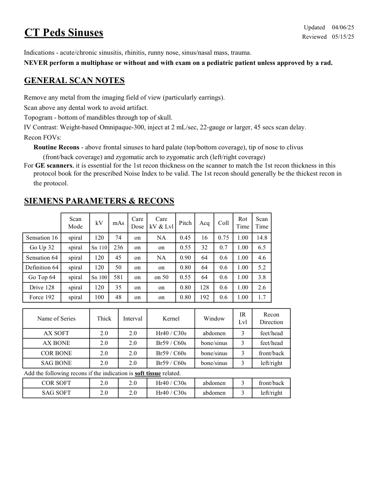
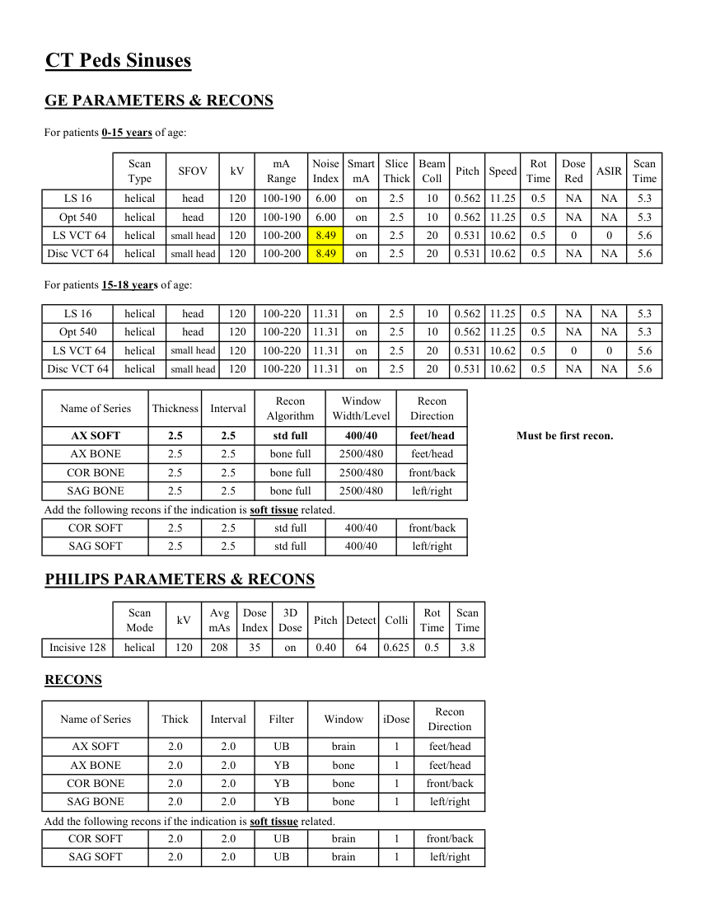

# CT — Sinusuri la copil (MCB)

## Documentul original MCB — Sinusuri la copil

**Protocol · 2 pagini · consultat la 2026-09-27.**

[Descarcă PDF-ul integral](../../assets/mcb-modalities/ct-sinusuri-la-copil-mcb/document.pdf) · [Sursa MCB](https://ref.mcbradiology.com/Protocols,%20Policies,%20Worksheets%20&%20Forms/CT/Protocols/Peds/3%20Peds%20Sinuses.pdf) · [Catalogul MCB pentru această modalitate](../mcb/index.md)

Instrucțiunile, valorile și ilustrațiile din documentul original sunt păstrate în **engleză**. Titlul și navigarea sunt în română.

### Pagina 1

{ loading=lazy }

### Pagina 2

{ loading=lazy }

## Textul documentului original

??? abstract "Pagina 1 — text în engleză"

    
Updated
    04/06/25
    CT Peds Sinuses
    Reviewed
    05/15/25
    Indications - acute/chronic sinusitis, rhinitis, runny nose, sinus/nasal mass, trauma.
    NEVER perform a multiphase or without and with exam on a pediatric patient unless approved by a rad.
    GENERAL SCAN NOTES
    Remove any metal from the imaging field of view (particularly earrings).
    Scan above any dental work to avoid artifact.
    Topogram - bottom of mandibles through top of skull.
    IV Contrast: Weight-based Omnipaque-300, inject at 2 mL/sec, 22-gauge or larger, 45 secs scan delay.
    Recon FOVs:
    Routine Recons - above frontal sinuses to hard palate (top/bottom coverage), tip of nose to clivus 
    (front/back coverage) and zygomatic arch to zygomatic arch (left/right coverage)
    For GE scanners, it is essential for the 1st recon thickness on the scanner to match the 1st recon thickness in this
    protocol book for the prescribed Noise Index to be valid. The 1st recon should generally be the thickest recon in 
    the protocol.
    SIEMENS PARAMETERS &amp; RECONS
    Scan                           
    Care                                          
    Scan                 
    Mode
    kV
    mAs
    Care                            
    Dose
    kV &amp; Lvl
    Pitch
    Acq
    Coll
    Rot 
    Time
    Time
    Sensation 16
    spiral
    120
    74
    on
    NA
    0.45
    16
    0.75
    1.00
    14.8
    0.55
    32
    0.7
    1.00
    6.5
    Go Up 32
    spiral
    Sn 110
    236
    on
    on
    Sensation 64
    spiral
    120
    45
    on
    NA
    0.90
    64
    0.6
    1.00
    4.6
    Definition 64
    spiral
    120
    50
    on
    0.80
    64
    0.6
    1.00
    5.2
    on
    Go Top 64
    spiral
    Sn 100
    581
    on
    on 50
    0.55
    64
    0.6
    1.00
    3.8
    Drive 128
    spiral
    120
    35
    on
    0.80
    128
    0.6
    1.00
    2.6
    on
    Force 192
    spiral
    100
    48
    on
    on
    0.80
    192
    0.6
    1.00
    1.7
    Recon                     
    Name of Series
    Thick
    Interval
    Kernel
    Window
    IR                       
    Lvl
    Direction
    AX SOFT
    2.0
    2.0
    Hr40 / C30s
    abdomen
    3
    feet/head
    AX BONE
    2.0
    2.0
    Br59 / C60s
    bone/sinus
    3
    feet/head
    COR BONE
    2.0
    2.0
    Br59 / C60s
    bone/sinus
    3
    front/back
    SAG BONE
    2.0
    2.0
    Br59 / C60s
    bone/sinus
    3
    left/right
    Add the following recons if the indication is soft tissue related.
    COR SOFT
    2.0
    2.0
    Hr40 / C30s
    abdomen
    3
    front/back
    left/right
    SAG SOFT
    2.0
    2.0
    Hr40 / C30s
    abdomen
    3
    

??? abstract "Pagina 2 — text în engleză"

    
CT Peds Sinuses
    GE PARAMETERS &amp; RECONS
    For patients 0-15 years of age:
    Smart             
    Slice                       
    Beam                                 
    Dose                                          
    Scan                 
    Type
    SFOV
    kV
    mA                           
    Red
    ASIR
    Scan               
    Range
    Noise                    
    Index
    mA
    Thick
    Coll
    Pitch
    Speed
    Rot                                
    Time
    Time
    LS 16
    helical
    head
    120
    100-190
    6.00
    on
    2.5
    10
    0.562 11.25
    0.5
    NA
    NA
    5.3
    on
    2.5
    Opt 540
    helical
    head
    120
    100-190
    6.00
    NA
    NA
    5.3
    10
    0.562 11.25
    0.5
     LS VCT 64
    helical
    small head
    120
    100-200
    8.49
    on
    2.5
    0
    5.6
    20
    0.531 10.62
    0.5
    0
    0.5
    NA
    NA
    Disc VCT 64
    helical
    small head
    120
    100-200
    8.49
    on
    2.5
    5.6
    20
    0.531 10.62
    For patients 15-18 years of age:
    LS 16
    helical
    head
    120
    100-220
    11.31
    on
    2.5
    10
    0.562 11.25
    0.5
    NA
    NA
    5.3
    Opt 540
    helical
    head
    120
    100-220
    11.31
    on
    2.5
    10
    0.562 11.25
    0.5
    NA
    NA
    5.3
     LS VCT 64
    helical
    small head
    120
    100-220
    11.31
    on
    2.5
    20
    0.531 10.62
    0.5
    0
    0
    5.6
    20
    0.531 10.62
    0.5
    NA
    NA
    Disc VCT 64
    helical
    small head
    120
    100-220
    11.31
    on
    2.5
    5.6
    Window                                   
    Recon                    
    Name of Series
    Thickness
    Interval
    Recon                                     
    Algorithm
    Width/Level
    Direction
    AX SOFT
    2.5
    2.5
    std full
    400/40
    feet/head
    Must be first recon.
    AX BONE
    2.5
    2.5
    bone full
    2500/480
    feet/head
    COR BONE
    2.5
    2.5
    bone full
    2500/480
    front/back
    SAG BONE
    2.5
    2.5
    bone full
    2500/480
    left/right
    Add the following recons if the indication is soft tissue related.
    COR SOFT
    2.5
    2.5
    std full
    400/40
    front/back
    SAG SOFT
    2.5
    2.5
    std full
    400/40
    left/right
    PHILIPS PARAMETERS &amp; RECONS
    Scan                           
    Dose                                          
    3D            
    Scan                 
    Pitch Detect Colli
    Rot 
    Mode
    kV
    Avg                      
    mAs
    Index
    Dose
    Time
    Time
    Incisive 128
    helical
    120
    208
    35
    on
    0.40
    64
    0.625
    0.5
    3.8
    RECONS
    Recon                     
    Name of Series
    Thick
    Interval
    Filter
    Window
    iDose
    Direction
    AX SOFT
    2.0
    2.0
    UB
    brain
    1
    feet/head
    AX BONE
    2.0
    2.0
    YB
    bone
    1
    feet/head
    COR BONE
    2.0
    2.0
    YB
    bone
    1
    front/back
    SAG BONE
    2.0
    2.0
    YB
    bone
    1
    left/right
    Add the following recons if the indication is soft tissue related.
    COR SOFT
    2.0
    2.0
    UB
    brain
    1
    front/back
    left/right
    SAG SOFT
    2.0
    2.0
    UB
    brain
    1
    

