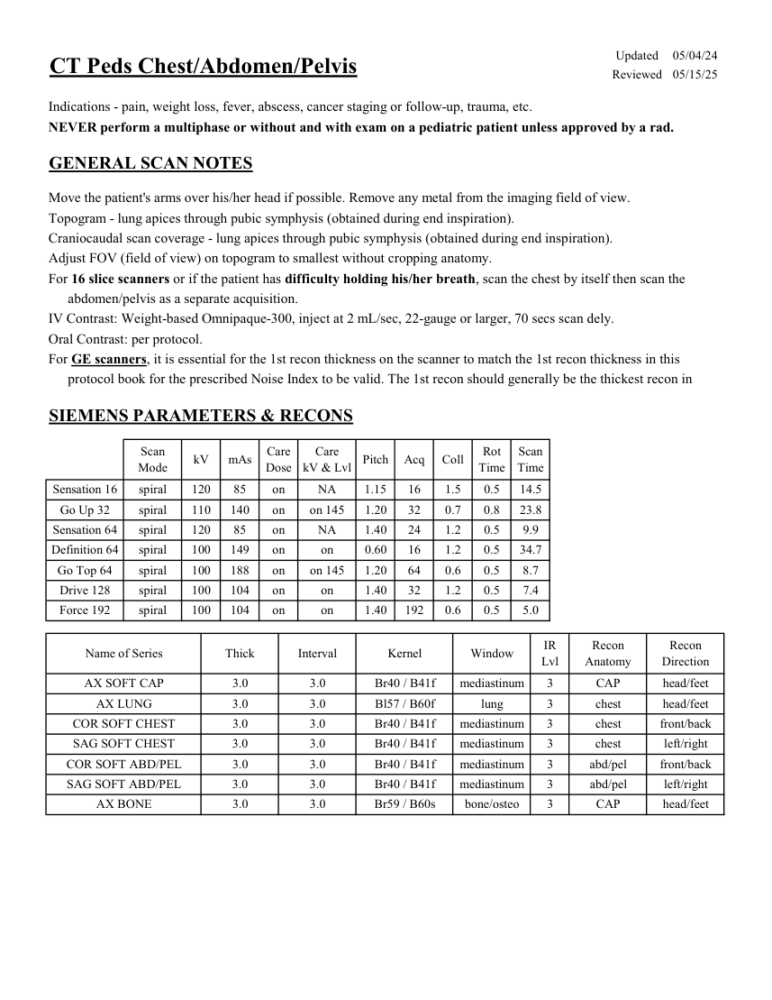
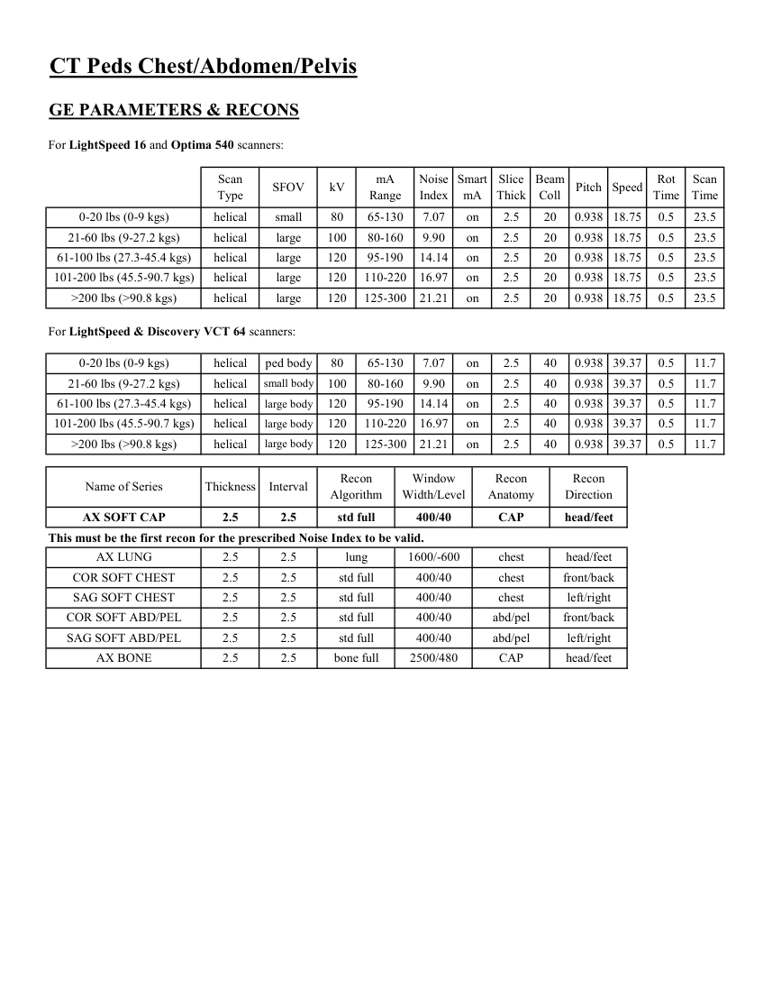
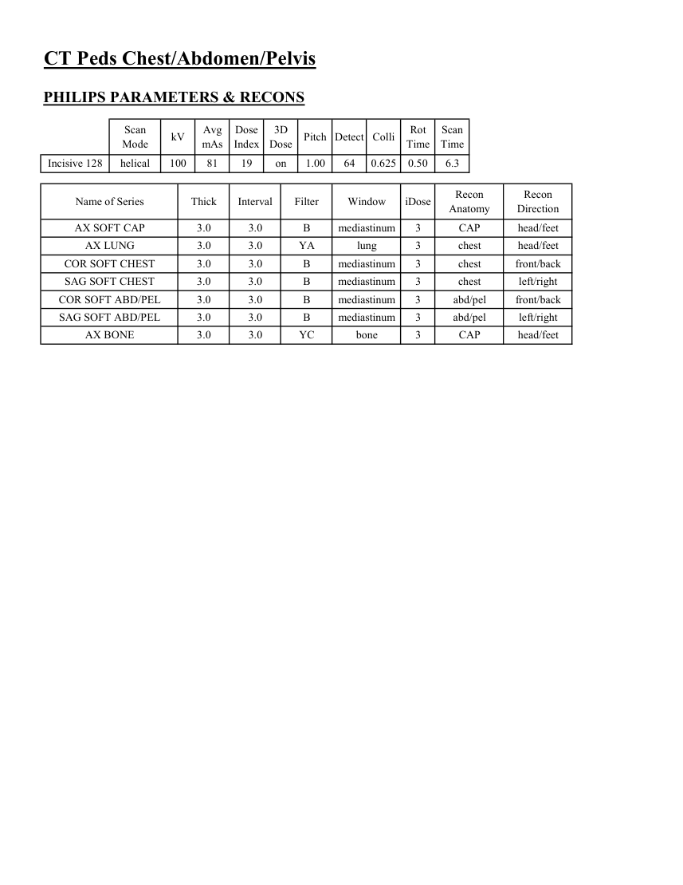

# CT — Torace, abdomen și pelvis la copil (MCB)

## Documentul original MCB — Torace, abdomen și pelvis la copil

**Protocol · 3 pagini · consultat la 2026-09-27.**

[Descarcă PDF-ul integral](../../assets/mcb-modalities/ct-torace-abdomen-si-pelvis-la-copil-mcb/document.pdf) · [Sursa MCB](https://ref.mcbradiology.com/Protocols,%20Policies,%20Worksheets%20&%20Forms/CT/Protocols/Peds/7%20Peds%20CAP.pdf) · [Catalogul MCB pentru această modalitate](../mcb/index.md)

Instrucțiunile, valorile și ilustrațiile din documentul original sunt păstrate în **engleză**. Titlul și navigarea sunt în română.

### Pagina 1

{ loading=lazy }

### Pagina 2

{ loading=lazy }

### Pagina 3

{ loading=lazy }

## Textul documentului original

??? abstract "Pagina 1 — text în engleză"

    
Updated
    05/04/24
    CT Peds Chest/Abdomen/Pelvis
    Reviewed
    05/15/25
    Indications - pain, weight loss, fever, abscess, cancer staging or follow-up, trauma, etc.
    NEVER perform a multiphase or without and with exam on a pediatric patient unless approved by a rad.
    GENERAL SCAN NOTES
    Move the patient&#x27;s arms over his/her head if possible. Remove any metal from the imaging field of view.
    Topogram - lung apices through pubic symphysis (obtained during end inspiration).
    Craniocaudal scan coverage - lung apices through pubic symphysis (obtained during end inspiration).
    Adjust FOV (field of view) on topogram to smallest without cropping anatomy.
    For 16 slice scanners or if the patient has difficulty holding his/her breath, scan the chest by itself then scan the
    abdomen/pelvis as a separate acquisition.
    IV Contrast: Weight-based Omnipaque-300, inject at 2 mL/sec, 22-gauge or larger, 70 secs scan dely.
    Oral Contrast: per protocol.
    For GE scanners, it is essential for the 1st recon thickness on the scanner to match the 1st recon thickness in this
    protocol book for the prescribed Noise Index to be valid. The 1st recon should generally be the thickest recon in 
    SIEMENS PARAMETERS &amp; RECONS
    Scan                           
    Care                                          
    Scan                 
    Mode
    kV
    mAs
    Care                            
    Dose
    kV &amp; Lvl
    Pitch
    Acq
    Coll
    Rot 
    Time
    Time
    Sensation 16
    spiral
    120
    85
    on
    NA
    1.15
    16
    1.5
    0.5
    14.5
    Go Up 32
    spiral
    110
    140
    on
    on 145
    1.20
    32
    0.7
    0.8
    23.8
    Sensation 64
    spiral
    120
    85
    on
    NA
    1.40
    24
    1.2
    0.5
    9.9
    Definition 64
    spiral
    100
    149
    on
    0.60
    16
    1.2
    0.5
    34.7
    on
    Go Top 64
    spiral
    100
    188
    on
    on 145
    1.20
    64
    0.6
    0.5
    8.7
    Drive 128
    spiral
    100
    104
    on
    1.40
    32
    1.2
    0.5
    7.4
    on
    Force 192
    spiral
    100
    104
    on
    on
    1.40
    192
    0.6
    0.5
    5.0
    Recon                       
    Recon                     
    Direction
    Name of Series
    Thick
    Interval
    Kernel
    Window
    IR                       
    Lvl
    Anatomy
    AX SOFT CAP
    3.0
    3.0
    Br40 / B41f
    mediastinum
    3
    CAP
    head/feet
    AX LUNG
    3.0
    3.0
    Bl57 / B60f
    lung
    3
    chest
    head/feet
    COR SOFT CHEST
    3.0
    3.0
    Br40 / B41f
    mediastinum
    3
    chest
    front/back
    SAG SOFT CHEST
    3.0
    3.0
    Br40 / B41f
    mediastinum
    3
    chest
    left/right
    COR SOFT ABD/PEL
    3.0
    3.0
    Br40 / B41f
    mediastinum
    3
    abd/pel
    front/back
    abd/pel
    left/right
    SAG SOFT ABD/PEL
    3.0
    3.0
    Br40 / B41f
    mediastinum
    3
    head/feet
    AX BONE
    3.0
    3.0
    CAP
    Br59 / B60s
    bone/osteo
    3
    

??? abstract "Pagina 2 — text în engleză"

    
CT Peds Chest/Abdomen/Pelvis
    GE PARAMETERS &amp; RECONS
    For LightSpeed 16 and Optima 540 scanners:
    Scan               
    Smart             
    Slice                       
    Beam                                 
    Scan                 
    Type
    SFOV
    kV
    mA                           
    Range
    Noise                    
    Index
    mA
    Thick
    Coll
    Pitch
    Speed
    Rot                               
    Time
    Time
    0-20 lbs (0-9 kgs)
    helical
    small
    80
    65-130
    0.5
    23.5
    7.07
    on
    2.5
    20
    0.938 18.75
    21-60 lbs (9-27.2 kgs)
    helical
    large
    100
    80-160
    9.90
    on
    2.5
    20
    0.938 18.75
    0.5
    23.5
    61-100 lbs (27.3-45.4 kgs)
    helical
    large
    120
    95-190
    0.5
    23.5
    20
    0.938 18.75
    14.14
    on
    2.5
    101-200 lbs (45.5-90.7 kgs)
    helical
    large
    120
    110-220
    16.97
    on
    2.5
    20
    0.938 18.75
    0.5
    23.5
    &gt;200 lbs (&gt;90.8 kgs)
    helical
    large
    120
    125-300
    0.5
    23.5
    20
    0.938 18.75
    21.21
    on
    2.5
    For LightSpeed &amp; Discovery VCT 64 scanners:
    0-20 lbs (0-9 kgs)
    helical
    ped body
    80
    65-130
    7.07
    on
    2.5
    40
    0.938 39.37
    0.5
    11.7
    21-60 lbs (9-27.2 kgs)
    helical
    small body
    100
    80-160
    0.5
    11.7
    40
    0.938 39.37
    9.90
    on
    2.5
    61-100 lbs (27.3-45.4 kgs)
    helical
    large body
    120
    95-190
    14.14
    on
    2.5
    40
    0.938 39.37
    0.5
    11.7
    101-200 lbs (45.5-90.7 kgs)
    helical
    large body
    120
    110-220
    16.97
    on
    2.5
    40
    0.938
    39.37
    0.5
    11.7
    &gt;200 lbs (&gt;90.8 kgs)
    helical
    large body
    120
    125-300
    21.21
    on
    2.5
    40
    0.938 39.37
    0.5
    11.7
    Window                                   
    Recon                                     
    Recon                                     
    Direction
    Name of Series
    Thickness
    Interval
    Recon                                     
    Algorithm
    Width/Level
    Anatomy
    AX SOFT CAP
    2.5
    2.5
    std full
    400/40
    CAP
    head/feet
    This must be the first recon for the prescribed Noise Index to be valid.
    AX LUNG
    2.5
    2.5
    lung
    1600/-600
    chest
    head/feet
    COR SOFT CHEST
    2.5
    2.5
    std full
    400/40
    chest
    front/back
    SAG SOFT CHEST
    2.5
    2.5
    std full
    400/40
    chest
    left/right
    COR SOFT ABD/PEL
    2.5
    2.5
    std full
    400/40
    abd/pel
    front/back
    SAG SOFT ABD/PEL
    2.5
    2.5
    std full
    400/40
    abd/pel
    left/right
    AX BONE
    2.5
    2.5
    bone full
    2500/480
    CAP
    head/feet
    

??? abstract "Pagina 3 — text în engleză"

    
CT Peds Chest/Abdomen/Pelvis
    PHILIPS PARAMETERS &amp; RECONS
    Scan                           
    Dose                                          
    3D            
    Scan                 
    Pitch Detect Colli
    Rot 
    Mode
    kV
    Avg                      
    mAs
    Index
    Dose
    Time
    Time
    Incisive 128
    helical
    100
    81
    19
    on
    1.00
    64
    0.625
    0.50
    6.3
    Recon                     
    Name of Series
    Thick
    Interval
    Filter
    Window
    iDose
    Recon                                     
    Anatomy
    Direction
    AX SOFT CAP
    3.0
    3.0
    B
    mediastinum
    3
    CAP
    head/feet
    AX LUNG
    head/feet
    3.0
    3.0
    YA
    lung
    3
    chest
    COR SOFT CHEST
    3.0
    3.0
    B
    mediastinum
    3
    chest
    front/back
    SAG SOFT CHEST
    3.0
    3.0
    B
    mediastinum
    3
    chest
    left/right
    COR SOFT ABD/PEL
    3.0
    3.0
    B
    mediastinum
    3
    abd/pel
    front/back
    SAG SOFT ABD/PEL
    3.0
    3.0
    B
    mediastinum
    3
    abd/pel
    left/right
    AX BONE
    3.0
    3.0
    bone
    3
    YC
    CAP
    head/feet
    

