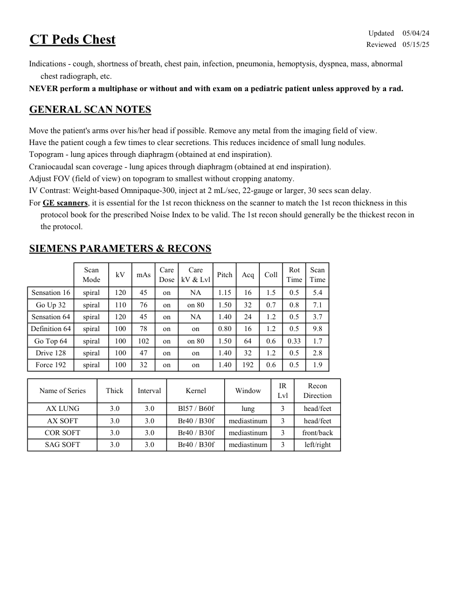
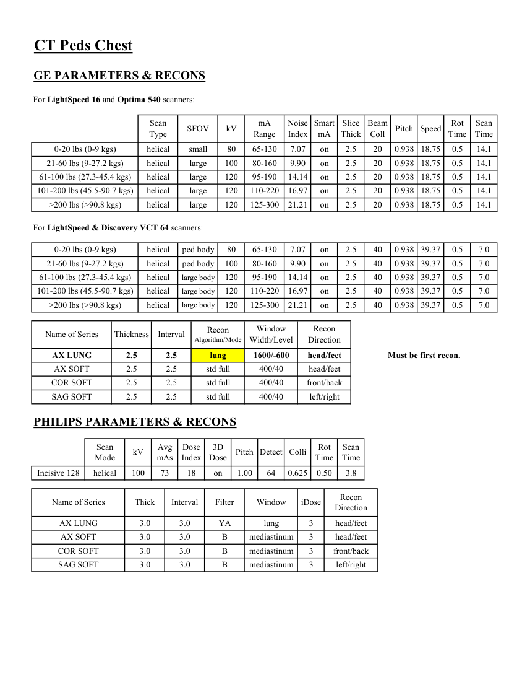

# CT — Torace pediatric (MCB)

## Documentul original MCB — Torace pediatric

**Protocol · 2 pagini · consultat la 2026-09-27.**

[Descarcă PDF-ul integral](../../assets/mcb-modalities/ct-torace-pediatric-mcb/document.pdf) · [Sursa MCB](https://ref.mcbradiology.com/Protocols,%20Policies,%20Worksheets%20&%20Forms/CT/Protocols/Peds/5%20Peds%20Chest.pdf) · [Catalogul MCB pentru această modalitate](../mcb/index.md)

Instrucțiunile, valorile și ilustrațiile din documentul original sunt păstrate în **engleză**. Titlul și navigarea sunt în română.

### Pagina 1

{ loading=lazy }

### Pagina 2

{ loading=lazy }

## Textul documentului original

??? abstract "Pagina 1 — text în engleză"

    
Updated
    05/04/24
    CT Peds Chest
    Reviewed
    05/15/25
    Indications - cough, shortness of breath, chest pain, infection, pneumonia, hemoptysis, dyspnea, mass, abnormal
    chest radiograph, etc.
    NEVER perform a multiphase or without and with exam on a pediatric patient unless approved by a rad.
    GENERAL SCAN NOTES
    Move the patient&#x27;s arms over his/her head if possible. Remove any metal from the imaging field of view.
    Have the patient cough a few times to clear secretions. This reduces incidence of small lung nodules.
    Topogram - lung apices through diaphragm (obtained at end inspiration).
    Craniocaudal scan coverage - lung apices through diaphragm (obtained at end inspiration).
    Adjust FOV (field of view) on topogram to smallest without cropping anatomy.
    IV Contrast: Weight-based Omnipaque-300, inject at 2 mL/sec, 22-gauge or larger, 30 secs scan delay.
    For GE scanners, it is essential for the 1st recon thickness on the scanner to match the 1st recon thickness in this
    protocol book for the prescribed Noise Index to be valid. The 1st recon should generally be the thickest recon in 
    the protocol.
    SIEMENS PARAMETERS &amp; RECONS
    Scan                           
    Care                                          
    Scan                 
    Mode
    kV
    mAs
    Care                            
    Dose
    kV &amp; Lvl
    Pitch
    Acq
    Coll
    Rot 
    Time
    Time
    Sensation 16
    spiral
    120
    45
    on
    NA
    1.15
    16
    1.5
    0.5
    5.4
    Go Up 32
    spiral
    110
    76
    on
    on 80
    1.50
    32
    0.7
    0.8
    7.1
    Sensation 64
    spiral
    120
    45
    on
    NA
    1.40
    24
    1.2
    0.5
    3.7
    Definition 64
    spiral
    100
    78
    on
    on
    0.80
    16
    1.2
    0.5
    9.8
    Go Top 64
    spiral
    100
    102
    on
    on 80
    1.50
    64
    0.6
    0.33
    1.7
    Drive 128
    spiral
    100
    47
    on
    on
    1.40
    32
    1.2
    0.5
    2.8
    Force 192
    spiral
    100
    32
    on
    on
    1.40
    192
    0.6
    0.5
    1.9
    Recon                     
    Name of Series
    Thick
    Interval
    Kernel
    Window
    IR                       
    Lvl
    Direction
    AX LUNG
    3.0
    3.0
    Bl57 / B60f
    lung
    3
    head/feet
    AX SOFT
    3.0
    3.0
    Br40 / B30f
    mediastinum
    3
    head/feet
    COR SOFT
    3.0
    3.0
    Br40 / B30f
    mediastinum
    3
    front/back
    left/right
    SAG SOFT
    3.0
    3.0
    Br40 / B30f
    mediastinum
    3
    

??? abstract "Pagina 2 — text în engleză"

    
CT Peds Chest
    GE PARAMETERS &amp; RECONS
    For LightSpeed 16 and Optima 540 scanners:
    Scan               
    Smart             
    Slice                       
    Beam                                 
    Scan                 
    Type
    SFOV
    kV
    mA                           
    Range
    Noise                    
    Index
    mA
    Thick
    Coll
    Pitch
    Speed
    Rot                               
    Time
    Time
    0-20 lbs (0-9 kgs)
    helical
    small
    80
    65-130
    7.07
    on
    2.5
    20
    0.938 18.75
    0.5
    14.1
    21-60 lbs (9-27.2 kgs)
    helical
    large
    100
    80-160
    9.90
    on
    2.5
    20
    0.938 18.75
    0.5
    14.1
    61-100 lbs (27.3-45.4 kgs)
    helical
    large
    120
    95-190
    14.14
    on
    2.5
    20
    0.938 18.75
    0.5
    14.1
    on
    2.5
    20
    0.938 18.75
    0.5
    101-200 lbs (45.5-90.7 kgs)
    helical
    large
    120
    110-220
    16.97
    14.1
    &gt;200 lbs (&gt;90.8 kgs)
    helical
    large
    120
    125-300
    21.21
    on
    2.5
    20
    0.938 18.75
    0.5
    14.1
    For LightSpeed &amp; Discovery VCT 64 scanners:
    0-20 lbs (0-9 kgs)
    helical
    ped body
    80
    65-130
    7.07
    7.0
    on
    2.5
    40
    0.938 39.37
    0.5
    21-60 lbs (9-27.2 kgs)
    helical
    ped body
    100
    80-160
    9.90
    on
    2.5
    40
    0.938 39.37
    0.5
    7.0
    61-100 lbs (27.3-45.4 kgs)
    helical
    large body
    120
    95-190
    14.14
    on
    2.5
    40
    0.938 39.37
    0.5
    7.0
    101-200 lbs (45.5-90.7 kgs)
    helical
    large body
    120
    110-220
    16.97
    on
    2.5
    40
    0.938 39.37
    0.5
    7.0
    on
    2.5
    40
    0.938 39.37
    0.5
    &gt;200 lbs (&gt;90.8 kgs)
    helical
    large body
    120
    125-300
    21.21
    7.0
    Window                                   
    Recon                    
    Name of Series
    Thickness
    Interval
    Recon                                     
    Algorithm/Mode
    Width/Level
    Direction
    AX LUNG
    2.5
    2.5
    lung
    1600/-600
    head/feet
    Must be first recon.
    AX SOFT
    2.5
    2.5
    std full
    400/40
    head/feet
    COR SOFT
    2.5
    2.5
    std full
    400/40
    front/back
    SAG SOFT
    2.5
    2.5
    std full
    400/40
    left/right
    PHILIPS PARAMETERS &amp; RECONS
    Scan                           
    Dose                                          
    3D            
    Rot 
    Scan                 
    Mode
    kV
    Avg                      
    mAs
    Index
    Dose
    Pitch Detect Colli
    Time
    Time
    Incisive 128
    helical
    100
    73
    18
    on
    1.00
    64
    0.625
    0.50
    3.8
    Name of Series
    Thick
    Interval
    Filter
    Window
    iDose
    Recon                     
    Direction
    3
    AX LUNG
    YA
    3.0
    3.0
    lung
    head/feet
    AX SOFT
    B
    3
    3.0
    3.0
    mediastinum
    head/feet
    COR SOFT
    B
    3.0
    3.0
    mediastinum
    front/back
    3
    3
    SAG SOFT
    B
    3.0
    3.0
    mediastinum
    left/right
    

