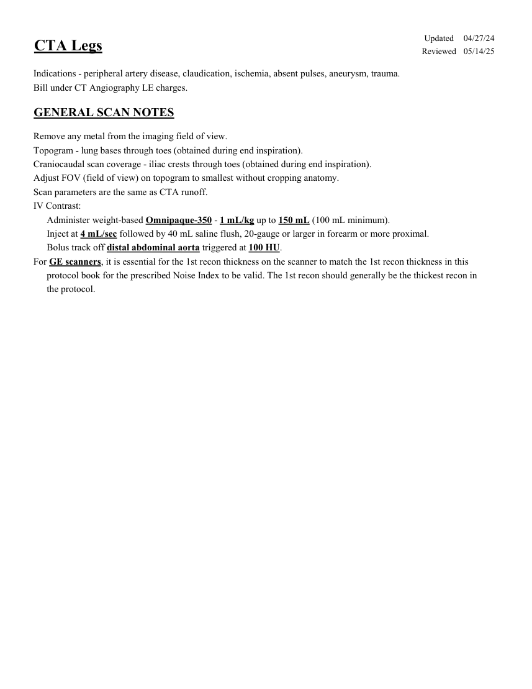
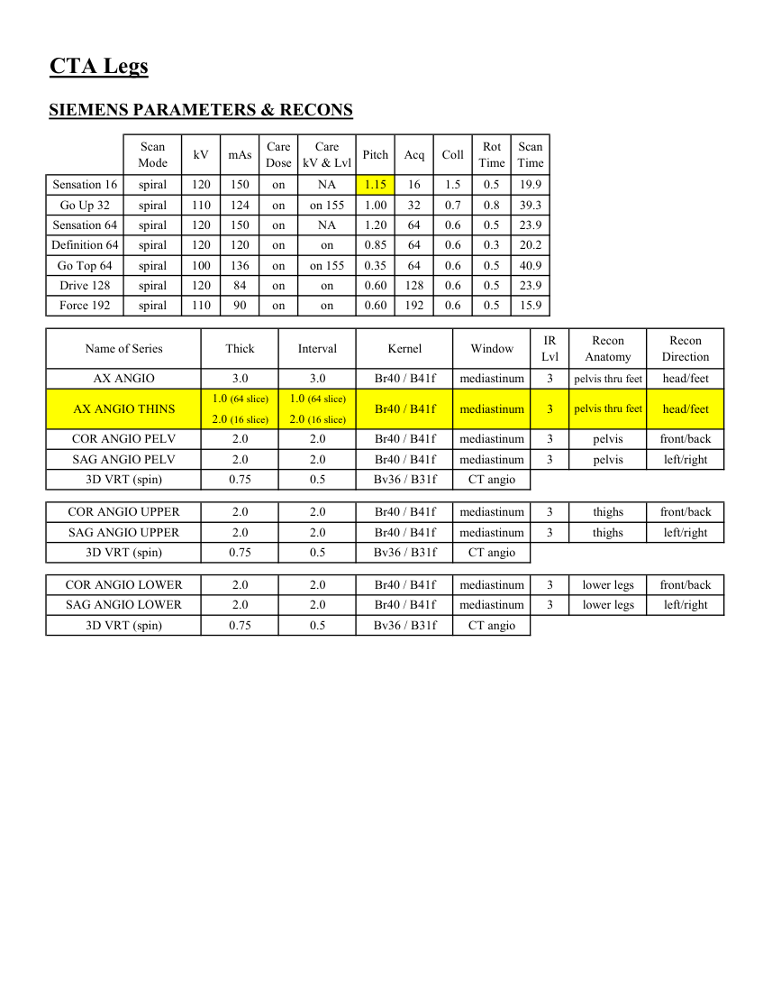
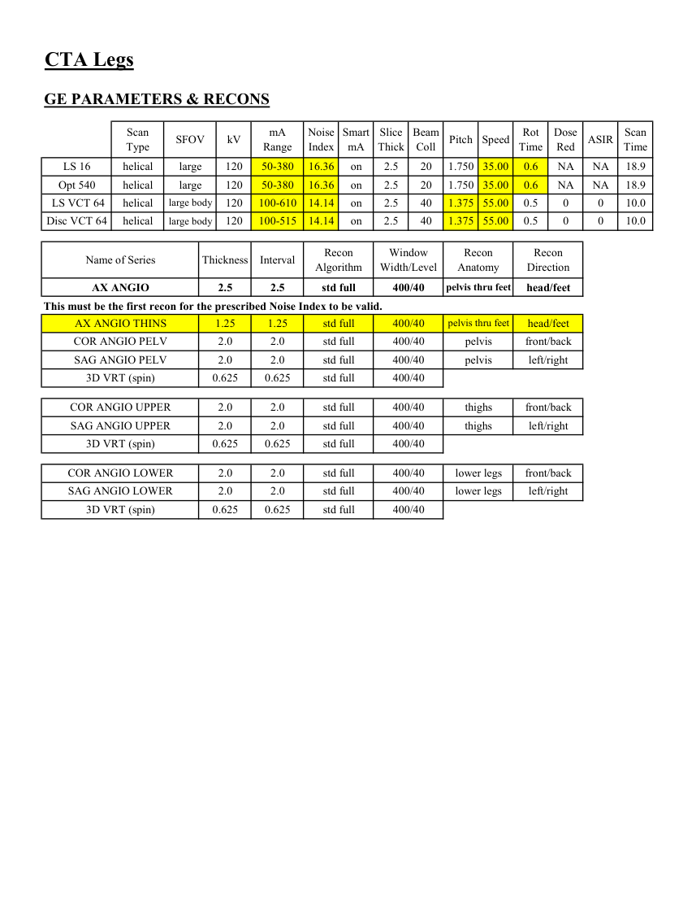
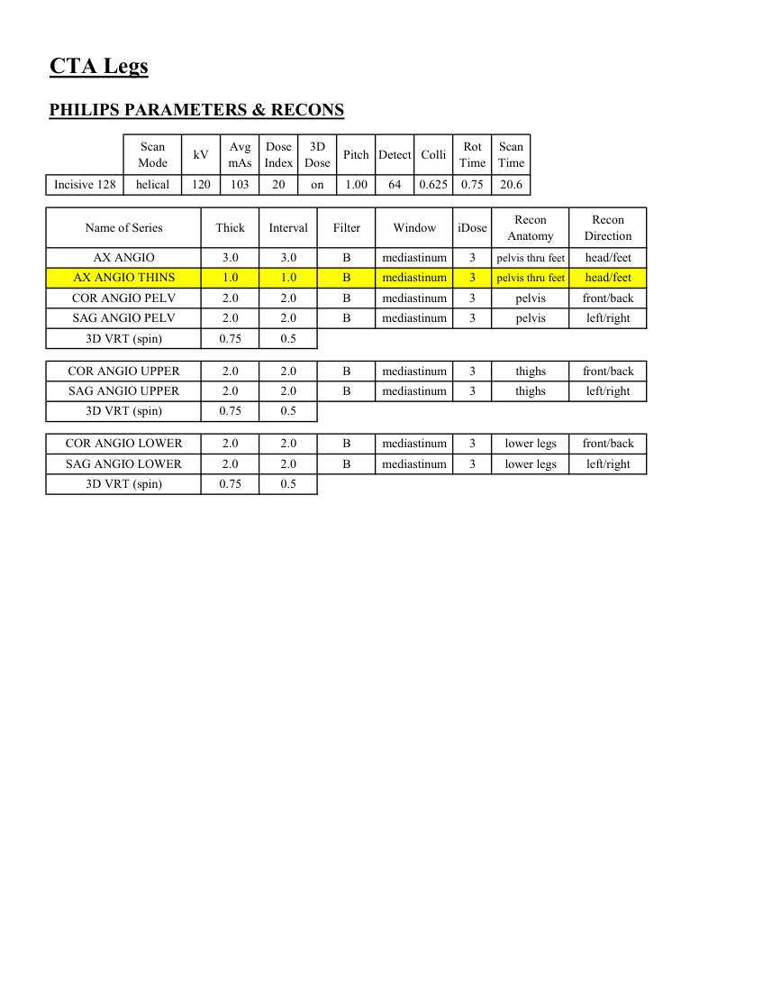

# CT — Angio-CT membre inferioare (MCB)

## Documentul original MCB — Angio-CT membre inferioare

**Protocol · 4 pagini · consultat la 2026-09-27.**

[Descarcă PDF-ul integral](../../assets/mcb-modalities/ct-angio-ct-membre-inferioare-mcb/document.pdf) · [Sursa MCB](https://ref.mcbradiology.com/Protocols,%20Policies,%20Worksheets%20&%20Forms/CT/Protocols/Vascular/9%20CTA%20Legs.pdf) · [Catalogul MCB pentru această modalitate](../mcb/index.md)

Instrucțiunile, valorile și ilustrațiile din documentul original sunt păstrate în **engleză**. Titlul și navigarea sunt în română.

### Pagina 1

{ loading=lazy }

### Pagina 2

{ loading=lazy }

### Pagina 3

{ loading=lazy }

### Pagina 4

{ loading=lazy }

## Textul documentului original

??? abstract "Pagina 1 — text în engleză"

    
Updated
    04/27/24
    CTA Legs
    Reviewed
    05/14/25
    Indications - peripheral artery disease, claudication, ischemia, absent pulses, aneurysm, trauma.
    Bill under CT Angiography LE charges.
    GENERAL SCAN NOTES
    Remove any metal from the imaging field of view.
    Topogram - lung bases through toes (obtained during end inspiration).
    Craniocaudal scan coverage - iliac crests through toes (obtained during end inspiration).
    Adjust FOV (field of view) on topogram to smallest without cropping anatomy.
    Scan parameters are the same as CTA runoff.
    IV Contrast:
    Administer weight-based Omnipaque-350 - 1 mL/kg up to 150 mL (100 mL minimum).
    Inject at 4 mL/sec followed by 40 mL saline flush, 20-gauge or larger in forearm or more proximal.
    Bolus track off distal abdominal aorta triggered at 100 HU. 
    For GE scanners, it is essential for the 1st recon thickness on the scanner to match the 1st recon thickness in this
    protocol book for the prescribed Noise Index to be valid. The 1st recon should generally be the thickest recon in 
    the protocol.
    

??? abstract "Pagina 2 — text în engleză"

    
CTA Legs
    SIEMENS PARAMETERS &amp; RECONS
    Scan                           
    Care                                          
    Scan                 
    Mode
    kV
    mAs
    Care                            
    Dose
    kV &amp; Lvl
    Pitch
    Acq
    Coll
    Rot 
    Time
    Time
    Sensation 16
    spiral
    120
    150
    on
    NA
    1.15
    16
    1.5
    0.5
    19.9
    Go Up 32
    spiral
    110
    124
    on
    on 155
    1.00
    32
    0.7
    0.8
    39.3
    Sensation 64
    spiral
    120
    150
    on
    NA
    1.20
    64
    0.6
    0.5
    23.9
    Definition 64
    spiral
    120
    120
    on
    on
    0.85
    64
    0.6
    0.3
    20.2
    Go Top 64
    spiral
    100
    136
    on
    on 155
    0.35
    64
    0.6
    0.5
    40.9
    Drive 128
    spiral
    120
    84
    on
    on
    0.60
    128
    0.6
    0.5
    23.9
    Force 192
    spiral
    110
    90
    on
    on
    0.60
    192
    0.6
    0.5
    15.9
    IR                       
    Recon                   
    Recon                     
    Thick
    Name of Series
    Kernel
    Window
    Interval
    Lvl
    Anatomy
    Direction
    AX ANGIO
    Br40 / B41f
    mediastinum
    3
    pelvis thru feet
    head/feet
    3.0
    3.0
    1.0 (64 slice)
    1.0 (64 slice)
    AX ANGIO THINS
    Br40 / B41f
    mediastinum
    3
    pelvis thru feet
    head/feet
    2.0 (16 slice)
    2.0 (16 slice)
    COR ANGIO PELV
    Br40 / B41f
    mediastinum
    3
    pelvis
    front/back
    2.0
    2.0
    SAG ANGIO PELV
    Br40 / B41f
    mediastinum
    3
    2.0
    2.0
    pelvis
    left/right
    3D VRT (spin)
    Bv36 / B31f
    CT angio
    0.75
    0.5
    COR ANGIO UPPER
    Br40 / B41f
    mediastinum
    3
    2.0
    2.0
    thighs
    front/back
    SAG ANGIO UPPER
    Br40 / B41f
    mediastinum
    3
    thighs
    left/right
    2.0
    2.0
    3D VRT (spin)
    Bv36 / B31f
    CT angio
    0.75
    0.5
    COR ANGIO LOWER
    Br40 / B41f
    mediastinum
    3
    lower legs
    front/back
    2.0
    2.0
    SAG ANGIO LOWER
    Br40 / B41f
    mediastinum
    2.0
    2.0
    3
    lower legs
    left/right
    3D VRT (spin)
    Bv36 / B31f
    CT angio
    0.75
    0.5
    

??? abstract "Pagina 3 — text în engleză"

    
CTA Legs
    GE PARAMETERS &amp; RECONS
    Scan               
    Smart             
    Slice                       
    Beam                                 
    Dose                                          
    Type
    SFOV
    kV
    mA                          
    Range
    Noise                    
    Index
    Speed
    Rot                                
    mA
    Thick
    Coll
    Pitch
    Time
    Red
    ASIR
    Scan                 
    Time
    LS 16
    helical
    large
    120
    50-380
    16.36
    on
    2.5
    0.6
    NA
    NA
    18.9
    20
    1.750 35.00
    Opt 540
    helical
    large
    120
    50-380
    16.36
    on
    2.5
    20
    1.750 35.00
    0.6
    NA
    NA
    18.9
     LS VCT 64
    helical
    large body
    120
    100-610
    14.14
    on
    2.5
    0
    10.0
    40
    1.375 55.00
    0.5
    0
    40
    1.375 55.00
    0.5
    0
    0
    Disc VCT 64
    helical
    large body
    120
    100-515
    14.14
    on
    2.5
    10.0
    Window                                   
    Recon                      
    Recon 
    Name of Series
    Thickness
    Interval
    Recon                                     
    Algorithm
    Width/Level
    Anatomy
    Direction
    AX ANGIO
    2.5
    2.5
    std full
    400/40
    pelvis thru feet
    head/feet
    This must be the first recon for the prescribed Noise Index to be valid.
    AX ANGIO THINS
    1.25
    1.25
    std full
    400/40
    pelvis thru feet
    head/feet
    COR ANGIO PELV
    2.0
    2.0
    std full
    400/40
    pelvis
    front/back
    SAG ANGIO PELV
    2.0
    2.0
    std full
    400/40
    pelvis
    left/right
    3D VRT (spin)
    0.625
    0.625
    std full
    400/40
    COR ANGIO UPPER
    2.0
    2.0
    std full
    400/40
    thighs
    front/back
    SAG ANGIO UPPER
    2.0
    2.0
    std full
    400/40
    thighs
    left/right
    3D VRT (spin)
    0.625
    0.625
    std full
    400/40
    400/40
    COR ANGIO LOWER
    2.0
    2.0
    std full
    lower legs
    front/back
    SAG ANGIO LOWER
    lower legs
    left/right
    2.0
    2.0
    std full
    400/40
    3D VRT (spin)
    0.625
    0.625
    std full
    400/40
    

??? abstract "Pagina 4 — text în engleză"

    
CTA Legs
    PHILIPS PARAMETERS &amp; RECONS
    Scan                           
    Dose                                          
    3D            
    Scan                 
    Mode
    kV
    Avg                      
    mAs
    Index
    Dose
    Pitch Detect Colli
    Rot 
    Time
    Time
    Incisive 128
    helical
    120
    103
    20
    on
    1.00
    64
    0.625
    0.75
    20.6
    Recon                     
    Name of Series
    Thick
    Interval
    Filter
    Window
    iDose
    Recon                   
    Anatomy
    Direction
    AX ANGIO
    3.0
    3.0
    B
    mediastinum
    3
    pelvis thru feet
    head/feet
    AX ANGIO THINS
    1.0
    1.0
    B
    mediastinum
    3
    pelvis thru feet
    head/feet
    COR ANGIO PELV
    2.0
    2.0
    B
    mediastinum
    3
    pelvis
    front/back
    SAG ANGIO PELV
    2.0
    2.0
    B
    mediastinum
    3
    pelvis
    left/right
    3D VRT (spin)
    0.75
    0.5
    COR ANGIO UPPER
    2.0
    2.0
    B
    mediastinum
    3
    thighs
    front/back
    SAG ANGIO UPPER
    2.0
    2.0
    B
    mediastinum
    3
    thighs
    left/right
    3D VRT (spin)
    0.75
    0.5
    COR ANGIO LOWER
    2.0
    2.0
    B
    mediastinum
    3
    lower legs
    front/back
    SAG ANGIO LOWER
    2.0
    2.0
    B
    mediastinum
    3
    lower legs
    left/right
    3D VRT (spin)
    0.75
    0.5
    

