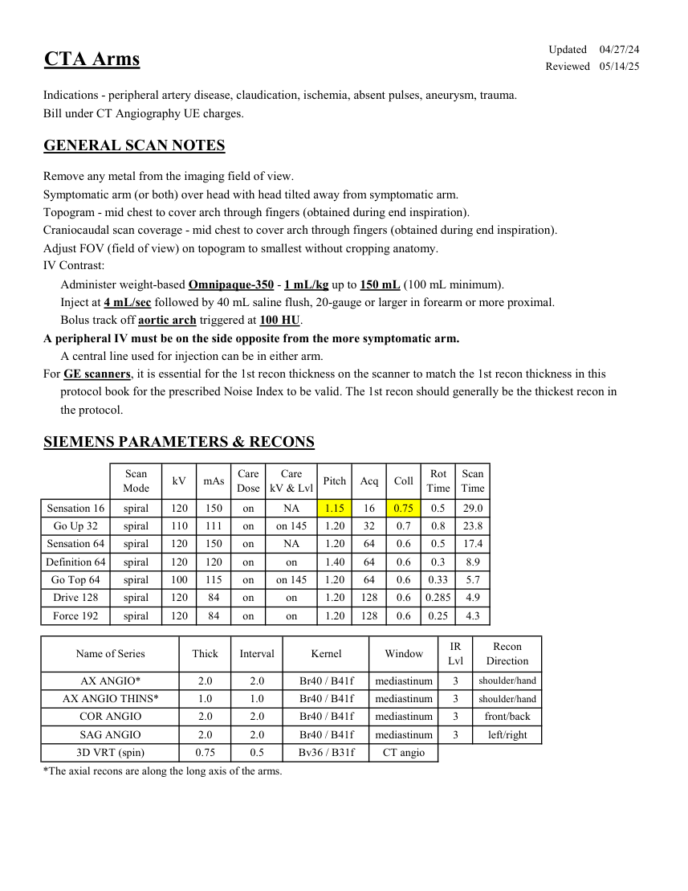
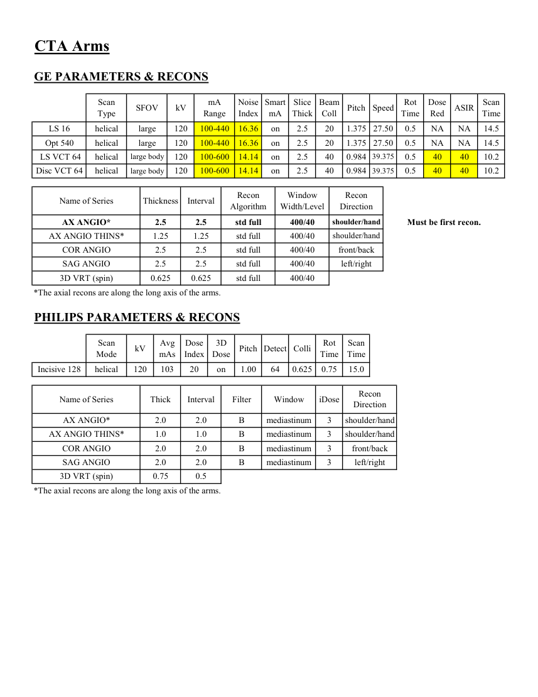

# CT — Angio-CT membre superioare (MCB)

## Documentul original MCB — Angio-CT membre superioare

**Protocol · 2 pagini · consultat la 2026-09-27.**

[Descarcă PDF-ul integral](../../assets/mcb-modalities/ct-angio-ct-membre-superioare-mcb/document.pdf) · [Sursa MCB](https://ref.mcbradiology.com/Protocols,%20Policies,%20Worksheets%20&%20Forms/CT/Protocols/Vascular/11%20CTA%20Arms.pdf) · [Catalogul MCB pentru această modalitate](../mcb/index.md)

Instrucțiunile, valorile și ilustrațiile din documentul original sunt păstrate în **engleză**. Titlul și navigarea sunt în română.

### Pagina 1

{ loading=lazy }

### Pagina 2

{ loading=lazy }

## Textul documentului original

??? abstract "Pagina 1 — text în engleză"

    
Updated
    04/27/24
    CTA Arms
    Reviewed
    05/14/25
    Indications - peripheral artery disease, claudication, ischemia, absent pulses, aneurysm, trauma.
    Bill under CT Angiography UE charges.
    GENERAL SCAN NOTES
    Remove any metal from the imaging field of view.
    Symptomatic arm (or both) over head with head tilted away from symptomatic arm.
    Topogram - mid chest to cover arch through fingers (obtained during end inspiration).
    Craniocaudal scan coverage - mid chest to cover arch through fingers (obtained during end inspiration).
    Adjust FOV (field of view) on topogram to smallest without cropping anatomy.
    IV Contrast:
    Administer weight-based Omnipaque-350 - 1 mL/kg up to 150 mL (100 mL minimum).
    Inject at 4 mL/sec followed by 40 mL saline flush, 20-gauge or larger in forearm or more proximal.
    Bolus track off aortic arch triggered at 100 HU. 
    A peripheral IV must be on the side opposite from the more symptomatic arm. 
    A central line used for injection can be in either arm.
    For GE scanners, it is essential for the 1st recon thickness on the scanner to match the 1st recon thickness in this
    protocol book for the prescribed Noise Index to be valid. The 1st recon should generally be the thickest recon in 
    the protocol.
    SIEMENS PARAMETERS &amp; RECONS
    Scan                           
    Care                                          
    Scan                 
    Coll
    Rot 
    Mode
    kV
    mAs
    Care                            
    Dose
    Pitch
    Acq
    kV &amp; Lvl
    Time
    Time
    Sensation 16
    NA
    spiral
    120
    150
    on
    1.15
    16
    0.75
    0.5
    29.0
    Go Up 32
    32
    0.7
    0.8
    23.8
    spiral
    110
    111
    on
    1.20
    on 145
    Sensation 64
    spiral
    120
    150
    on
    NA
    1.20
    64
    0.6
    0.5
    17.4
    Definition 64
    spiral
    120
    120
    on
    on
    1.40
    64
    0.6
    0.3
    8.9
    Go Top 64
    spiral
    100
    115
    on
    on 145
    1.20
    64
    0.6
    0.33
    5.7
    Drive 128
    spiral
    120
    84
    on
    on
    1.20
    128
    0.6
    0.285
    4.9
    Force 192
    spiral
    120
    84
    on
    on
    1.20
    128
    0.6
    0.25
    4.3
    IR                       
    Name of Series
    Thick
    Interval
    Window
    Recon                     
    Kernel
    Lvl
    Direction
    shoulder/hand
    AX ANGIO*
    2.0
    2.0
    mediastinum
    Br40 / B41f
    3
    AX ANGIO THINS*
    1.0
    1.0
    mediastinum
    shoulder/hand
    Br40 / B41f
    3
    COR ANGIO
    2.0
    2.0
    mediastinum
    front/back
    Br40 / B41f
    3
    SAG ANGIO
    2.0
    2.0
    mediastinum
    Br40 / B41f
    3
    left/right
    3D VRT (spin)
    0.75
    0.5
    CT angio
    Bv36 / B31f
    *The axial recons are along the long axis of the arms.
    

??? abstract "Pagina 2 — text în engleză"

    
CTA Arms
    GE PARAMETERS &amp; RECONS
    Scan               
    Smart             
    Slice                       
    Beam                                 
    Dose                                          
    Speed
    Rot                                
    Type
    SFOV
    kV
    mA                          
    Range
    Noise                    
    Index
    mA
    Thick
    Coll
    Pitch
    Time
    Red
    ASIR
    Scan                 
    Time
    LS 16
    helical
    large
    120
    100-440
    NA
    14.5
    20
    16.36
    on
    2.5
    0.5
    NA
    1.375 27.50
    on
    2.5
    20
    1.375 27.50
    0.5
    Opt 540
    helical
    large
    120
    100-440
    16.36
    NA
    NA
    14.5
     LS VCT 64
    helical
    large body
    120
    100-600
    14.14
    on
    2.5
    40
    10.2
    40
    0.984 39.375
    0.5
    40
    Disc VCT 64
    helical
    large body
    120
    100-600
    14.14
    on
    2.5
    10.2
    40
    0.984 39.375
    0.5
    40
    40
    Window                                   
    Recon 
    Name of Series
    Thickness
    Interval
    Recon                                     
    Algorithm
    Width/Level
    Direction
    AX ANGIO*
    2.5
    2.5
    std full
    400/40
    shoulder/hand
    Must be first recon.
    AX ANGIO THINS*
    1.25
    1.25
    std full
    400/40
    shoulder/hand
    COR ANGIO
    2.5
    2.5
    std full
    400/40
    front/back
    SAG ANGIO
    2.5
    2.5
    std full
    400/40
    left/right
    3D VRT (spin)
    0.625
    0.625
    std full
    400/40
    *The axial recons are along the long axis of the arms.
    PHILIPS PARAMETERS &amp; RECONS
    Scan                           
    Dose                                          
    3D            
    Scan                 
    Colli
    Rot 
    Mode
    kV
    Avg                      
    mAs
    Index
    Dose
    Pitch Detect
    Time
    Time
    Incisive 128
    helical
    120
    103
    20
    on
    1.00
    64
    0.625
    0.75
    15.0
    Name of Series
    Thick
    Interval
    Filter
    Window
    iDose
    Recon                     
    Direction
    AX ANGIO*
    2.0
    2.0
    B
    mediastinum
    3
    shoulder/hand
    AX ANGIO THINS*
    1.0
    1.0
    B
    mediastinum
    3
    shoulder/hand
    COR ANGIO
    2.0
    2.0
    B
    mediastinum
    3
    front/back
    SAG ANGIO
    2.0
    2.0
    B
    mediastinum
    3
    left/right
    3D VRT (spin)
    0.75
    0.5
    *The axial recons are along the long axis of the arms.
    

