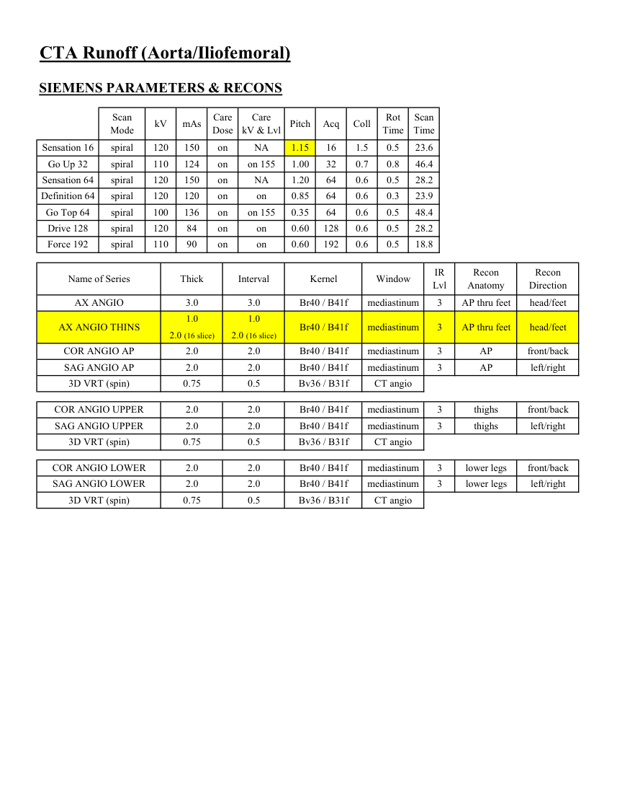
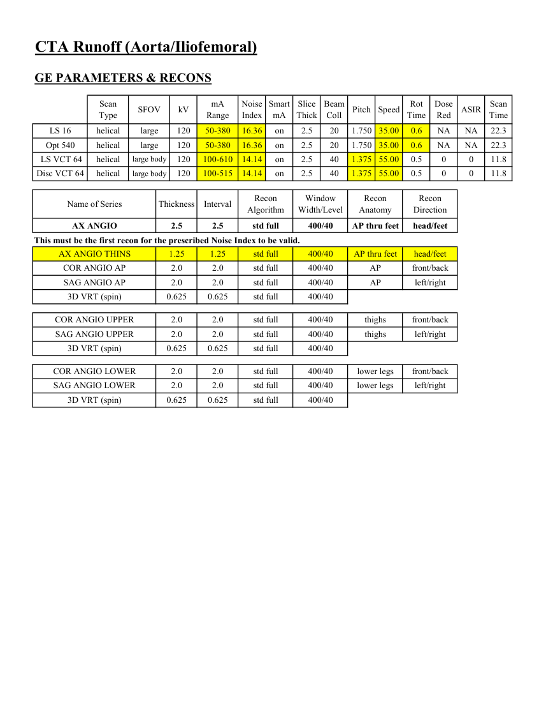
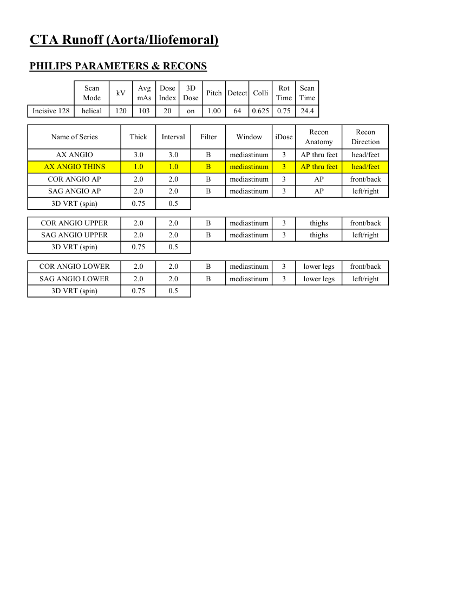

# CT — Angiografie runoff (MCB)

## Documentul original MCB — Angiografie runoff

**Protocol · 4 pagini · consultat la 2026-09-27.**

[Descarcă PDF-ul integral](../../assets/mcb-modalities/ct-angiografie-runoff-mcb/document.pdf) · [Sursa MCB](https://ref.mcbradiology.com/Protocols,%20Policies,%20Worksheets%20&%20Forms/CT/Protocols/Vascular/8%20Runoff.pdf) · [Catalogul MCB pentru această modalitate](../mcb/index.md)

Instrucțiunile, valorile și ilustrațiile din documentul original sunt păstrate în **engleză**. Titlul și navigarea sunt în română.

### Pagina 1

{ loading=lazy }

### Pagina 2

{ loading=lazy }

### Pagina 3

{ loading=lazy }

### Pagina 4

{ loading=lazy }

## Textul documentului original

??? abstract "Pagina 1 — text în engleză"

    
Updated
    04/27/24
    CTA Runoff (Aorta/Iliofemoral)
    Reviewed
    05/14/25
    Indications - peripheral artery disease, claudication, ischemia, absent pulses, aneurysm, trauma.
    Bill under CT Angiography Abd Aorta + Iliofemoral charge.
    GENERAL SCAN NOTES
    Move the patient&#x27;s arms over his/her head if possible. Remove any metal from the imaging field of view.
    Topogram - lung bases through toes (obtained during end inspiration).
    Craniocaudal scan coverage - lung bases through toes (obtained during end inspiration).
    Adjust FOV (field of view) on topogram to smallest without cropping anatomy.
    IV Contrast:
    Administer weight-based Omnipaque-350 - 1 mL/kg up to 150 mL (100 mL minimum).
    Inject at 4 mL/sec followed by 40 mL saline flush, 20-gauge or larger in forearm or more proximal.
    Bolus track off proximal abdominal aorta triggered at 100 HU. 
    Oral Contrast: generally not given for this protocol.
    For GE scanners, it is essential for the 1st recon thickness on the scanner to match the 1st recon thickness in this
    protocol book for the prescribed Noise Index to be valid. The 1st recon should generally be the thickest recon in 
    the protocol.
    

??? abstract "Pagina 2 — text în engleză"

    
CTA Runoff (Aorta/Iliofemoral)
    SIEMENS PARAMETERS &amp; RECONS
    Scan                           
    Care                                          
    Scan                 
    Mode
    kV
    mAs
    Care                            
    Dose
    Pitch
    Acq
    Coll
    Rot 
    kV &amp; Lvl
    Time
    Time
    Sensation 16
    spiral
    120
    150
    on
    1.15
    16
    1.5
    0.5
    23.6
    NA
    Go Up 32
    spiral
    110
    124
    on
    on 155
    1.00
    32
    0.7
    0.8
    46.4
    Sensation 64
    spiral
    120
    150
    on
    NA
    1.20
    64
    0.6
    0.5
    28.2
    Definition 64
    spiral
    120
    120
    on
    0.85
    64
    0.6
    on
    0.3
    23.9
    Go Top 64
    spiral
    100
    136
    on
    0.35
    64
    0.6
    0.5
    on 155
    48.4
    Drive 128
    spiral
    120
    84
    on
    0.60
    128
    0.6
    0.5
    28.2
    on
    Force 192
    spiral
    110
    90
    on
    0.60
    192
    0.6
    0.5
    18.8
    on
    IR                       
    Recon                     
    Name of Series
    Window
    Recon                   
    Thick
    Interval
    Kernel
    Lvl
    Anatomy
    Direction
    AX ANGIO
    3.0
    3.0
    Br40 / B41f
    mediastinum
    3
    AP thru feet
    head/feet
    1.0
    1.0
    AP thru feet
    head/feet
    AX ANGIO THINS
    Br40 / B41f
    mediastinum
    3
    2.0 (16 slice)
    2.0 (16 slice)
    COR ANGIO AP
    mediastinum
    AP
    front/back
    2.0
    2.0
    3
    Br40 / B41f
    SAG ANGIO AP
    left/right
    2.0
    2.0
    mediastinum
    AP
    3
    Br40 / B41f
    3D VRT (spin)
    CT angio
    0.75
    0.5
    Bv36 / B31f
    COR ANGIO UPPER
    mediastinum
    thighs
    2.0
    2.0
    Br40 / B41f
    3
    front/back
    SAG ANGIO UPPER
    mediastinum
    thighs
    left/right
    2.0
    2.0
    Br40 / B41f
    3
    3D VRT (spin)
    CT angio
    0.75
    0.5
    Bv36 / B31f
    COR ANGIO LOWER
    mediastinum
    lower legs
    2.0
    2.0
    Br40 / B41f
    3
    front/back
    SAG ANGIO LOWER
    mediastinum
    2.0
    2.0
    Br40 / B41f
    3
    lower legs
    left/right
    3D VRT (spin)
    CT angio
    0.75
    0.5
    Bv36 / B31f
    

??? abstract "Pagina 3 — text în engleză"

    
CTA Runoff (Aorta/Iliofemoral)
    GE PARAMETERS &amp; RECONS
    Scan               
    Smart             
    Slice                       
    Beam                                 
    Dose                                          
    Speed
    Rot                                
    ASIR
    Scan                 
    Type
    SFOV
    kV
    mA                          
    Range
    Noise                    
    Index
    mA
    Thick
    Coll
    Pitch
    Time
    Red
    Time
    LS 16
    helical
    large
    120
    50-380
    16.36
    on
    2.5
    20
    1.750 35.00
    0.6
    NA
    NA
    22.3
    Opt 540
    helical
    large
    120
    50-380
    16.36
    on
    2.5
    20
    1.750 35.00
    0.6
    NA
    NA
    22.3
     LS VCT 64
    helical
    large body
    120
    100-610
    14.14
    on
    2.5
    40
    1.375 55.00
    0.5
    0
    0
    11.8
    Disc VCT 64
    helical
    large body
    120
    100-515
    14.14
    on
    2.5
    40
    1.375 55.00
    0.5
    0
    0
    11.8
    Window                                   
    Recon                      
    Recon 
    Name of Series
    Thickness
    Interval
    Recon                                     
    Algorithm
    Width/Level
    Anatomy
    Direction
    AX ANGIO
    2.5
    2.5
    std full
    400/40
    AP thru feet
    head/feet
    This must be the first recon for the prescribed Noise Index to be valid.
    AX ANGIO THINS
    1.25
    1.25
    std full
    400/40
    AP thru feet
    head/feet
    COR ANGIO AP
    2.0
    2.0
    std full
    400/40
    AP
    front/back
    SAG ANGIO AP
    2.0
    2.0
    std full
    400/40
    AP
    left/right
    3D VRT (spin)
    0.625
    0.625
    std full
    400/40
    COR ANGIO UPPER
    2.0
    2.0
    std full
    400/40
    thighs
    front/back
    SAG ANGIO UPPER
    2.0
    2.0
    std full
    400/40
    thighs
    left/right
    3D VRT (spin)
    0.625
    0.625
    std full
    400/40
    COR ANGIO LOWER
    2.0
    2.0
    std full
    400/40
    lower legs
    front/back
    SAG ANGIO LOWER
    2.0
    2.0
    std full
    400/40
    lower legs
    left/right
    3D VRT (spin)
    0.625
    0.625
    std full
    400/40
    

??? abstract "Pagina 4 — text în engleză"

    
CTA Runoff (Aorta/Iliofemoral)
    PHILIPS PARAMETERS &amp; RECONS
    Scan                           
    Dose                                          
    3D            
    Scan                 
    Mode
    kV
    Avg                      
    mAs
    Index
    Dose
    Pitch Detect Colli
    Rot 
    Time
    Time
    Incisive 128
    helical
    120
    103
    20
    on
    1.00
    64
    0.625
    0.75
    24.4
    Recon                     
    Name of Series
    Thick
    Interval
    Filter
    Window
    iDose
    Recon                   
    Anatomy
    Direction
    AX ANGIO
    3.0
    3.0
    mediastinum
    B
    3
    head/feet
    AP thru feet
    AX ANGIO THINS
    1.0
    1.0
    B
    mediastinum
    3
    AP thru feet
    head/feet
    COR ANGIO AP
    2.0
    2.0
    mediastinum
    3
    AP
    front/back
    B
    SAG ANGIO AP
    2.0
    2.0
    mediastinum
    3
    B
    AP
    left/right
    3D VRT (spin)
    0.75
    0.5
    COR ANGIO UPPER
    2.0
    2.0
    B
    3
    mediastinum
    thighs
    front/back
    SAG ANGIO UPPER
    2.0
    2.0
    B
    mediastinum
    thighs
    left/right
    3
    3D VRT (spin)
    0.75
    0.5
    COR ANGIO LOWER
    2.0
    2.0
    mediastinum
    3
    lower legs
    front/back
    B
    SAG ANGIO LOWER
    2.0
    2.0
    mediastinum
    B
    3
    lower legs
    left/right
    3D VRT (spin)
    0.75
    0.5
    

