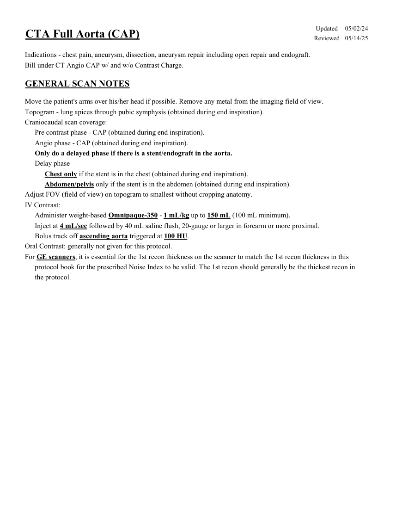
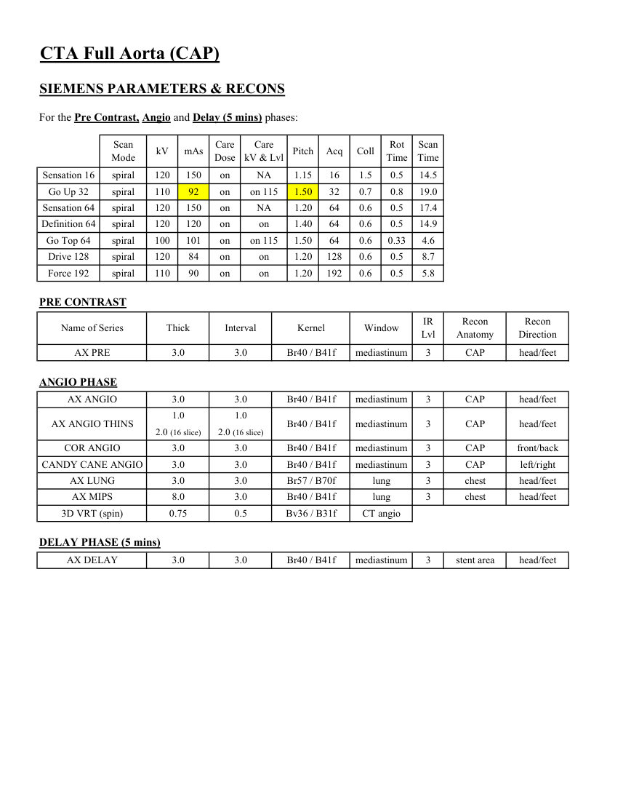
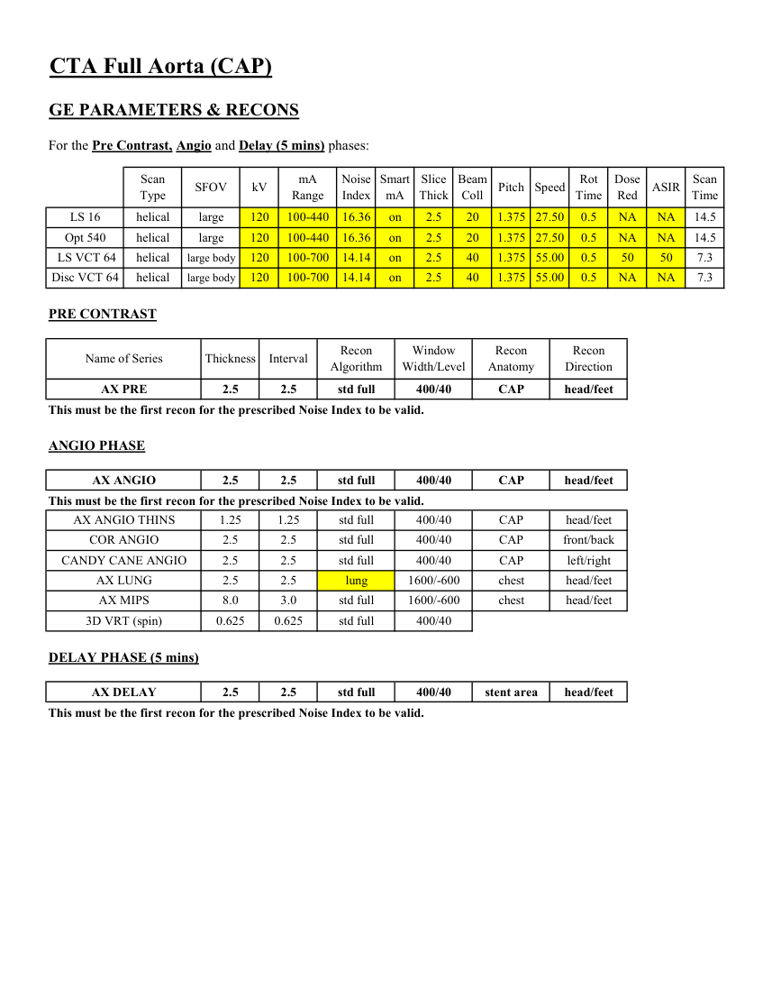
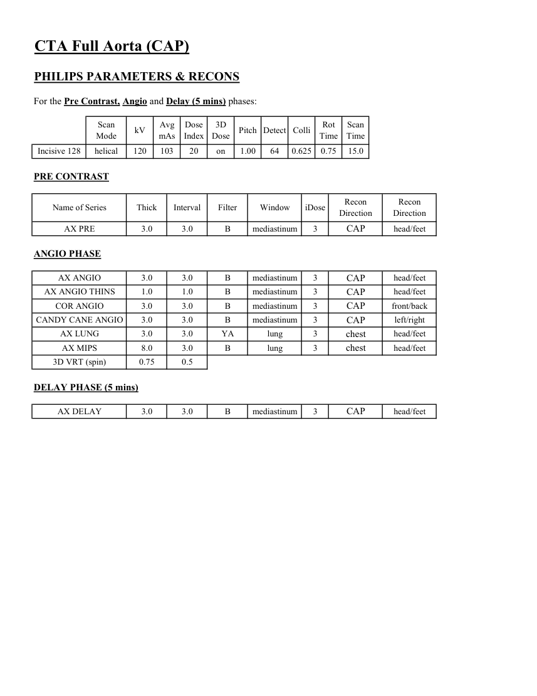

# CT — Aortă completă (torace, abdomen și pelvis) (MCB)

## Documentul original MCB — Aortă completă (torace, abdomen și pelvis)

**Protocol · 4 pagini · consultat la 2026-09-27.**

[Descarcă PDF-ul integral](../../assets/mcb-modalities/ct-aorta-completa-torace-abdomen-si-pelvis-mcb/document.pdf) · [Sursa MCB](https://ref.mcbradiology.com/Protocols,%20Policies,%20Worksheets%20&%20Forms/CT/Protocols/Vascular/1%20Aorta%20Full%20%28CAP%29.pdf) · [Catalogul MCB pentru această modalitate](../mcb/index.md)

Instrucțiunile, valorile și ilustrațiile din documentul original sunt păstrate în **engleză**. Titlul și navigarea sunt în română.

### Pagina 1

{ loading=lazy }

### Pagina 2

{ loading=lazy }

### Pagina 3

{ loading=lazy }

### Pagina 4

{ loading=lazy }

## Textul documentului original

??? abstract "Pagina 1 — text în engleză"

    
Updated
    05/02/24
    CTA Full Aorta (CAP)
    Reviewed
    05/14/25
    Indications - chest pain, aneurysm, dissection, aneurysm repair including open repair and endograft.
    Bill under CT Angio CAP w/ and w/o Contrast Charge.
    GENERAL SCAN NOTES
    Move the patient&#x27;s arms over his/her head if possible. Remove any metal from the imaging field of view.
    Topogram - lung apices through pubic symphysis (obtained during end inspiration).
    Craniocaudal scan coverage:
    Pre contrast phase - CAP (obtained during end inspiration).
    Angio phase - CAP (obtained during end inspiration).
    Only do a delayed phase if there is a stent/endograft in the aorta.
    Delay phase
    Chest only if the stent is in the chest (obtained during end inspiration).
    Abdomen/pelvis only if the stent is in the abdomen (obtained during end inspiration).
    Adjust FOV (field of view) on topogram to smallest without cropping anatomy.
    IV Contrast:
    Administer weight-based Omnipaque-350 - 1 mL/kg up to 150 mL (100 mL minimum).
    Inject at 4 mL/sec followed by 40 mL saline flush, 20-gauge or larger in forearm or more proximal.
    Bolus track off ascending aorta triggered at 100 HU. 
    Oral Contrast: generally not given for this protocol.
    For GE scanners, it is essential for the 1st recon thickness on the scanner to match the 1st recon thickness in this
    protocol book for the prescribed Noise Index to be valid. The 1st recon should generally be the thickest recon in 
    the protocol.
    

??? abstract "Pagina 2 — text în engleză"

    
CTA Full Aorta (CAP)
    SIEMENS PARAMETERS &amp; RECONS
    For the Pre Contrast, Angio and Delay (5 mins) phases:
    Scan                           
    Care                                          
    Rot 
    Scan                 
    kV
    mAs
    Care                            
    Mode
    Dose
    Pitch
    Acq
    kV &amp; Lvl
    Coll
    Time
    Time
    Sensation 16
    spiral
    120
    150
    on
    1.15
    16
    14.5
    NA
    1.5
    0.5
    Go Up 32
    spiral
    92
    on
    1.50
    32
    0.7
    110
    on 115
    0.8
    19.0
    Sensation 64
    spiral
    120
    150
    on
    NA
    1.20
    64
    0.6
    0.5
    17.4
    Definition 64
    spiral
    120
    120
    on
    1.40
    64
    0.6
    0.5
    14.9
    on
    Go Top 64
    spiral
    100
    101
    on
    1.50
    64
    on 115
    0.6
    0.33
    4.6
    Drive 128
    spiral
    120
    84
    on
    1.20
    on
    0.6
    0.5
    128
    8.7
    Force 192
    spiral
    110
    90
    on
    1.20
    192
    0.6
    on
    0.5
    5.8
    PRE CONTRAST
    Recon                    
    Recon             
    Name of Series
    Thick
    Interval
    Kernel
    IR                       
    Window
    Lvl
    Anatomy
    Direction
    AX PRE
    mediastinum
    CAP
    head/feet
    3.0
    3.0
    Br40 / B41f
    3
    ANGIO PHASE
    head/feet
    AX ANGIO
    mediastinum
    CAP
    3.0
    3.0
    Br40 / B41f
    3
    1.0
    1.0
    AX ANGIO THINS
    Br40 / B41f
    mediastinum
    3
    CAP
    head/feet
    2.0 (16 slice)
    2.0 (16 slice)
    COR ANGIO
    mediastinum
    3.0
    3.0
    Br40 / B41f
    3
    CAP
    front/back
    CANDY CANE ANGIO
    3.0
    3.0
    Br40 / B41f
    mediastinum
    3
    left/right
    CAP
    AX LUNG
    lung
    chest
    head/feet
    3.0
    3.0
    Br57 / B70f
    3
    AX MIPS
    8.0
    3.0
    lung
    Br40 / B41f
    chest
    head/feet
    3
    3D VRT (spin)
    0.75
    0.5
    Bv36 / B31f
    CT angio
    DELAY PHASE (5 mins)
    AX DELAY
    3.0
    3.0
    Br40 / B41f
    mediastinum
    3
    stent area
    head/feet
    

??? abstract "Pagina 3 — text în engleză"

    
CTA Full Aorta (CAP)
    GE PARAMETERS &amp; RECONS
    For the Pre Contrast, Angio and Delay (5 mins) phases:
    Scan               
    Smart             
    Slice                       
    Beam                                 
    Rot                                
    Dose                                          
    Scan                 
    Speed
    Type
    SFOV
    kV
    mA                          
    Range
    Noise                    
    Index
    mA
    Thick
    Coll
    Pitch
    Time
    Red
    ASIR
    Time
    14.5
    1.375 27.50
    LS 16
    helical
    large
    120
    100-440
    16.36
    on
    2.5
    20
    0.5
    NA
    NA
    Opt 540
    helical
    large
    120
    100-440
    16.36
    NA
    14.5
    on
    2.5
    20
    1.375 27.50
    0.5
    NA
    1.375 55.00
    0.5
    50
    50
    7.3
     LS VCT 64
    helical
    large body
    120
    100-700
    14.14
    on
    2.5
    40
    1.375 55.00
    0.5
    NA
    NA
    7.3
    Disc VCT 64
    helical
    large body
    120
    100-700
    14.14
    on
    2.5
    40
    PRE CONTRAST
    Window                                   
    Recon              
    Recon 
    Name of Series
    Thickness
    Interval
    Recon                                     
    Algorithm
    Width/Level
    Anatomy
    Direction
    AX PRE
    2.5
    2.5
    std full
    400/40
    CAP
    head/feet
    This must be the first recon for the prescribed Noise Index to be valid.
    ANGIO PHASE
    AX ANGIO
    2.5
    2.5
    std full
    400/40
    CAP
    head/feet
    This must be the first recon for the prescribed Noise Index to be valid.
    AX ANGIO THINS
    1.25
    1.25
    std full
    400/40
    CAP
    head/feet
    COR ANGIO
    2.5
    2.5
    std full
    400/40
    CAP
    front/back
    CANDY CANE ANGIO
    2.5
    2.5
    std full
    400/40
    CAP
    left/right
    AX LUNG
    2.5
    2.5
    lung
    1600/-600
    chest
    head/feet
    AX MIPS
    8.0
    3.0
    std full
    1600/-600
    chest
    head/feet
    3D VRT (spin)
    0.625
    0.625
    std full
    400/40
    DELAY PHASE (5 mins)
    AX DELAY
    2.5
    2.5
    std full
    400/40
    stent area
    head/feet
    This must be the first recon for the prescribed Noise Index to be valid.
    

??? abstract "Pagina 4 — text în engleză"

    
CTA Full Aorta (CAP)
    PHILIPS PARAMETERS &amp; RECONS
    For the Pre Contrast, Angio and Delay (5 mins) phases:
    Scan                           
    Dose                                          
    3D            
    Scan                 
    Mode
    kV
    Avg                      
    mAs
    Index
    Dose
    Pitch Detect Colli
    Rot 
    Time
    Time
    Incisive 128
    helical
    120
    103
    20
    on
    1.00
    64
    0.625
    0.75
    15.0
    PRE CONTRAST
    Name of Series
    Thick
    Interval
    Recon                     
    Filter
    Window
    iDose
    Recon                     
    Direction
    Direction
    AX PRE
    3.0
    3.0
    B
    mediastinum
    3
    head/feet
    CAP
    ANGIO PHASE
    AX ANGIO
    3.0
    3.0
    B
    mediastinum
    3
    head/feet
    AX ANGIO THINS
    1.0
    1.0
    mediastinum
    3
    B
    head/feet
    CAP
    CAP
    COR ANGIO
    3.0
    3.0
    B
    mediastinum
    3
    front/back
    CANDY CANE ANGIO
    3.0
    3.0
    B
    mediastinum
    3
    left/right
    CAP
    CAP
    AX LUNG
    3.0
    3.0
    YA
    lung
    3
    head/feet
    chest
    AX MIPS
    8.0
    3.0
    B
    lung
    3
    head/feet
    chest
    3D VRT (spin)
    0.75
    0.5
    DELAY PHASE (5 mins)
    AX DELAY
    3.0
    3.0
    B
    head/feet
    mediastinum
    3
    CAP
    

