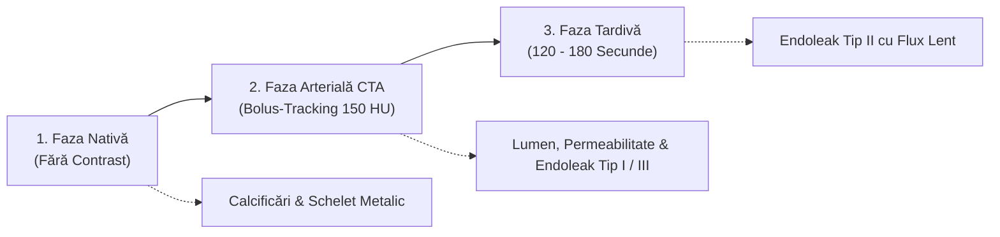

# Protocol CT Supraveghere Endoproteză Aortică (EVAR / TEVAR Trifazic)

Protocol de angiografie tomografică computerizată multifazică dedicat supravegherii post-operatorii a pacienților purtători de endoproteze aortice abdominale (**EVAR**) sau toracice (**TEVAR**), elaborat de **Medical Imaging Associates (MIA Radiology)**.

  

    🩸 MONITORIZARE VASCULARĂ &bull; SUPRAVEGHERE EVAR / TEVAR
  

  

    Detectarea la timp a scurgerilor perigrefon (<em>endoleaks</em>) și prevenirea rupturii tardive de anevrism necesită o explorare strict <strong>trifazică</strong>: scanarea nativă este urmată de faza arterială de mare viteză și obligatoriu de <strong>faza tardivă (120 – 180 secunde)</strong>, singura capabilă să decelaze endoleak-urile cu flux lent de Tip II.
  

  <a href="https://miaradmodalitywiki.powerappsportals.com/CT-Aorta-with-Endograft" target="_blank" rel="noopener" style="font-weight: 600; color: #6ee7b7; text-decoration: none;">
    Consultați specificațiile originale MIA CTA Aorta Endograft ➔
  </a>

---

## 1. Justificare Clinică & Ghid IRIS

- **Indicație:** Control periodic după reparare endovasculară de anevrism aortic la 1 lună, 6 luni, 12 luni și ulterior anual dacă sacul este stabil; suspiciune de endoleak, creștere a sacului anevrismal sau ischemie acută de membru inferior.
- **Grad de Recomandare:** **Grad A** (standardul de aur în ghidurile internaționale ESVS și SVS).
- **Clasă de Doză:** **Clasa 3** (Doză medie, 3 - 10 mSv).

---

## 2. Protocol de Injectare & Faze de Achiziție

| Parametru | Specificație Tehnică |
|:----------|:---------------------|
| **Cateter IV** | 18G în vena antecubitală |
| **Agent Contrast** | Substanță iodată non-ionică 350 – 370 mg I/mL |
| **Volum & Debit** | 100 – 120 mL la un debit de **4.0 mL/s** |
| **Saline Chaser** | 40 – 50 mL ser fiziologic la 4.0 mL/s |
| **Declanșare Arterială** | Bolus-tracking în aorta proximală deasupra endoprotezei la prag de **150 HU** |
| **Faza Tardivă** | Întârziere fixă de **120 – 180 secunde** post-injectare |

---

## 3. Protocolul Celor Trei Faze de Scanare

1. **Faza Nativă:** Deasupra trunchiului celiac până la bifurcația femurală. Distinge calcificările parietale preexistente și densitățile spontane de contrastul extravazat în sac.
2. **Faza Arterială:** Vizualizează lumenul vascular, permeabilitatea arterelor renale și a arterelor iliace interne/externe. Evidențiază endoleak-urile cu debit crescut la nivelul manșetelor de etanșare (Tip I) sau defecte de conexiune structurală între componente (Tip III).
3. **Faza Tardivă (120-180s):** Re-scanare centrată pe sacul anevrismal. Detectează acumularea progresivă a contrastului din vasele colaterale retrograd patente (artere lombare, artera mezenterică inferioară) caracteristică endoleak-ului de Tip II.

---

## 4. Clasificarea Radiologică a Endoleak-urilor

| Tip Endoleak | Mecanism Fiziopatologic | Comportament Imagistic CT | Atitudine Terapeutică |
|:-------------|:------------------------|:--------------------------|:----------------------|
| **Tip I** | Defect de etanșare la zona de fixare proximală (IA) sau distală (IB) | Opacifiere imediată în faza arterială în contact direct cu manșeta endoprotezei | **Urgență chirurgicală / endovasculară** (risc mare de ruptură) |
| **Tip II** | Flux retrograd în sac din ramuri colaterale (artere lombare, artera mezenterică inferioară) | Frecvent absent sau discret în faza arterială; **apariție netă în faza tardivă (120-180s)** | Supraveghere; embolizare dacă sacul anevrismal crește $\ge 5$ mm |
| **Tip III** | Defecțiune structurală: deconectare a componentelor modulare (IIIA) sau ruptură de grefă (IIIB) | Jet arterial masiv în sacul anevrismal în faza arterială | **Urgență de reintervenție** prin plasare de manșon suplimentar |
| **Tip IV** | Porozitate tranzitorie a materialului textil al grefei | Încărcare difuză în primele 30 zile postoperator, dispare spontan | Rezoluție spontană post-anticoagulare |
| **Tip V** | Endotensiune (creștere a presiunii și a sacului fără evidențierea unei scurgeri de contrast) | Sac în creștere fără jet decelabil | Monitorizare atentă / conversie chirurgicală |
