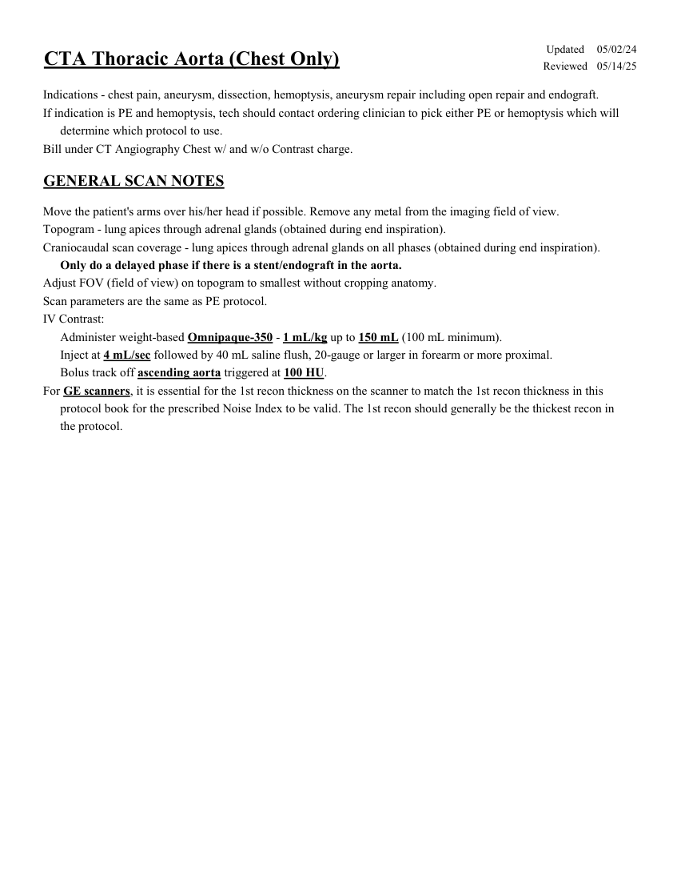
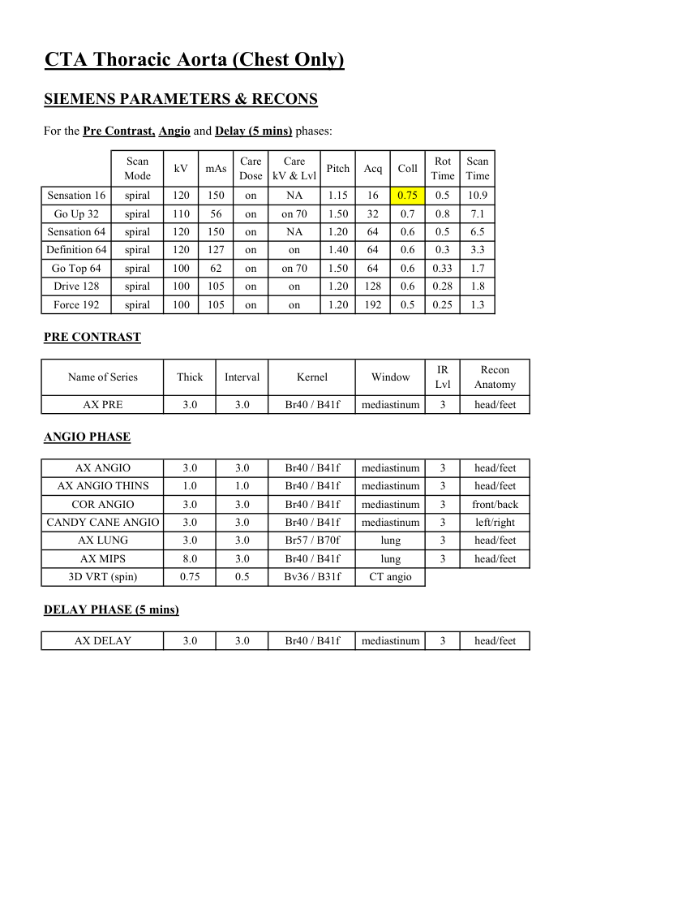
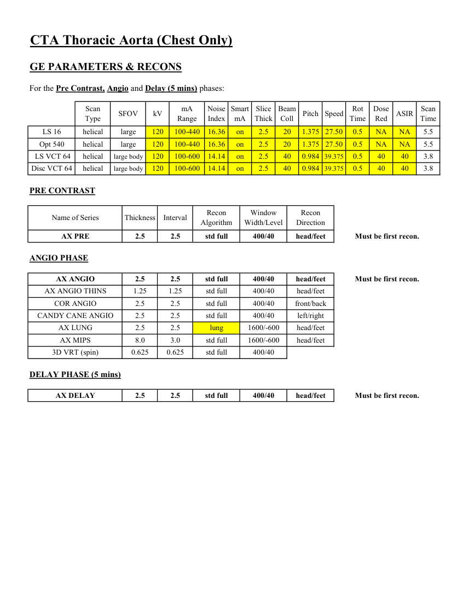
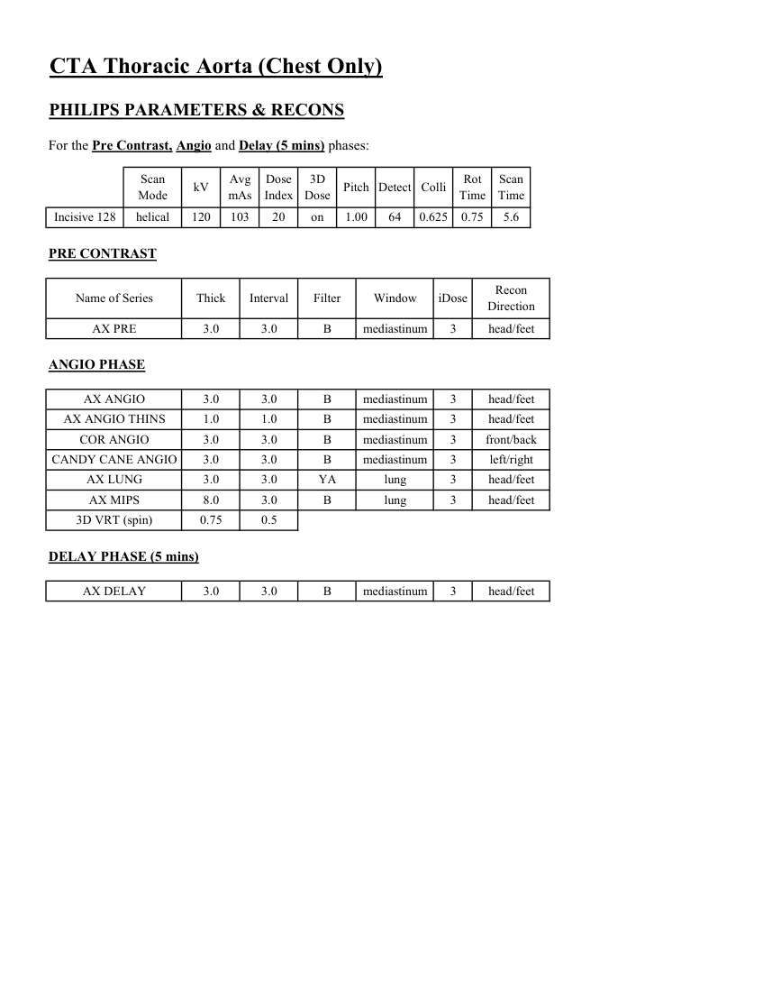

# CT — Aortă toracică (MCB)

## Documentul original MCB — Aortă toracică

**Protocol · 4 pagini · consultat la 2026-09-27.**

[Descarcă PDF-ul integral](../../assets/mcb-modalities/ct-aorta-toracica-mcb/document.pdf) · [Sursa MCB](https://ref.mcbradiology.com/Protocols,%20Policies,%20Worksheets%20&%20Forms/CT/Protocols/Vascular/2%20Aorta%20Thoracic.pdf) · [Catalogul MCB pentru această modalitate](../mcb/index.md)

Instrucțiunile, valorile și ilustrațiile din documentul original sunt păstrate în **engleză**. Titlul și navigarea sunt în română.

### Pagina 1

{ loading=lazy }

### Pagina 2

{ loading=lazy }

### Pagina 3

{ loading=lazy }

### Pagina 4

{ loading=lazy }

## Textul documentului original

??? abstract "Pagina 1 — text în engleză"

    
Updated
    05/02/24
    CTA Thoracic Aorta (Chest Only)
    Reviewed
    05/14/25
    Indications - chest pain, aneurysm, dissection, hemoptysis, aneurysm repair including open repair and endograft.
    If indication is PE and hemoptysis, tech should contact ordering clinician to pick either PE or hemoptysis which will
    determine which protocol to use.
    Bill under CT Angiography Chest w/ and w/o Contrast charge.
    GENERAL SCAN NOTES
    Move the patient&#x27;s arms over his/her head if possible. Remove any metal from the imaging field of view.
    Topogram - lung apices through adrenal glands (obtained during end inspiration).
    Craniocaudal scan coverage - lung apices through adrenal glands on all phases (obtained during end inspiration).
    Only do a delayed phase if there is a stent/endograft in the aorta.
    Adjust FOV (field of view) on topogram to smallest without cropping anatomy.
    Scan parameters are the same as PE protocol.
    IV Contrast:
    Administer weight-based Omnipaque-350 - 1 mL/kg up to 150 mL (100 mL minimum).
    Inject at 4 mL/sec followed by 40 mL saline flush, 20-gauge or larger in forearm or more proximal.
    Bolus track off ascending aorta triggered at 100 HU. 
    For GE scanners, it is essential for the 1st recon thickness on the scanner to match the 1st recon thickness in this
    protocol book for the prescribed Noise Index to be valid. The 1st recon should generally be the thickest recon in 
    the protocol.
    

??? abstract "Pagina 2 — text în engleză"

    
CTA Thoracic Aorta (Chest Only)
    SIEMENS PARAMETERS &amp; RECONS
    For the Pre Contrast, Angio and Delay (5 mins) phases:
    Scan                           
    Care                                          
    Rot 
    Scan                 
    Mode
    kV
    mAs
    Care                            
    Dose
    kV &amp; Lvl
    Pitch
    Acq
    Coll
    Time
    Time
    Sensation 16
    spiral
    120
    150
    on
    NA
    1.15
    16
    0.75
    0.5
    10.9
    Go Up 32
    spiral
    110
    56
    on
    on 70
    1.50
    32
    0.7
    0.8
    7.1
    Sensation 64
    spiral
    120
    150
    on
    NA
    1.20
    64
    0.6
    0.5
    6.5
    Definition 64
    spiral
    120
    127
    on
    on
    1.40
    64
    0.6
    0.3
    3.3
    Go Top 64
    spiral
    100
    62
    on
    on 70
    1.50
    64
    0.6
    0.33
    1.7
    Drive 128
    spiral
    100
    105
    on
    on
    1.20
    128
    0.6
    0.28
    1.8
    Force 192
    spiral
    100
    105
    on
    on
    1.20
    192
    0.5
    0.25
    1.3
    PRE CONTRAST
    IR                       
    Recon             
    Name of Series
    Thick
    Interval
    Window
    Kernel
    Lvl
    Anatomy
    AX PRE
    3.0
    3.0
    mediastinum
    head/feet
    Br40 / B41f
    3
    ANGIO PHASE
    AX ANGIO
    3.0
    3.0
    mediastinum
    head/feet
    Br40 / B41f
    3
    AX ANGIO THINS
    1.0
    1.0
    head/feet
    Br40 / B41f
    mediastinum
    3
    COR ANGIO
    3.0
    3.0
    Br40 / B41f
    mediastinum
    3
    front/back
    CANDY CANE ANGIO
    3.0
    3.0
    mediastinum
    left/right
    Br40 / B41f
    3
    AX LUNG
    3.0
    3.0
    lung
    head/feet
    Br57 / B70f
    3
    AX MIPS
    8.0
    3.0
    lung
    head/feet
    3
    Br40 / B41f
    3D VRT (spin)
    0.75
    0.5
    CT angio
    Bv36 / B31f
    DELAY PHASE (5 mins)
    AX DELAY
    3.0
    3.0
    mediastinum
    head/feet
    3
    Br40 / B41f
    

??? abstract "Pagina 3 — text în engleză"

    
CTA Thoracic Aorta (Chest Only)
    GE PARAMETERS &amp; RECONS
    For the Pre Contrast, Angio and Delay (5 mins) phases:
    Scan               
    Smart             
    Slice                       
    Beam                                 
    Dose                                          
    Pitch
    Speed
    Rot                                
    Type
    SFOV
    kV
    mA                          
    Range
    Noise                    
    Index
    mA
    Thick
    Coll
    Time
    Red
    ASIR
    Scan                 
    Time
    LS 16
    helical
    large
    120
    100-440
    16.36
    on
    2.5
    20
    1.375 27.50
    0.5
    NA
    NA
    5.5
    Opt 540
    helical
    large
    120
    100-440
    16.36
    on
    2.5
    20
    1.375 27.50
    0.5
    NA
    NA
    5.5
     LS VCT 64
    helical
    large body
    120
    100-600
    14.14
    on
    2.5
    40
    0.984 39.375
    0.5
    40
    40
    3.8
    Disc VCT 64
    helical
    large body
    120
    100-600
    14.14
    on
    2.5
    40
    0.984 39.375
    0.5
    40
    40
    3.8
    PRE CONTRAST
    Window                                   
    Recon 
    Name of Series
    Thickness
    Interval
    Recon                                     
    Algorithm
    Width/Level
    Direction
    AX PRE
    2.5
    2.5
    std full
    400/40
    head/feet
    Must be first recon.
    ANGIO PHASE
    AX ANGIO
    2.5
    2.5
    std full
    400/40
    head/feet
    Must be first recon.
    AX ANGIO THINS
    1.25
    1.25
    std full
    400/40
    head/feet
    COR ANGIO
    2.5
    2.5
    std full
    400/40
    front/back
    CANDY CANE ANGIO
    2.5
    2.5
    std full
    400/40
    left/right
    AX LUNG
    2.5
    2.5
    lung
    1600/-600
    head/feet
    AX MIPS
    8.0
    3.0
    std full
    1600/-600
    head/feet
    3D VRT (spin)
    0.625
    0.625
    std full
    400/40
    DELAY PHASE (5 mins)
    AX DELAY
    2.5
    2.5
    std full
    400/40
    Must be first recon.
    head/feet
    

??? abstract "Pagina 4 — text în engleză"

    
CTA Thoracic Aorta (Chest Only)
    PHILIPS PARAMETERS &amp; RECONS
    For the Pre Contrast, Angio and Delay (5 mins) phases:
    Scan                           
    Dose                                          
    3D            
    Scan                 
    Mode
    kV
    Avg                      
    mAs
    Index
    Dose
    Pitch Detect Colli
    Rot 
    Time
    Time
    Incisive 128
    helical
    120
    103
    20
    on
    1.00
    64
    0.625
    5.6
    0.75
    PRE CONTRAST
    Name of Series
    Thick
    Interval
    Filter
    Window
    iDose
    Recon                     
    Direction
    AX PRE
    3.0
    3.0
    B
    mediastinum
    3
    head/feet
    ANGIO PHASE
    AX ANGIO
    3.0
    3.0
    B
    mediastinum
    3
    head/feet
    AX ANGIO THINS
    1.0
    1.0
    B
    mediastinum
    3
    head/feet
    COR ANGIO
    3.0
    3.0
    B
    mediastinum
    3
    front/back
    CANDY CANE ANGIO
    3.0
    3.0
    B
    mediastinum
    3
    left/right
    AX LUNG
    3.0
    3.0
    YA
    lung
    3
    head/feet
    AX MIPS
    8.0
    3.0
    B
    lung
    3
    head/feet
    3D VRT (spin)
    0.75
    0.5
    DELAY PHASE (5 mins)
    AX DELAY
    3.0
    3.0
    B
    mediastinum
    3
    head/feet
    

