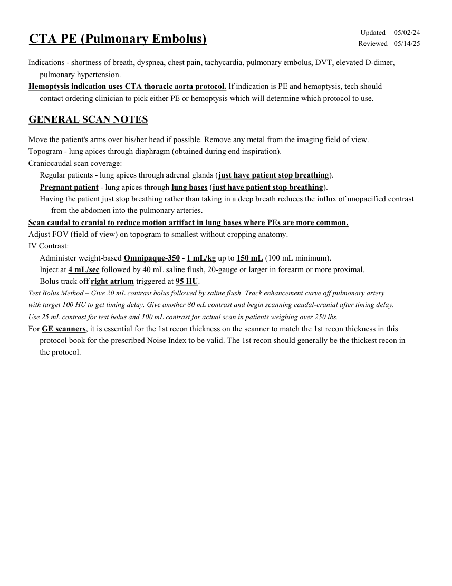
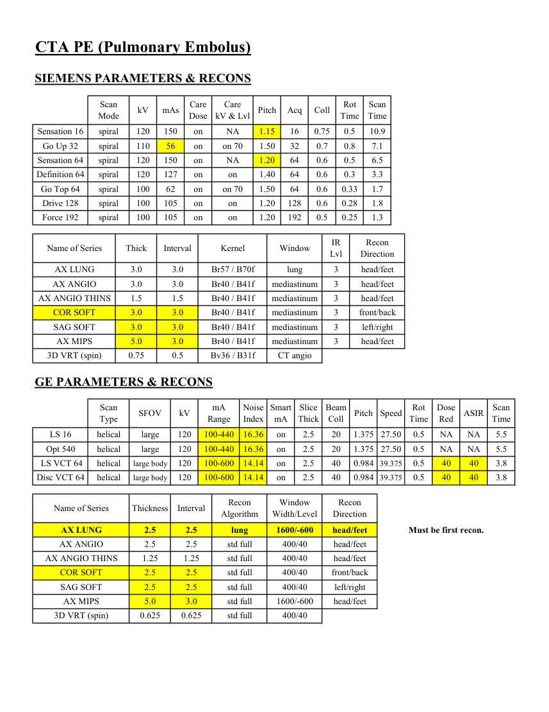
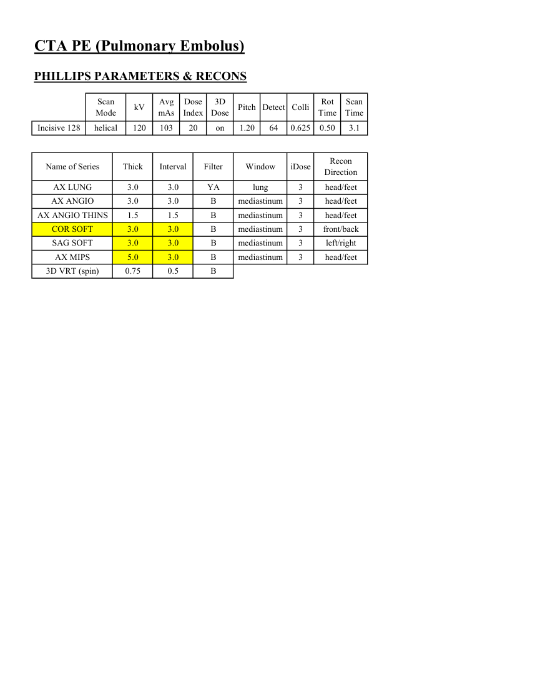

# CT — Embolie pulmonară (MCB)

## Documentul original MCB — Embolie pulmonară

**Protocol · 3 pagini · consultat la 2026-09-27.**

[Descarcă PDF-ul integral](../../assets/mcb-modalities/ct-embolie-pulmonara-mcb/document.pdf) · [Sursa MCB](https://ref.mcbradiology.com/Protocols,%20Policies,%20Worksheets%20&%20Forms/CT/Protocols/Vascular/4%20PE.pdf) · [Catalogul MCB pentru această modalitate](../mcb/index.md)

Instrucțiunile, valorile și ilustrațiile din documentul original sunt păstrate în **engleză**. Titlul și navigarea sunt în română.

### Pagina 1

{ loading=lazy }

### Pagina 2

{ loading=lazy }

### Pagina 3

{ loading=lazy }

## Textul documentului original

??? abstract "Pagina 1 — text în engleză"

    
Updated
    05/02/24
    CTA PE (Pulmonary Embolus)
    Reviewed
    05/14/25
    Indications - shortness of breath, dyspnea, chest pain, tachycardia, pulmonary embolus, DVT, elevated D-dimer, 
    pulmonary hypertension.
    Hemoptysis indication uses CTA thoracic aorta protocol. If indication is PE and hemoptysis, tech should 
    contact ordering clinician to pick either PE or hemoptysis which will determine which protocol to use.
    GENERAL SCAN NOTES
    Move the patient&#x27;s arms over his/her head if possible. Remove any metal from the imaging field of view.
    Topogram - lung apices through diaphragm (obtained during end inspiration).
    Craniocaudal scan coverage:
    Regular patients - lung apices through adrenal glands (just have patient stop breathing).
    Pregnant patient - lung apices through lung bases (just have patient stop breathing).
    Having the patient just stop breathing rather than taking in a deep breath reduces the influx of unopacified contrast
    from the abdomen into the pulmonary arteries.
    Scan caudal to cranial to reduce motion artifact in lung bases where PEs are more common.
    Adjust FOV (field of view) on topogram to smallest without cropping anatomy.
    IV Contrast:
    Administer weight-based Omnipaque-350 - 1 mL/kg up to 150 mL (100 mL minimum).
    Inject at 4 mL/sec followed by 40 mL saline flush, 20-gauge or larger in forearm or more proximal.
    Bolus track off right atrium triggered at 95 HU. 
    Test Bolus Method – Give 20 mL contrast bolus followed by saline flush. Track enhancement curve off pulmonary artery 
    with target 100 HU to get timing delay. Give another 80 mL contrast and begin scanning caudal-cranial after timing delay. 
    Use 25 mL contrast for test bolus and 100 mL contrast for actual scan in patients weighing over 250 lbs.
    For GE scanners, it is essential for the 1st recon thickness on the scanner to match the 1st recon thickness in this
    protocol book for the prescribed Noise Index to be valid. The 1st recon should generally be the thickest recon in 
    the protocol.
    

??? abstract "Pagina 2 — text în engleză"

    
CTA PE (Pulmonary Embolus)
    SIEMENS PARAMETERS &amp; RECONS
    Scan                           
    Care                                          
    Rot 
    Scan                 
    Mode
    kV
    mAs
    Care                            
    Dose
    Pitch
    Acq
    Coll
    kV &amp; Lvl
    Time
    Time
    Sensation 16
    spiral
    120
    150
    on
    1.15
    16
    0.75
    0.5
    NA
    10.9
    Go Up 32
    spiral
    110
    56
    on
    on 70
    1.50
    32
    0.7
    0.8
    7.1
    Sensation 64
    spiral
    120
    150
    on
    1.20
    64
    0.6
    NA
    0.5
    6.5
    Definition 64
    spiral
    120
    127
    on
    1.40
    64
    0.6
    on
    0.3
    3.3
    Go Top 64
    spiral
    100
    62
    on
    1.50
    64
    0.6
    0.33
    on 70
    1.7
    Drive 128
    spiral
    100
    105
    on
    1.20
    128
    0.6
    0.28
    on
    1.8
    Force 192
    spiral
    100
    105
    on
    1.20
    192
    0.5
    on
    0.25
    1.3
    Recon                     
    Name of Series
    Thick
    Interval
    Kernel
    Window
    IR                       
    Lvl
    Direction
    AX LUNG
    3.0
    3.0
    Br57 / B70f
    lung
    3
    head/feet
    AX ANGIO
    3.0
    3.0
    Br40 / B41f
    mediastinum
    3
    head/feet
    AX ANGIO THINS
    1.5
    1.5
    Br40 / B41f
    mediastinum
    3
    head/feet
    COR SOFT
    3.0
    3.0
    Br40 / B41f
    mediastinum
    3
    front/back
    SAG SOFT
    3.0
    3.0
    Br40 / B41f
    mediastinum
    3
    left/right
    AX MIPS
    5.0
    3.0
    Br40 / B41f
    mediastinum
    3
    head/feet
    3D VRT (spin)
    0.75
    0.5
    Bv36 / B31f
    CT angio
    GE PARAMETERS &amp; RECONS
    Scan               
    Smart             
    Slice                       
    Beam                                 
    Rot                                
    Dose                                          
    ASIR
    Scan                 
    Type
    SFOV
    kV
    mA                          
    Range
    Noise                    
    Index
    mA
    Thick
    Coll
    Pitch
    Speed
    Time
    Red
    Time
    NA
    LS 16
    helical
    large
    120
    100-440
    16.36
    on
    2.5
    20
    1.375 27.50
    0.5
    NA
    5.5
    Opt 540
    helical
    120
    2.5
    20
    large
    100-440
    16.36
    on
    1.375 27.50
    0.5
    NA
    NA
    5.5
     LS VCT 64
    helical
    large body
    120
    100-600
    14.14
    on
    2.5
    40
    0.984 39.375
    0.5
    40
    40
    3.8
    Disc VCT 64
    helical
    large body
    120
    100-600
    14.14
    on
    2.5
    40
    0.984 39.375
    0.5
    40
    40
    3.8
    Window                                   
    Recon 
    Name of Series
    Thickness
    Interval
    Recon                                     
    Algorithm
    Width/Level
    Direction
    AX LUNG
    2.5
    2.5
    lung
    1600/-600
    head/feet
    Must be first recon.
    AX ANGIO
    2.5
    2.5
    std full
    head/feet
    400/40
    AX ANGIO THINS
    1.25
    1.25
    std full
    400/40
    head/feet
    COR SOFT
    2.5
    2.5
    std full
    400/40
    front/back
    SAG SOFT
    2.5
    2.5
    std full
    400/40
    left/right
    AX MIPS
    5.0
    3.0
    std full
    1600/-600
    head/feet
    3D VRT (spin)
    0.625
    0.625
    std full
    400/40
    

??? abstract "Pagina 3 — text în engleză"

    
CTA PE (Pulmonary Embolus)
    PHILLIPS PARAMETERS &amp; RECONS
    Scan                           
    Dose                                          
    3D            
    Rot 
    Scan                 
    Colli
    Mode
    kV
    Avg                      
    mAs
    Index
    Dose
    Detect
    Pitch
    Time
    Time
    Incisive 128
    helical
    120
    103
    3.1
    20
    on
    64
    1.20
    0.50
    0.625
    Name of Series
    Thick
    Interval
    Filter
    Window
    iDose
    Recon                     
    Direction
    AX LUNG
    3.0
    3.0
    YA
    lung
    3
    head/feet
    AX ANGIO
    3.0
    3.0
    B
    mediastinum
    3
    head/feet
    AX ANGIO THINS
    1.5
    1.5
    B
    mediastinum
    3
    head/feet
    COR SOFT
    3.0
    3.0
    B
    mediastinum
    3
    front/back
    SAG SOFT
    3.0
    3.0
    B
    mediastinum
    3
    left/right
    AX MIPS
    5.0
    3.0
    B
    mediastinum
    3
    head/feet
    3D VRT (spin)
    0.75
    0.5
    B
    

