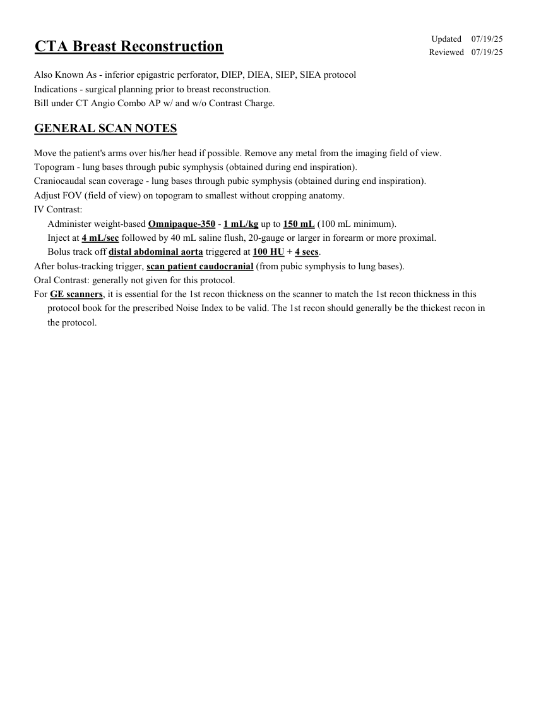
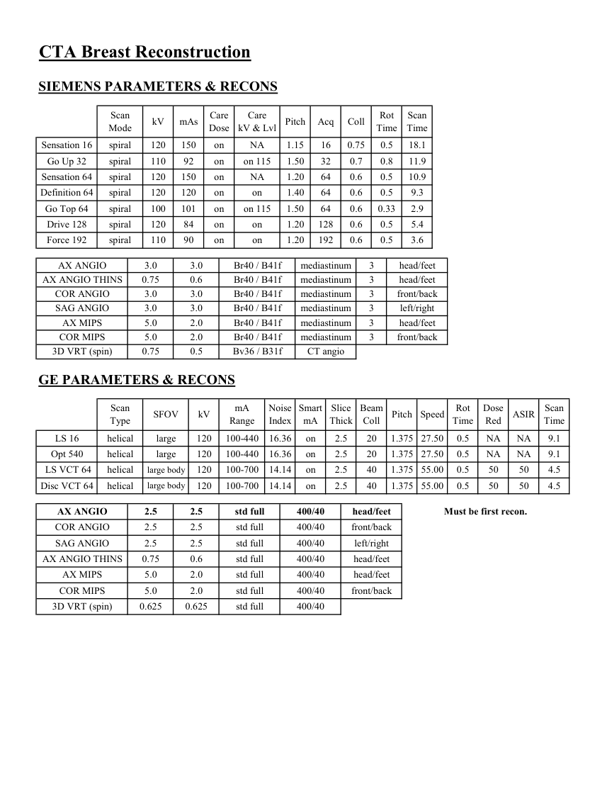
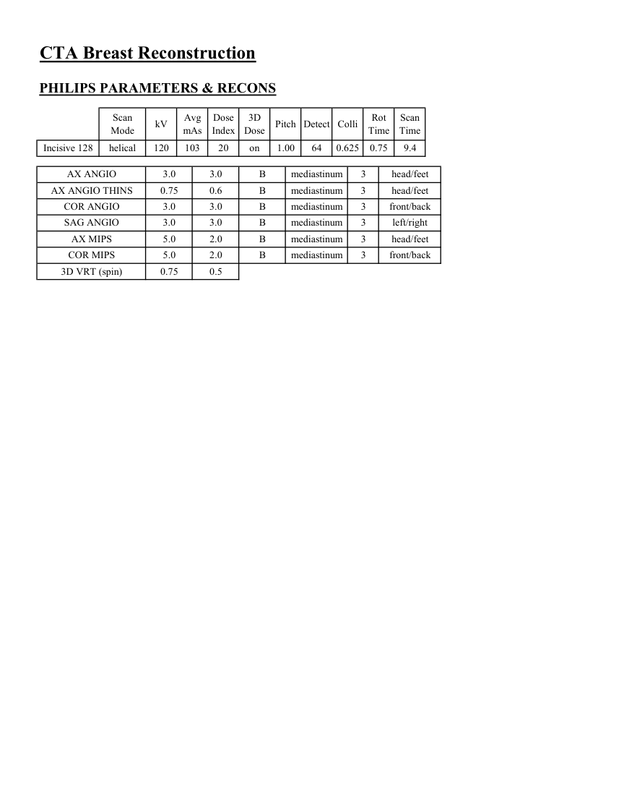

# CT — Reconstrucție mamară DIEP (MCB)

## Documentul original MCB — Reconstrucție mamară DIEP

**Protocol · 3 pagini · consultat la 2026-09-27.**

[Descarcă PDF-ul integral](../../assets/mcb-modalities/ct-reconstructie-mamara-diep-mcb/document.pdf) · [Sursa MCB](https://ref.mcbradiology.com/Protocols,%20Policies,%20Worksheets%20&%20Forms/CT/Protocols/Vascular/12%20Breast%20Reconstruction.pdf) · [Catalogul MCB pentru această modalitate](../mcb/index.md)

Instrucțiunile, valorile și ilustrațiile din documentul original sunt păstrate în **engleză**. Titlul și navigarea sunt în română.

### Pagina 1

{ loading=lazy }

### Pagina 2

{ loading=lazy }

### Pagina 3

{ loading=lazy }

## Textul documentului original

??? abstract "Pagina 1 — text în engleză"

    
Updated
    07/19/25
    CTA Breast Reconstruction
    Reviewed
    07/19/25
    Also Known As - inferior epigastric perforator, DIEP, DIEA, SIEP, SIEA protocol
    Indications - surgical planning prior to breast reconstruction.
    Bill under CT Angio Combo AP w/ and w/o Contrast Charge.
    GENERAL SCAN NOTES
    Move the patient&#x27;s arms over his/her head if possible. Remove any metal from the imaging field of view.
    Topogram - lung bases through pubic symphysis (obtained during end inspiration).
    Craniocaudal scan coverage - lung bases through pubic symphysis (obtained during end inspiration).
    Adjust FOV (field of view) on topogram to smallest without cropping anatomy.
    IV Contrast:
    Administer weight-based Omnipaque-350 - 1 mL/kg up to 150 mL (100 mL minimum).
    Inject at 4 mL/sec followed by 40 mL saline flush, 20-gauge or larger in forearm or more proximal.
    Bolus track off distal abdominal aorta triggered at 100 HU + 4 secs. 
    After bolus-tracking trigger, scan patient caudocranial (from pubic symphysis to lung bases).
    Oral Contrast: generally not given for this protocol.
    For GE scanners, it is essential for the 1st recon thickness on the scanner to match the 1st recon thickness in this
    protocol book for the prescribed Noise Index to be valid. The 1st recon should generally be the thickest recon in 
    the protocol.
    

??? abstract "Pagina 2 — text în engleză"

    
CTA Breast Reconstruction
    SIEMENS PARAMETERS &amp; RECONS
    Scan                           
    Care                                          
    Scan                 
    Coll
    Rot 
    Mode
    kV
    mAs
    Care                            
    Dose
    kV &amp; Lvl
    Pitch
    Acq
    Time
    Time
    Sensation 16
    spiral
    120
    150
    on
    NA
    1.15
    16
    0.75
    0.5
    18.1
    Go Up 32
    spiral
    110
    92
    on
    on 115
    1.50
    32
    0.7
    0.8
    11.9
    Sensation 64
    spiral
    120
    150
    on
    NA
    1.20
    64
    0.6
    0.5
    10.9
    Definition 64
    spiral
    120
    120
    on
    on
    1.40
    64
    0.6
    0.5
    9.3
    Go Top 64
    spiral
    100
    101
    on
    on 115
    1.50
    64
    0.6
    0.33
    2.9
    Drive 128
    spiral
    120
    84
    on
    on
    1.20
    128
    0.6
    0.5
    5.4
    Force 192
    spiral
    110
    90
    on
    on
    1.20
    192
    0.6
    0.5
    3.6
    AX ANGIO
    3.0
    3.0
    Br40 / B41f
    mediastinum
    3
    head/feet
    AX ANGIO THINS
    0.75
    0.6
    Br40 / B41f
    mediastinum
    3
    head/feet
    COR ANGIO
    3.0
    3.0
    Br40 / B41f
    mediastinum
    3
    front/back
    SAG ANGIO
    3.0
    3.0
    Br40 / B41f
    mediastinum
    3
    left/right
    AX MIPS
    5.0
    2.0
    Br40 / B41f
    mediastinum
    3
    head/feet
    COR MIPS
    5.0
    2.0
    Br40 / B41f
    mediastinum
    3
    front/back
    3D VRT (spin)
    0.75
    0.5
    Bv36 / B31f
    CT angio
    GE PARAMETERS &amp; RECONS
    Scan               
    Smart             
    Slice                       
    Beam                                 
    Dose                                          
    Pitch
    Speed
    Rot                                
    Type
    SFOV
    kV
    mA                          
    Range
    Noise                    
    Index
    mA
    Thick
    Coll
    Time
    Red
    ASIR
    Scan                 
    Time
    on
    2.5
    20
    1.375 27.50
    0.5
    LS 16
    helical
    large
    120
    100-440
    16.36
    NA
    NA
    9.1
    Opt 540
    helical
    large
    120
    100-440
    16.36
    on
    2.5
    20
    1.375 27.50
    0.5
    NA
    NA
    9.1
     LS VCT 64
    helical
    large body
    120
    100-700
    14.14
    on
    2.5
    40
    1.375 55.00
    0.5
    50
    50
    4.5
    Disc VCT 64
    helical
    large body
    120
    100-700
    14.14
    on
    2.5
    40
    1.375 55.00
    0.5
    50
    50
    4.5
    AX ANGIO
    2.5
    2.5
    std full
    400/40
    head/feet
    Must be first recon.
    COR ANGIO
    2.5
    2.5
    std full
    400/40
    front/back
    SAG ANGIO
    2.5
    2.5
    std full
    400/40
    left/right
    AX ANGIO THINS
    0.75
    0.6
    std full
    400/40
    head/feet
    AX MIPS
    5.0
    2.0
    std full
    400/40
    head/feet
    COR MIPS
    5.0
    2.0
    std full
    400/40
    front/back
    3D VRT (spin)
    0.625
    0.625
    std full
    400/40
    

??? abstract "Pagina 3 — text în engleză"

    
CTA Breast Reconstruction
    PHILIPS PARAMETERS &amp; RECONS
    Scan                           
    Dose                                          
    3D            
    Scan                 
    Detect Colli
    Rot 
    Mode
    kV
    Avg                      
    mAs
    Index
    Dose
    Pitch
    Time
    Time
    Incisive 128
    helical
    120
    103
    20
    on
    1.00
    64
    0.625
    0.75
    9.4
    AX ANGIO
    3.0
    3.0
    B
    mediastinum
    3
    head/feet
    AX ANGIO THINS
    0.75
    0.6
    B
    mediastinum
    3
    head/feet
    COR ANGIO
    3.0
    3.0
    B
    mediastinum
    3
    front/back
    SAG ANGIO
    3.0
    3.0
    B
    mediastinum
    3
    left/right
    AX MIPS
    5.0
    2.0
    B
    mediastinum
    3
    head/feet
    5.0
    2.0
    B
    mediastinum
    3
    front/back
    COR MIPS
    3D VRT (spin)
    0.75
    0.5
    

