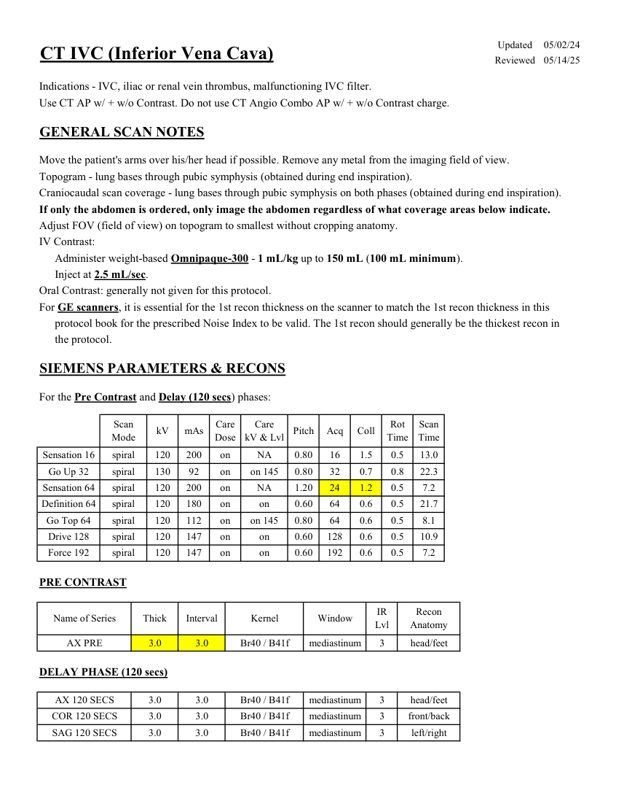
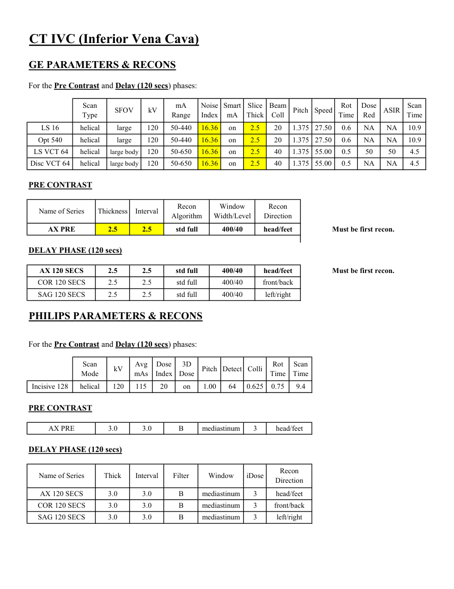

# CT — Venă cavă inferioară (MCB)

## Documentul original MCB — Venă cavă inferioară

**Protocol · 2 pagini · consultat la 2026-09-27.**

[Descarcă PDF-ul integral](../../assets/mcb-modalities/ct-vena-cava-inferioara-mcb/document.pdf) · [Sursa MCB](https://ref.mcbradiology.com/Protocols,%20Policies,%20Worksheets%20&%20Forms/CT/Protocols/Vascular/7%20IVC.pdf) · [Catalogul MCB pentru această modalitate](../mcb/index.md)

Instrucțiunile, valorile și ilustrațiile din documentul original sunt păstrate în **engleză**. Titlul și navigarea sunt în română.

### Pagina 1

{ loading=lazy }

### Pagina 2

{ loading=lazy }

## Textul documentului original

??? abstract "Pagina 1 — text în engleză"

    
Updated
    05/02/24
    CT IVC (Inferior Vena Cava)
    Reviewed
    05/14/25
    Indications - IVC, iliac or renal vein thrombus, malfunctioning IVC filter.
    Use CT AP w/ + w/o Contrast. Do not use CT Angio Combo AP w/ + w/o Contrast charge.
    GENERAL SCAN NOTES
    Move the patient&#x27;s arms over his/her head if possible. Remove any metal from the imaging field of view.
    Topogram - lung bases through pubic symphysis (obtained during end inspiration).
    Craniocaudal scan coverage - lung bases through pubic symphysis on both phases (obtained during end inspiration).
    If only the abdomen is ordered, only image the abdomen regardless of what coverage areas below indicate.
    Adjust FOV (field of view) on topogram to smallest without cropping anatomy.
    IV Contrast:
    Administer weight-based Omnipaque-300 - 1 mL/kg up to 150 mL (100 mL minimum).
    Inject at 2.5 mL/sec.
    Oral Contrast: generally not given for this protocol.
    For GE scanners, it is essential for the 1st recon thickness on the scanner to match the 1st recon thickness in this
    protocol book for the prescribed Noise Index to be valid. The 1st recon should generally be the thickest recon in 
    the protocol.
    SIEMENS PARAMETERS &amp; RECONS
    For the Pre Contrast and Delay (120 secs) phases:
    Scan                           
    Care                                          
    Rot 
    Scan                 
    Mode
    kV
    mAs
    Care                            
    Dose
    kV &amp; Lvl
    Pitch
    Acq
    Coll
    Time
    Time
    Sensation 16
    spiral
    120
    200
    on
    NA
    0.80
    16
    1.5
    0.5
    13.0
    Go Up 32
    spiral
    130
    92
    on
    on 145
    0.80
    32
    0.7
    0.8
    22.3
    Sensation 64
    spiral
    120
    200
    on
    NA
    1.20
    24
    1.2
    0.5
    7.2
    Definition 64
    spiral
    120
    180
    on
    on
    0.60
    64
    0.6
    0.5
    21.7
    Go Top 64
    spiral
    120
    112
    on
    on 145
    0.80
    64
    0.6
    0.5
    8.1
    Drive 128
    spiral
    120
    147
    on
    on
    0.60
    128
    0.6
    0.5
    10.9
    Force 192
    spiral
    120
    147
    on
    on
    0.60
    192
    0.6
    0.5
    7.2
    PRE CONTRAST
    IR                       
    Name of Series
    Thick
    Interval
    Window
    Recon             
    Kernel
    Lvl
    Anatomy
    AX PRE
    3.0
    3.0
    Br40 / B41f
    mediastinum
    3
    head/feet
    DELAY PHASE (120 secs)
    AX 120 SECS
    3.0
    3.0
    mediastinum
    head/feet
    Br40 / B41f
    3
    COR 120 SECS
    3.0
    3.0
    mediastinum
    front/back
    Br40 / B41f
    3
    SAG 120 SECS
    3.0
    3.0
    mediastinum
    Br40 / B41f
    3
    left/right
    

??? abstract "Pagina 2 — text în engleză"

    
CT IVC (Inferior Vena Cava)
    GE PARAMETERS &amp; RECONS
    For the Pre Contrast and Delay (120 secs) phases:
    mA                          
    Smart             
    Slice                       
    Beam                                 
    Rot                                
    Dose                                          
    Scan                 
    Speed
    Scan               
    Type
    SFOV
    kV
    Range
    Noise                    
    Index
    mA
    Thick
    Coll
    Pitch
    Time
    Red
    ASIR
    Time
    LS 16
    helical
    large
    120
    50-440
    16.36
    on
    2.5
    20
    10.9
    1.375 27.50
    0.6
    NA
    NA
    Opt 540
    helical
    large
    120
    50-440
    16.36
    on
    2.5
    20
    1.375 27.50
    0.6
    NA
    NA
    10.9
    16.36
    on
    2.5
    40
    1.375
     LS VCT 64
    helical
    large body
    120
    50-650
    55.00
    0.5
    50
    50
    4.5
    Disc VCT 64
    helical
    large body
    120
    50-650
    16.36
    on
    2.5
    40
    1.375 55.00
    0.5
    NA
    NA
    4.5
    PRE CONTRAST
    Window                                   
    Recon                    
    Name of Series
    Thickness
    Interval
    Recon                                     
    Algorithm
    Width/Level
    Direction
    AX PRE
    2.5
    2.5
    std full
    400/40
    head/feet
    Must be first recon.
    DELAY PHASE (120 secs)
    AX 120 SECS
    2.5
    2.5
    std full
    400/40
    head/feet
    Must be first recon.
    COR 120 SECS
    2.5
    2.5
    std full
    400/40
    front/back
    SAG 120 SECS
    2.5
    2.5
    std full
    400/40
    left/right
    PHILIPS PARAMETERS &amp; RECONS
    For the Pre Contrast and Delay (120 secs) phases:
    Scan                           
    Dose                                          
    3D            
    Scan                 
    Colli
    Mode
    kV
    Avg                      
    mAs
    Index
    Dose
    Pitch Detect
    Rot 
    Time
    Time
    on
    1.00
    64
    0.625
    0.75
    Incisive 128
    helical
    120
    115
    20
    9.4
    PRE CONTRAST
    3
    head/feet
    AX PRE
    3.0
    3.0
    B
    mediastinum
    DELAY PHASE (120 secs)
    Name of Series
    Thick
    Interval
    Filter
    Window
    iDose
    Recon                     
    Direction
    AX 120 SECS
    3.0
    3.0
    B
    mediastinum
    3
    head/feet
    COR 120 SECS
    3.0
    3.0
    B
    mediastinum
    3
    front/back
    SAG 120 SECS
    3.0
    3.0
    B
    mediastinum
    3
    left/right
    

