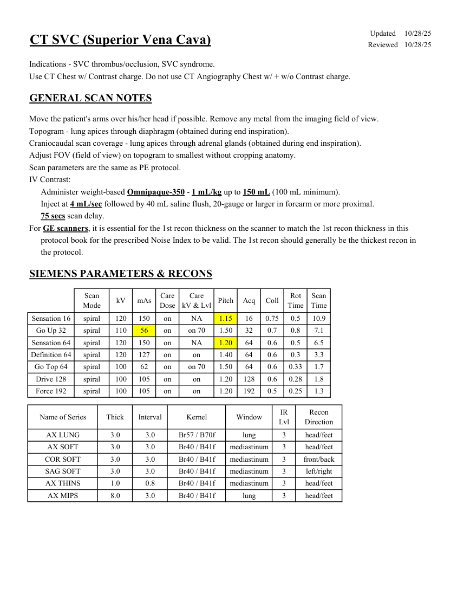
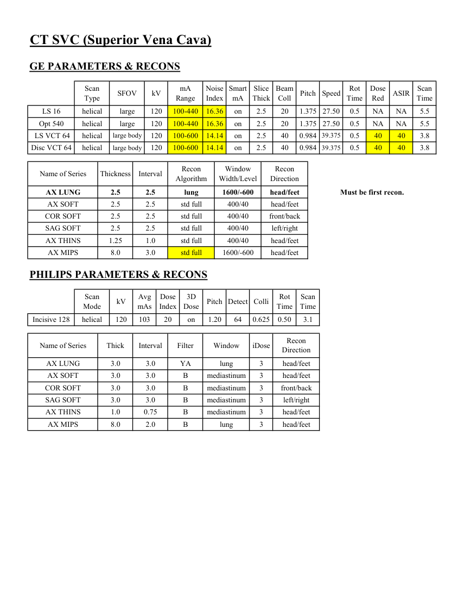

# CT — Venă cavă superioară (MCB)

## Documentul original MCB — Venă cavă superioară

**Protocol · 2 pagini · consultat la 2026-09-27.**

[Descarcă PDF-ul integral](../../assets/mcb-modalities/ct-vena-cava-superioara-mcb/document.pdf) · [Sursa MCB](https://ref.mcbradiology.com/Protocols,%20Policies,%20Worksheets%20&%20Forms/CT/Protocols/Vascular/5%20SVC.pdf) · [Catalogul MCB pentru această modalitate](../mcb/index.md)

Instrucțiunile, valorile și ilustrațiile din documentul original sunt păstrate în **engleză**. Titlul și navigarea sunt în română.

### Pagina 1

{ loading=lazy }

### Pagina 2

{ loading=lazy }

## Textul documentului original

??? abstract "Pagina 1 — text în engleză"

    
Updated
    10/28/25
    CT SVC (Superior Vena Cava)
    Reviewed
    10/28/25
    Indications - SVC thrombus/occlusion, SVC syndrome.
    Use CT Chest w/ Contrast charge. Do not use CT Angiography Chest w/ + w/o Contrast charge.
    GENERAL SCAN NOTES
    Move the patient&#x27;s arms over his/her head if possible. Remove any metal from the imaging field of view.
    Topogram - lung apices through diaphragm (obtained during end inspiration).
    Craniocaudal scan coverage - lung apices through adrenal glands (obtained during end inspiration).
    Adjust FOV (field of view) on topogram to smallest without cropping anatomy.
    Scan parameters are the same as PE protocol.
    IV Contrast:
    Administer weight-based Omnipaque-350 - 1 mL/kg up to 150 mL (100 mL minimum).
    Inject at 4 mL/sec followed by 40 mL saline flush, 20-gauge or larger in forearm or more proximal.
    75 secs scan delay.
    For GE scanners, it is essential for the 1st recon thickness on the scanner to match the 1st recon thickness in this
    protocol book for the prescribed Noise Index to be valid. The 1st recon should generally be the thickest recon in 
    the protocol.
    SIEMENS PARAMETERS &amp; RECONS
    Scan                           
    Care                                          
    Scan                 
    Mode
    kV
    mAs
    Care                            
    Dose
    kV &amp; Lvl
    Pitch
    Acq
    Coll
    Rot 
    Time
    Time
    Sensation 16
    spiral
    120
    150
    on
    NA
    1.15
    16
    0.75
    0.5
    10.9
    Go Up 32
    spiral
    110
    56
    on
    on 70
    1.50
    32
    0.7
    0.8
    7.1
    Sensation 64
    spiral
    120
    150
    on
    NA
    1.20
    64
    0.6
    0.5
    6.5
    Definition 64
    spiral
    120
    127
    on
    on
    1.40
    64
    0.6
    0.3
    3.3
    Go Top 64
    spiral
    100
    62
    on
    on 70
    1.50
    64
    0.6
    0.33
    1.7
    Drive 128
    spiral
    100
    105
    on
    on
    1.20
    128
    0.6
    0.28
    1.8
    Force 192
    spiral
    100
    105
    on
    on
    1.20
    192
    0.5
    0.25
    1.3
    IR                       
    Recon                     
    Name of Series
    Thick
    Interval
    Kernel
    Window
    Lvl
    Direction
    AX LUNG
    3.0
    3.0
    Br57 / B70f
    lung
    3
    head/feet
    AX SOFT
    3.0
    3.0
    Br40 / B41f
    mediastinum
    3
    head/feet
    COR SOFT
    3.0
    3.0
    Br40 / B41f
    mediastinum
    3
    front/back
    SAG SOFT
    3.0
    3.0
    Br40 / B41f
    mediastinum
    3
    left/right
    AX THINS
    1.0
    0.8
    Br40 / B41f
    mediastinum
    3
    head/feet
    head/feet
    AX MIPS
    8.0
    3.0
    Br40 / B41f
    lung
    3
    

??? abstract "Pagina 2 — text în engleză"

    
CT SVC (Superior Vena Cava)
    GE PARAMETERS &amp; RECONS
    Smart             
    Slice                       
    Beam                                 
    Rot                                
    Dose                                          
    Scan                 
    kV
    mA                           
    Type
    SFOV
    Coll
    Pitch
    Scan               
    Range
    Speed
    Noise                    
    Index
    mA
    Thick
    Time
    Red
    ASIR
    Time
    LS 16
    helical
    large
    120
    100-440
    16.36
    on
    2.5
    20
    1.375 27.50
    0.5
    NA
    NA
    5.5
    Opt 540
    helical
    large
    120
    100-440
    16.36
    on
    2.5
    20
    1.375 27.50
    0.5
    NA
    NA
    5.5
    39.375
    40
    0.984
     LS VCT 64
    helical
    large body
    120
    100-600
    14.14
    on
    2.5
    0.5
    40
    40
    3.8
    Disc VCT 64
    helical
    large body
    120
    100-600
    14.14
    on
    2.5
    40
    0.984 39.375
    0.5
    40
    40
    3.8
    Window                                   
    Recon                    
    Name of Series
    Thickness
    Interval
    Recon                                     
    Algorithm
    Width/Level
    Direction
    AX LUNG
    2.5
    2.5
    lung
    1600/-600
    head/feet
    Must be first recon.
    AX SOFT
    2.5
    2.5
    std full
    400/40
    head/feet
    COR SOFT
    2.5
    2.5
    std full
    400/40
    front/back
    SAG SOFT
    2.5
    2.5
    std full
    400/40
    left/right
    AX THINS
    1.25
    1.0
    std full
    400/40
    head/feet
    AX MIPS
    8.0
    3.0
    std full
    1600/-600
    head/feet
    PHILIPS PARAMETERS &amp; RECONS
    Scan                           
    Dose                                          
    3D            
    Rot 
    Scan                 
    Mode
    kV
    Avg                      
    mAs
    Index
    Dose
    Pitch Detect Colli
    Time
    Time
    on
    1.20
    64
    0.625
    0.50
    Incisive 128
    helical
    120
    103
    20
    3.1
    Name of Series
    Thick
    Interval
    Filter
    Window
    iDose
    Recon                     
    Direction
    AX LUNG
    3.0
    3.0
    YA
    lung
    3
    head/feet
    AX SOFT
    3.0
    3.0
    B
    mediastinum
    3
    head/feet
    COR SOFT
    3.0
    3.0
    B
    mediastinum
    3
    front/back
    SAG SOFT
    3.0
    3.0
    B
    mediastinum
    3
    left/right
    AX THINS
    1.0
    0.75
    B
    mediastinum
    3
    head/feet
    3
    head/feet
    AX MIPS
    8.0
    2.0
    B
    lung
    

