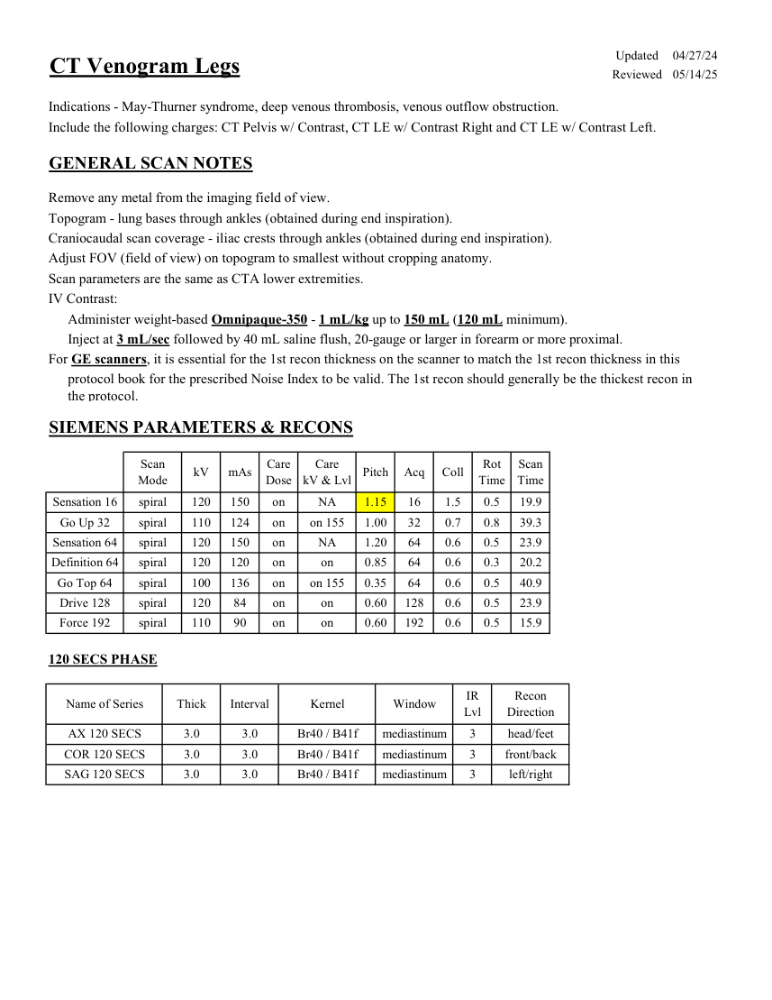
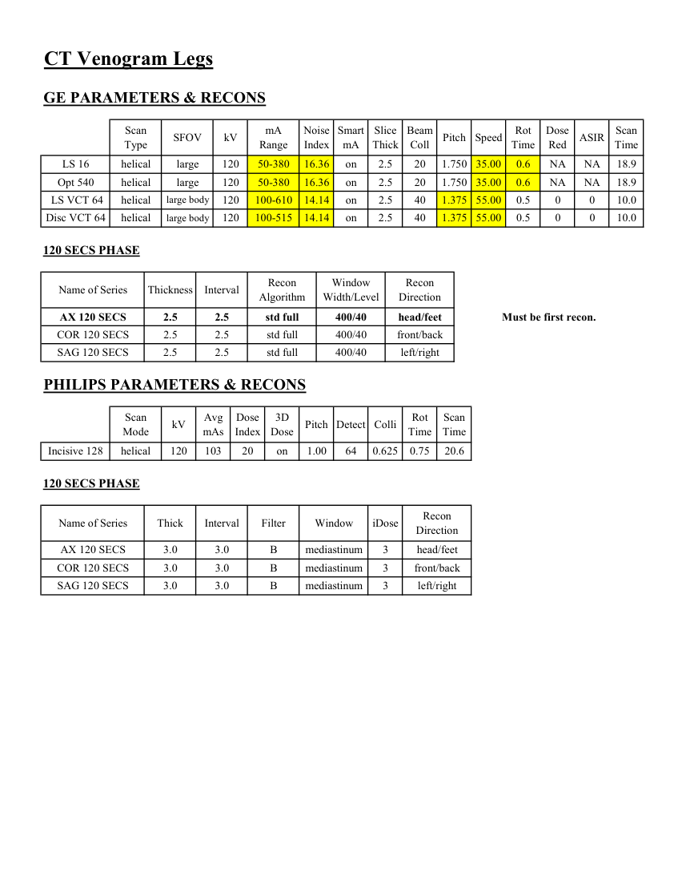

# CT — Venografie membre inferioare (MCB)

## Documentul original MCB — Venografie membre inferioare

**Protocol · 2 pagini · consultat la 2026-09-27.**

[Descarcă PDF-ul integral](../../assets/mcb-modalities/ct-venografie-membre-inferioare-mcb/document.pdf) · [Sursa MCB](https://ref.mcbradiology.com/Protocols,%20Policies,%20Worksheets%20&%20Forms/CT/Protocols/Vascular/10%20CTV%20Legs.pdf) · [Catalogul MCB pentru această modalitate](../mcb/index.md)

Instrucțiunile, valorile și ilustrațiile din documentul original sunt păstrate în **engleză**. Titlul și navigarea sunt în română.

### Pagina 1

{ loading=lazy }

### Pagina 2

{ loading=lazy }

## Textul documentului original

??? abstract "Pagina 1 — text în engleză"

    
Updated
    04/27/24
    CT Venogram Legs
    Reviewed
    05/14/25
    Indications - May-Thurner syndrome, deep venous thrombosis, venous outflow obstruction.
    Include the following charges: CT Pelvis w/ Contrast, CT LE w/ Contrast Right and CT LE w/ Contrast Left.
    GENERAL SCAN NOTES
    Remove any metal from the imaging field of view.
    Topogram - lung bases through ankles (obtained during end inspiration).
    Craniocaudal scan coverage - iliac crests through ankles (obtained during end inspiration).
    Adjust FOV (field of view) on topogram to smallest without cropping anatomy.
    Scan parameters are the same as CTA lower extremities.
    IV Contrast:
    Administer weight-based Omnipaque-350 - 1 mL/kg up to 150 mL (120 mL minimum).
    Inject at 3 mL/sec followed by 40 mL saline flush, 20-gauge or larger in forearm or more proximal.
    For GE scanners, it is essential for the 1st recon thickness on the scanner to match the 1st recon thickness in this
    protocol book for the prescribed Noise Index to be valid. The 1st recon should generally be the thickest recon in 
    the protocol.
    SIEMENS PARAMETERS &amp; RECONS
    Scan                           
    Care                            
    Care                                          
    Scan                 
    Mode
    kV
    mAs
    Dose
    kV &amp; Lvl
    Pitch
    Acq
    Coll
    Rot 
    Time
    Time
    Sensation 16
    spiral
    120
    0.5
    150
    on
    19.9
    NA
    1.15
    16
    1.5
    Go Up 32
    spiral
    110
    124
    on
    0.8
    39.3
    on 155
    1.00
    32
    0.7
    Sensation 64
    spiral
    120
    150
    on
    NA
    1.20
    64
    0.6
    0.5
    23.9
    Definition 64
    spiral
    120
    120
    on
    on
    0.85
    64
    0.6
    0.3
    20.2
    Go Top 64
    spiral
    100
    136
    on
    on 155
    0.35
    64
    0.6
    0.5
    40.9
    Drive 128
    spiral
    120
    84
    on
    on
    0.60
    128
    0.6
    0.5
    23.9
    Force 192
    spiral
    110
    90
    on
    on
    0.60
    192
    0.6
    0.5
    15.9
    120 SECS PHASE
    Name of Series
    Thick
    IR                       
    Interval
    Window
    Recon                     
    Direction
    Kernel
    Lvl
    AX 120 SECS
    3.0
    3.0
    mediastinum
    head/feet
    Br40 / B41f
    3
    COR 120 SECS
    3.0
    3.0
    mediastinum
    front/back
    Br40 / B41f
    3
    SAG 120 SECS
    3.0
    3.0
    mediastinum
    left/right
    Br40 / B41f
    3
    

??? abstract "Pagina 2 — text în engleză"

    
CT Venogram Legs
    GE PARAMETERS &amp; RECONS
    Scan               
    Smart             
    Slice                       
    Beam                                 
    Rot                                
    Dose                                          
    Speed
    Type
    SFOV
    kV
    mA                          
    Range
    Noise                    
    Index
    mA
    Thick
    Coll
    Pitch
    Time
    Red
    ASIR
    Scan                 
    Time
    LS 16
    helical
    large
    120
    50-380
    16.36
    on
    2.5
    20
    1.750 35.00
    0.6
    NA
    NA
    18.9
    Opt 540
    helical
    large
    120
    50-380
    16.36
    on
    2.5
    20
    1.750 35.00
    0.6
    NA
    NA
    18.9
    0
    10.0
    2.5
    40
    1.375
     LS VCT 64
    helical
    large body
    120
    100-610
    14.14
    on
    55.00
    0.5
    0
    Disc VCT 64
    helical
    large body
    120
    100-515
    14.14
    on
    2.5
    10.0
    40
    1.375 55.00
    0.5
    0
    0
    120 SECS PHASE
    Window                                   
    Recon                                     
    Name of Series
    Thickness
    Interval
    Recon                                     
    Algorithm
    Width/Level
    Direction
    AX 120 SECS
    2.5
    2.5
    std full
    400/40
    head/feet
    Must be first recon.
    COR 120 SECS
    2.5
    2.5
    std full
    400/40
    front/back
    SAG 120 SECS
    2.5
    2.5
    std full
    400/40
    left/right
    PHILIPS PARAMETERS &amp; RECONS
    Scan                           
    Dose                                          
    3D            
    Scan                 
    Mode
    kV
    Avg                      
    mAs
    Index
    Dose
    Pitch Detect Colli
    Rot 
    Time
    Time
    Incisive 128
    helical
    120
    103
    20
    on
    1.00
    64
    0.625
    0.75
    20.6
    120 SECS PHASE
    Name of Series
    Thick
    Interval
    Filter
    Window
    iDose
    Recon                     
    Direction
    AX 120 SECS
    3.0
    3.0
    B
    mediastinum
    3
    head/feet
    COR 120 SECS
    3.0
    3.0
    front/back
    B
    mediastinum
    3
    SAG 120 SECS
    3.0
    3.0
    B
    mediastinum
    3
    left/right
    

