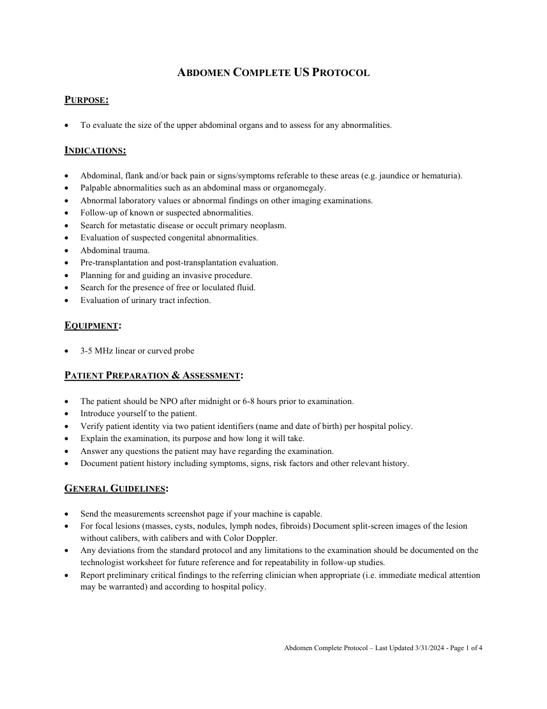
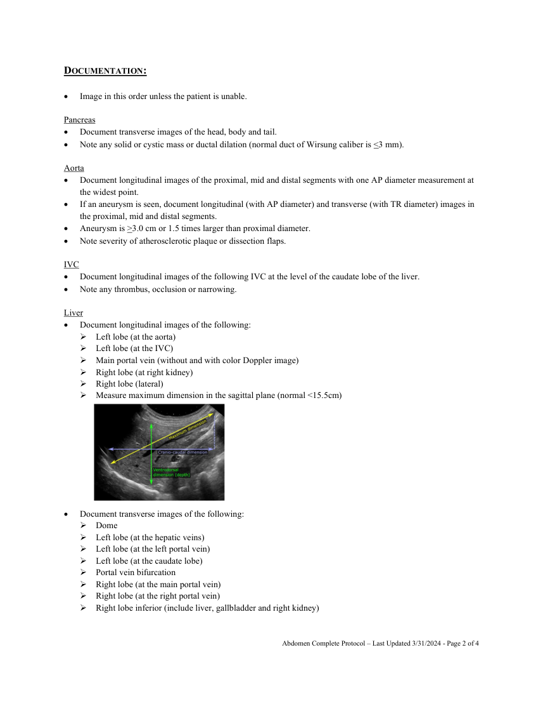
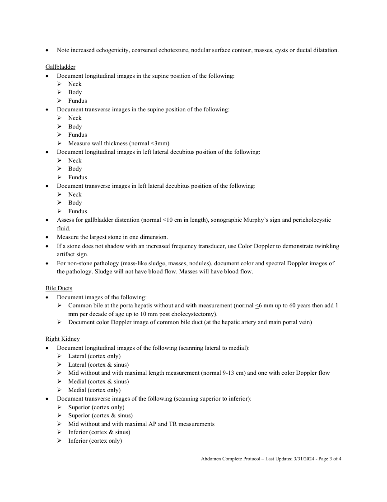
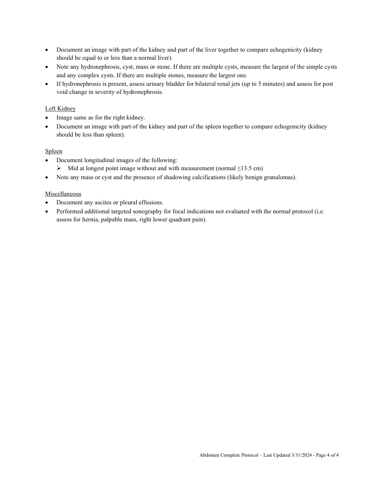

# Ecografie — Abdomen complet (MCB)

## Documentul original MCB — Abdomen complet

**Protocol · 4 pagini · consultat la 2026-09-27.**

[Descarcă PDF-ul integral](../../assets/mcb-modalities/eco-abdomen-complet-mcb/document.pdf) · [Sursa MCB](https://ref.mcbradiology.com/Protocols,%20Policies,%20Worksheets%20&%20Forms/US/Protocols/Abdomen%20Complete.pdf) · [Catalogul MCB pentru această modalitate](../mcb/index.md)

Instrucțiunile, valorile și ilustrațiile din documentul original sunt păstrate în **engleză**. Titlul și navigarea sunt în română.

### Pagina 1

{ loading=lazy }

### Pagina 2

{ loading=lazy }

### Pagina 3

{ loading=lazy }

### Pagina 4

{ loading=lazy }

## Textul documentului original

??? abstract "Pagina 1 — text în engleză"

    
ABDOMEN COMPLETE US PROTOCOL 
     
    PURPOSE: 
     
     
    To evaluate the size of the upper abdominal organs and to assess for any abnormalities. 
     
    INDICATIONS: 
     
     
    Abdominal, flank and/or back pain or signs/symptoms referable to these areas (e.g. jaundice or hematuria). 
     
    Palpable abnormalities such as an abdominal mass or organomegaly. 
     
    Abnormal laboratory values or abnormal findings on other imaging examinations. 
     
    Follow-up of known or suspected abnormalities. 
     
    Search for metastatic disease or occult primary neoplasm. 
     
    Evaluation of suspected congenital abnormalities. 
     
    Abdominal trauma. 
     
    Pre-transplantation and post-transplantation evaluation. 
     
    Planning for and guiding an invasive procedure. 
     
    Search for the presence of free or loculated fluid. 
     
    Evaluation of urinary tract infection. 
     
    EQUIPMENT: 
     
     
    3-5 MHz linear or curved probe 
     
    PATIENT PREPARATION &amp; ASSESSMENT: 
     
     
    The patient should be NPO after midnight or 6-8 hours prior to examination. 
     
    Introduce yourself to the patient.  
     
    Verify patient identity via two patient identifiers (name and date of birth) per hospital policy. 
     
    Explain the examination, its purpose and how long it will take. 
     
    Answer any questions the patient may have regarding the examination. 
     
    Document patient history including symptoms, signs, risk factors and other relevant history. 
     
    GENERAL GUIDELINES: 
     
     
    Send the measurements screenshot page if your machine is capable. 
     
    For focal lesions (masses, cysts, nodules, lymph nodes, fibroids) Document split-screen images of the lesion 
    without calibers, with calibers and with Color Doppler.  
     
    Any deviations from the standard protocol and any limitations to the examination should be documented on the 
    technologist worksheet for future reference and for repeatability in follow-up studies. 
     
    Report preliminary critical findings to the referring clinician when appropriate (i.e. immediate medical attention 
    may be warranted) and according to hospital policy. 
     
     
     
     
    Abdomen Complete Protocol – Last Updated 3/31/2024 - Page 1 of 4 
     
     
    

??? abstract "Pagina 2 — text în engleză"

    
DOCUMENTATION: 
     
     
    Image in this order unless the patient is unable. 
     
    Pancreas 
     
    Document transverse images of the head, body and tail. 
     
    Note any solid or cystic mass or ductal dilation (normal duct of Wirsung caliber is &lt;3 mm). 
     
    Aorta 
     
    Document longitudinal images of the proximal, mid and distal segments with one AP diameter measurement at 
    the widest point. 
     
    If an aneurysm is seen, document longitudinal (with AP diameter) and transverse (with TR diameter) images in 
    the proximal, mid and distal segments. 
     
    Aneurysm is &gt;3.0 cm or 1.5 times larger than proximal diameter.  
     
    Note severity of atherosclerotic plaque or dissection flaps. 
     
    IVC 
     
    Document longitudinal images of the following IVC at the level of the caudate lobe of the liver. 
     
    Note any thrombus, occlusion or narrowing. 
     
    Liver 
     
    Document longitudinal images of the following: 
     Left lobe (at the aorta) 
     Left lobe (at the IVC) 
     Main portal vein (without and with color Doppler image) 
     Right lobe (at right kidney) 
     Right lobe (lateral) 
     Measure maximum dimension in the sagittal plane (normal &lt;15.5cm) 
     
     
     
     
     
     
     
     
     
     
    Document transverse images of the following: 
     Dome 
     Left lobe (at the hepatic veins) 
     Left lobe (at the left portal vein) 
     Left lobe (at the caudate lobe) 
     Portal vein bifurcation 
     Right lobe (at the main portal vein) 
     Right lobe (at the right portal vein) 
     Right lobe inferior (include liver, gallbladder and right kidney) 
     
     
    Abdomen Complete Protocol – Last Updated 3/31/2024 - Page 2 of 4 
     
     
    

??? abstract "Pagina 3 — text în engleză"

    
 
    Note increased echogenicity, coarsened echotexture, nodular surface contour, masses, cysts or ductal dilatation. 
     
    Gallbladder 
     
    Document longitudinal images in the supine position of the following: 
     Neck 
     Body 
     Fundus 
     
    Document transverse images in the supine position of the following: 
     Neck 
     Body 
     Fundus  
     Measure wall thickness (normal &lt;3mm) 
     
    Document longitudinal images in left lateral decubitus position of the following: 
     Neck 
     Body 
     Fundus 
     
    Document transverse images in left lateral decubitus position of the following: 
     Neck 
     Body 
     Fundus 
     
    Assess for gallbladder distention (normal &lt;10 cm in length), sonographic Murphy’s sign and pericholecystic 
    fluid. 
     
    Measure the largest stone in one dimension. 
     
    If a stone does not shadow with an increased frequency transducer, use Color Doppler to demonstrate twinkling 
    artifact sign. 
     
    For non-stone pathology (mass-like sludge, masses, nodules), document color and spectral Doppler images of 
    the pathology. Sludge will not have blood flow. Masses will have blood flow. 
     
    Bile Ducts 
     
    Document images of the following: 
     Common bile at the porta hepatis without and with measurement (normal &lt;6 mm up to 60 years then add 1 
    mm per decade of age up to 10 mm post cholecystectomy). 
     Document color Doppler image of common bile duct (at the hepatic artery and main portal vein) 
     
    Right Kidney 
     
    Document longitudinal images of the following (scanning lateral to medial): 
     Lateral (cortex only) 
     Lateral (cortex &amp; sinus) 
     Mid without and with maximal length measurement (normal 9-13 cm) and one with color Doppler flow 
     Medial (cortex &amp; sinus) 
     Medial (cortex only) 
     
    Document transverse images of the following (scanning superior to inferior): 
     Superior (cortex only) 
     Superior (cortex &amp; sinus) 
     Mid without and with maximal AP and TR measurements 
     Inferior (cortex &amp; sinus) 
     Inferior (cortex only) 
     
     
    Abdomen Complete Protocol – Last Updated 3/31/2024 - Page 3 of 4 
     
     
    

??? abstract "Pagina 4 — text în engleză"

    
 
    Document an image with part of the kidney and part of the liver together to compare echogenicity (kidney 
    should be equal to or less than a normal liver). 
     
    Note any hydronephrosis, cyst, mass or stone. If there are multiple cysts, measure the largest of the simple cysts 
    and any complex cysts. If there are multiple stones, measure the largest one. 
     
    If hydronephrosis is present, assess urinary bladder for bilateral renal jets (up to 5 minutes) and assess for post 
    void change in severity of hydronephrosis. 
     
    Left Kidney 
     
    Image same as for the right kidney. 
     
    Document an image with part of the kidney and part of the spleen together to compare echogenicity (kidney 
    should be less than spleen). 
     
    Spleen 
     
    Document longitudinal images of the following: 
     Mid at longest point image without and with measurement (normal ≤13.5 cm) 
     
    Note any mass or cyst and the presence of shadowing calcifications (likely benign granulomas). 
     
    Miscellaneous 
     
    Document any ascites or pleural effusions.  
     
    Performed additional targeted sonography for focal indications not evaluated with the normal protocol (i.e. 
    assess for hernia, palpable mass, right lower quadrant pain). 
     
     
    Abdomen Complete Protocol – Last Updated 3/31/2024 - Page 4 of 4 
     
     
    

