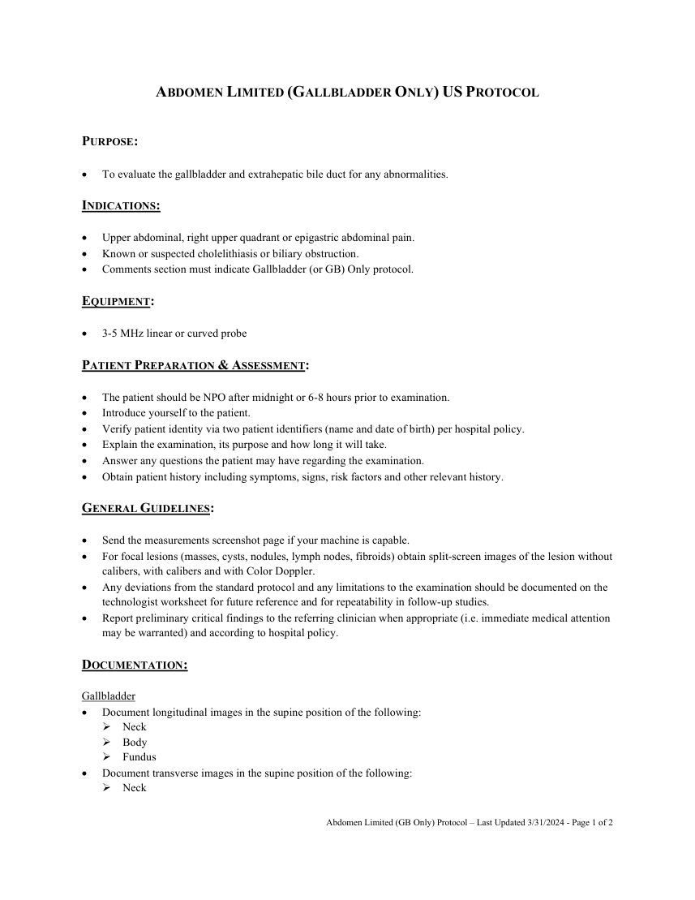
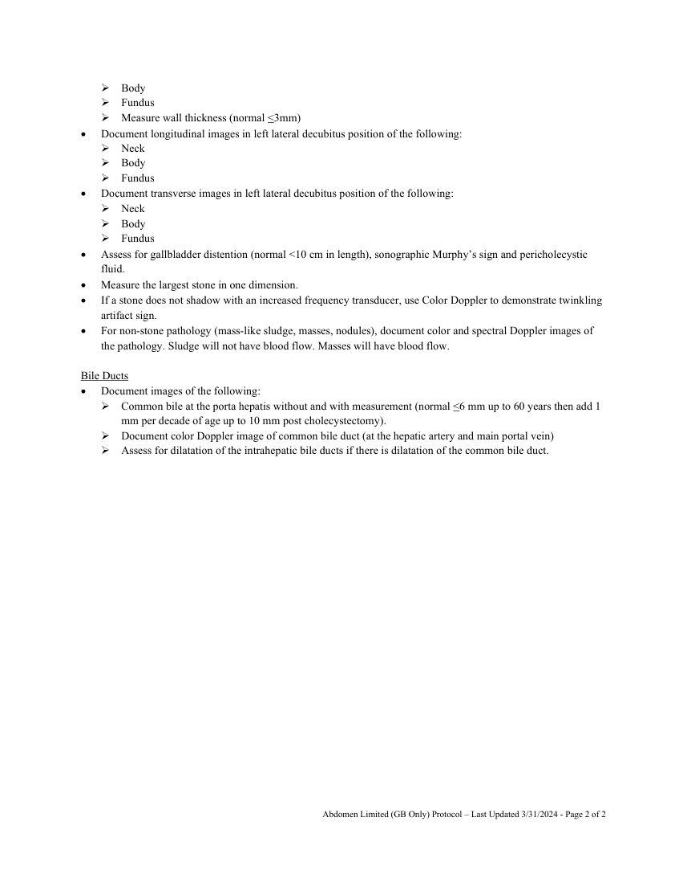

# Ecografie — Abdomen țintit: vezică biliară (MCB)

## Documentul original MCB — Abdomen țintit: vezică biliară

**Protocol · 2 pagini · consultat la 2026-09-27.**

[Descarcă PDF-ul integral](../../assets/mcb-modalities/eco-abdomen-tintit-vezica-biliara-mcb/document.pdf) · [Sursa MCB](https://ref.mcbradiology.com/Protocols,%20Policies,%20Worksheets%20&%20Forms/US/Protocols/Abdomen%20Limited%20%28GB%20Only%29.pdf) · [Catalogul MCB pentru această modalitate](../mcb/index.md)

Instrucțiunile, valorile și ilustrațiile din documentul original sunt păstrate în **engleză**. Titlul și navigarea sunt în română.

### Pagina 1

{ loading=lazy }

### Pagina 2

{ loading=lazy }

## Textul documentului original

??? abstract "Pagina 1 — text în engleză"

    
ABDOMEN LIMITED (GALLBLADDER ONLY) US PROTOCOL 
     
     
    PURPOSE: 
     
     
    To evaluate the gallbladder and extrahepatic bile duct for any abnormalities. 
     
    INDICATIONS: 
     
     
    Upper abdominal, right upper quadrant or epigastric abdominal pain. 
     
    Known or suspected cholelithiasis or biliary obstruction. 
     
    Comments section must indicate Gallbladder (or GB) Only protocol. 
     
    EQUIPMENT: 
     
     
    3-5 MHz linear or curved probe 
     
    PATIENT PREPARATION &amp; ASSESSMENT: 
     
     
    The patient should be NPO after midnight or 6-8 hours prior to examination. 
     
    Introduce yourself to the patient.  
     
    Verify patient identity via two patient identifiers (name and date of birth) per hospital policy. 
     
    Explain the examination, its purpose and how long it will take. 
     
    Answer any questions the patient may have regarding the examination. 
     
    Obtain patient history including symptoms, signs, risk factors and other relevant history. 
     
    GENERAL GUIDELINES: 
     
     
    Send the measurements screenshot page if your machine is capable. 
     
    For focal lesions (masses, cysts, nodules, lymph nodes, fibroids) obtain split-screen images of the lesion without 
    calibers, with calibers and with Color Doppler.  
     
    Any deviations from the standard protocol and any limitations to the examination should be documented on the 
    technologist worksheet for future reference and for repeatability in follow-up studies. 
     
    Report preliminary critical findings to the referring clinician when appropriate (i.e. immediate medical attention 
    may be warranted) and according to hospital policy. 
     
    DOCUMENTATION: 
     
    Gallbladder 
     
    Document longitudinal images in the supine position of the following: 
     Neck 
     Body 
     Fundus 
     
    Document transverse images in the supine position of the following: 
     Neck 
     
     
    Abdomen Limited (GB Only) Protocol – Last Updated 3/31/2024 - Page 1 of 2 
     
     
    

??? abstract "Pagina 2 — text în engleză"

    
 Body 
     Fundus  
     Measure wall thickness (normal &lt;3mm) 
     
    Document longitudinal images in left lateral decubitus position of the following: 
     Neck 
     Body 
     Fundus 
     
    Document transverse images in left lateral decubitus position of the following: 
     Neck 
     Body 
     Fundus 
     
    Assess for gallbladder distention (normal &lt;10 cm in length), sonographic Murphy’s sign and pericholecystic 
    fluid. 
     
    Measure the largest stone in one dimension. 
     
    If a stone does not shadow with an increased frequency transducer, use Color Doppler to demonstrate twinkling 
    artifact sign. 
     
    For non-stone pathology (mass-like sludge, masses, nodules), document color and spectral Doppler images of 
    the pathology. Sludge will not have blood flow. Masses will have blood flow. 
     
    Bile Ducts 
     
    Document images of the following: 
     Common bile at the porta hepatis without and with measurement (normal &lt;6 mm up to 60 years then add 1 
    mm per decade of age up to 10 mm post cholecystectomy). 
     Document color Doppler image of common bile duct (at the hepatic artery and main portal vein) 
     Assess for dilatation of the intrahepatic bile ducts if there is dilatation of the common bile duct. 
     
     
     
     
     
    Abdomen Limited (GB Only) Protocol – Last Updated 3/31/2024 - Page 2 of 2 
     
     
    

