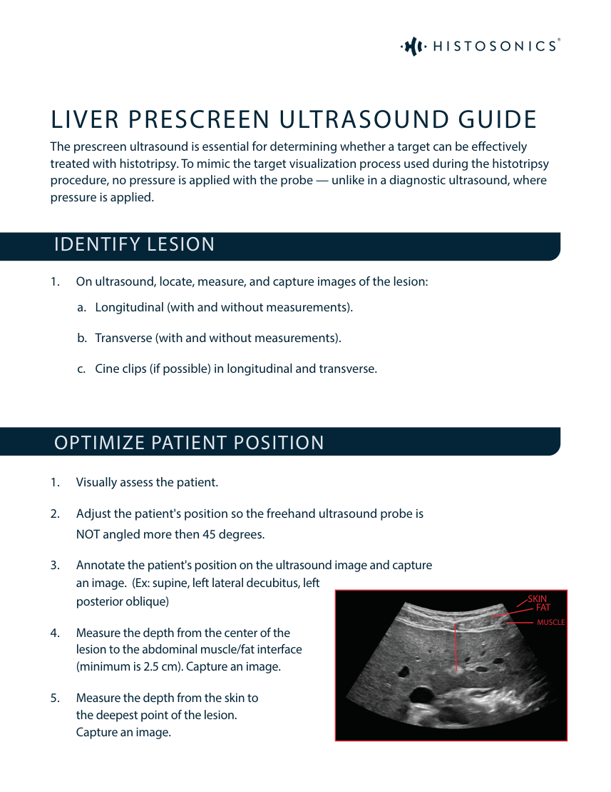
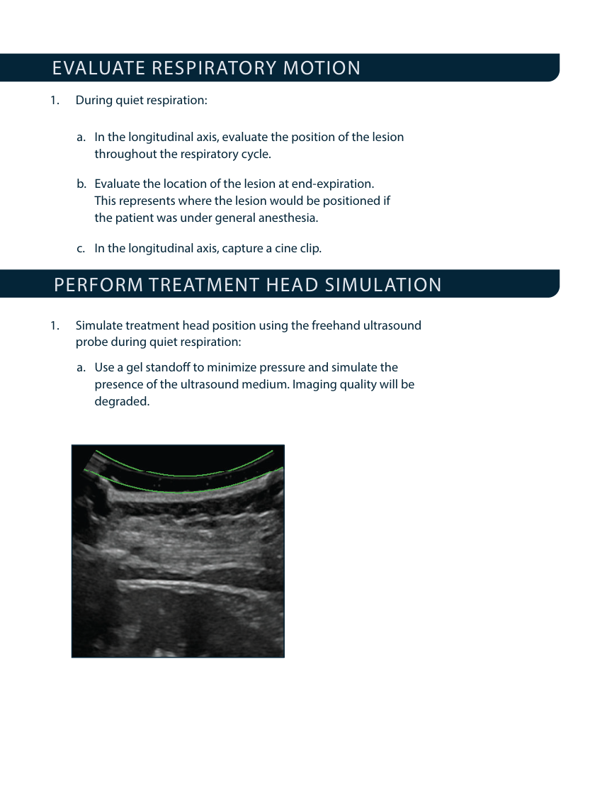
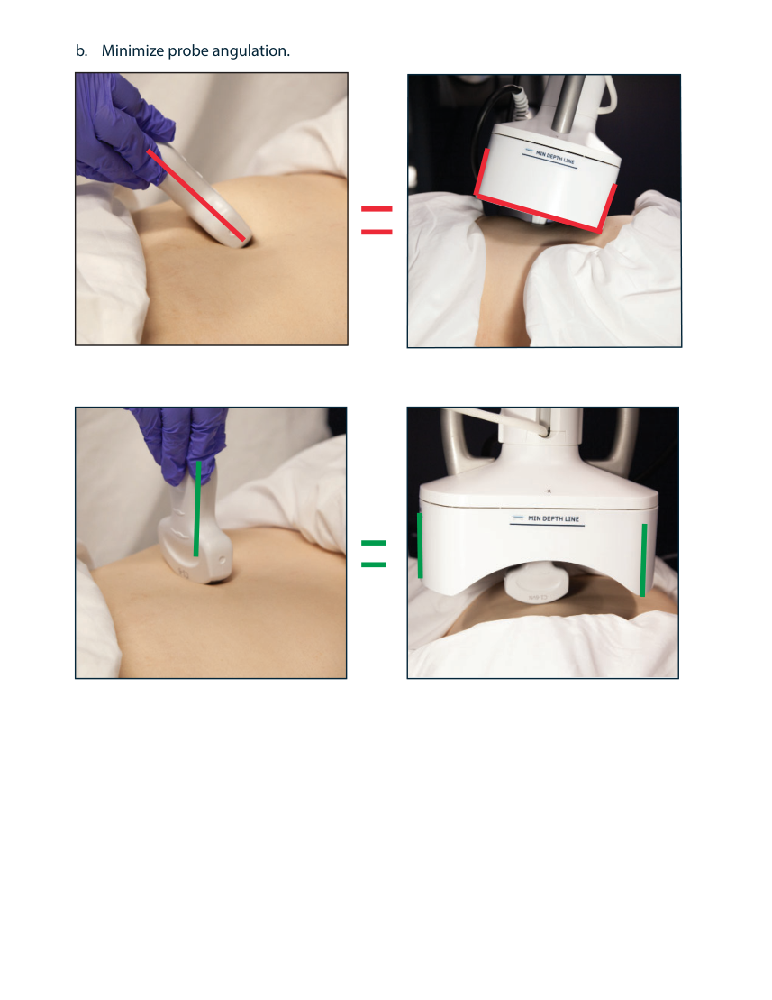
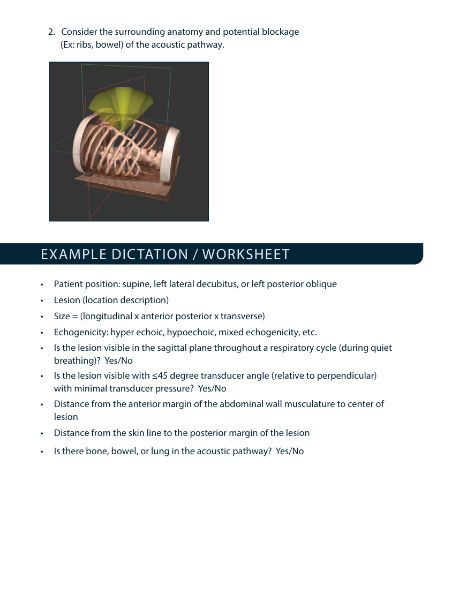
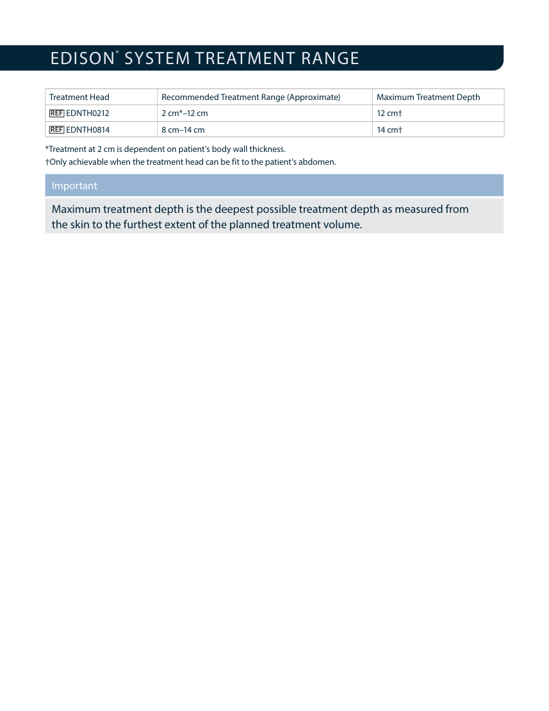
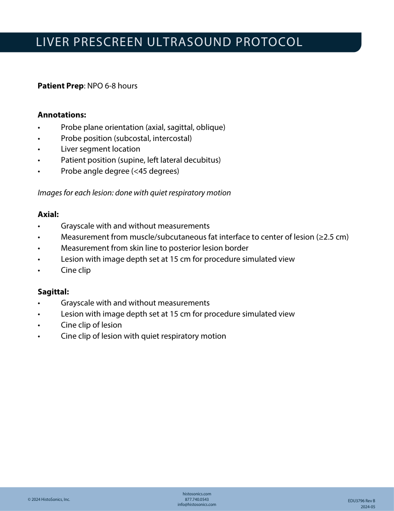

# Ecografie — Evaluare înainte de histotripsie (MCB)

## Documentul original MCB — Evaluare înainte de histotripsie

**Protocol · 6 pagini · consultat la 2026-09-27.**

[Descarcă PDF-ul integral](../../assets/mcb-modalities/eco-evaluare-inainte-de-histotripsie-mcb/document.pdf) · [Sursa MCB](https://ref.mcbradiology.com/Protocols,%20Policies,%20Worksheets%20&%20Forms/US/Protocols/Histotripsy%20Pre%20Scan.pdf) · [Catalogul MCB pentru această modalitate](../mcb/index.md)

Instrucțiunile, valorile și ilustrațiile din documentul original sunt păstrate în **engleză**. Titlul și navigarea sunt în română.

### Pagina 1

{ loading=lazy }

### Pagina 2

{ loading=lazy }

### Pagina 3

{ loading=lazy }

### Pagina 4

{ loading=lazy }

### Pagina 5

{ loading=lazy }

### Pagina 6

{ loading=lazy }

## Textul documentului original

??? abstract "Pagina 1 — text în engleză"

    
LIVER PRESCREEN ULTRASOUND GUIDE
    The prescreen ultrasound is essential for determining whether a target can be effectively 
    treated with histotripsy. To mimic the target visualization process used during the histotripsy 
    procedure, no pressure is applied with the probe — unlike in a diagnostic ultrasound, where 
    pressure is applied.
    IDENTIFY LESION
    1.
    On ultrasound, locate, measure, and capture images of the lesion:
    a. Longitudinal (with and without measurements).
    b. Transverse (with and without measurements).
    c. Cine clips (if possible) in longitudinal and transverse.
    OPTIMIZE PATIENT POSITION
    1.
    Visually assess the patient.
    2.
    Adjust the patient&#x27;s position so the freehand ultrasound probe is
    NOT angled more then 45 degrees.
    SKIN
    3.
    Annotate the patient&#x27;s position on the ultrasound image and capture
    an image.  (Ex: supine, left lateral decubitus, left
    posterior oblique)
    MUSCLE
    FAT
    4.
    Measure the depth from the center of the
    lesion to the abdominal muscle/fat interface
    (minimum is 2.5 cm). Capture an image.
    5.
    Measure the depth from the skin to
    the deepest point of the lesion.
    Capture an image.
    

??? abstract "Pagina 2 — text în engleză"

    
          EVALUATE RESPIRATORY MOTION
    1.
    During quiet respiration:
    a. In the longitudinal axis, evaluate the position of the lesion
    throughout the respiratory cycle.
    b. Evaluate the location of the lesion at end-expiration.
    This represents where the lesion would be positioned if
    the patient was under general anesthesia.
    c. In the longitudinal axis, capture a cine clip.
    PERFORM TREATMENT HEAD SIMULATION
    1.
    Simulate treatment head position using the freehand ultrasound
    probe during quiet respiration:
    a. Use a gel standoff to minimize pressure and simulate the
    presence of the ultrasound medium. Imaging quality will be
    degraded.
    

??? abstract "Pagina 3 — text în engleză"

    
b.
    Minimize probe angulation.
    

??? abstract "Pagina 4 — text în engleză"

    
2. Consider the surrounding anatomy and potential blockage
    (Ex: ribs, bowel) of the acoustic pathway.
    EXAMPLE DICTATION / WORKSHEET
    •
    Patient position: supine, left lateral decubitus, or left posterior oblique
    •
    Lesion (location description)
    •
    Size = (longitudinal x anterior posterior x transverse)
    •
    Echogenicity: hyper echoic, hypoechoic, mixed echogenicity, etc.
    •
    Is the lesion visible in the sagittal plane throughout a respiratory cycle (during quiet
    breathing)?  Yes/No
    •
    Is the lesion visible with ≤45 degree transducer angle (relative to perpendicular)
    with minimal transducer pressure?  Yes/No
    •
    Distance from the anterior margin of the abdominal wall musculature to center of
    lesion
    •
    Distance from the skin line to the posterior margin of the lesion
    •
    Is there bone, bowel, or lung in the acoustic pathway?  Yes/No
    

??? abstract "Pagina 5 — text în engleză"

    
EDISON
    ® SYSTEM TREATMENT RANGE
    Treatment Head
     
    Recommended Treatment Range (Approximate) 
    Maximum Treatment Depth
     EDNTH0212
    2 cm*–12 cm
    12 cm†
     EDNTH0814
    8 cm–14 cm
    14 cm†
    *Treatment at 2 cm is dependent on patient&#x27;s body wall thickness.
    †Only achievable when the treatment head can be fit to the patient&#x27;s abdomen.
    Important
    Maximum treatment depth is the deepest possible treatment depth as measured from 
    the skin to the furthest extent of the planned treatment volume.
    

??? abstract "Pagina 6 — text în engleză"

    
LIVER PRESCREEN ULTRASOUND PROTOCOL
    Patient Prep: NPO 6-8 hours
    Annotations:
    •
    Probe plane orientation (axial, sagittal, oblique)
    •
    Probe position (subcostal, intercostal)
    •
    Liver segment location
    •
    Patient position (supine, left lateral decubitus)
    •
    Probe angle degree (&lt;45 degrees)
    Images for each lesion: done with quiet respiratory motion 
    Axial:
    •
    Grayscale with and without measurements
    •
    Measurement from muscle/subcutaneous fat interface to center of lesion (≥2.5 cm)
    •
    Measurement from skin line to posterior lesion border
    •
    Lesion with image depth set at 15 cm for procedure simulated view
    •
    Cine clip
    Sagittal:
    •
    Grayscale with and without measurements
    •
    Lesion with image depth set at 15 cm for procedure simulated view
    •
    Cine clip of lesion
    •
    Cine clip of lesion with quiet respiratory motion
    © 2024 HistoSonics, Inc.
    histosonics.com
    877.740.0543
    info@histosonics.com
    EDU3796 Rev B
                  2024-05
    

