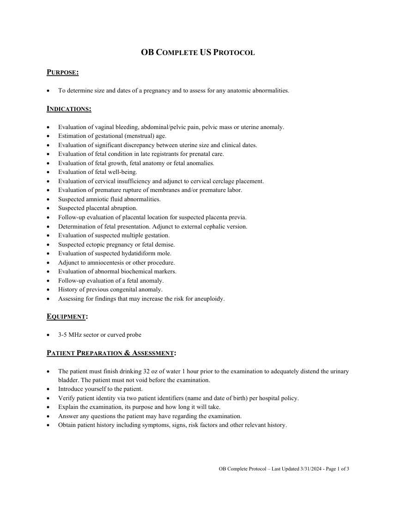
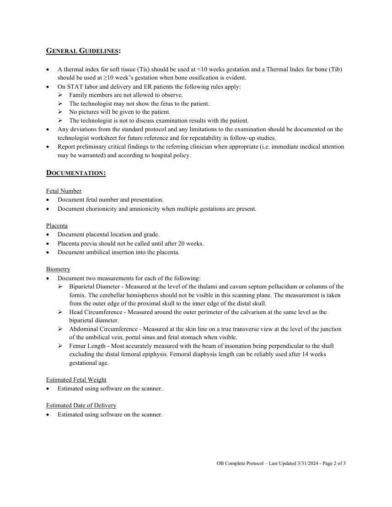
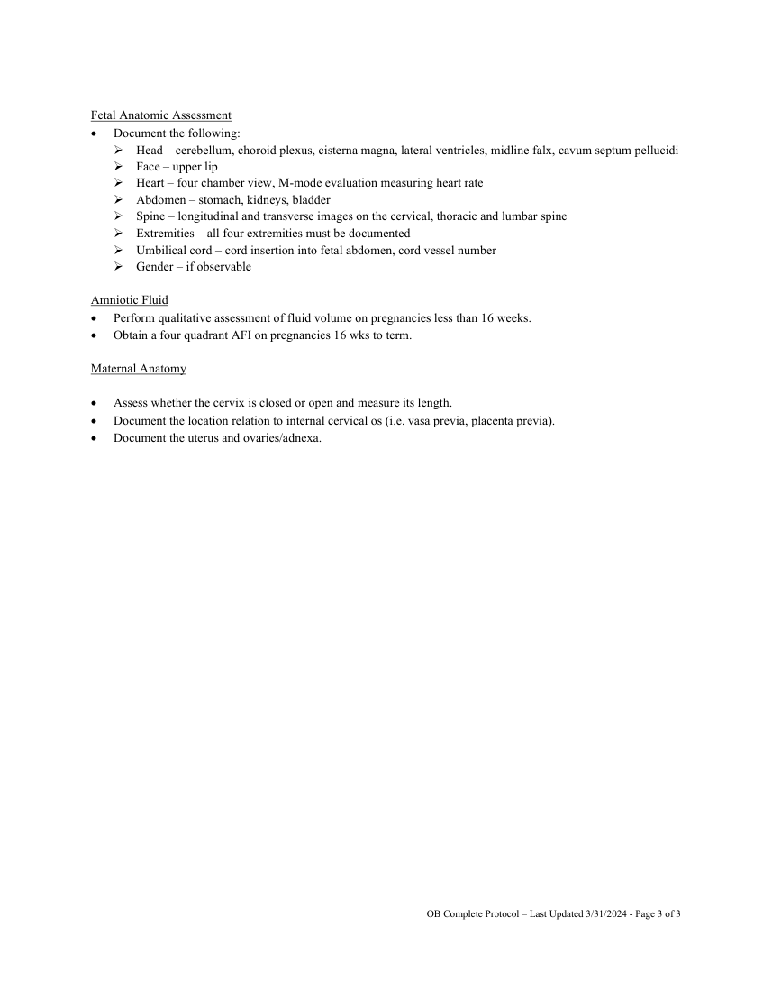

# Ecografie — Examinare obstetricală completă (MCB)

## Documentul original MCB — Examinare obstetricală completă

**Protocol · 3 pagini · consultat la 2026-09-27.**

[Descarcă PDF-ul integral](../../assets/mcb-modalities/eco-examinare-obstetricala-completa-mcb/document.pdf) · [Sursa MCB](https://ref.mcbradiology.com/Protocols,%20Policies,%20Worksheets%20&%20Forms/US/Protocols/OB%20Complete.pdf) · [Catalogul MCB pentru această modalitate](../mcb/index.md)

Instrucțiunile, valorile și ilustrațiile din documentul original sunt păstrate în **engleză**. Titlul și navigarea sunt în română.

### Pagina 1

{ loading=lazy }

### Pagina 2

{ loading=lazy }

### Pagina 3

{ loading=lazy }

## Textul documentului original

??? abstract "Pagina 1 — text în engleză"

    
OB COMPLETE US PROTOCOL 
     
    PURPOSE:  
     
     
    To determine size and dates of a pregnancy and to assess for any anatomic abnormalities. 
     
    INDICATIONS: 
     
     
    Evaluation of vaginal bleeding, abdominal/pelvic pain, pelvic mass or uterine anomaly. 
     
    Estimation of gestational (menstrual) age. 
     
    Evaluation of significant discrepancy between uterine size and clinical dates. 
     
    Evaluation of fetal condition in late registrants for prenatal care. 
     
    Evaluation of fetal growth, fetal anatomy or fetal anomalies. 
     
    Evaluation of fetal well-being. 
     
    Evaluation of cervical insufficiency and adjunct to cervical cerclage placement. 
     
    Evaluation of premature rupture of membranes and/or premature labor. 
     
    Suspected amniotic fluid abnormalities. 
     
    Suspected placental abruption. 
     
    Follow-up evaluation of placental location for suspected placenta previa. 
     
    Determination of fetal presentation. Adjunct to external cephalic version. 
     
    Evaluation of suspected multiple gestation. 
     
    Suspected ectopic pregnancy or fetal demise. 
     
    Evaluation of suspected hydatidiform mole. 
     
    Adjunct to amniocentesis or other procedure. 
     
    Evaluation of abnormal biochemical markers. 
     
    Follow-up evaluation of a fetal anomaly. 
     
    History of previous congenital anomaly. 
     
    Assessing for findings that may increase the risk for aneuploidy. 
     
    EQUIPMENT: 
     
     
    3-5 MHz sector or curved probe 
     
    PATIENT PREPARATION &amp; ASSESSMENT: 
     
     
    The patient must finish drinking 32 oz of water 1 hour prior to the examination to adequately distend the urinary 
    bladder. The patient must not void before the examination. 
     
    Introduce yourself to the patient.  
     
    Verify patient identity via two patient identifiers (name and date of birth) per hospital policy. 
     
    Explain the examination, its purpose and how long it will take. 
     
    Answer any questions the patient may have regarding the examination. 
     
    Obtain patient history including symptoms, signs, risk factors and other relevant history. 
     
     
     
     
    OB Complete Protocol – Last Updated 3/31/2024 - Page 1 of 3 
     
     
    

??? abstract "Pagina 2 — text în engleză"

    
GENERAL GUIDELINES: 
     
     
    A thermal index for soft tissue (Tis) should be used at &lt;10 weeks gestation and a Thermal Index for bone (Tib) 
    should be used at ≥10 week’s gestation when bone ossification is evident. 
     
    On STAT labor and delivery and ER patients the following rules apply: 
     Family members are not allowed to observe. 
     The technologist may not show the fetus to the patient. 
     No pictures will be given to the patient. 
     The technologist is not to discuss examination results with the patient. 
     
    Any deviations from the standard protocol and any limitations to the examination should be documented on the 
    technologist worksheet for future reference and for repeatability in follow-up studies. 
     
    Report preliminary critical findings to the referring clinician when appropriate (i.e. immediate medical attention 
    may be warranted) and according to hospital policy. 
     
    DOCUMENTATION: 
     
    Fetal Number 
     
    Document fetal number and presentation. 
     
    Document chorionicity and amnionicity when multiple gestations are present. 
     
    Placenta 
     
    Document placental location and grade. 
     
    Placenta previa should not be called until after 20 weeks. 
     
    Document umbilical insertion into the placenta. 
     
    Biometry 
     
    Document two measurements for each of the following: 
     Biparietal Diameter - Measured at the level of the thalami and cavum septum pellucidum or columns of the 
    fornix. The cerebellar hemispheres should not be visible in this scanning plane. The measurement is taken 
    from the outer edge of the proximal skull to the inner edge of the distal skull. 
     Head Circumference - Measured around the outer perimeter of the calvarium at the same level as the 
    biparietal diameter. 
     Abdominal Circumference - Measured at the skin line on a true transverse view at the level of the junction 
    of the umbilical vein, portal sinus and fetal stomach when visible. 
     Femur Length - Most accurately measured with the beam of insonation being perpendicular to the shaft 
    excluding the distal femoral epiphysis. Femoral diaphysis length can be reliably used after 14 weeks 
    gestational age. 
     
    Estimated Fetal Weight 
     
    Estimated using software on the scanner. 
     
    Estimated Date of Delivery 
     
    Estimated using software on the scanner. 
     
     
     
     
     
    OB Complete Protocol – Last Updated 3/31/2024 - Page 2 of 3 
     
     
    

??? abstract "Pagina 3 — text în engleză"

    
 
    Fetal Anatomic Assessment 
     
    Document the following: 
     Head – cerebellum, choroid plexus, cisterna magna, lateral ventricles, midline falx, cavum septum pellucidi 
     Face – upper lip 
     Heart – four chamber view, M-mode evaluation measuring heart rate 
     Abdomen – stomach, kidneys, bladder 
     Spine – longitudinal and transverse images on the cervical, thoracic and lumbar spine 
     Extremities – all four extremities must be documented 
     Umbilical cord – cord insertion into fetal abdomen, cord vessel number 
     Gender – if observable 
     
    Amniotic Fluid 
     
    Perform qualitative assessment of fluid volume on pregnancies less than 16 weeks. 
     
    Obtain a four quadrant AFI on pregnancies 16 wks to term. 
     
    Maternal Anatomy 
     
     
    Assess whether the cervix is closed or open and measure its length. 
     
    Document the location relation to internal cervical os (i.e. vasa previa, placenta previa). 
     
    Document the uterus and ovaries/adnexa. 
     
     
    OB Complete Protocol – Last Updated 3/31/2024 - Page 3 of 3 
     
     
    

