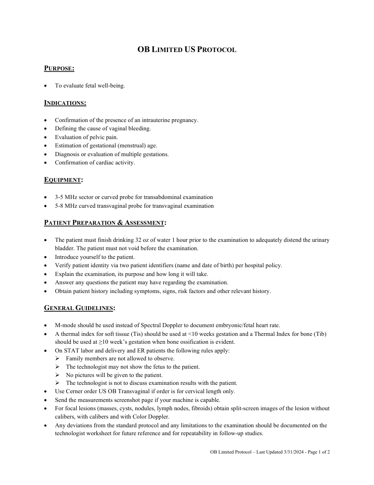
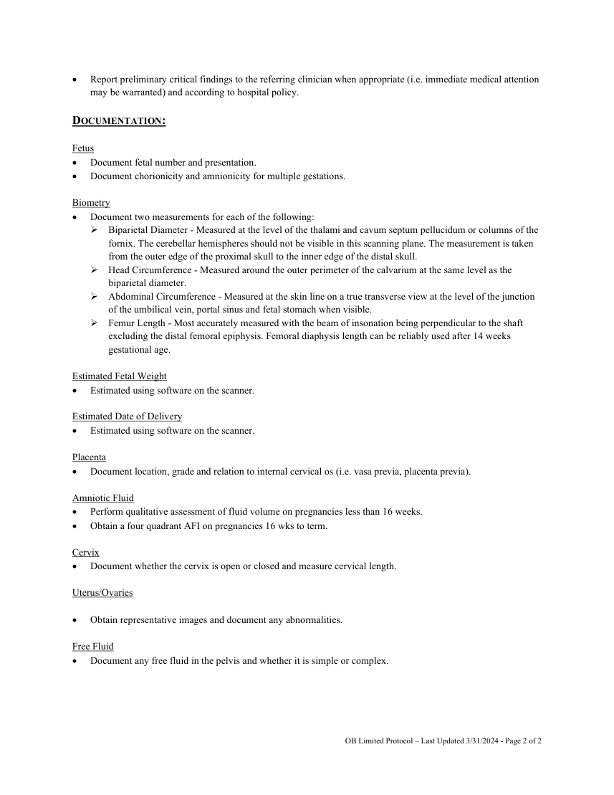

# Ecografie — Examinare obstetricală limitată (MCB)

## Documentul original MCB — Examinare obstetricală limitată

**Protocol · 2 pagini · consultat la 2026-09-27.**

[Descarcă PDF-ul integral](../../assets/mcb-modalities/eco-examinare-obstetricala-limitata-mcb/document.pdf) · [Sursa MCB](https://ref.mcbradiology.com/Protocols,%20Policies,%20Worksheets%20&%20Forms/US/Protocols/OB%20Limited.pdf) · [Catalogul MCB pentru această modalitate](../mcb/index.md)

Instrucțiunile, valorile și ilustrațiile din documentul original sunt păstrate în **engleză**. Titlul și navigarea sunt în română.

### Pagina 1

{ loading=lazy }

### Pagina 2

{ loading=lazy }

## Textul documentului original

??? abstract "Pagina 1 — text în engleză"

    
OB LIMITED US PROTOCOL 
     
    PURPOSE:  
     
     
    To evaluate fetal well-being. 
     
    INDICATIONS: 
     
     
    Confirmation of the presence of an intrauterine pregnancy. 
     
    Defining the cause of vaginal bleeding. 
     
    Evaluation of pelvic pain. 
     
    Estimation of gestational (menstrual) age. 
     
    Diagnosis or evaluation of multiple gestations. 
     
    Confirmation of cardiac activity. 
     
    EQUIPMENT: 
     
     
    3-5 MHz sector or curved probe for transabdominal examination 
     
    5-8 MHz curved transvaginal probe for transvaginal examination 
     
    PATIENT PREPARATION &amp; ASSESSMENT: 
     
     
    The patient must finish drinking 32 oz of water 1 hour prior to the examination to adequately distend the urinary 
    bladder. The patient must not void before the examination. 
     
    Introduce yourself to the patient.  
     
    Verify patient identity via two patient identifiers (name and date of birth) per hospital policy. 
     
    Explain the examination, its purpose and how long it will take. 
     
    Answer any questions the patient may have regarding the examination. 
     
    Obtain patient history including symptoms, signs, risk factors and other relevant history. 
     
    GENERAL GUIDELINES: 
     
     
    M-mode should be used instead of Spectral Doppler to document embryonic/fetal heart rate. 
     
    A thermal index for soft tissue (Tis) should be used at &lt;10 weeks gestation and a Thermal Index for bone (Tib) 
    should be used at ≥10 week’s gestation when bone ossification is evident. 
     
    On STAT labor and delivery and ER patients the following rules apply: 
     Family members are not allowed to observe. 
     The technologist may not show the fetus to the patient. 
     No pictures will be given to the patient. 
     The technologist is not to discuss examination results with the patient. 
     
    Use Cerner order US OB Transvaginal if order is for cervical length only. 
     
    Send the measurements screenshot page if your machine is capable. 
     
    For focal lesions (masses, cysts, nodules, lymph nodes, fibroids) obtain split-screen images of the lesion without 
    calibers, with calibers and with Color Doppler.  
     
    Any deviations from the standard protocol and any limitations to the examination should be documented on the 
    technologist worksheet for future reference and for repeatability in follow-up studies. 
     
     
    OB Limited Protocol – Last Updated 3/31/2024 - Page 1 of 2 
     
    

??? abstract "Pagina 2 — text în engleză"

    
 
    Report preliminary critical findings to the referring clinician when appropriate (i.e. immediate medical attention 
    may be warranted) and according to hospital policy. 
     
    DOCUMENTATION: 
     
    Fetus 
     
    Document fetal number and presentation. 
     
    Document chorionicity and amnionicity for multiple gestations. 
     
    Biometry 
     
    Document two measurements for each of the following: 
     Biparietal Diameter - Measured at the level of the thalami and cavum septum pellucidum or columns of the 
    fornix. The cerebellar hemispheres should not be visible in this scanning plane. The measurement is taken 
    from the outer edge of the proximal skull to the inner edge of the distal skull. 
     Head Circumference - Measured around the outer perimeter of the calvarium at the same level as the 
    biparietal diameter. 
     Abdominal Circumference - Measured at the skin line on a true transverse view at the level of the junction 
    of the umbilical vein, portal sinus and fetal stomach when visible. 
     Femur Length - Most accurately measured with the beam of insonation being perpendicular to the shaft 
    excluding the distal femoral epiphysis. Femoral diaphysis length can be reliably used after 14 weeks 
    gestational age. 
     
    Estimated Fetal Weight 
     
    Estimated using software on the scanner. 
     
    Estimated Date of Delivery 
     
    Estimated using software on the scanner. 
     
    Placenta 
     
    Document location, grade and relation to internal cervical os (i.e. vasa previa, placenta previa). 
     
    Amniotic Fluid 
     
    Perform qualitative assessment of fluid volume on pregnancies less than 16 weeks. 
     
    Obtain a four quadrant AFI on pregnancies 16 wks to term. 
     
    Cervix 
     
    Document whether the cervix is open or closed and measure cervical length. 
     
    Uterus/Ovaries 
     
     
    Obtain representative images and document any abnormalities. 
     
    Free Fluid 
     
    Document any free fluid in the pelvis and whether it is simple or complex.  
     
     
    OB Limited Protocol – Last Updated 3/31/2024 - Page 2 of 2 
     
    

