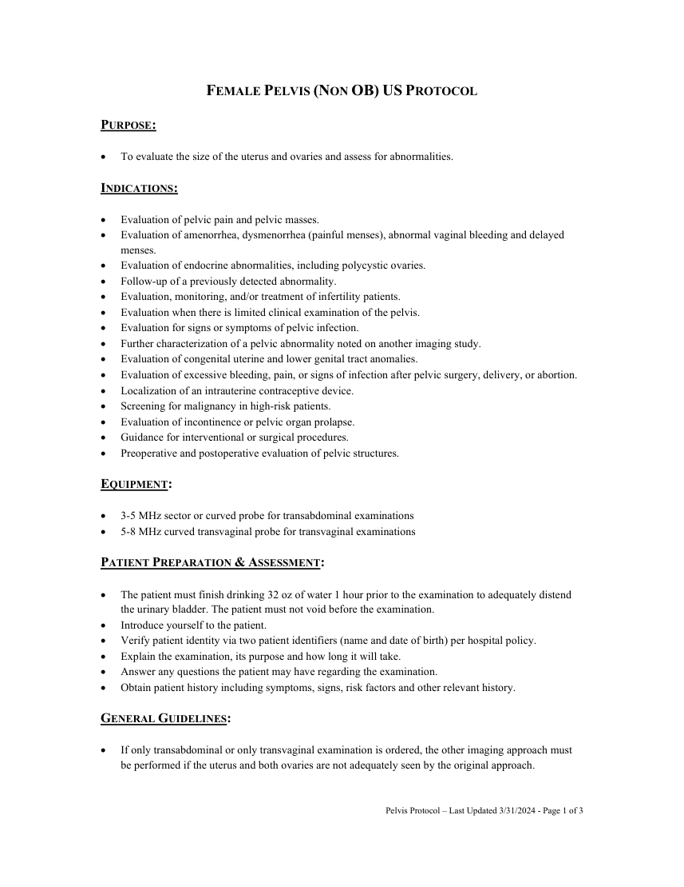
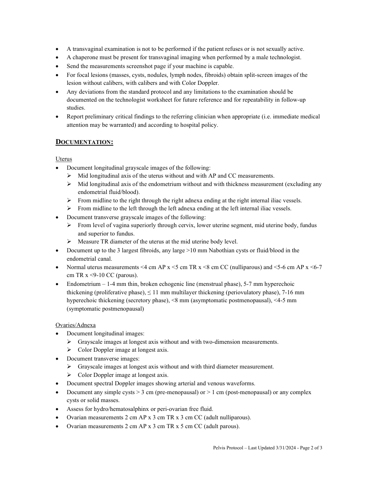
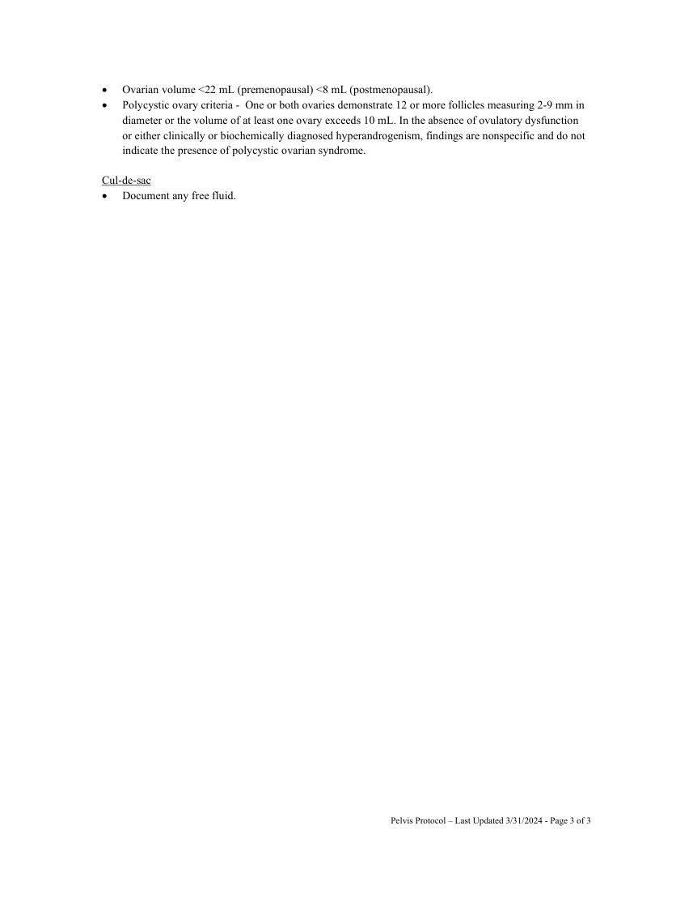

# Ecografie — Pelvis feminin neobstetrical (MCB)

## Documentul original MCB — Pelvis feminin neobstetrical

**Protocol · 3 pagini · consultat la 2026-09-27.**

[Descarcă PDF-ul integral](../../assets/mcb-modalities/eco-pelvis-feminin-neobstetrical-mcb/document.pdf) · [Sursa MCB](https://ref.mcbradiology.com/Protocols,%20Policies,%20Worksheets%20&%20Forms/US/Protocols/Female%20Pelvis%20%28Non%20OB%29.pdf) · [Catalogul MCB pentru această modalitate](../mcb/index.md)

Instrucțiunile, valorile și ilustrațiile din documentul original sunt păstrate în **engleză**. Titlul și navigarea sunt în română.

### Pagina 1

{ loading=lazy }

### Pagina 2

{ loading=lazy }

### Pagina 3

{ loading=lazy }

## Textul documentului original

??? abstract "Pagina 1 — text în engleză"

    
FEMALE PELVIS (NON OB) US PROTOCOL 
     
    PURPOSE: 
     
     
    To evaluate the size of the uterus and ovaries and assess for abnormalities. 
     
    INDICATIONS: 
     
     
    Evaluation of pelvic pain and pelvic masses. 
     
    Evaluation of amenorrhea, dysmenorrhea (painful menses), abnormal vaginal bleeding and delayed 
    menses. 
     
    Evaluation of endocrine abnormalities, including polycystic ovaries. 
     
    Follow-up of a previously detected abnormality. 
     
    Evaluation, monitoring, and/or treatment of infertility patients. 
     
    Evaluation when there is limited clinical examination of the pelvis. 
     
    Evaluation for signs or symptoms of pelvic infection. 
     
    Further characterization of a pelvic abnormality noted on another imaging study. 
     
    Evaluation of congenital uterine and lower genital tract anomalies. 
     
    Evaluation of excessive bleeding, pain, or signs of infection after pelvic surgery, delivery, or abortion. 
     
    Localization of an intrauterine contraceptive device. 
     
    Screening for malignancy in high-risk patients. 
     
    Evaluation of incontinence or pelvic organ prolapse. 
     
    Guidance for interventional or surgical procedures. 
     
    Preoperative and postoperative evaluation of pelvic structures. 
     
    EQUIPMENT: 
     
     
    3-5 MHz sector or curved probe for transabdominal examinations 
     
    5-8 MHz curved transvaginal probe for transvaginal examinations 
     
    PATIENT PREPARATION &amp; ASSESSMENT: 
     
     
    The patient must finish drinking 32 oz of water 1 hour prior to the examination to adequately distend 
    the urinary bladder. The patient must not void before the examination. 
     
    Introduce yourself to the patient.  
     
    Verify patient identity via two patient identifiers (name and date of birth) per hospital policy. 
     
    Explain the examination, its purpose and how long it will take. 
     
    Answer any questions the patient may have regarding the examination. 
     
    Obtain patient history including symptoms, signs, risk factors and other relevant history. 
     
    GENERAL GUIDELINES: 
     
     
    If only transabdominal or only transvaginal examination is ordered, the other imaging approach must 
    be performed if the uterus and both ovaries are not adequately seen by the original approach. 
     
     
    Pelvis Protocol – Last Updated 3/31/2024 - Page 1 of 3 
     
     
    

??? abstract "Pagina 2 — text în engleză"

    
 
    A transvaginal examination is not to be performed if the patient refuses or is not sexually active. 
     
    A chaperone must be present for transvaginal imaging when performed by a male technologist. 
     
    Send the measurements screenshot page if your machine is capable. 
     
    For focal lesions (masses, cysts, nodules, lymph nodes, fibroids) obtain split-screen images of the 
    lesion without calibers, with calibers and with Color Doppler.  
     
    Any deviations from the standard protocol and any limitations to the examination should be 
    documented on the technologist worksheet for future reference and for repeatability in follow-up 
    studies. 
     
    Report preliminary critical findings to the referring clinician when appropriate (i.e. immediate medical 
    attention may be warranted) and according to hospital policy. 
     
    DOCUMENTATION: 
     
    Uterus 
     
    Document longitudinal grayscale images of the following: 
     Mid longitudinal axis of the uterus without and with AP and CC measurements. 
     Mid longitudinal axis of the endometrium without and with thickness measurement (excluding any 
    endometrial fluid/blood). 
     From midline to the right through the right adnexa ending at the right internal iliac vessels. 
     From midline to the left through the left adnexa ending at the left internal iliac vessels. 
     
    Document transverse grayscale images of the following: 
     From level of vagina superiorly through cervix, lower uterine segment, mid uterine body, fundus 
    and superior to fundus. 
     Measure TR diameter of the uterus at the mid uterine body level. 
     
    Document up to the 3 largest fibroids, any large &gt;10 mm Nabothian cysts or fluid/blood in the 
    endometrial canal. 
     
    Normal uterus measurements &lt;4 cm AP x &lt;5 cm TR x &lt;8 cm CC (nulliparous) and &lt;5-6 cm AP x &lt;6-7 
    cm TR x &lt;9-10 CC (parous). 
     
    Endometrium – 1-4 mm thin, broken echogenic line (menstrual phase), 5-7 mm hyperechoic 
    thickening (proliferative phase), ≤ 11 mm multilayer thickening (periovulatory phase), 7-16 mm 
    hyperechoic thickening (secretory phase), &lt;8 mm (asymptomatic postmenopausal), &lt;4-5 mm 
    (symptomatic postmenopausal) 
     
    Ovaries/Adnexa 
     
    Document longitudinal images: 
     Grayscale images at longest axis without and with two-dimension measurements. 
     Color Doppler image at longest axis. 
     
    Document transverse images: 
     Grayscale images at longest axis without and with third diameter measurement. 
     Color Doppler image at longest axis. 
     
    Document spectral Doppler images showing arterial and venous waveforms. 
     
    Document any simple cysts &gt; 3 cm (pre-menopausal) or &gt; 1 cm (post-menopausal) or any complex 
    cysts or solid masses. 
     
    Assess for hydro/hematosalphinx or peri-ovarian free fluid. 
     
    Ovarian measurements 2 cm AP x 3 cm TR x 3 cm CC (adult nulliparous). 
     
    Ovarian measurements 2 cm AP x 3 cm TR x 5 cm CC (adult parous). 
     
     
    Pelvis Protocol – Last Updated 3/31/2024 - Page 2 of 3 
     
     
    

??? abstract "Pagina 3 — text în engleză"

    
 
    Ovarian volume &lt;22 mL (premenopausal) &lt;8 mL (postmenopausal). 
     
    Polycystic ovary criteria -  One or both ovaries demonstrate 12 or more follicles measuring 2-9 mm in 
    diameter or the volume of at least one ovary exceeds 10 mL. In the absence of ovulatory dysfunction 
    or either clinically or biochemically diagnosed hyperandrogenism, findings are nonspecific and do not 
    indicate the presence of polycystic ovarian syndrome. 
     
    Cul-de-sac 
     
    Document any free fluid. 
     
     
     
     
     
     
    Pelvis Protocol – Last Updated 3/31/2024 - Page 3 of 3 
     
     
    

