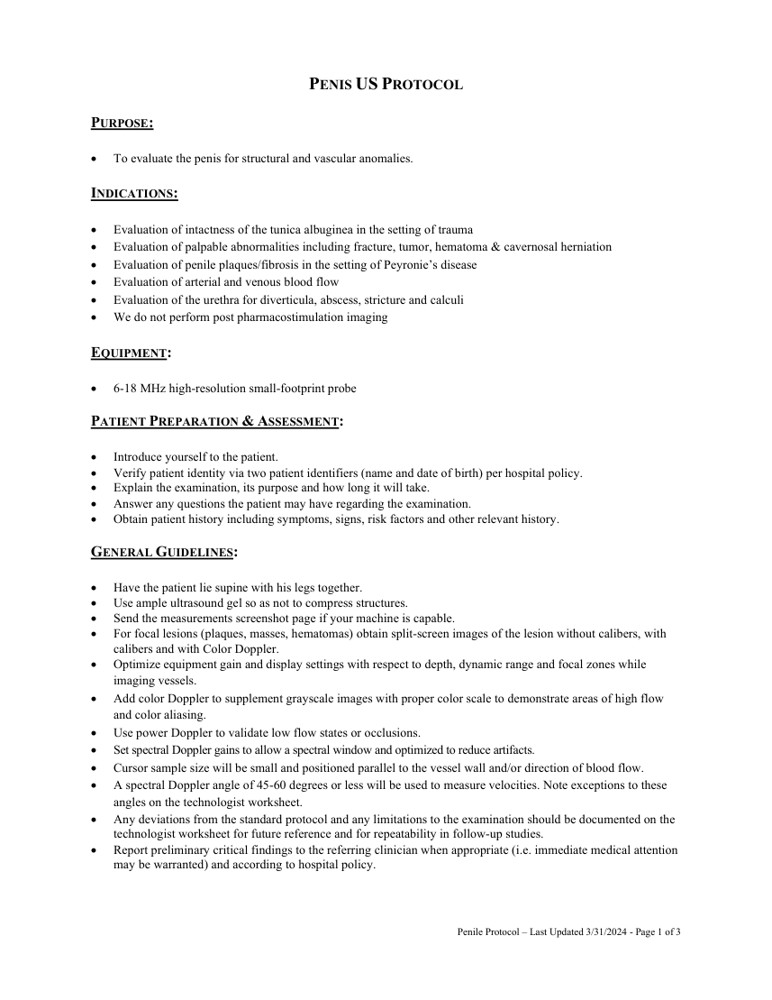
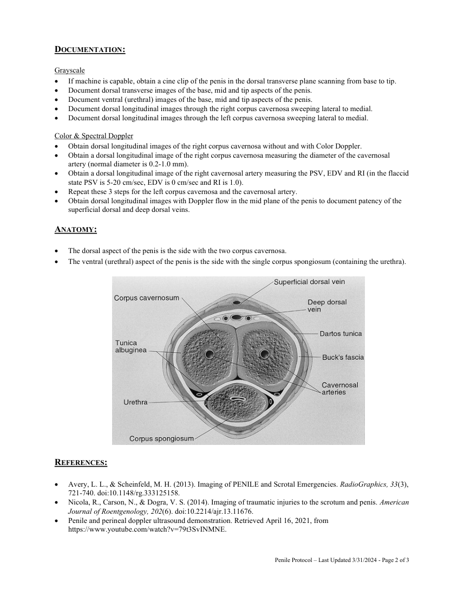

# Ecografie — Penis (MCB)

## Documentul original MCB — Penis

**Protocol · 3 pagini · consultat la 2026-09-27.**

[Descarcă PDF-ul integral](../../assets/mcb-modalities/eco-penis-mcb/document.pdf) · [Sursa MCB](https://ref.mcbradiology.com/Protocols,%20Policies,%20Worksheets%20&%20Forms/US/Protocols/Penis.pdf) · [Catalogul MCB pentru această modalitate](../mcb/index.md)

Instrucțiunile, valorile și ilustrațiile din documentul original sunt păstrate în **engleză**. Titlul și navigarea sunt în română.

### Pagina 1

{ loading=lazy }

### Pagina 2

{ loading=lazy }

### Pagina 3

{ loading=lazy }

## Textul documentului original

??? abstract "Pagina 1 — text în engleză"

    
PENIS US PROTOCOL 
     
    PURPOSE:  
     
     
    To evaluate the penis for structural and vascular anomalies. 
     
    INDICATIONS: 
     
     
    Evaluation of intactness of the tunica albuginea in the setting of trauma 
     
    Evaluation of palpable abnormalities including fracture, tumor, hematoma &amp; cavernosal herniation 
     
    Evaluation of penile plaques/fibrosis in the setting of Peyronie’s disease 
     
    Evaluation of arterial and venous blood flow 
     
    Evaluation of the urethra for diverticula, abscess, stricture and calculi 
     
    We do not perform post pharmacostimulation imaging 
     
    EQUIPMENT: 
     
     
    6-18 MHz high-resolution small-footprint probe 
     
    PATIENT PREPARATION &amp; ASSESSMENT: 
     
     
    Introduce yourself to the patient.  
     
    Verify patient identity via two patient identifiers (name and date of birth) per hospital policy. 
     
    Explain the examination, its purpose and how long it will take. 
     
    Answer any questions the patient may have regarding the examination. 
     
    Obtain patient history including symptoms, signs, risk factors and other relevant history. 
     
    GENERAL GUIDELINES: 
     
     
    Have the patient lie supine with his legs together. 
     
    Use ample ultrasound gel so as not to compress structures. 
     
    Send the measurements screenshot page if your machine is capable. 
     
    For focal lesions (plaques, masses, hematomas) obtain split-screen images of the lesion without calibers, with 
    calibers and with Color Doppler.  
     
    Optimize equipment gain and display settings with respect to depth, dynamic range and focal zones while 
    imaging vessels. 
     
    Add color Doppler to supplement grayscale images with proper color scale to demonstrate areas of high flow 
    and color aliasing. 
     
    Use power Doppler to validate low flow states or occlusions. 
     
    Set spectral Doppler gains to allow a spectral window and optimized to reduce artifacts. 
     
    Cursor sample size will be small and positioned parallel to the vessel wall and/or direction of blood flow. 
     
    A spectral Doppler angle of 45-60 degrees or less will be used to measure velocities. Note exceptions to these 
    angles on the technologist worksheet. 
     
    Any deviations from the standard protocol and any limitations to the examination should be documented on the 
    technologist worksheet for future reference and for repeatability in follow-up studies. 
     
    Report preliminary critical findings to the referring clinician when appropriate (i.e. immediate medical attention 
    may be warranted) and according to hospital policy. 
     
     
     
    Penile Protocol – Last Updated 3/31/2024 - Page 1 of 3 
     
    

??? abstract "Pagina 2 — text în engleză"

    
DOCUMENTATION: 
     
    Grayscale 
     
    If machine is capable, obtain a cine clip of the penis in the dorsal transverse plane scanning from base to tip.  
     
    Document dorsal transverse images of the base, mid and tip aspects of the penis. 
     
    Document ventral (urethral) images of the base, mid and tip aspects of the penis. 
     
    Document dorsal longitudinal images through the right corpus cavernosa sweeping lateral to medial. 
     
    Document dorsal longitudinal images through the left corpus cavernosa sweeping lateral to medial. 
     
    Color &amp; Spectral Doppler 
     
    Obtain dorsal longitudinal images of the right corpus cavernosa without and with Color Doppler. 
     
    Obtain a dorsal longitudinal image of the right corpus cavernosa measuring the diameter of the cavernosal 
    artery (normal diameter is 0.2-1.0 mm). 
     
    Obtain a dorsal longitudinal image of the right cavernosal artery measuring the PSV, EDV and RI (in the flaccid 
    state PSV is 5-20 cm/sec, EDV is 0 cm/sec and RI is 1.0). 
     
    Repeat these 3 steps for the left corpus cavernosa and the cavernosal artery. 
     
    Obtain dorsal longitudinal images with Doppler flow in the mid plane of the penis to document patency of the 
    superficial dorsal and deep dorsal veins. 
     
    ANATOMY: 
     
     
    The dorsal aspect of the penis is the side with the two corpus cavernosa. 
     
    The ventral (urethral) aspect of the penis is the side with the single corpus spongiosum (containing the urethra). 
     
     
     
    REFERENCES: 
     
    Avery, L. L., &amp; Scheinfeld, M. H. (2013). Imaging of PENILE and Scrotal Emergencies. RadioGraphics, 33(3), 
    721-740. doi:10.1148/rg.333125158. 
     
    Nicola, R., Carson, N., &amp; Dogra, V. S. (2014). Imaging of traumatic injuries to the scrotum and penis. American 
    Journal of Roentgenology, 202(6). doi:10.2214/ajr.13.11676. 
     
    Penile and perineal doppler ultrasound demonstration. Retrieved April 16, 2021, from 
    https://www.youtube.com/watch?v=79t3SvINMNE. 
     
     
    Penile Protocol – Last Updated 3/31/2024 - Page 2 of 3 
     
    

??? abstract "Pagina 3 — text în engleză"

    
 
    Penile Ultrasound. Retrieved April 16, 2021, from https://russellgroupllc.org/wp-
    content/themes/bgmd/assets/presentations/PenileUltrasoundOct2010s.pdf. 
     
    Penile Ultrasound. Retrieved April 16, 2021, from https://radiologykey.com/penile-ultrasound/. 
     
     
     
    Penile Protocol – Last Updated 3/31/2024 - Page 3 of 3 
     
    

