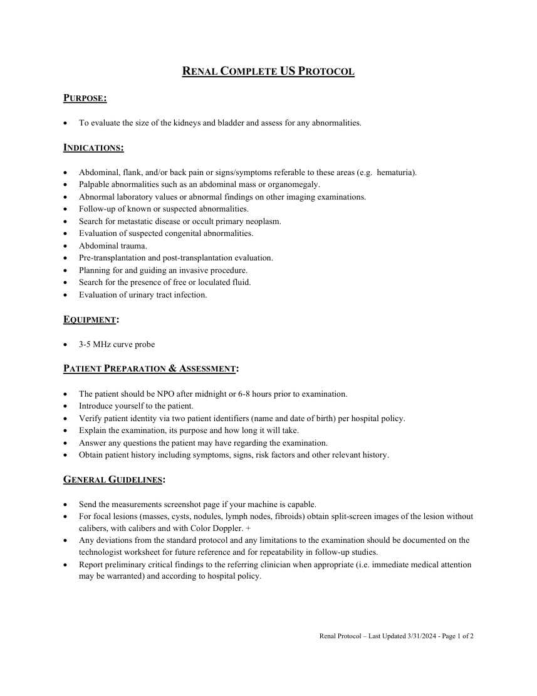
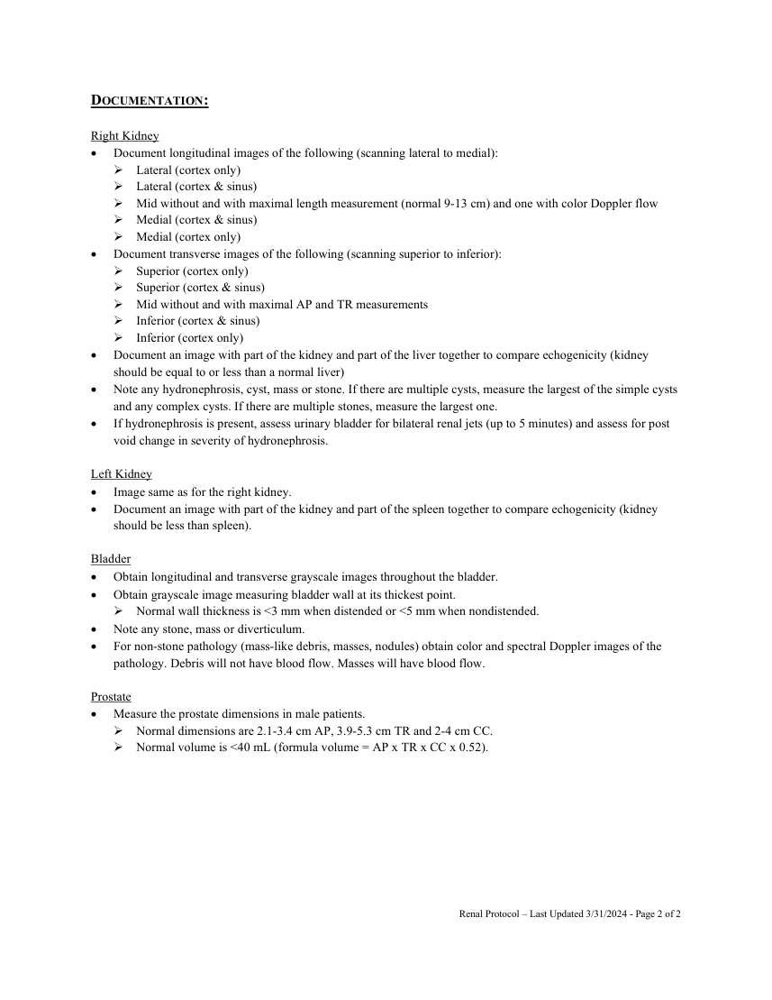

# Ecografie — Rinichi: examinare completă (MCB)

## Documentul original MCB — Rinichi: examinare completă

**Protocol · 2 pagini · consultat la 2026-09-27.**

[Descarcă PDF-ul integral](../../assets/mcb-modalities/eco-rinichi-examinare-completa-mcb/document.pdf) · [Sursa MCB](https://ref.mcbradiology.com/Protocols,%20Policies,%20Worksheets%20&%20Forms/US/Protocols/Renal%20Complete.pdf) · [Catalogul MCB pentru această modalitate](../mcb/index.md)

Instrucțiunile, valorile și ilustrațiile din documentul original sunt păstrate în **engleză**. Titlul și navigarea sunt în română.

### Pagina 1

{ loading=lazy }

### Pagina 2

{ loading=lazy }

## Textul documentului original

??? abstract "Pagina 1 — text în engleză"

    
 
    RENAL COMPLETE US PROTOCOL  
     
    PURPOSE: 
     
     
    To evaluate the size of the kidneys and bladder and assess for any abnormalities. 
     
    INDICATIONS: 
     
     
    Abdominal, flank, and/or back pain or signs/symptoms referable to these areas (e.g.  hematuria). 
     
    Palpable abnormalities such as an abdominal mass or organomegaly. 
     
    Abnormal laboratory values or abnormal findings on other imaging examinations. 
     
    Follow-up of known or suspected abnormalities. 
     
    Search for metastatic disease or occult primary neoplasm. 
     
    Evaluation of suspected congenital abnormalities. 
     
    Abdominal trauma. 
     
    Pre-transplantation and post-transplantation evaluation. 
     
    Planning for and guiding an invasive procedure. 
     
    Search for the presence of free or loculated fluid. 
     
    Evaluation of urinary tract infection. 
     
    EQUIPMENT: 
     
     
    3-5 MHz curve probe 
     
    PATIENT PREPARATION &amp; ASSESSMENT: 
     
     
    The patient should be NPO after midnight or 6-8 hours prior to examination. 
     
    Introduce yourself to the patient.  
     
    Verify patient identity via two patient identifiers (name and date of birth) per hospital policy. 
     
    Explain the examination, its purpose and how long it will take. 
     
    Answer any questions the patient may have regarding the examination. 
     
    Obtain patient history including symptoms, signs, risk factors and other relevant history. 
     
    GENERAL GUIDELINES: 
     
     
    Send the measurements screenshot page if your machine is capable. 
     
    For focal lesions (masses, cysts, nodules, lymph nodes, fibroids) obtain split-screen images of the lesion without 
    calibers, with calibers and with Color Doppler. + 
     
    Any deviations from the standard protocol and any limitations to the examination should be documented on the 
    technologist worksheet for future reference and for repeatability in follow-up studies. 
     
    Report preliminary critical findings to the referring clinician when appropriate (i.e. immediate medical attention 
    may be warranted) and according to hospital policy. 
     
     
     
     
    Renal Protocol – Last Updated 3/31/2024 - Page 1 of 2 
     
     
    

??? abstract "Pagina 2 — text în engleză"

    
 
    DOCUMENTATION: 
     
    Right Kidney 
     
    Document longitudinal images of the following (scanning lateral to medial): 
     Lateral (cortex only) 
     Lateral (cortex &amp; sinus) 
     Mid without and with maximal length measurement (normal 9-13 cm) and one with color Doppler flow 
     Medial (cortex &amp; sinus) 
     Medial (cortex only) 
     
    Document transverse images of the following (scanning superior to inferior): 
     Superior (cortex only) 
     Superior (cortex &amp; sinus) 
     Mid without and with maximal AP and TR measurements 
     Inferior (cortex &amp; sinus) 
     Inferior (cortex only) 
     
    Document an image with part of the kidney and part of the liver together to compare echogenicity (kidney 
    should be equal to or less than a normal liver) 
     
    Note any hydronephrosis, cyst, mass or stone. If there are multiple cysts, measure the largest of the simple cysts 
    and any complex cysts. If there are multiple stones, measure the largest one. 
     
    If hydronephrosis is present, assess urinary bladder for bilateral renal jets (up to 5 minutes) and assess for post 
    void change in severity of hydronephrosis. 
     
    Left Kidney 
     
    Image same as for the right kidney. 
     
    Document an image with part of the kidney and part of the spleen together to compare echogenicity (kidney 
    should be less than spleen). 
     
    Bladder 
     
    Obtain longitudinal and transverse grayscale images throughout the bladder. 
     
    Obtain grayscale image measuring bladder wall at its thickest point. 
     Normal wall thickness is &lt;3 mm when distended or &lt;5 mm when nondistended. 
     
    Note any stone, mass or diverticulum. 
     
    For non-stone pathology (mass-like debris, masses, nodules) obtain color and spectral Doppler images of the 
    pathology. Debris will not have blood flow. Masses will have blood flow. 
     
    Prostate 
     
    Measure the prostate dimensions in male patients. 
     Normal dimensions are 2.1-3.4 cm AP, 3.9-5.3 cm TR and 2-4 cm CC. 
     Normal volume is &lt;40 mL (formula volume = AP x TR x CC x 0.52). 
     
     
    Renal Protocol – Last Updated 3/31/2024 - Page 2 of 2 
     
     
    

