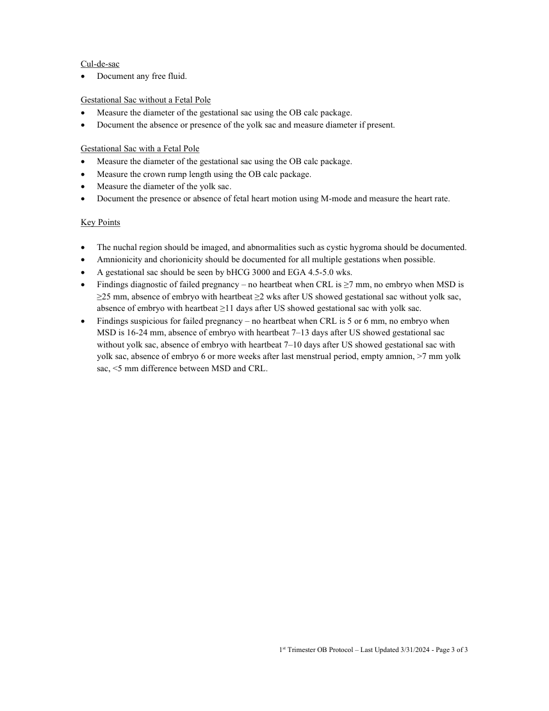

# Ecografie — Sarcină în trimestrul I (MCB)

## Documentul original MCB — Sarcină în trimestrul I

**Protocol · 3 pagini · consultat la 2026-09-27.**

[Descarcă PDF-ul integral](../../assets/mcb-modalities/eco-sarcina-in-trimestrul-i-mcb/document.pdf) · [Sursa MCB](https://ref.mcbradiology.com/Protocols,%20Policies,%20Worksheets%20&%20Forms/US/Protocols/1st%20Trimester%20OB.pdf) · [Catalogul MCB pentru această modalitate](../mcb/index.md)

Instrucțiunile, valorile și ilustrațiile din documentul original sunt păstrate în **engleză**. Titlul și navigarea sunt în română.

### Pagina 1

{ loading=lazy }

### Pagina 2

{ loading=lazy }

### Pagina 3

{ loading=lazy }

## Textul documentului original

??? abstract "Pagina 1 — text în engleză"

    
1ST TRIMESTER OB US PROTOCOL 
     
     
    PURPOSE: 
     
     
    To confirm the presence of a pregnancy, to estimate the gestational age of the fetus and to assess for 
    abnormalities in the uterus or ovaries. 
     
    INDICATIONS: 
     
     
    Evaluation for the cause of pelvic pain and/or vaginal bleeding. 
     
    Evaluation of maternal pelvic masses and/or uterine abnormalities. 
     
    Confirmation of a suspected intrauterine pregnancy. 
     
    Evaluation for a suspected ectopic pregnancy. 
     
    Estimation of gestational (menstrual) age. 
     
    Diagnosis or evaluation of multiple gestations. 
     
    Confirmation of fetal cardiac activity. 
     
    Assessing for certain fetal anomalies, such as anencephaly, in high risk patients. 
     
    Measuring the nuchal translucency (NT) when part of a screening program for fetal aneuploidy. 
     
    Evaluation of suspected hydatidiform mole. 
     
    Imaging as an adjunct to chorionic villus sampling, embryo transfer, and localization and removal of 
    an intrauterine device. 
     
    EQUIPMENT: 
     
     
    3-5 MHz sector or curved probe for transabdominal evaluation 
     
    5-8 MHz curved transvaginal probe for transvaginal evaluation 
     
    PATIENT PREPARATION &amp; ASSESSMENT: 
     
     
    The patient must finish drinking 32 oz of water 1 hour prior to the examination to adequately distend 
    the urinary bladder. The patient must not void before the examination. 
     
    Introduce yourself to the patient.  
     
    Verify patient identity via two patient identifiers (name and date of birth) per hospital policy. 
     
    Explain the examination, its purpose and how long it will take. 
     
    Answer any questions the patient may have regarding the examination. 
     
    Obtain patient history including symptoms, signs, risk factors and other relevant history. 
     
    GENERAL GUIDELINES: 
     
     
    Scanning in the first trimester may be performed either transabdominally or transvaginally. If a 
    transabdominal examination is not definitive (viable IUP not confirmed and/or both ovaries not 
    visualized), a transvaginal or transperineal scan should be performed whenever possible. 
     
    A transvaginal examination is not to be performed if the patient refuses or is not sexually active. 
     
    A chaperone must be present for transvaginal imaging when performed by a male technologist. 
     
    If a yolk sac and/or a fetal pole is present (i.e. definite IUP) leave the order as US 1st Trimester. 
     
     
    1st Trimester OB Protocol – Last Updated 3/31/2024 - Page 1 of 3 
     
     
    

??? abstract "Pagina 2 — text în engleză"

    
 
    If a yolk sac or a fetal pole is not present (i.e. not definite IUP) change the order to US Pelvis 
    Complete. 
     
    M-mode should be used instead of spectral Doppler to document embryonic/fetal heart rate. 
     
    A thermal index for soft tissue (Tis) should be used at &lt;10 weeks gestation and a thermal index for 
    bone (Tib) should be used at ≥10 weeks gestation when bone ossification is evident. 
     
    On STAT labor and delivery and ER patients, the following rules apply: 
     Family members are not allowed to observe. 
     The technologist may not show the fetus to the patient. 
     No pictures will be given to the patient. 
     The technologist is not to discuss examination results with the patient. 
     
    Send the measurements screenshot page if your machine is capable. 
     
    For focal lesions (masses, cysts, nodules, lymph nodes, fibroids) obtain split-screen images of the 
    lesion without calibers, with calibers and with Color Doppler.  
     
    Any deviations from the standard protocol and any limitations to the examination should be 
    documented on the technologist worksheet for future reference and for repeatability in follow-up 
    studies. 
     
    Report preliminary critical findings to the referring clinician when appropriate (i.e. immediate medical 
    attention may be warranted) and according to hospital policy. 
     
    DOCUMENTATION: 
     
    Uterus 
     
    Document longitudinal grayscale images of the following: 
     Mid longitudinal axis of the uterus without and with AP and CC dimension measurements. 
     Mid longitudinal axis of the endometrium without and with thickness measurement (if no IUP). 
     From midline to the right through the right adnexa ending at the right internal iliac vessels. 
     From midline to the left through the left adnexa ending at the left internal iliac vessels. 
     Assess whether the cervix is closed or open and measure its length. 
     
    Document transverse grayscale images of the following: 
     From level of vagina superiorly through cervix, lower uterine segment, mid uterine body, fundus 
    and superior to the fundus. 
     Measure TR dimension measurement of the uterus at the level of the mid uterine body. 
     
    Document up to the 3 largest fibroids, any large &gt;10 mm Nabothian cysts or fluid/blood in the 
    endometrial canal. 
     
    Ovaries/Adnexa 
     
    Document longitudinal images of the following: 
     Grayscale images at the longest axis without and with two-dimension measurements. 
     Color Doppler image at the longest axis. 
     
    Document transverse images of the following: 
     Grayscale images at the longest axis without and with the third diameter measurement. 
     Color Doppler image at the longest axis. 
     
    Document spectral Doppler images displaying arterial and venous waveforms. 
     
    Document any simple cysts &gt;3 cm or complex cysts or solid masses of any size. 
     
    Assess for hydro/hematosalphinx or peri-ovarian free fluid. 
     
     
     
     
    1st Trimester OB Protocol – Last Updated 3/31/2024 - Page 2 of 3 
     
     
    

??? abstract "Pagina 3 — text în engleză"

    
Cul-de-sac 
     
    Document any free fluid. 
     
    Gestational Sac without a Fetal Pole 
     
    Measure the diameter of the gestational sac using the OB calc package. 
     
    Document the absence or presence of the yolk sac and measure diameter if present. 
     
    Gestational Sac with a Fetal Pole 
     
    Measure the diameter of the gestational sac using the OB calc package. 
     
    Measure the crown rump length using the OB calc package. 
     
    Measure the diameter of the yolk sac. 
     
    Document the presence or absence of fetal heart motion using M-mode and measure the heart rate. 
     
    Key Points 
     
     
    The nuchal region should be imaged, and abnormalities such as cystic hygroma should be documented. 
     
    Amnionicity and chorionicity should be documented for all multiple gestations when possible. 
     
    A gestational sac should be seen by bHCG 3000 and EGA 4.5-5.0 wks. 
     
    Findings diagnostic of failed pregnancy – no heartbeat when CRL is ≥7 mm, no embryo when MSD is 
    ≥25 mm, absence of embryo with heartbeat ≥2 wks after US showed gestational sac without yolk sac, 
    absence of embryo with heartbeat ≥11 days after US showed gestational sac with yolk sac. 
     
    Findings suspicious for failed pregnancy – no heartbeat when CRL is 5 or 6 mm, no embryo when 
    MSD is 16-24 mm, absence of embryo with heartbeat 7–13 days after US showed gestational sac 
    without yolk sac, absence of embryo with heartbeat 7–10 days after US showed gestational sac with 
    yolk sac, absence of embryo 6 or more weeks after last menstrual period, empty amnion, &gt;7 mm yolk 
    sac, &lt;5 mm difference between MSD and CRL.  
     
     
    1st Trimester OB Protocol – Last Updated 3/31/2024 - Page 3 of 3 
     
     
    

