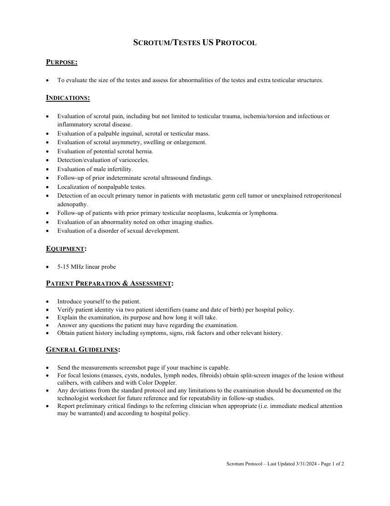
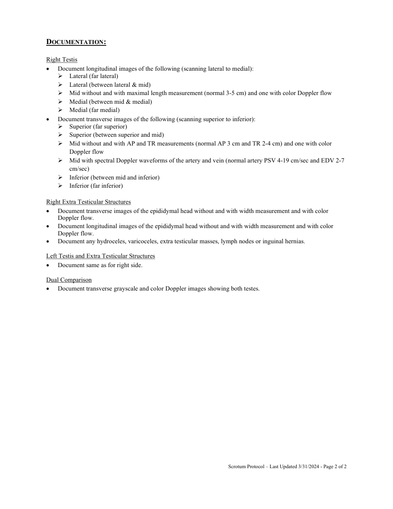

# Ecografie — Scrot și testicule (MCB)

## Documentul original MCB — Scrot și testicule

**Protocol · 2 pagini · consultat la 2026-09-27.**

[Descarcă PDF-ul integral](../../assets/mcb-modalities/eco-scrot-si-testicule-mcb/document.pdf) · [Sursa MCB](https://ref.mcbradiology.com/Protocols,%20Policies,%20Worksheets%20&%20Forms/US/Protocols/Scrotum%20Testes.pdf) · [Catalogul MCB pentru această modalitate](../mcb/index.md)

Instrucțiunile, valorile și ilustrațiile din documentul original sunt păstrate în **engleză**. Titlul și navigarea sunt în română.

### Pagina 1

{ loading=lazy }

### Pagina 2

{ loading=lazy }

## Textul documentului original

??? abstract "Pagina 1 — text în engleză"

    
SCROTUM/TESTES US PROTOCOL 
     
    PURPOSE:  
     
     
    To evaluate the size of the testes and assess for abnormalities of the testes and extra testicular structures. 
     
    INDICATIONS: 
     
     
    Evaluation of scrotal pain, including but not limited to testicular trauma, ischemia/torsion and infectious or 
    inflammatory scrotal disease. 
     
    Evaluation of a palpable inguinal, scrotal or testicular mass. 
     
    Evaluation of scrotal asymmetry, swelling or enlargement. 
     
    Evaluation of potential scrotal hernia. 
     
    Detection/evaluation of varicoceles. 
     
    Evaluation of male infertility. 
     
    Follow-up of prior indeterminate scrotal ultrasound findings. 
     
    Localization of nonpalpable testes. 
     
    Detection of an occult primary tumor in patients with metastatic germ cell tumor or unexplained retroperitoneal 
    adenopathy. 
     
    Follow-up of patients with prior primary testicular neoplasms, leukemia or lymphoma. 
     
    Evaluation of an abnormality noted on other imaging studies. 
     
    Evaluation of a disorder of sexual development. 
     
    EQUIPMENT: 
     
     
    5-15 MHz linear probe 
     
    PATIENT PREPARATION &amp; ASSESSMENT: 
     
     
    Introduce yourself to the patient.  
     
    Verify patient identity via two patient identifiers (name and date of birth) per hospital policy. 
     
    Explain the examination, its purpose and how long it will take. 
     
    Answer any questions the patient may have regarding the examination. 
     
    Obtain patient history including symptoms, signs, risk factors and other relevant history. 
     
    GENERAL GUIDELINES: 
     
     
    Send the measurements screenshot page if your machine is capable. 
     
    For focal lesions (masses, cysts, nodules, lymph nodes, fibroids) obtain split-screen images of the lesion without 
    calibers, with calibers and with Color Doppler.  
     
    Any deviations from the standard protocol and any limitations to the examination should be documented on the 
    technologist worksheet for future reference and for repeatability in follow-up studies. 
     
    Report preliminary critical findings to the referring clinician when appropriate (i.e. immediate medical attention 
    may be warranted) and according to hospital policy. 
     
     
     
     
     
    Scrotum Protocol – Last Updated 3/31/2024 - Page 1 of 2 
     
     
    

??? abstract "Pagina 2 — text în engleză"

    
DOCUMENTATION: 
     
    Right Testis 
     
    Document longitudinal images of the following (scanning lateral to medial): 
     Lateral (far lateral) 
     Lateral (between lateral &amp; mid) 
     Mid without and with maximal length measurement (normal 3-5 cm) and one with color Doppler flow  
     Medial (between mid &amp; medial) 
     Medial (far medial) 
     
    Document transverse images of the following (scanning superior to inferior): 
     Superior (far superior) 
     Superior (between superior and mid) 
     Mid without and with AP and TR measurements (normal AP 3 cm and TR 2-4 cm) and one with color 
    Doppler flow 
     Mid with spectral Doppler waveforms of the artery and vein (normal artery PSV 4-19 cm/sec and EDV 2-7 
    cm/sec) 
     Inferior (between mid and inferior) 
     Inferior (far inferior) 
     
    Right Extra Testicular Structures 
     
    Document transverse images of the epididymal head without and with width measurement and with color 
    Doppler flow.  
     
    Document longitudinal images of the epididymal head without and with width measurement and with color 
    Doppler flow.  
     
    Document any hydroceles, varicoceles, extra testicular masses, lymph nodes or inguinal hernias. 
     
    Left Testis and Extra Testicular Structures 
     
    Document same as for right side.  
     
    Dual Comparison 
     
    Document transverse grayscale and color Doppler images showing both testes.   
     
     
     
     
    Scrotum Protocol – Last Updated 3/31/2024 - Page 2 of 2 
     
     
    

