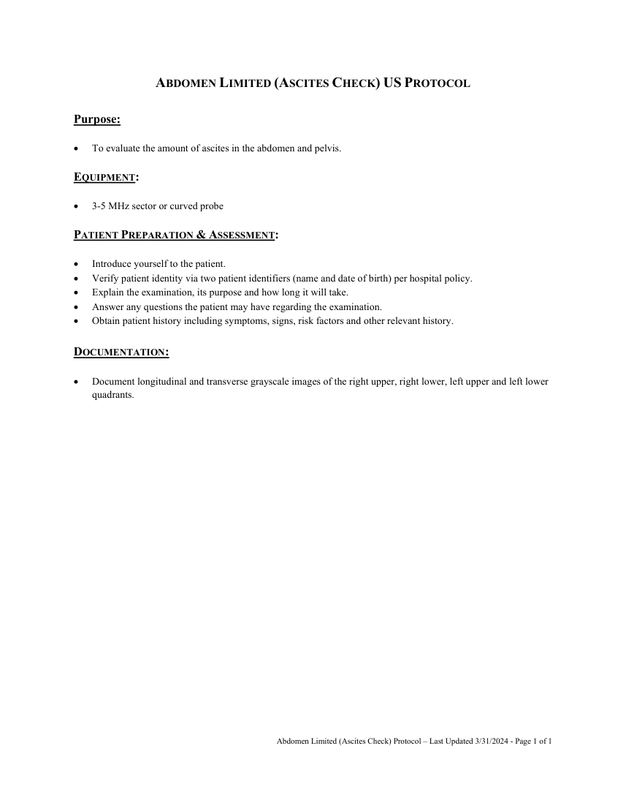

# Ecografie — Verificarea ascitei (MCB)

## Documentul original MCB — Verificarea ascitei

**Protocol · 1 pagini · consultat la 2026-09-27.**

[Descarcă PDF-ul integral](../../assets/mcb-modalities/eco-verificarea-ascitei-mcb/document.pdf) · [Sursa MCB](https://ref.mcbradiology.com/Protocols,%20Policies,%20Worksheets%20&%20Forms/US/Protocols/Abdomen%20Limited%20%28Ascites%20Check%29.pdf) · [Catalogul MCB pentru această modalitate](../mcb/index.md)

Instrucțiunile, valorile și ilustrațiile din documentul original sunt păstrate în **engleză**. Titlul și navigarea sunt în română.

### Pagina 1

{ loading=lazy }

## Textul documentului original

??? abstract "Pagina 1 — text în engleză"

    
 
    ABDOMEN LIMITED (ASCITES CHECK) US PROTOCOL 
     
    Purpose: 
     
     
    To evaluate the amount of ascites in the abdomen and pelvis. 
     
    EQUIPMENT: 
     
     
    3-5 MHz sector or curved probe 
     
    PATIENT PREPARATION &amp; ASSESSMENT: 
     
     
    Introduce yourself to the patient.  
     
    Verify patient identity via two patient identifiers (name and date of birth) per hospital policy. 
     
    Explain the examination, its purpose and how long it will take. 
     
    Answer any questions the patient may have regarding the examination. 
     
    Obtain patient history including symptoms, signs, risk factors and other relevant history. 
     
    DOCUMENTATION: 
     
     
    Document longitudinal and transverse grayscale images of the right upper, right lower, left upper and left lower 
    quadrants. 
     
     
    Abdomen Limited (Ascites Check) Protocol – Last Updated 3/31/2024 - Page 1 of 1 
     
     
    

