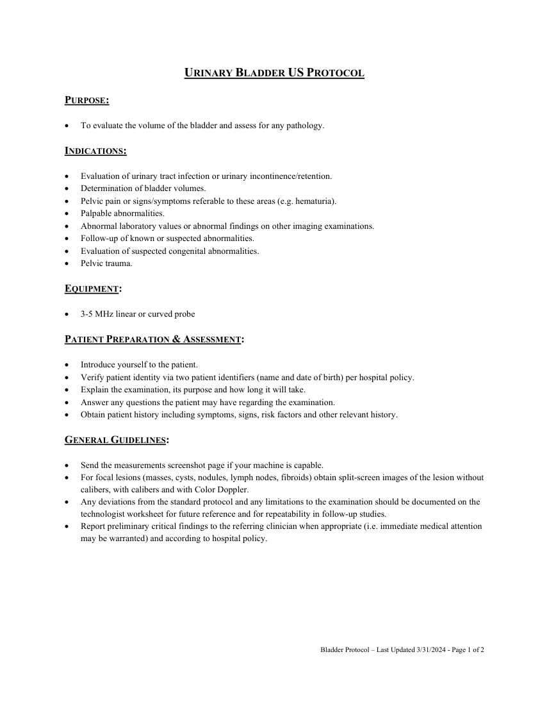
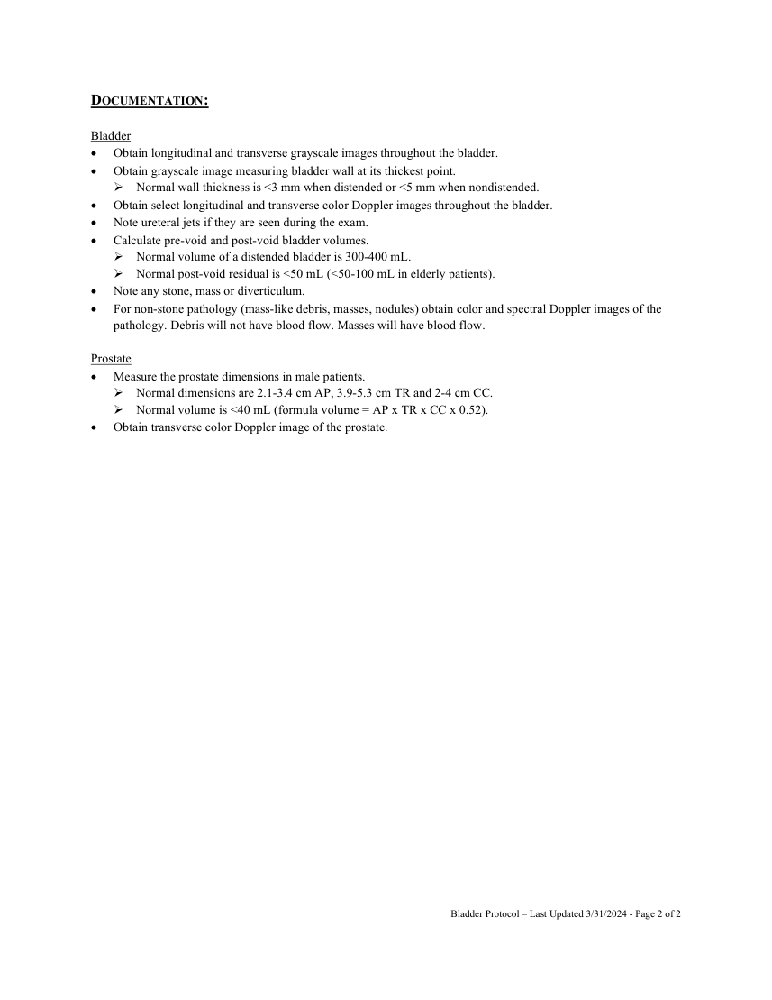

# Ecografie — Vezică urinară (MCB)

## Documentul original MCB — Vezică urinară

**Protocol · 2 pagini · consultat la 2026-09-27.**

[Descarcă PDF-ul integral](../../assets/mcb-modalities/eco-vezica-urinara-mcb/document.pdf) · [Sursa MCB](https://ref.mcbradiology.com/Protocols,%20Policies,%20Worksheets%20&%20Forms/US/Protocols/Urinary%20Bladder.pdf) · [Catalogul MCB pentru această modalitate](../mcb/index.md)

Instrucțiunile, valorile și ilustrațiile din documentul original sunt păstrate în **engleză**. Titlul și navigarea sunt în română.

### Pagina 1

{ loading=lazy }

### Pagina 2

{ loading=lazy }

## Textul documentului original

??? abstract "Pagina 1 — text în engleză"

    
URINARY BLADDER US PROTOCOL  
     
    PURPOSE: 
     
     
    To evaluate the volume of the bladder and assess for any pathology. 
     
    INDICATIONS: 
     
     
    Evaluation of urinary tract infection or urinary incontinence/retention. 
     
    Determination of bladder volumes. 
     
    Pelvic pain or signs/symptoms referable to these areas (e.g. hematuria). 
     
    Palpable abnormalities. 
     
    Abnormal laboratory values or abnormal findings on other imaging examinations. 
     
    Follow-up of known or suspected abnormalities. 
     
    Evaluation of suspected congenital abnormalities. 
     
    Pelvic trauma. 
     
    EQUIPMENT: 
     
     
    3-5 MHz linear or curved probe 
     
    PATIENT PREPARATION &amp; ASSESSMENT: 
     
     
    Introduce yourself to the patient.  
     
    Verify patient identity via two patient identifiers (name and date of birth) per hospital policy. 
     
    Explain the examination, its purpose and how long it will take. 
     
    Answer any questions the patient may have regarding the examination. 
     
    Obtain patient history including symptoms, signs, risk factors and other relevant history. 
     
    GENERAL GUIDELINES: 
     
     
    Send the measurements screenshot page if your machine is capable. 
     
    For focal lesions (masses, cysts, nodules, lymph nodes, fibroids) obtain split-screen images of the lesion without 
    calibers, with calibers and with Color Doppler.  
     
    Any deviations from the standard protocol and any limitations to the examination should be documented on the 
    technologist worksheet for future reference and for repeatability in follow-up studies. 
     
    Report preliminary critical findings to the referring clinician when appropriate (i.e. immediate medical attention 
    may be warranted) and according to hospital policy. 
     
     
     
     
     
     
     
     
     
    Bladder Protocol – Last Updated 3/31/2024 - Page 1 of 2 
     
     
    

??? abstract "Pagina 2 — text în engleză"

    
DOCUMENTATION: 
     
    Bladder 
     
    Obtain longitudinal and transverse grayscale images throughout the bladder. 
     
    Obtain grayscale image measuring bladder wall at its thickest point. 
     Normal wall thickness is &lt;3 mm when distended or &lt;5 mm when nondistended. 
     
    Obtain select longitudinal and transverse color Doppler images throughout the bladder. 
     
    Note ureteral jets if they are seen during the exam. 
     
    Calculate pre-void and post-void bladder volumes. 
     Normal volume of a distended bladder is 300-400 mL. 
     Normal post-void residual is &lt;50 mL (&lt;50-100 mL in elderly patients). 
     
    Note any stone, mass or diverticulum. 
     
    For non-stone pathology (mass-like debris, masses, nodules) obtain color and spectral Doppler images of the 
    pathology. Debris will not have blood flow. Masses will have blood flow. 
     
    Prostate 
     
    Measure the prostate dimensions in male patients. 
     Normal dimensions are 2.1-3.4 cm AP, 3.9-5.3 cm TR and 2-4 cm CC. 
     Normal volume is &lt;40 mL (formula volume = AP x TR x CC x 0.52). 
     
    Obtain transverse color Doppler image of the prostate. 
     
     
     
     
    Bladder Protocol – Last Updated 3/31/2024 - Page 2 of 2 
     
     
    

