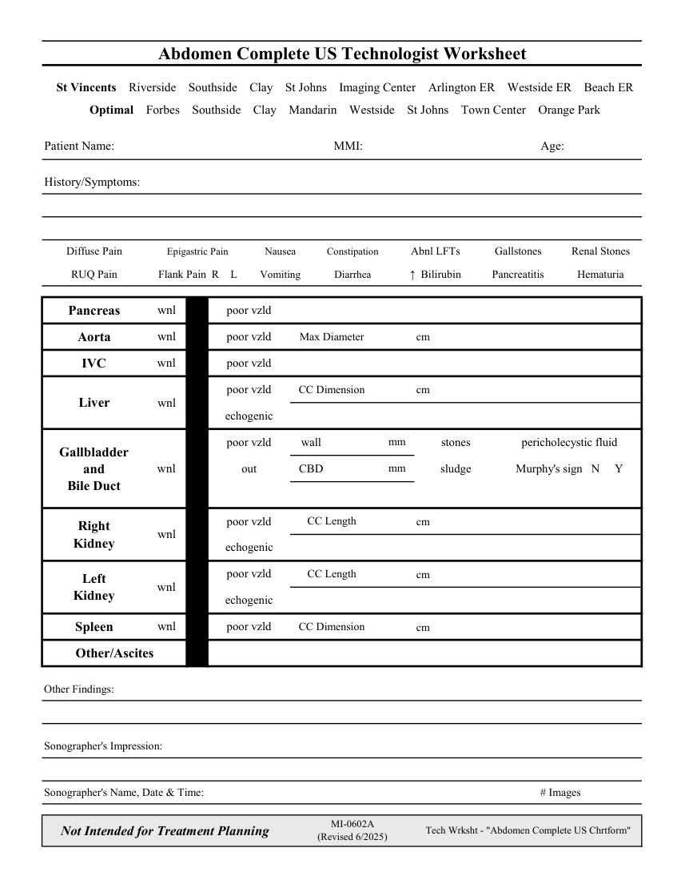

# Ecografie — Fișă de lucru: Abdomen complet (MCB)

## Documentul original MCB — Fișă de lucru: Abdomen complet

**Fișă de lucru · 1 pagini · consultat la 2026-09-27.**

[Descarcă PDF-ul integral](../../assets/mcb-modalities/eco-fisa-de-lucru-abdomen-complet-mcb/document.pdf) · [Sursa MCB](https://ref.mcbradiology.com/Protocols,%20Policies,%20Worksheets%20&%20Forms/US/Tech%20Worksheets/Abdomen%20Complete.pdf) · [Catalogul MCB pentru această modalitate](../mcb/index.md)

Instrucțiunile, valorile și ilustrațiile din documentul original sunt păstrate în **engleză**. Titlul și navigarea sunt în română.

### Pagina 1

{ loading=lazy }

## Textul documentului original

??? abstract "Pagina 1 — text în engleză"

    
Abdomen Complete US Technologist Worksheet
      St Vincents    Riverside    Southside    Clay    St Johns    Imaging Center    Arlington ER    Westside ER    Beach ER
      Optimal    Forbes    Southside    Clay    Mandarin    Westside    St Johns    Town Center    Orange Park
    Patient Name:
    MMI:
    Age:
    History/Symptoms:
    Nausea
    Epigastric Pain
    Diffuse Pain
    Constipation
    Abnl LFTs
    Gallstones
    Renal Stones
    Diarrhea
    Flank Pain  R    L
    RUQ Pain
    ↑  Bilirubin
    Pancreatitis
    Hematuria
    Vomiting
    poor vzld
    Pancreas
    wnl
    Max Diameter
    poor vzld
    cm
    Aorta
    wnl
    poor vzld
    IVC
    wnl
    CC Dimension
    poor vzld
    cm
    Liver
    wnl
    echogenic
    poor vzld
    wall
                     mm
    stones
    pericholecystic fluid
    Gallbladder                             
    out
    CBD
    Murphy&#x27;s sign   N     Y
                     mm
    sludge
    wnl
    and                                  
    Bile Duct
    CC Length
    poor vzld
    cm
    Right                                      
    Kidney
    wnl
    echogenic
    CC Length
    poor vzld
    cm
    Left                                      
    Kidney
    wnl
    echogenic
    cm
    CC Dimension
    Spleen
    wnl
    poor vzld
    Other/Ascites
    Other Findings:
    Sonographer&#x27;s Impression:
    Sonographer&#x27;s Name, Date &amp; Time:
    # Images
    MI-0602A                                             
    Not Intended for Treatment Planning
    (Revised 6/2025)
    Tech Wrksht - &quot;Abdomen Complete US Chrtform&quot;
    

