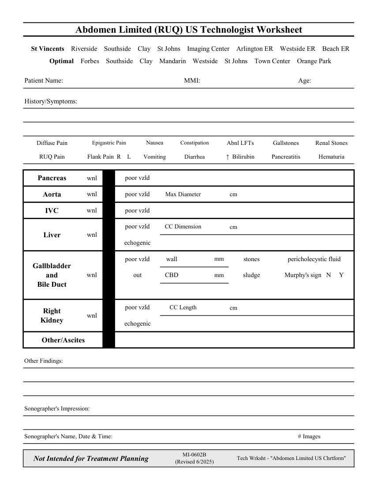

# Ecografie — Fișă de lucru: Abdomen țintit: cadran superior drept (MCB)

## Documentul original MCB — Fișă de lucru: Abdomen țintit: cadran superior drept

**Fișă de lucru · 1 pagini · consultat la 2026-09-27.**

[Descarcă PDF-ul integral](../../assets/mcb-modalities/eco-fisa-de-lucru-abdomen-tintit-cadran-superior-drept-mcb/document.pdf) · [Sursa MCB](https://ref.mcbradiology.com/Protocols,%20Policies,%20Worksheets%20&%20Forms/US/Tech%20Worksheets/Abdomen%20Limited%20%28RUQ%29.pdf) · [Catalogul MCB pentru această modalitate](../mcb/index.md)

Instrucțiunile, valorile și ilustrațiile din documentul original sunt păstrate în **engleză**. Titlul și navigarea sunt în română.

### Pagina 1

{ loading=lazy }

## Textul documentului original

??? abstract "Pagina 1 — text în engleză"

    
Abdomen Limited (RUQ) US Technologist Worksheet
      St Vincents    Riverside    Southside    Clay    St Johns    Imaging Center    Arlington ER    Westside ER    Beach ER
      Optimal    Forbes    Southside    Clay    Mandarin    Westside    St Johns    Town Center    Orange Park
    Patient Name:
    MMI:
    Age:
    History/Symptoms:
    Diffuse Pain
    Epigastric Pain
    Nausea
    Constipation
    Abnl LFTs
    Gallstones
    Renal Stones
    RUQ Pain
    Flank Pain  R    L
    Vomiting
    Diarrhea
    ↑  Bilirubin
    Pancreatitis
    Hematuria
    Pancreas
    wnl
    poor vzld
    cm
    Aorta
    wnl
    poor vzld
    Max Diameter
    IVC
    wnl
    poor vzld
    poor vzld
    CC Dimension
    cm
    Liver
    wnl
    echogenic
    poor vzld
    wall
                     mm
    stones
    pericholecystic fluid
    Gallbladder                             
    out
    CBD
                     mm
    sludge
    Murphy&#x27;s sign   N     Y
    wnl
    and                                  
    Bile Duct
    CC Length
    poor vzld
    cm
    Right                                      
    Kidney
    wnl
    echogenic
    Other/Ascites
    Other Findings:
    Sonographer&#x27;s Impression:
    Sonographer&#x27;s Name, Date &amp; Time:
    # Images
    Not Intended for Treatment Planning
    MI-0602B                                               
    (Revised 6/2025)
    Tech Wrksht - &quot;Abdomen Limited US Chrtform&quot;
    

