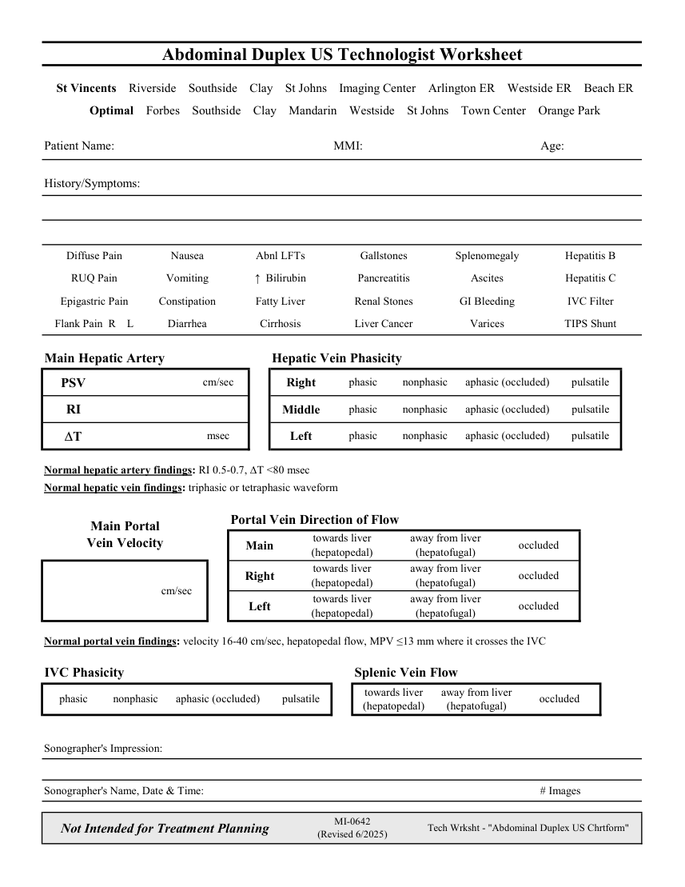

# Ecografie — Fișă de lucru: Abdominal Duplex (MCB)

## Documentul original MCB — Fișă de lucru: Abdominal Duplex

**Fișă de lucru · 1 pagini · consultat la 2026-09-27.**

[Descarcă PDF-ul integral](../../assets/mcb-modalities/eco-fisa-de-lucru-abdominal-duplex-mcb/document.pdf) · [Sursa MCB](https://ref.mcbradiology.com/Protocols,%20Policies,%20Worksheets%20&%20Forms/US/Tech%20Worksheets/Abdominal%20Duplex.pdf) · [Catalogul MCB pentru această modalitate](../mcb/index.md)

Instrucțiunile, valorile și ilustrațiile din documentul original sunt păstrate în **engleză**. Titlul și navigarea sunt în română.

### Pagina 1

{ loading=lazy }

## Textul documentului original

??? abstract "Pagina 1 — text în engleză"

    
Abdominal Duplex US Technologist Worksheet
      St Vincents    Riverside    Southside    Clay    St Johns    Imaging Center    Arlington ER    Westside ER    Beach ER
      Optimal    Forbes    Southside    Clay    Mandarin    Westside    St Johns    Town Center    Orange Park
    Patient Name:
    MMI:
    Age:
    History/Symptoms:
    Diffuse Pain
    Nausea
    Abnl LFTs
    Gallstones
    Splenomegaly
    Hepatitis B
    RUQ Pain
    Ascites
    Vomiting
    ↑  Bilirubin
    Pancreatitis
    Hepatitis C
    Epigastric Pain
    Constipation
    Fatty Liver
    GI Bleeding
    Renal Stones
    IVC Filter
    Flank Pain  R    L
    TIPS Shunt
    Diarrhea
    Cirrhosis
    Liver Cancer
    Varices
    Main Hepatic Artery
    Hepatic Vein Phasicity
    cm/sec
    aphasic (occluded)
    nonphasic
    pulsatile
    Right
    phasic
    PSV
    phasic
    pulsatile
    nonphasic
    aphasic (occluded)
    Middle
    RI
    msec
    phasic
    nonphasic
    pulsatile
    aphasic (occluded)
    Left
    DT
    Normal hepatic artery findings: RI 0.5-0.7, DT &lt;80 msec
    Normal hepatic vein findings: triphasic or tetraphasic waveform
    Portal Vein Direction of Flow
    Main Portal                                     
    towards liver                                             
    away from liver                                                                         
    Vein Velocity
    occluded
    Main
    (hepatopedal)
    (hepatofugal)
    towards liver                                             
    away from liver                                                                         
    occluded
    Right
    (hepatopedal)
    (hepatofugal)
    cm/sec
    towards liver                                             
    away from liver                                                                         
    occluded
    Left
    (hepatopedal)
    (hepatofugal)
    Normal portal vein findings: velocity 16-40 cm/sec, hepatopedal flow, MPV ≤13 mm where it crosses the IVC
    IVC Phasicity
    Splenic Vein Flow
    towards liver                                             
    aphasic (occluded)
    (hepatopedal)
    phasic
    nonphasic
    pulsatile
    away from liver                                                              
    (hepatofugal)
    occluded
    Sonographer&#x27;s Impression:
    Sonographer&#x27;s Name, Date &amp; Time:
    # Images
    MI-0642                                                   
    Not Intended for Treatment Planning
    (Revised 6/2025)
    Tech Wrksht - &quot;Abdominal Duplex US Chrtform&quot;
    

