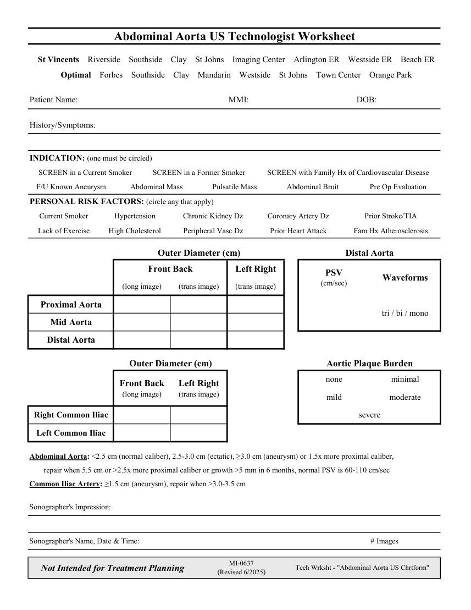

# Ecografie — Fișă de lucru: Aortă abdominală (MCB)

## Documentul original MCB — Fișă de lucru: Aortă abdominală

**Fișă de lucru · 1 pagini · consultat la 2026-09-27.**

[Descarcă PDF-ul integral](../../assets/mcb-modalities/eco-fisa-de-lucru-aorta-abdominala-mcb/document.pdf) · [Sursa MCB](https://ref.mcbradiology.com/Protocols,%20Policies,%20Worksheets%20&%20Forms/US/Tech%20Worksheets/Abdominal%20Aorta.pdf) · [Catalogul MCB pentru această modalitate](../mcb/index.md)

Instrucțiunile, valorile și ilustrațiile din documentul original sunt păstrate în **engleză**. Titlul și navigarea sunt în română.

### Pagina 1

{ loading=lazy }

## Textul documentului original

??? abstract "Pagina 1 — text în engleză"

    
Abdominal Aorta US Technologist Worksheet
      St Vincents    Riverside    Southside    Clay    St Johns    Imaging Center    Arlington ER    Westside ER    Beach ER
      Optimal    Forbes    Southside    Clay    Mandarin    Westside    St Johns    Town Center    Orange Park
    Patient Name:
    MMI:
    DOB:
    History/Symptoms:
    INDICATION: (one must be circled)
    SCREEN in a Current Smoker
    SCREEN in a Former Smoker
    SCREEN with Family Hx of Cardiovascular Disease
    F/U Known Aneurysm
    Abdominal Mass
    Pulsatile Mass
    Abdominal Bruit
    Pre Op Evaluation
    PERSONAL RISK FACTORS: (circle any that apply)
    Current Smoker
    Hypertension
    Chronic Kidney Dz
    Coronary Artery Dz
    Prior Stroke/TIA
    Lack of Exercise
    High Cholesterol
    Peripheral Vasc Dz
    Prior Heart Attack
    Fam Hx Atherosclerosis
    Outer Diameter (cm)
    Distal Aorta
    Front Back
    Left Right
    PSV                                      
    (cm/sec)
    Waveforms
    (long image)
    (trans image)
    (trans image)
    Proximal Aorta
    tri / bi / mono
    Mid Aorta
    Distal Aorta
    Outer Diameter (cm)
    Aortic Plaque Burden
    none
    minimal
    Front Back                                     
    (long image)
    Left Right                                    
    (trans image)
    mild
    moderate
    Right Common Iliac
    severe
    Left Common Iliac
    Abdominal Aorta: &lt;2.5 cm (normal caliber), 2.5-3.0 cm (ectatic), ≥3.0 cm (aneurysm) or 1.5x more proximal caliber, 
    repair when 5.5 cm or &gt;2.5x more proximal caliber or growth &gt;5 mm in 6 months, normal PSV is 60-110 cm/sec
    Common Iliac Artery: ≥1.5 cm (aneurysm), repair when &gt;3.0-3.5 cm
    Sonographer&#x27;s Impression:
    Sonographer&#x27;s Name, Date &amp; Time:
    # Images
    Not Intended for Treatment Planning
    MI-0637                                                      
    (Revised 6/2025)
    Tech Wrksht - &quot;Abdominal Aorta US Chrtform&quot;
    

