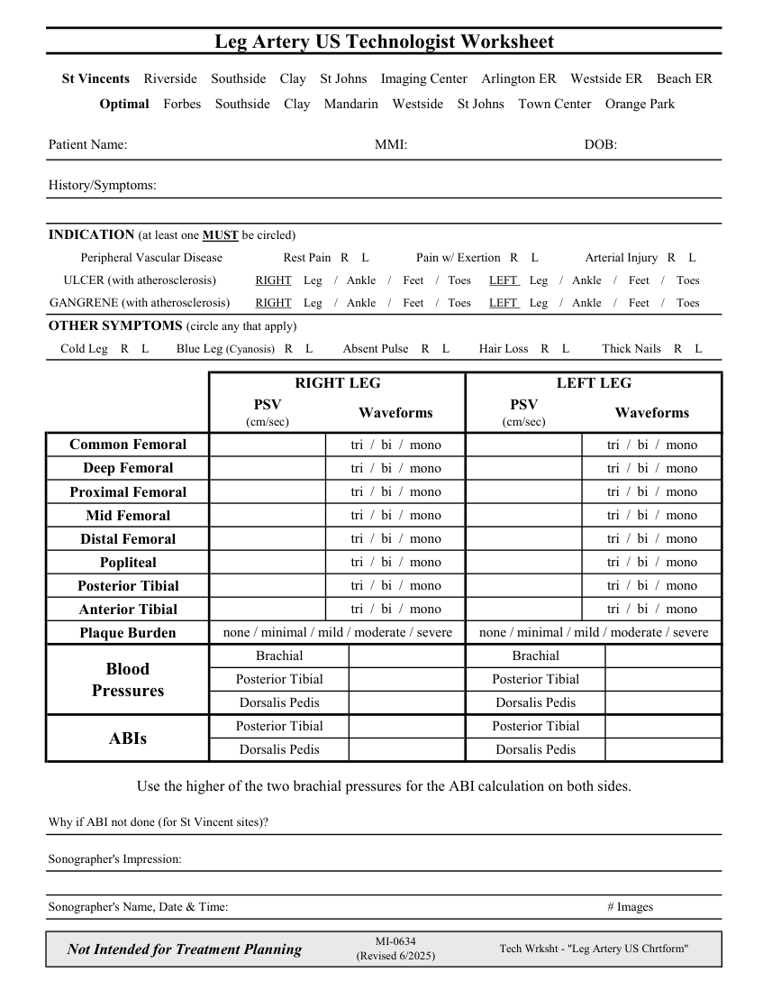

# Ecografie — Fișă de lucru: Artere ale membrului inferior (MCB)

## Documentul original MCB — Fișă de lucru: Artere ale membrului inferior

**Fișă de lucru · 1 pagini · consultat la 2026-09-27.**

[Descarcă PDF-ul integral](../../assets/mcb-modalities/eco-fisa-de-lucru-artere-ale-membrului-inferior-mcb/document.pdf) · [Sursa MCB](https://ref.mcbradiology.com/Protocols,%20Policies,%20Worksheets%20&%20Forms/US/Tech%20Worksheets/Leg%20Arteries.pdf) · [Catalogul MCB pentru această modalitate](../mcb/index.md)

Instrucțiunile, valorile și ilustrațiile din documentul original sunt păstrate în **engleză**. Titlul și navigarea sunt în română.

### Pagina 1

{ loading=lazy }

## Textul documentului original

??? abstract "Pagina 1 — text în engleză"

    
Leg Artery US Technologist Worksheet
      St Vincents    Riverside    Southside    Clay    St Johns    Imaging Center    Arlington ER    Westside ER    Beach ER
      Optimal    Forbes    Southside    Clay    Mandarin    Westside    St Johns    Town Center    Orange Park
    Patient Name:
    MMI:
    DOB:
    History/Symptoms:
    INDICATION (at least one MUST be circled)
    Peripheral Vascular Disease
    Rest Pain   R    L
    Pain w/ Exertion   R    L
    Arterial Injury   R    L
    ULCER (with atherosclerosis)
    RIGHT    Leg    /   Ankle    /    Feet    /   Toes      LEFT    Leg    /   Ankle    /    Feet    /    Toes
    GANGRENE (with atherosclerosis)
    RIGHT    Leg    /   Ankle    /    Feet    /   Toes      LEFT    Leg    /   Ankle    /    Feet    /    Toes
    OTHER SYMPTOMS (circle any that apply)
    Cold Leg    R    L
    Blue Leg (Cyanosis)   R    L
    Absent Pulse    R    L
    Hair Loss    R    L
    Thick Nails    R    L
    RIGHT LEG
    LEFT LEG
    PSV                 
    (cm/sec)
    Waveforms
    PSV                 
    (cm/sec)
    Waveforms
    tri  /  bi  /  mono
    Common Femoral
    tri  /  bi  /  mono
    tri  /  bi  /  mono
    tri  /  bi  /  mono
    Deep Femoral
    Proximal Femoral
    tri  /  bi  /  mono
    tri  /  bi  /  mono
    Mid Femoral
    tri  /  bi  /  mono
    tri  /  bi  /  mono
    Distal Femoral
    tri  /  bi  /  mono
    tri  /  bi  /  mono
    Popliteal
    tri  /  bi  /  mono
    tri  /  bi  /  mono
    Posterior Tibial
    tri  /  bi  /  mono
    tri  /  bi  /  mono
    Anterior Tibial
    tri  /  bi  /  mono
    tri  /  bi  /  mono
    Plaque Burden
    none / minimal / mild / moderate / severe
    none / minimal / mild / moderate / severe
    Brachial
    Brachial
    Blood                                       
    Posterior Tibial
    Posterior Tibial
    Pressures
    Dorsalis Pedis
    Dorsalis Pedis
    Posterior Tibial
    Posterior Tibial
    Dorsalis Pedis
    ABIs
    Dorsalis Pedis
    Use the higher of the two brachial pressures for the ABI calculation on both sides.
    Why if ABI not done (for St Vincent sites)?
    Sonographer&#x27;s Impression:
    Sonographer&#x27;s Name, Date &amp; Time:
    # Images
    Tech Wrksht - &quot;Leg Artery US Chrtform&quot;
    Not Intended for Treatment Planning
    MI-0634                                                  
    (Revised 6/2025)
    

