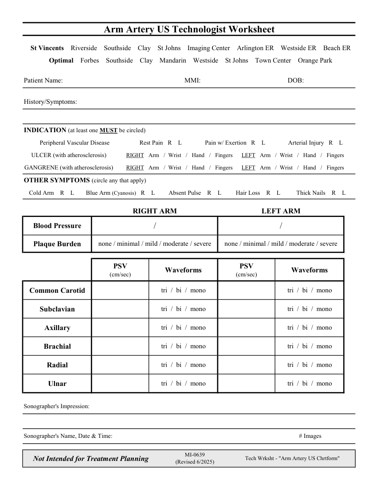

# Ecografie — Fișă de lucru: Artere ale membrului superior (MCB)

## Documentul original MCB — Fișă de lucru: Artere ale membrului superior

**Fișă de lucru · 1 pagini · consultat la 2026-09-27.**

[Descarcă PDF-ul integral](../../assets/mcb-modalities/eco-fisa-de-lucru-artere-ale-membrului-superior-mcb/document.pdf) · [Sursa MCB](https://ref.mcbradiology.com/Protocols,%20Policies,%20Worksheets%20&%20Forms/US/Tech%20Worksheets/Arm%20Arteries.pdf) · [Catalogul MCB pentru această modalitate](../mcb/index.md)

Instrucțiunile, valorile și ilustrațiile din documentul original sunt păstrate în **engleză**. Titlul și navigarea sunt în română.

### Pagina 1

{ loading=lazy }

## Textul documentului original

??? abstract "Pagina 1 — text în engleză"

    
Arm Artery US Technologist Worksheet
      St Vincents    Riverside    Southside    Clay    St Johns    Imaging Center    Arlington ER    Westside ER    Beach ER
      Optimal    Forbes    Southside    Clay    Mandarin    Westside    St Johns    Town Center    Orange Park
    Patient Name:
    MMI:
    DOB:
    History/Symptoms:
    INDICATION (at least one MUST be circled)
    Peripheral Vascular Disease
    Arterial Injury   R    L
    Rest Pain   R    L
    Pain w/ Exertion   R    L
    ULCER (with atherosclerosis)
    RIGHT   Arm   /  Wrist   /   Hand   /   Fingers      LEFT   Arm   /  Wrist   /   Hand   /   Fingers
    RIGHT   Arm   /  Wrist   /   Hand   /   Fingers      LEFT   Arm   /  Wrist   /   Hand   /   Fingers
    GANGRENE (with atherosclerosis)
    OTHER SYMPTOMS (circle any that apply)
    Cold Arm    R    L
    Absent Pulse    R    L
    Hair Loss    R    L
    Thick Nails    R    L
    Blue Arm (Cyanosis)   R    L
    RIGHT ARM
    LEFT ARM
    Blood Pressure
    /
    /
    none / minimal / mild / moderate / severe
    none / minimal / mild / moderate / severe
    Plaque Burden
    PSV                 
    Waveforms
    (cm/sec)
    (cm/sec)
    Waveforms
    PSV                 
    tri  /  bi  /  mono
    tri  /  bi  /  mono
    Common Carotid
    tri  /  bi  /  mono
    tri  /  bi  /  mono
    Subclavian
    tri  /  bi  /  mono
    tri  /  bi  /  mono
    Axillary
    tri  /  bi  /  mono
    tri  /  bi  /  mono
    Brachial
    tri  /  bi  /  mono
    tri  /  bi  /  mono
    Radial
    tri  /  bi  /  mono
    tri  /  bi  /  mono
    Ulnar
    Sonographer&#x27;s Impression:
    Sonographer&#x27;s Name, Date &amp; Time:
    # Images
    Not Intended for Treatment Planning
    MI-0639                                                   
    (Revised 6/2025)
    Tech Wrksht - &quot;Arm Artery US Chrtform&quot;
    

