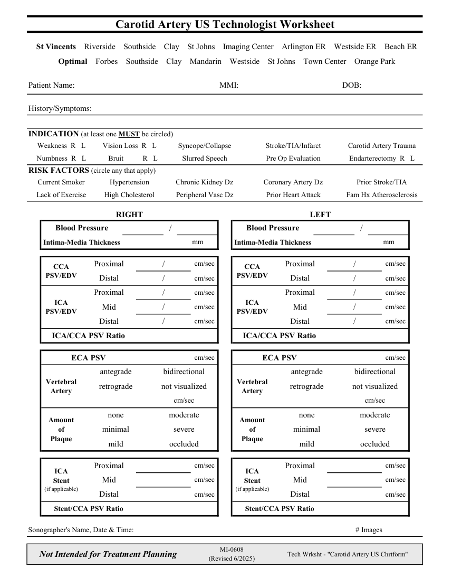

# Ecografie — Fișă de lucru: Artere carotide (MCB)

## Documentul original MCB — Fișă de lucru: Artere carotide

**Fișă de lucru · 1 pagini · consultat la 2026-09-27.**

[Descarcă PDF-ul integral](../../assets/mcb-modalities/eco-fisa-de-lucru-artere-carotide-mcb/document.pdf) · [Sursa MCB](https://ref.mcbradiology.com/Protocols,%20Policies,%20Worksheets%20&%20Forms/US/Tech%20Worksheets/Carotid%20Arteries.pdf) · [Catalogul MCB pentru această modalitate](../mcb/index.md)

Instrucțiunile, valorile și ilustrațiile din documentul original sunt păstrate în **engleză**. Titlul și navigarea sunt în română.

### Pagina 1

{ loading=lazy }

## Textul documentului original

??? abstract "Pagina 1 — text în engleză"

    
Carotid Artery US Technologist Worksheet
      St Vincents    Riverside    Southside    Clay    St Johns    Imaging Center    Arlington ER    Westside ER    Beach ER
      Optimal    Forbes    Southside    Clay    Mandarin    Westside    St Johns    Town Center    Orange Park
    Patient Name:
    DOB:
    MMI:
    History/Symptoms:
    INDICATION (at least one MUST be circled)
    Weakness  R   L
    Vision Loss  R   L
    Carotid Artery Trauma
    Stroke/TIA/Infarct
    Syncope/Collapse
    Numbness  R   L
    Bruit
    R   L
    Endarterectomy  R   L
    Slurred Speech
    Pre Op Evaluation
    RISK FACTORS (circle any that apply)
    Current Smoker
    Hypertension
    Prior Stroke/TIA
    Chronic Kidney Dz
    Coronary Artery Dz
    Lack of Exercise
    High Cholesterol
    Fam Hx Atherosclerosis
    Peripheral Vasc Dz
    Prior Heart Attack
    RIGHT
    LEFT
    Blood Pressure
    Blood Pressure
    /
    /
    mm
    Intima-Media Thickness
    Intima-Media Thickness
    mm
    cm/sec
    Proximal
    /
    Proximal
    /
    cm/sec
    CCA                                  
    CCA                                  
    PSV/EDV
    PSV/EDV
    Distal
    cm/sec
    /
    Distal
    /
    cm/sec
    cm/sec
    Proximal
    /
    cm/sec
    Proximal
    /
    ICA                
    ICA                
    cm/sec
    Mid
    /
    Mid
    /
    cm/sec
    PSV/EDV
    PSV/EDV
    cm/sec
    Distal
    /
    Distal
    /
    cm/sec
    ICA/CCA PSV Ratio
    ICA/CCA PSV Ratio
    cm/sec
    cm/sec
    ECA PSV
    ECA PSV
    antegrade
    bidirectional
    antegrade
    bidirectional
    Vertebral               
    Vertebral               
    retrograde
    not visualized
    retrograde
    not visualized
    Artery
    Artery
    cm/sec
    cm/sec
    none
    moderate
    none
    moderate
    Amount                                               
    Amount                                               
    of                             
    of                             
    minimal
    severe
    minimal
    severe
    Plaque
    Plaque
    mild
    occluded
    mild
    occluded
    cm/sec
    Proximal
    Proximal
    cm/sec
    ICA                                          
    ICA                                          
    cm/sec
    Mid
    Mid
    cm/sec
    Stent              
    Stent              
    (if applicable)
    (if applicable)
    cm/sec
    Distal
    Distal
    cm/sec
    Stent/CCA PSV Ratio
    Stent/CCA PSV Ratio
    Sonographer&#x27;s Name, Date &amp; Time:
    # Images
    Not Intended for Treatment Planning
    MI-0608                                                         
    (Revised 6/2025)
    Tech Wrksht - &quot;Carotid Artery US Chrtform&quot;
    

