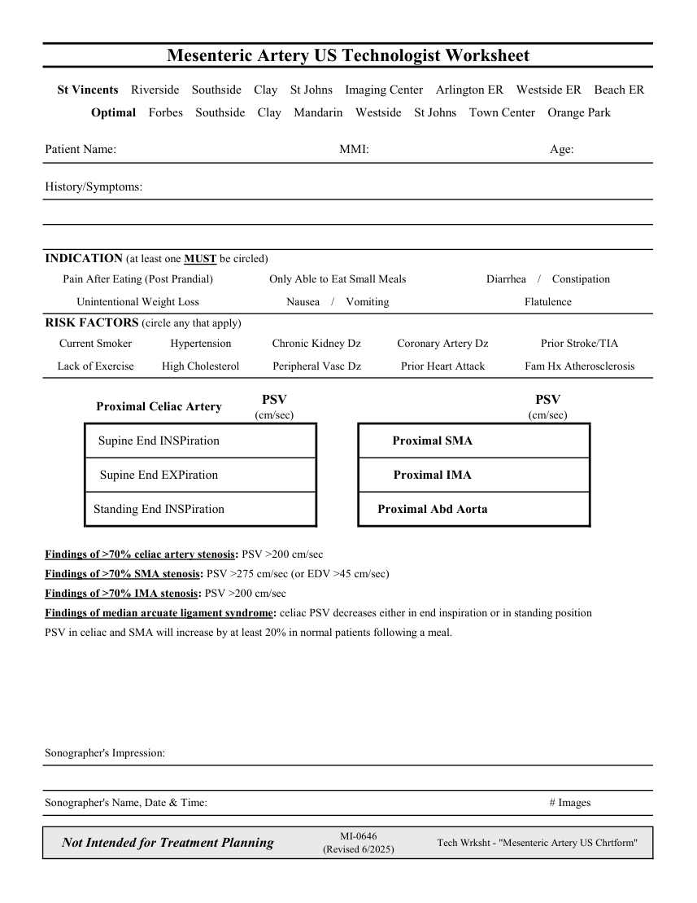

# Ecografie — Fișă de lucru: Artere mezenterice (MCB)

## Documentul original MCB — Fișă de lucru: Artere mezenterice

**Fișă de lucru · 1 pagini · consultat la 2026-09-27.**

[Descarcă PDF-ul integral](../../assets/mcb-modalities/eco-fisa-de-lucru-artere-mezenterice-mcb/document.pdf) · [Sursa MCB](https://ref.mcbradiology.com/Protocols,%20Policies,%20Worksheets%20&%20Forms/US/Tech%20Worksheets/Mesenteric%20Artery.pdf) · [Catalogul MCB pentru această modalitate](../mcb/index.md)

Instrucțiunile, valorile și ilustrațiile din documentul original sunt păstrate în **engleză**. Titlul și navigarea sunt în română.

### Pagina 1

{ loading=lazy }

## Textul documentului original

??? abstract "Pagina 1 — text în engleză"

    
Mesenteric Artery US Technologist Worksheet
      St Vincents    Riverside    Southside    Clay    St Johns    Imaging Center    Arlington ER    Westside ER    Beach ER
      Optimal    Forbes    Southside    Clay    Mandarin    Westside    St Johns    Town Center    Orange Park
    Patient Name:
    MMI:
    Age:
    History/Symptoms:
    INDICATION (at least one MUST be circled)
    Only Able to Eat Small Meals
    Pain After Eating (Post Prandial)
    Diarrhea    /    Constipation
    Unintentional Weight Loss
    Nausea    /    Vomiting
    Flatulence
    RISK FACTORS (circle any that apply)
    Current Smoker
    Hypertension
    Chronic Kidney Dz
    Coronary Artery Dz
    Prior Stroke/TIA
    Lack of Exercise
    High Cholesterol
    Peripheral Vasc Dz
    Prior Heart Attack
    Fam Hx Atherosclerosis
    PSV                                     
    PSV                                     
    Proximal Celiac Artery
    (cm/sec)
    (cm/sec)
    Supine End INSPiration
    Proximal SMA
    Supine End EXPiration
    Proximal IMA
    Standing End INSPiration
    Proximal Abd Aorta
    Findings of &gt;70% celiac artery stenosis: PSV &gt;200 cm/sec
    Findings of &gt;70% SMA stenosis: PSV &gt;275 cm/sec (or EDV &gt;45 cm/sec)
    Findings of &gt;70% IMA stenosis: PSV &gt;200 cm/sec
    Findings of median arcuate ligament syndrome: celiac PSV decreases either in end inspiration or in standing position
    PSV in celiac and SMA will increase by at least 20% in normal patients following a meal.
    Sonographer&#x27;s Impression:
    Sonographer&#x27;s Name, Date &amp; Time:
    # Images
    Not Intended for Treatment Planning
    MI-0646                                                        
    (Revised 6/2025)
    Tech Wrksht - &quot;Mesenteric Artery US Chrtform&quot;
    

