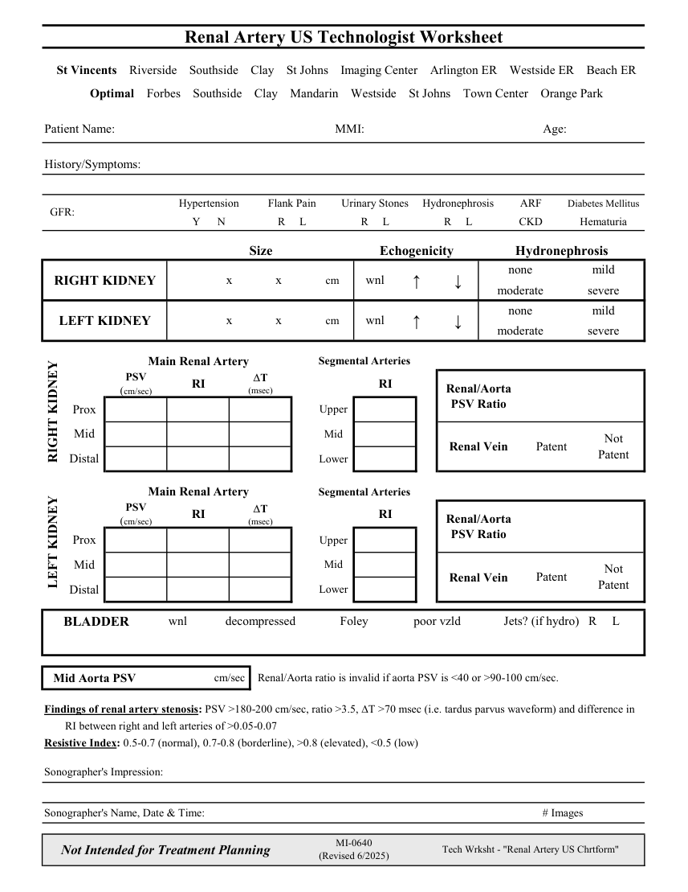

# Ecografie — Fișă de lucru: Artere renale (MCB)

## Documentul original MCB — Fișă de lucru: Artere renale

**Fișă de lucru · 1 pagini · consultat la 2026-09-27.**

[Descarcă PDF-ul integral](../../assets/mcb-modalities/eco-fisa-de-lucru-artere-renale-mcb/document.pdf) · [Sursa MCB](https://ref.mcbradiology.com/Protocols,%20Policies,%20Worksheets%20&%20Forms/US/Tech%20Worksheets/Renal%20Artery.pdf) · [Catalogul MCB pentru această modalitate](../mcb/index.md)

Instrucțiunile, valorile și ilustrațiile din documentul original sunt păstrate în **engleză**. Titlul și navigarea sunt în română.

### Pagina 1

{ loading=lazy }

## Textul documentului original

??? abstract "Pagina 1 — text în engleză"

    
Renal Artery US Technologist Worksheet
      St Vincents    Riverside    Southside    Clay    St Johns    Imaging Center    Arlington ER    Westside ER    Beach ER
      Optimal    Forbes    Southside    Clay    Mandarin    Westside    St Johns    Town Center    Orange Park
    Patient Name:
    MMI:
    Age:
    History/Symptoms:
    Diabetes Mellitus
    ARF
    Hypertension
    Flank Pain
    Urinary Stones
    Hydronephrosis
    R     L
      GFR:
    CKD
    Y      N
    R     L
    R     L
    Hematuria
    Size
    Echogenicity
    Hydronephrosis
    none
    mild
    RIGHT KIDNEY
                  x              x              cm
    wnl
    ↑
    ↓
    moderate
    severe
    none
    mild
    LEFT KIDNEY
                  x              x              cm
    wnl
    ↑
    ↓
    moderate
    severe
    Main Renal Artery
    Segmental Arteries
    PSV                   
    (msec)
    RI
    Renal/Aorta 
    (cm/sec)
    RI
    DT                          
    PSV Ratio
    Upper
    Prox
    Mid
    Mid
    Not                     
    Renal Vein
    Patent
    Patent
    RIGHT KIDNEY
    Lower
    Distal
    Main Renal Artery
    Segmental Arteries
    PSV                    
    (msec)
    RI
    Renal/Aorta 
    (cm/sec)
    RI
    DT                          
    PSV Ratio
    Prox
    Upper
    Mid
    Mid
    Patent
    Not                     
    Renal Vein
    LEFT KIDNEY
    Patent
    Distal
    Lower
     BLADDER
    wnl
    decompressed
    Foley
    poor vzld
    Jets? (if hydro)   R     L
      Renal/Aorta ratio is invalid if aorta PSV is &lt;40 or &gt;90-100 cm/sec.
    cm/sec 
    Mid Aorta PSV
    Findings of renal artery stenosis: PSV &gt;180-200 cm/sec, ratio &gt;3.5, DT &gt;70 msec (i.e. tardus parvus waveform) and difference in
    RI between right and left arteries of &gt;0.05-0.07
    Resistive Index: 0.5-0.7 (normal), 0.7-0.8 (borderline), &gt;0.8 (elevated), &lt;0.5 (low)
    Sonographer&#x27;s Impression:
    Sonographer&#x27;s Name, Date &amp; Time:
    # Images
    Tech Wrksht - &quot;Renal Artery US Chrtform&quot;
    Not Intended for Treatment Planning
    MI-0640                                                        
    (Revised 6/2025)
    

