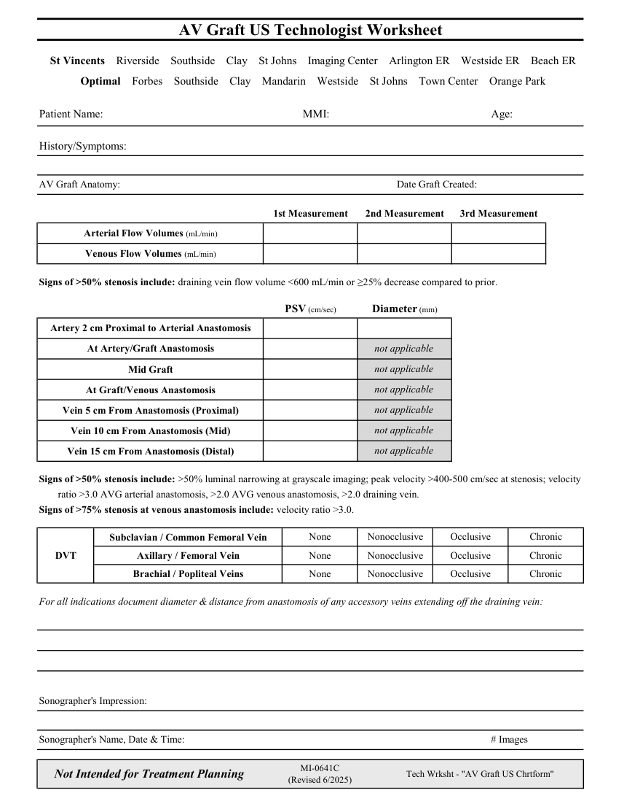

# Ecografie — Fișă de lucru: AV Graft (MCB)

## Documentul original MCB — Fișă de lucru: AV Graft

**Fișă de lucru · 1 pagini · consultat la 2026-09-27.**

[Descarcă PDF-ul integral](../../assets/mcb-modalities/eco-fisa-de-lucru-av-graft-mcb/document.pdf) · [Sursa MCB](https://ref.mcbradiology.com/Protocols,%20Policies,%20Worksheets%20&%20Forms/US/Tech%20Worksheets/AV%20Graft.pdf) · [Catalogul MCB pentru această modalitate](../mcb/index.md)

Instrucțiunile, valorile și ilustrațiile din documentul original sunt păstrate în **engleză**. Titlul și navigarea sunt în română.

### Pagina 1

{ loading=lazy }

## Textul documentului original

??? abstract "Pagina 1 — text în engleză"

    
AV Graft US Technologist Worksheet
      St Vincents    Riverside    Southside    Clay    St Johns    Imaging Center    Arlington ER    Westside ER    Beach ER
      Optimal    Forbes    Southside    Clay    Mandarin    Westside    St Johns    Town Center    Orange Park
    Patient Name:
    MMI:
    Age:
    History/Symptoms:
    AV Graft Anatomy:
    Date Graft Created:
    1st Measurement
    2nd Measurement
    3rd Measurement
    Arterial Flow Volumes (mL/min)
    Venous Flow Volumes (mL/min)
    Signs of &gt;50% stenosis include: draining vein flow volume &lt;600 mL/min or ≥25% decrease compared to prior.
    PSV (cm/sec)
    Diameter (mm)
    Artery 2 cm Proximal to Arterial Anastomosis
    At Artery/Graft Anastomosis
    not applicable
    not applicable
    Mid Graft
    At Graft/Venous Anastomosis
    not applicable
    not applicable
    Vein 5 cm From Anastomosis (Proximal)
    Vein 10 cm From Anastomosis (Mid)
    not applicable
    Vein 15 cm From Anastomosis (Distal)
    not applicable
    Signs of &gt;50% stenosis include: &gt;50% luminal narrowing at grayscale imaging; peak velocity &gt;400-500 cm/sec at stenosis; velocity 
    ratio &gt;3.0 AVG arterial anastomosis, &gt;2.0 AVG venous anastomosis, &gt;2.0 draining vein.
    Signs of &gt;75% stenosis at venous anastomosis include: velocity ratio &gt;3.0.
    Nonocclusive
    Occlusive
    Chronic
    Subclavian / Common Femoral Vein
    None
    DVT
    Axillary / Femoral Vein
    None
    Nonocclusive
    Occlusive
    Chronic
    Brachial / Popliteal Veins
    None
    Nonocclusive
    Occlusive
    Chronic
    For all indications document diameter &amp; distance from anastomosis of any accessory veins extending off the draining vein:
    Sonographer&#x27;s Impression:
    Sonographer&#x27;s Name, Date &amp; Time:
    # Images
    Not Intended for Treatment Planning
    MI-0641C                                                    
    (Revised 6/2025)
    Tech Wrksht - &quot;AV Graft US Chrtform&quot;
    

